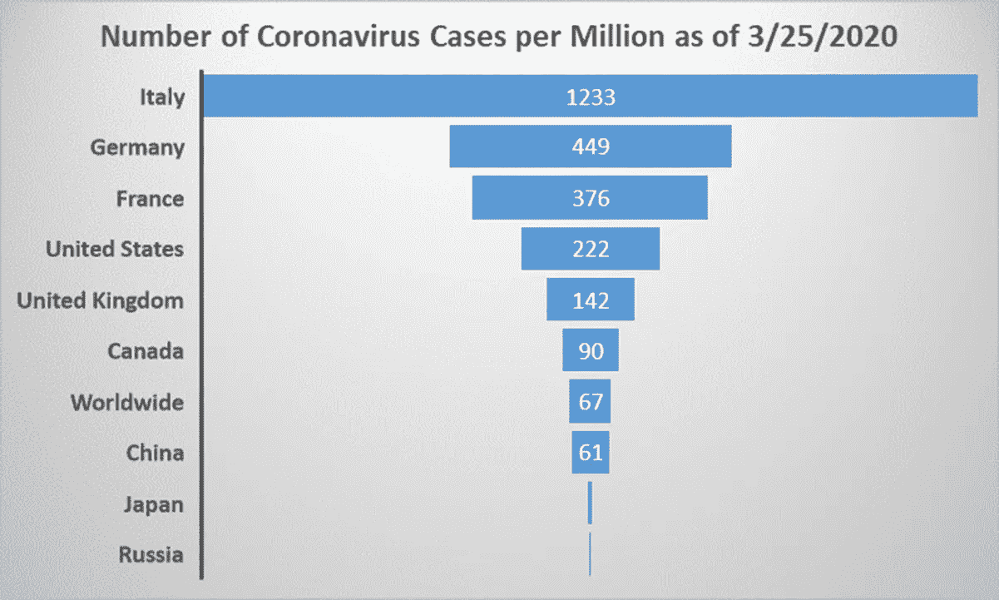
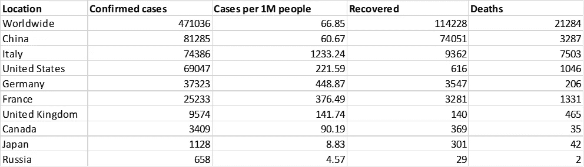
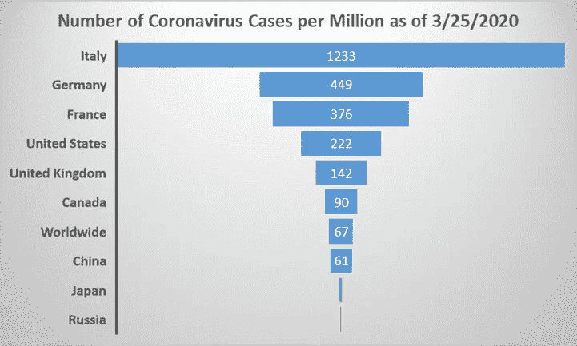
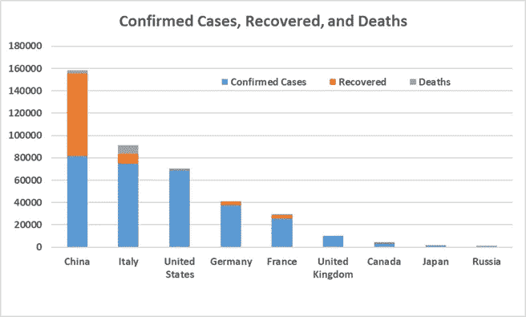

# 高度工业化国家的冠状病毒病例

> 原文：<https://pub.towardsai.net/coronavirus-cases-in-highly-industrialized-countries-53db3996176?source=collection_archive---------1----------------------->

来自 9 大工业化国家的冠状病毒病例。数据来源:[新冠肺炎谷歌危机应对数据](https://google.org/crisisresponse/covid19-map)。Benjamin O. Tayo 的图片

## 在主要工业化国家中，意大利受到的冲击最大。日本和俄罗斯的病例数和死亡数最少。意大利和美国的病例数预计将在几天内超过中国。

冠状病毒，也被称为新冠肺炎，是一种新型的高传染性病毒，它已经造成了全球性的疫情，并成为全世界的头条新闻。根据新冠肺炎的[谷歌危机响应数据，截至 2020 年 3 月 25 日，全球共有 471，076 例确诊病例，21，284 人死亡。根据同一份报告，共有 183 个国家、领土或地区报告了实验室确认的新冠肺炎病例和死亡。](https://google.org/crisisresponse/covid19-map)

在这篇文章中，我们分析了来自世界上工业化程度最高的国家的冠状病毒病例。这些国家是最发达的，拥有先进的医疗保健系统。我们的目标是比较这些国家的统计数据，并希望了解每个国家是如何应对疫情的。

## 用于分析的数据集

用于我们分析的数据集是从 2020 年 3 月 25 日[谷歌在新冠肺炎](https://google.org/crisisresponse/covid19-map)的危机响应数据中删除的。数据存储在 Excel 文件中。然后进行数据辩论，将原始数据转换成可供分析的形式。然后我们选择了主要工业化国家的数据，如下表所示。

**截至 2020 年 3 月 25 日世界主要工业化国家的冠状病毒数据**。来源:[谷歌对新冠肺炎危机的反应数据](https://google.org/crisisresponse/covid19-map)

## 比较每百万的病例数

由于确诊病例数将随着该地区人口的增加而增加，一个好的衡量标准或指标是考虑每 100 万人的病例数，如下图所示:

**截至 2020 年 3 月 25 日全球主要工业化国家每百万人冠状病毒病例数。Benjamin O. Tayo 拍摄的图片**

该图显示，与意大利、德国、法国、美国和英国相比，俄罗斯、日本、中国和加拿大的百万分之一病例数相对较少。到目前为止，意大利是受新冠肺炎病毒影响最严重的国家，每百万人中有 1233 例病例。我们注意到，尽管新冠肺炎病毒源自中国，但中国政府迅速采取了非常严格的措施(如完全封锁大多数受影响的城镇)来遏制病毒并减少其传播。意大利是世界旅游业的领导者之一。因为意大利没有尽早关闭边境，也没有及时实施全国封锁，这可以解释为什么意大利受到的冲击最大。

## 确诊病例、康复和死亡

接下来，我们分析了这些国家的确诊病例、恢复和死亡总数，如下图所示。

截至 2020 年 3 月 25 日，世界主要工业化国家的冠状病毒病例数、治愈数和死亡数。本杰明·欧·塔约的图片

该数字表明，中国仍是病例数量最多的国家。我们还观察到，意大利和美国非常接近中国。这意味着在短短几天内，意大利和美国的确诊病例将超过中国。最大的恢复是在中国，这也是由于中国采取了激进的措施来控制病毒并减少其传播。在死亡人数方面，意大利领先(7503 人死亡)，而中国为 3287 人死亡。日本和俄罗斯的病例数(1，128 和 658)和死亡数(42 和 2)分别最少。在美国，纽约是病毒的新中心。其他州如加利福尼亚和华盛顿州在病例数量上领先。这些州是国际旅行的门户，所以他们有最多的病例是有道理的。美国中部(中西部各州)的病例数最少。

## 摘要

总之，我们已经讨论了来自世界上工业化程度最高的国家的各种新冠肺炎统计数据。我们观察到，即使新冠肺炎源于中国，中国政府也颁布了非常严格的措施，并及时地遏制了病毒。意大利仍然是受影响最严重的国家，每百万人中有令人震惊的病例数(1，233 例)，死亡总数为 7，503 例，而中国每百万人中有 61 例，死亡总数为 3，287 例。在世界工业化国家中，俄罗斯(每百万 5 例，2 例总死亡)和日本(每百万 9 例，42 例总死亡)受影响最小。这些统计数据最后更新于 2020 年 3 月 25 日。在接下来的日子里，意大利和美国的确诊病例数预计将超过中国。

每个人都有责任采取必要的预防措施，帮助新冠肺炎曲线变平，并减少其蔓延。拉平新冠肺炎曲线不仅有助于遏制病毒，还能让我们的研究人员和科学家有时间开发治疗和预防疾病的药物和疫苗。

## 参考资料:

[新冠肺炎谷歌危机应对数据](https://google.org/crisisresponse/covid19-map)

[拉平冠状病毒曲线](https://medium.com/towards-artificial-intelligence/flattening-the-corona-virus-curve-1d34ba5661c4)