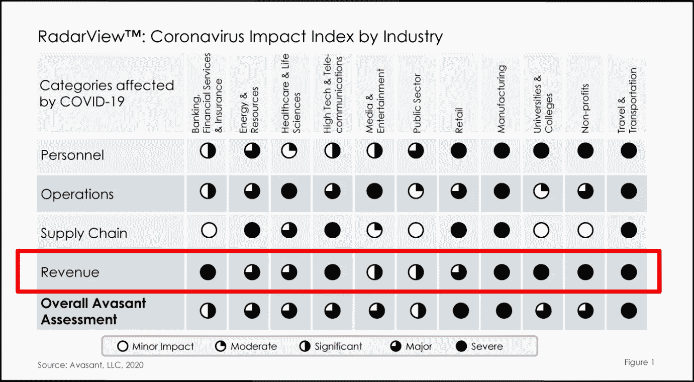

# 新冠肺炎之后的企业人工智能战略

> 原文：<https://pub.towardsai.net/corporate-ai-strategy-after-covid-19-5d5cc5e49e69?source=collection_archive---------2----------------------->

## [人工智能](https://towardsai.net/p/category/artificial-intelligence)、[未来](https://towardsai.net/p/category/future)、[科技](https://towardsai.net/p/category/technology)

## 人工智能可以帮助新冠肺炎的公司比以前更有弹性

照片由 [Kayle Kaupanger](https://unsplash.com/@notaphotographer?utm_source=unsplash&utm_medium=referral&utm_content=creditCopyText) 在 [Unsplash](https://unsplash.com/s/photos/empty-street-coronavirus?utm_source=unsplash&utm_medium=referral&utm_content=creditCopyText) 上拍摄

乍一看，大流行后的经济似乎不是投资人工智能的最佳时机。大多数行业都受到收入和现金流的影响。然而，一些公司将采用人工智能来提高效率，并在经济复苏后为增长奠定基础。

**了解其业务需求和人工智能用例的公司可以进行人工智能投资，从而获得高投资回报率。** AI 擅长自动化需要耗费人力的人工流程。人工智能还擅长在大型数据集中寻找模式，以产生洞察力。如果使用得当，人工智能可以帮助公司在后冠状病毒经济衰退期间削减成本和保持收入。

虽然截至 2020 年 6 月，美国股市出现了惊人的反弹，但股票并不总是反映商业环境。公司在全球范围内运作，亚洲和拉丁美洲的国家因为新冠肺炎而在经济上受到伤害。可能的“第二波”可能会进一步损害商业前景。精明的商业领袖将探索人工智能如何帮助他们在这种环境中导航。

# 业务优先级将决定人工智能策略

新冠肺炎严重影响了各行各业的收入。 ***来源:***[***Avasant***](https://info.avasant.com/coronavirus-impact-index-by-industry)

**在大流行后的经济中，公司必须专注于三个关键的业务优先事项** : **客户洞察、成本效率和降低风险。任何人工智能项目都必须至少满足其中一个优先级。这些优先事项将在 2020 年(至少)在各行业普遍存在，因为大多数公司都损失了大量收入。**

**客户洞察**将帮助公司理解和预测不断变化的客户行为。虽然它可能不会有助于削减成本，但它会带来新的客户并占领市场份额。客户洞察有助于公司开发客户需要的产品，并进行有针对性的营销。建立这一基础将使企业在经济复苏时大幅领先于竞争对手。

**成本效率**在收入下降时非常有意义。AI 可以通过自动化文档分析、索赔处理和其他人工业务流程来帮助削减成本。

**降低风险**在经济低迷时期非常重要。例如，银行业和保险业的欺诈风险会增加潜在成本。监管机构喜欢对未能防止欺诈和洗钱的银行处以数十亿美元的罚款。当收入下降时，必须避免这些风险。

一些著名的公司已经将人工智能用于这些目的很多年了。负责人工智能采用的商业领袖可以使用这些例子来告知他们自己的人工智能战略。

# 摩根大通:用自然语言处理实现文档分析自动化

公司有专门从发票、客户表格、法律合同等中提取和分析信息的团队。大多数公司有太多的数据。例如，据埃森哲称，大多数保险公司只处理了 10-15%的数据。人工智能可以在这方面提供帮助。

**摩根大通**推出了一款名为 [COIN](https://towardsdatascience.com/natural-language-processing-in-banking-current-uses-7fbbaee837de) (合同智能的简称)的人工智能文档搜索工具。COIN 帮助摩根大通的法律部门在数千份法律文件中进行搜索，并在几秒钟内提取相关数据。许多法律工作涉及到文档分析以研究法律先例，因此任何加速这一过程的工具都是有价值的。

COIN 由一种名为**自然语言处理(NLP)** 的人工智能技术驱动。NLP 使计算机能够比人类更快地阅读和解释文本。据称，COIN 在几秒钟内从 12，000 份商业信贷协议中提取了法律团队感兴趣的 150 种数据。据称，COIN 每年为银行节省 15，000 天的人工工作。

NLP 和机器学习训练软件处理不同的文档结构和布局。如果布局和格式不变，传统软件可以从文档中提取信息。由于文档格式在现实世界中确实会发生变化，人工智能使软件能够“读取”和“解释”许多文档类型，而无需通过编程来处理个别情况。

解释文档的人工智能工具也有助于公司产生客户洞察力。这些工具可以分析客户数据库并生成 360 度客户视图，从而实现有针对性的营销和交叉销售机会。

银行的投资部门可以实现财务报告分析的自动化，让人工分析师专注于更复杂的工作。年度报告长达数百页。如果人工智能工具可以执行初步分析，人类分析师就可以专注于更高价值的分析。

# 丹斯克银行:利用深度学习改进欺诈检测

在经济困难时期，诈骗会增加。银行和保险公司将会看到潜在欺诈交易的激增，必须对其进行调查。这非常耗时。人工智能工具可以更好地检测欺诈，并在没有人工干预的情况下处理常见的欺诈案件，从而将工作人员解放出来，专注于高价值和复杂的案件。

丹麦银行是丹麦最大的银行，他们与一家名为 [Teradata](http://www.teradata.com) 的分析公司合作，建立了一个由**深度学习**驱动的[欺诈检测系统](https://assets.teradata.com/resourceCenter/downloads/CaseStudies/CaseStudy_EB9821_Danske_Bank_Fights_Fraud.pdf)。

新系统使 Danske 银行大大降低了与欺诈相关的风险。该银行的欺诈检测能力提高了 50%，误报率下降了 60%。员工现在可以将更多的时间投入到复杂和高价值的欺诈案件中。

该银行旧的基于规则的系统仅在 40%的情况下正确检测到欺诈，这使该银行面临巨大的风险。旧系统每天还会产生 1200 个误报，合法交易被错误地归类为欺诈。员工浪费了大量时间调查无辜的交易。

深度学习听起来很复杂，但我们可以认为它是一种高级的模式检测和分类工具。当深度学习系统被输入成千上万的交易时，它会学习识别哪些交易是“正常的”，哪些是潜在的欺诈交易。它在很大程度上是在没有人工监督的情况下做到这一点的，并在看到更多数据时进行改进。

丹斯克银行新的深度学习系统由不同的欺诈检测模型组成，这些模型相互竞争，以更好地检测欺诈。获胜的模型训练较弱的模型，这确保所有模型随着时间的推移变得更好。

# 蚂蚁金服:用机器视觉实现保险理赔自动化

保险公司通过销售保险赚钱，但却花费大量时间和金钱处理索赔。对于保险公司和客户来说，索赔过程可能是漫长而痛苦的。

一个很好的例子是汽车保险索赔。通常情况下，如果你的车损坏了，你必须提交文件，也许要和索赔代理人谈谈，然后等很长时间才能拿到钱。这个过程也花费了保险公司的钱。

阿里巴巴集团旗下的金融科技公司蚂蚁金服(Ant Financial)开发了一款名为[定损宝(ding sun Bao)](https://www.alizila.com/ai-powered-app-car-insurance/)的手机应用，它可以自动检测你的汽车受损情况，并立即为你理赔。车主只需使用该应用程序为他们的汽车拍照。

该应用使用一种叫做**机器视觉**的人工智能技术来检测物体。神经网络也用于图像识别，以对汽车类型、汽车零件和汽车损坏类型进行分类。该应用程序估计修理成本，并确定对司机未来保险费的影响。所有这一切据称发生在[六秒](https://www.alizila.com/china-auto-insurance-claims-adjusters-get-ai-boost-ant/)内。

# 利用智能 RPA 实现人力资源流程自动化

公司正在转向人工智能支持的机器人流程自动化，以更有效地自动化业务流程。像 [Automation Anywhere](http://www.automationanywhere.com) 这样的供应商为多个行业提供人工智能驱动的 RPA 解决方案。

根据 Automation Anywhere [案例研究](https://www.automationanywhere.com/images/casestudy/global-bank-case-study.pdf)，一家全球银行使用一款名为 IQ Bot 的支持人工智能的 RPA 工具来自动化众多人力资源职能，并每年节省 100 万美元。

该银行的人力资源部门管理着数百份不同语言和国家的人力资源入职表格。人力资源人员过去常常手动分类、管理和处理这些表格，并手动将数据输入人力资源管理系统。这种方法既慢又容易出错。

Automation Anywhere 的 IQ Bot 能够处理这些表单并处理数据输入。首先，任务机器人下载表格，并将其输入智商机器人。接下来，IQ Bot 从表格中提取和清理相关数据，并自动将记录输入银行的人力资源管理系统。

# 商业领袖的秘诀

后冠状病毒时代的经济将充满挑战和不确定性。公司将优先通过客户洞察、削减成本和降低风险来创造收入。

当涉及到 AI 项目时，公司可以在短期内关注低成本和高 ROI 的项目。企业领导人如何选择 AI 项目，取决于他们公司的财务状况和业务需求。高管必须了解他们的业务需求和挑战，然后选择满足这些需求的 AI 工具。

成功的人工智能项目需要技术和商业团队之间的密切合作。业务领导和职能专家必须能够将业务需求转化为技术需求。这确保了 AI 工具可以满足当前(和不断发展的)业务需求。

一个了解业务如何运作*和*并具有人工智能意识的员工非常适合充当业务和技术方面之间的桥梁。他们也将能够在人工智能工具建成后有效地使用它们。高管应该跨部门选择这些员工来管理 AI 项目和采用。

*这篇文章的灵感来自我代表* [*Blu 人工智能*](https://www.blu.ltd/) 共同主持的一个网络研讨会