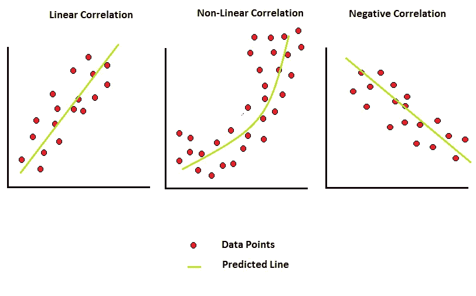
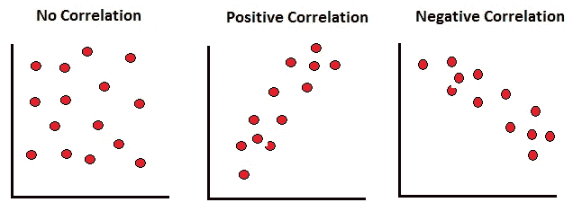
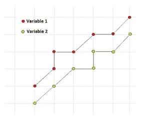
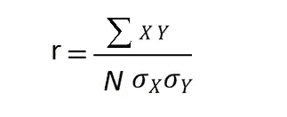
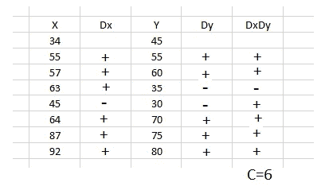
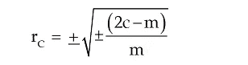

# 统计学中的相关性及其类型

> 原文：<https://pub.towardsai.net/correlation-and-its-types-in-statistics-7a723dcfd12d?source=collection_archive---------2----------------------->

## [统计数据](https://towardsai.net/p/category/statistics)

## 统计学有助于理解机器学习中的行为

相关性的类型。作者的照片

在本文中，我们将讨论变量之间的相关性，以观察数据的分散性。数据图的宽视图提供了挑选最适合的有价值的机器学习算法的洞察力。基于线性、非线性、密度和聚类来区分机器学习算法。

> ***把相关(共变)分成如下所示的部分:***

*   观察变量之间是否有关系。
*   如果这种相关性存在，那么它们彼此之间的意义有多大。
*   因果关系的原因。

 [## Z-统计量，T-统计量，P-统计量还在迷惑你？

### 机器学习统计学中的定义和概念

pub.towardsai.net](/z-statistics-t-statistics-p-statistics-are-still-confusing-you-87557047e20a) 

> ***变量中的相关类型***

*   **正:**这种类型的相关性基于两个数据变量基于递增平均值的递增移动。
*   **负:**这种类型的相关性基于一个变量增加而另一个变量减少的情况，反之亦然。
*   **简单:**仅两个变量之间的关系。
*   **多重:**这种类型的关系取决于各种变量。
*   **线性:**当关系是基于两个变量彼此之间的恒定比率差异变化时。
*   **非线性:**当这种关系不是基于两个变量彼此之间的恒定比率差异变化时。

 [## 统计学中的卡方假设检验

### 分类特征之间的关系关联

pub.towardsai.net](/chi-square-hypothesis-testing-in-statistics-87884bc73d99) 

> ***研究相关性的一些方法如下:***

*   散布法
*   图解
*   卡尔·皮尔逊相关系数
*   并发偏差法

## 散布法

在散点图中，我们通过图表寻找信息。这是检查两个变量之间关系的最简单的图表形式。从图中可以注意到，点是分散的，它们通过运动向我们显示信息。

*   上升趋势形成了正相关。
*   下跌趋势形成负相关。
*   点在各处的分散在它们之间没有形成相关性。

两个变量之间的散点图。作者的照片

散点图的一个主要问题是我们不能计算适当的相关度，因为它不是基于数学方法。

## 图解

在这种类型的方法中，相关性与线图或其他类型的图相关。在图表方法中，两个变量的点都放在图表中，以检查两个变量的接近程度和方向。这种方法在时间序列中很有用。

图表法。作者的照片

在这种方法中，我们也没有得到相关值。

 [## 各种类型集中趋势测量

### 中心趋势超出了平均值、中间值和众数

pub.towardsai.net](/various-type-of-central-tendency-measurement-d3cece097345) 

## 卡尔·皮尔逊方法

这种方法给出了两个变量之间关系的数学值。赋予该值的符号是“r ”,它表示相关程度。在这种方法中，我们必须明确一点，当我们计算项目与实际平均值的偏差时，值“r”给出了正确的值。

r =相关系数

X = (X-X^)

Y = (Y-Y^)

N =观察对数

适马 x =变量 x 的标准偏差

适马 y =变量 y 的标准偏差

r 的取值范围在“-1”到“+1”之间，它也用值来表示方向。例如，值+0.85 表示正相关，值-0.43 表示负相关。

*   皮尔逊的方法假设变量是线性相关的。
*   当系数根据假设的平均值计算时，它会影响关系。如果实际平均值是“24.4352”，那么计算时间会稍长一些。
*   这种方法比另一种方法计算时间长。

## 并发偏差法

在这种方法中，相关性是基于两个变量之间的运动差异来计算的。这意味着 X 变量有数值，这些数值是递增和递减的值，如下图所示，变量 Y 也是如此:

该方法中相关系数的公式如下所示:

Rc =相关系数

C =两个可变方向相乘的正结果数

M =成对观察的数量

> ***结论:***

相关性在机器学习和统计学中非常重要，可以知道变量之间的关系。

我希望你喜欢这篇文章。通过我的 [LinkedIn](https://www.linkedin.com/in/data-scientist-95040a1ab/) 和 [twitter](https://twitter.com/amitprius) 联系我。

# 推荐文章

1.  [NLP —用 Python 从零到英雄](https://medium.com/towards-artificial-intelligence/nlp-zero-to-hero-with-python-2df6fcebff6e?sk=2231d868766e96b13d1e9d7db6064df1)

2. [Python 数据结构数据类型和对象](https://medium.com/towards-artificial-intelligence/python-data-structures-data-types-and-objects-244d0a86c3cf?sk=42f4b462499f3fc3a160b21e2c94dba6)

3. [Python:零到英雄附实例](https://medium.com/towards-artificial-intelligence/python-zero-to-hero-with-examples-c7a5dedb968b?source=friends_link&sk=186aff630c2241aca16522241333e3e0)

4.[用 Python 全面讲解 SVM 分类](https://medium.com/towards-artificial-intelligence/fully-explained-svm-classification-with-python-eda124997bcd?source=friends_link&sk=da300d557992d67808746ee706269b2f)

5.[用 Python 全面讲解 K-means 聚类](https://medium.com/towards-artificial-intelligence/fully-explained-k-means-clustering-with-python-e7caa573176a?source=friends_link&sk=9c5c613ceb10f2d203712634f3b6fb28)

6.[用 Python 全面解释线性回归](https://medium.com/towards-artificial-intelligence/fully-explained-linear-regression-with-python-fe2b313f32f3?source=friends_link&sk=53c91a2a51347ec2d93f8222c0e06402)

7.[用 Python 全面解释逻辑回归](https://medium.com/towards-artificial-intelligence/fully-explained-logistic-regression-with-python-f4a16413ddcd?source=friends_link&sk=528181f15a44e48ea38fdd9579241a78)

8.[Python 时间序列基础](https://medium.com/towards-artificial-intelligence/basic-of-time-series-with-python-a2f7cb451a76?source=friends_link&sk=09d77be2d6b8779973e41ab54ebcf6c5)

9. [NumPy:用 Python 零到英雄](https://medium.com/towards-artificial-intelligence/numpy-zero-to-hero-with-python-d135f57d6082?source=friends_link&sk=45c0921423cdcca2f5772f5a5c1568f1)

10.[机器学习中的混淆矩阵](https://medium.com/analytics-vidhya/confusion-matrix-in-machine-learning-91b6e2b3f9af?source=friends_link&sk=11c6531da0bab7b504d518d02746d4cc)