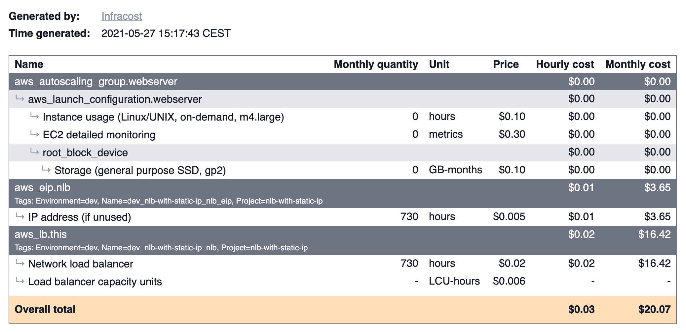
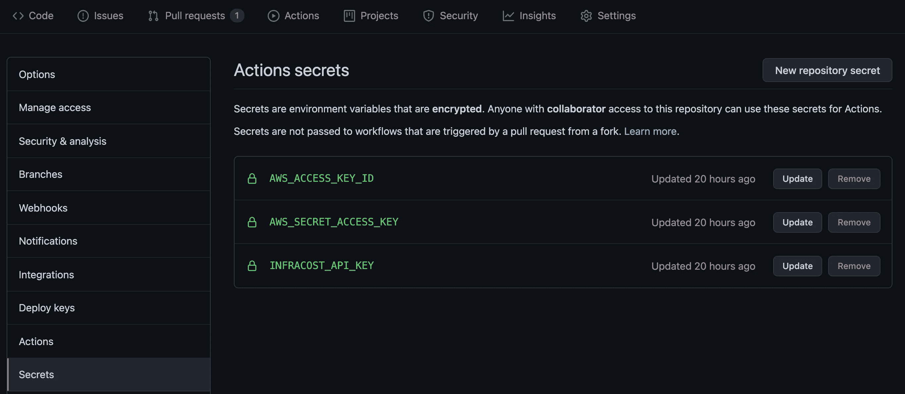
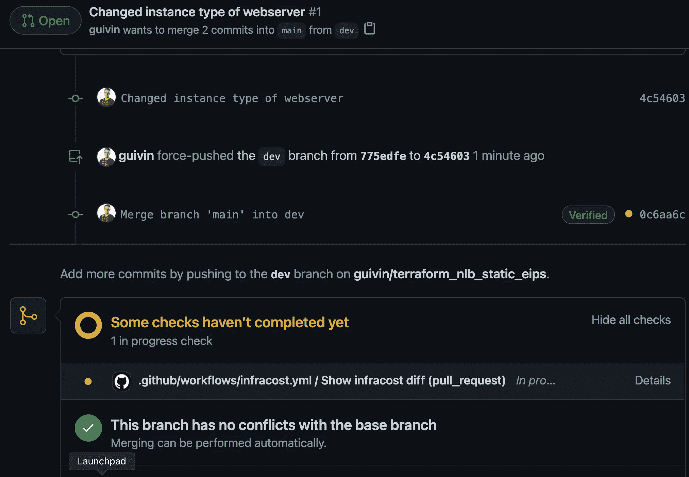
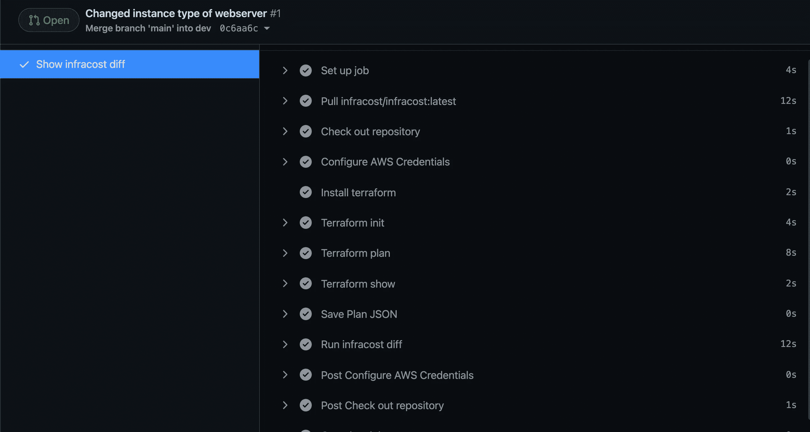
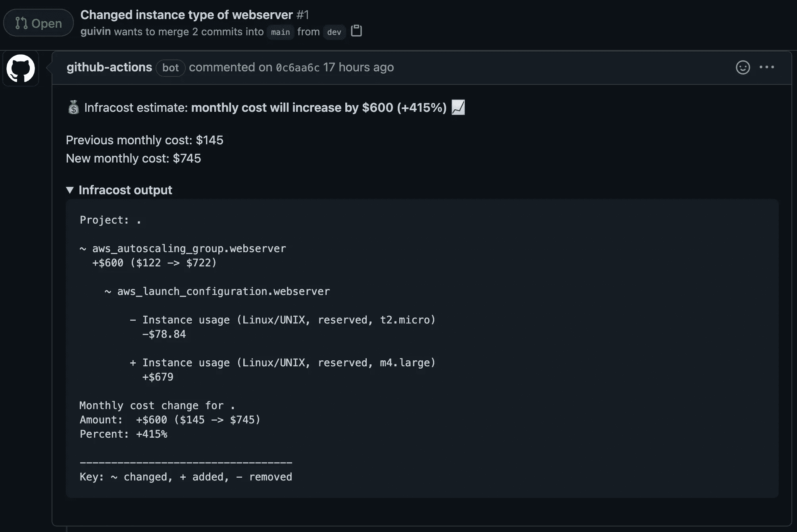

# 如何用 Terraform 进行云成本估算

> 原文：<https://pub.towardsai.net/cost-driven-infrastructure-development-with-infracost-183a83048bc6?source=collection_archive---------2----------------------->

## 在您的拉取请求中自动估算云成本


[行政长官](https://unsplash.com/@executium?utm_source=unsplash&utm_medium=referral&utm_content=creditCopyText)在[广场](https://unsplash.com/?utm_source=unsplash&utm_medium=referral&utm_content=creditCopyText)拍照

云计算非常适合快速发展您的业务。您只需为您使用的东西付费。这是一把双刃剑，你可以节省很多，也可以付出很多。这就是为什么每天分析你的账单是很重要的一点。云计算提供商提供工具来分析成本。这是一项枯燥但必要的任务。

在本文中，我们将看到如何以一种更有趣的方式来做这件事。众所周知，云基础设施通常作为代码来管理。最常用的工具是 Terraform。它能够跟踪代码和现有内容之间的变化。

每个变化都涉及成本，我们将看到如何用 Infracost 将这个维度添加到 Terraform 中。最后，您将知道如何度量变更的成本，并将其集成到您的代码审查中。这里以该项目为例进行介绍

# 什么是 Infracost？

> *“infra cost 显示了基础设施即代码项目(如 Terraform)的云成本估算。它有助于 DevOps、SRE 和开发人员快速看到成本明细，并提前比较不同的选项。”*[*https://github.com/infracost/infracost*](https://github.com/infracost/infracost)

Infracost 是一个简单的可执行程序。所以在 CI/CD 管道中安装和使用它非常简单。这里我们将使用 Terraform，但在项目路线图中，计划使用其他工具，如 [Pulumi](https://www.pulumi.com/) 或 [CloudFormation](https://aws.amazon.com/cloudformation) 。

一旦下载，Infracost 只需要注册，你就可以走了！

```
$ infracost register 
Please enter your name and email address to get an API key. See our FAQ (https://www.infracost.io/docs/faq) for more details. 
Name: Guillaume Vincent 
Email: [[email protected]](https://getbetterdevops.io/cdn-cgi/l/email-protection) 
Thank you Guillaume Vincent! Your API key is: xxxxxxxxxxxxxxxxxxxxxxxxx 
Success: Your API key has been saved to /Users/gvincent/.config/infracost/credentials.yml You can now run infracost breakdown --path=... and point to your Terraform directory or JSON/plan file.
```

# 估计成本

## 成本的详细分类

可以执行 Infracost 以获得完整的月度成本明细:

```
$ infracost breakdown --path terraform_nlb_static_eips
Detected Terraform directory at terraform_nlb_static_eips
  ✔ Running terraform init
  ✔ Running terraform plan
  ✔ Running terraform show
✔ Calculating monthly cost estimate
Project: terraform_nlb_static_eips
Name                                                      Monthly Qty  Unit            Monthly Cost
aws_autoscaling_group.webserver
 └─ aws_launch_configuration.webserver
    ├─ Instance usage (Linux/UNIX, on-demand, t2.micro)              0  hours                  $0.00
    ├─ EC2 detailed monitoring                                       0  metrics                $0.00
    └─ root_block_device
       └─ Storage (general purpose SSD, gp2)                         0  GB-months              $0.00
aws_eip.nlb
 └─ IP address (if unused)                                         730  hours                  $3.65
aws_lb.this
 ├─ Network load balancer                                          730  hours                 $16.42
 └─ Load balancer capacity units                         Cost depends on usage: $0.006 per LCU-hours
PROJECT TOTAL                                                                                $20.07
```

您可以修改代码并重新运行之前的命令，以获得新版本的更新成本估计。

## 当前状态和计划状态之间的每月成本差异

Terraform 更新、删除或创建资源将基础结构状态保存在文件中。当您部署一个新版本时，Terraform 能够根据您的更改检测出需要更新、删除和创建的内容。Infracost 依靠这个状态文件向您显示当前计划变更的成本影响。

为了说明这一点，我使用`terraform apply`部署了初始代码版本。然后我将当前的 EC2 实例类型从`t2.micro`扩展到`m4.large`:

```
$ git --no-pager diff                                                                                                                             
diff --git a/launch-configuration.tf b/launch-configuration.tf
index db22265..bcf90c7 100644
--- a/launch-configuration.tf
+++ b/launch-configuration.tf
@@ -1,7 +1,7 @@
 resource "aws_launch_configuration" "webserver" {
   name_prefix                 = "${local.name_prefix}_webserver"
   image_id                    = data.aws_ami.ubuntu.image_id
-  instance_type               = "t2.micro"
+  instance_type               = "m4.large"
   security_groups             = [
  aws_security_group.public.id]
   user_data                   = data.template_cloudinit_config.this.rendered
```

然后，我使用 diff 参数启动 Infracost 命令:

```
$ infracost diff --path .                                                                                                                                                                           
Detected Terraform directory at .
  ✔ Running terraform plan
  ✔ Running terraform show
✔ Calculating monthly cost estimate
Project: .
~ aws_autoscaling_group.webserver
  +$64.53 ($11.37 -> $75.90)
~ aws_launch_configuration.webserver
- Instance usage (Linux/UNIX, on-demand, t2.micro)
          -$8.47
+ Instance usage (Linux/UNIX, on-demand, m4.large)
          +$73.00
Monthly cost change for .
Amount:  +$64.53 ($27.79 -> $92.32)
Percent: +232%
```

diff 用法非常适合添加到代码评审的补充中，以证明和论证变更的成本。

## 使用使用文件改进成本估算

您可以向 Infracost 提供一个使用文件来细化成本估算:

terracost-usage-example.yml

该文件被添加到命令参数中:

```
$ infracost breakdown --path . --format html > report.html
```

## 报告

您可以生成[报告](https://www.infracost.io/docs/multi_project/report)来共享不同格式(HTML、JSON 等)的成本估算..) :



HTML 成本估算报告

# 将 Infracost 添加到 GitHub 操作

您可以将 Infracost 与许多 CI/CD 解决方案集成在一起。这里我们将关注 Github 动作，因为重用来自[市场](https://github.com/marketplace?type=actions)的现有动作很容易。在工作流中，我们将使用以下操作:

*   [Infracost 动作](https://github.com/infracost/infracost-gh-action)
*   [配置凭证的 AWS 操作](https://github.com/aws-actions/configure-aws-credentials)

工作流的配置在`.github/workflows/infracost.yml`的 terraform git 项目中进行配置:

。github/workflows/infracost.yml



储存在保管库中的 GitHub 操作工作流所需的凭据

我将之前的实例类型更改提交给了名为 dev 的分支，并打开了一个 pull 请求。这将触发工作流的步骤:



GitHub 拉请求的创建



GitHub 动作工作流程步骤的执行

当执行的工作流结束时，Infracost 输出在 pull 请求中可见:



拉取请求中的 Infracost 输出

# 资源

[](https://guillaume-vincent.medium.com/aws-load-balancer-and-static-ip-with-terraform-939f49475c80) [## 将静态 Ip 分配给 AWS 负载平衡器

### 用 Terraform 配置网络负载平衡器

guillaume-vincent.medium.com](https://guillaume-vincent.medium.com/aws-load-balancer-and-static-ip-with-terraform-939f49475c80) [](https://www.infracost.io/) [## 拉式请求中 Terraform 的云成本估算| Infracost

### Infracost 显示 Terraform 项目的云成本估算。它集成到拉请求中，并允许开发人员和…

www.infracost.io](https://www.infracost.io/) [](https://github.com/infracost/infracost) [## 低于成本/低于成本

### Infracost 显示了 Terraform 等基础设施即代码项目的云成本估算。它帮助德沃普斯，SRE 和…

github.com](https://github.com/infracost/infracost) [](https://github.com/features/actions) [## 功能* GitHub 操作

### 此时您不能执行该操作。您已使用另一个标签页或窗口登录。您已在另一个选项卡中注销，或者…

github.com](https://github.com/features/actions)  [## infra cost/infra cost-GH-行动

### 每当 Terraform 文件发生变化时，这个 GitHub 操作都会针对 pull 请求运行 Infracost。它会自动添加一个拉力…

github.com](https://github.com/infracost/infracost-gh-action) [](https://github.com/aws-actions/configure-aws-credentials) [## AWS-操作/配置-AWS-凭据

### 配置 AWS 凭据和区域环境变量，以便在其他 GitHub 操作中使用。环境变量…

github.com](https://github.com/aws-actions/configure-aws-credentials)