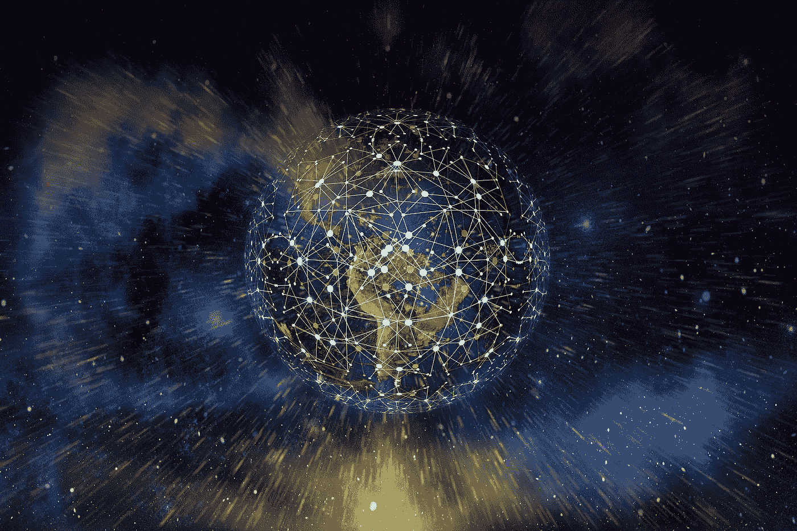

# 聊天机器人能穿越小世界吗？

> 原文：<https://pub.towardsai.net/could-chatbots-cross-small-worlds-a04b577b2f72?source=collection_archive---------0----------------------->

## 聊天机器人对人类身份的潜在影响。

杰勒特·皮沙贝

## 聊天机器人是语言的管道。

资源网络包围并赋予我们每天取得成果的能力。全球供应链建立了商品和服务的流动网络，从教育、贷款、食品分销、娱乐到运输。至少从网络所有者的角度来看，网络中的每个人都是一个节点，是多层网络的参与者，这主要是因为我们作为客户或其他参与模式，认同并隶属于该网络的某个部分或子部分。

TCP/IP 和 HTTP 协议支持作为互联网基础的技术网络。互联网，或称互联网络，这种通信网络实现了全球共享的奇迹般的壮举，这是马可尼发明的传播无线电网络所无法比拟的，它并不遵循梅特卡夫定律。每个节点不相互连接。子网、VPN、暗网和防火墙相互阻止服务器资源，并围绕利益或要求聚集在一起。

非互联网资源(人、食物、一些信息、信用、教育等。)也随着兴趣或要求而组织起来，如运动、所有权或意识形态。资金或专有知识产权等组织资产隐藏在旨在保护和守卫的许多物理和数字防御和授权层之后。

搜索本身，虽然理论上跨越了网络，但却局限于一个优化的结果群体，对于谷歌或脸书来说，这种优化是基于广告的。由于搜索结果的数量庞大，超越广告优先需要奉献精神、DuckDuckGo 或机器搜索。

就像今天信息在子网和搜索之间流动一样，很有可能由代码和数字输出组成的多种人工智能将沿着这些相同的管道流动。

使用人工智能技术生成人工智能对话代理(如 [Meena 2.6](https://ai.googleblog.com/2020/01/towards-conversational-agent-that-can.html) )的证据引出了一个问题，即这些对话代理将用于什么？

除了用包含在 YouTube 或 Vimeo 的平台和域内的 Deepfake 视频表演来欺骗人类之外，当一个对话聊天机器人通过转折测试时，有证据表明谷歌的 Meena 可能接近这样做，这将意味着无穷无尽的貌似真实、模拟的非真实对话可以沿着人们所属的这些子网传播。

## 语言和身份。

我们学习我们是谁，我们的身份，我们在事物中的位置的方式，很早就通过我们的家庭和社区设定了。社区标准和期望是明确的，通过机构和权威人物，如父母、教师和警察，我们了解我们是什么子网的一部分，我们不是什么子网的一部分，以及我们需要做什么来保持成员身份。

我们知道自己属于哪个“部落”,不属于哪个。我们本质上并且很可能自主地描述了一个身份的子网络，它是我们准备检查的话语的边界，以及一组外部的“额外话语”,我们不是其中的一方，并与之保持一定的距离。

这种自主行为影响了我们对原因和结果的感知能力，告诉我们什么是*因果关系。使人类有意义的东西，也就是因果关系的东西，不是科学的，而是由我们的身份赞助和引导的，不是纯粹逻辑本身可以导航的。可能只有维特根斯坦能够做到这一点。*

人工智能代理不受这些考虑的支配。它们是寻求效率的公司的资产，无论这种效率是拒绝垃圾邮件、优化数据中心空调，还是使客户零售体验更具粘性。

如果我们接受每个节点(人或资源)并不与其他节点相连，并且子网络的集群(无论是由资源、信念、设备、认知、信息、数据、金钱、土地等组成。)由于无处不在的计算连接而横向互联，这就是[小世界网络](https://en.wikipedia.org/wiki/Small-world_network)的论点。

## 风险。

由通用协议互联的资源集群可以允许人工智能工作在小世界网络中流动和传播。

现在，如果最初的人工智能努力本质上是狭义的解决方案，那么新兴的更广泛的对话代理可以模仿人类语言来触摸感知和认知。最接近我们的东西是由语言和批判性思维构成的。而且这还不包括一个尚不存在的 AGI，它可以让*和*说话。

如果我们的身份起源于我们的家乡子网络，通常是一个在我们还是孩子的时候就被自主规定的物理/意识形态社区，那么这个子网络就是我们知识的小世界，并创造了我们的经历。

任何能够自信地模拟人类特质的人工智能的最大风险不是财富分配不平等，这是意外收入条款试图缓解的，因为这就是资本主义。而硅谷 4 国在这方面已经实现了高级的不平等。

最大的风险是，具有非人类道德的人工对话代理与人类身份创造的自主过程相交叉，而人类身份创造的自主过程是产生意义的能力的根源。

## 以任何其他名称做广告。

试图影响人类绕过批判性思维的广告使用心理学技术从网络中的一个供应商那里获得资源，而不是另一个供应商，这种广告找到了新的盟友。

假冒的未申报聊天机器人模仿社交网络上的远程数字朋友，可以以某种程度的真实性进行聊天，这种真实性是无法检测的，可以非常容易和令人信服地推广产品和服务。但是，更重要的是，随着时间的推移，人类参与者的身份可能会慢慢演变，以改变对人工对话代理“偏好”的产品或品牌的“品牌价值”的忠诚。

伟大的全球品牌倡导品牌价值，如耐克的“只管去做”。虽然全球人口的规模使其成为一种人造体验，但与带有制造商标志的产品的真实性不同，该公司推出的一些东西是品牌承诺，我们可以选择购买或不购买。我们选择认同或不认同那个品牌，并把它纳入我们的小世界子网络。

在聊天机器人出现之前，我们可以通过人们在公共叙事层面上撰写的文本来获取新闻，我们可以对其进行评估和批判性思考；或者观看好莱坞电影，为了反思或刺激而精心制作的信息；或者观看高度编辑的公共媒体频道，并怀疑他们的政治倾向。

现在，聊天机器人*作为新媒体*处于私人一对一的水平，处于私人谈话的水平，一个潜在的非道德代理人在我们耳边低语，穿越我们的小世界。

在这个人工智能广告网络可能的未来，利用会话词汇的能力，有说服力的个性化文本可以从一个小世界传播到另一个小世界。随着 MelNet 等的完善，单词将会以类似人类的流畅度和音调变化说出来。使对话与子网密切相关、使对话有意义、使对话引人入胜的习惯用语和语言的各个方面，可以随着同样的广告冲动在子网之间穿行而被转换和翻译，从而使每个小世界变得不那么独特，而更加同质。不那么小。

这是一种风险，这是一种非人类代理将我们的身份殖民到自然发生的小世界边界之外的风险，这是 AI 本身固有的风险，无法通过扼杀 AI 或将其标记为 Bot 来消除。

一个引人注目的、有吸引力的、个性化的、专注的、全天候“为我们”的谈话者的风险是一个数字斯文加利，通过奉承和镜子般的议程驱动的声明扭曲人类的身份，有可能使一个不加批判的未来变得更不多样化、更同质、更不个人主义、更无聊、更不理智。

## **脚注**

[1]甚至不同语言(协议)的自然子网障碍也不会[长久](https://www.zdnet.com/article/google-ai-helps-google-translate-offer-these-new-languages-spoken-by-millions/#ftag=CAD-03-10abf5f)。