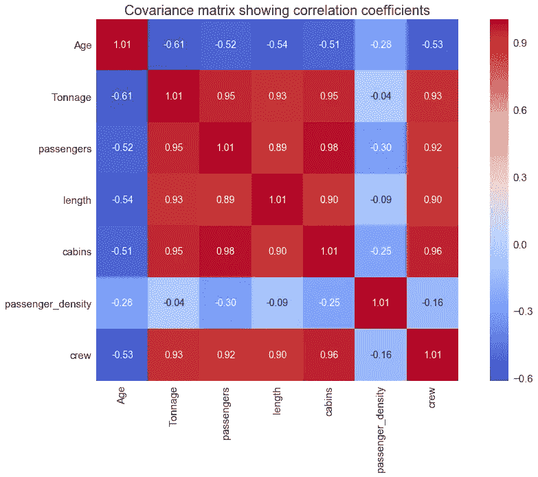
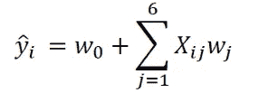
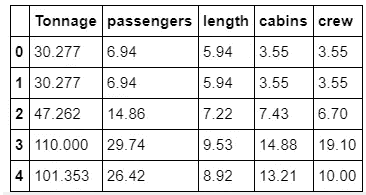

# 使用 Seaborn 热图的协方差矩阵可视化

> 原文：<https://pub.towardsai.net/covariance-matrix-visualization-using-seaborns-heatmap-plot-64332b6c90c5?source=collection_archive---------1----------------------->

## 本教程演示了如何使用 seaborn 库创建和可视化协方差矩阵



Benjamin O. Tayo 的图片

# 一.导言

在实现机器学习算法之前，有必要在训练数据集中仅选择相关特征。转换数据集以便只选择训练所需的相关特征的过程称为降维。特征选择和维数减少是重要的，因为有三个主要原因:

1.  **防止过度拟合**:具有太多特征的高维数据集有时会导致过度拟合(模型捕捉真实和随机效果)。
2.  **简单性**:一个拥有太多特性的过于复杂的模型可能很难解释，尤其是当特性相互关联的时候。
3.  **计算效率**:在低维数据集上训练的模型在计算上是高效的(执行算法需要更少的计算时间)。

协方差矩阵是一种非常简单、有效和可靠的特征选择和降维方法。本教程将说明如何使用 seaborn 库创建和可视化协方差矩阵图。

我们将使用游轮数据集[**cruise _ ship _ info . CSV**](https://github.com/bot13956/ML_Model_for_Predicting_Ships_Crew_Size)用协方差矩阵图来说明特征选择和维数减少的过程。假设我们要建立一个回归模型来预测邮轮**的船员人数**，基于以下特征:【12】年龄、14】吨位、16 乘客、18 长度、20 船舱、22 乘客密度。我们的模型可以表示为:



其中 **X** 为特征矩阵， **w** 为训练时需要学习的权重。我们要解决的问题如下:

在 6 个特征[' **年龄**'、**吨位**'、**乘客**'、**长度**'、**车厢**'、**乘客 _ 密度** ]中，哪一个最重要？我们可以通过创建和可视化协方差矩阵来回答这个问题。

# 二。使用 Seaborn 库创建和可视化协方差矩阵

## 导入必要的库

```
**import** **numpy** **as** **np** **import** **pandas** **as** **pd** **import** **matplotlib.pyplot** **as** **plt** **import** **seaborn** **as** **sns**
```

## 读取数据集并显示列

```
df = pd.read_csv("cruise_ship_info.csv")df.head()
```


## 计算协方差矩阵

```
cols = ['Age', 'Tonnage', 'passengers', 'length', 'cabins','passenger_density','crew']**from** **sklearn.preprocessing** **import** StandardScalerstdsc = StandardScaler()X_std = stdsc.fit_transform(df[cols].iloc[:,range(0,7)].valuescov_mat =np.cov(X_std.T)
```

## 生成用于显示协方差矩阵的热图

```
plt.figure(figsize=(10,10))sns.set(font_scale=1.5)hm = sns.heatmap(cov_mat,
                 cbar=**True**,
                 annot=**True**,
                 square=**True**,
                 fmt='.2f',
                 annot_kws={'size': 12},
                 yticklabels=cols,
                 xticklabels=cols)plt.title('Covariance matrix showing correlation coefficients')plt.tight_layout()plt.show()
```


## 使用协方差矩阵图的特征选择

从上面的协方差矩阵图中，我们看到“船员”变量与 4 个预测变量“吨位”、“乘客”、“长度”和“客舱”密切相关(相关系数≥ 0.6)。

```
cols_selected = ['Tonnage', 'passengers', 'length', 'cabins','crew']df[cols_selected].head()
```



## 定义您的特征和目标变量

```
X = df[cols_selected].iloc[:,0:4].values    *# features matrix * y = df[cols_selected]['crew'].values        *# target variable*
```

上面获得的特征矩阵和目标变量然后可以用于[模型建立](https://github.com/bot13956/ML_Model_for_Predicting_Ships_Crew_Size)。

# 三。总结和结论

总之，我们已经展示了如何使用 seaborn 的热图工具创建和可视化协方差矩阵。利用协方差矩阵的可视化，使用特征选择将原始维数从 6 降低到 4。

其他高级的特征选择和降维方法有**主成分分析**(PCA)**线性判别分析**(LDA)**套索回归**、**岭回归**。点击以下链接了解更多信息:

[**机器学习:通过主成分分析进行降维**](https://medium.com/towards-artificial-intelligence/machine-learning-dimensionality-reduction-via-principal-component-analysis-1bdc77462831)

[**机器学习:通过线性判别分析进行降维**](https://medium.com/towards-artificial-intelligence/machine-learning-dimensionality-reduction-via-linear-discriminant-analysis-cc96b49d2757)

本文的数据集和 jupyter 笔记本文件可以从这个存储库下载:[https://github . com/bot 13956/ML _ Model _ for _ Predicting _ Ships _ Crew _ Size](https://github.com/bot13956/ML_Model_for_Predicting_Ships_Crew_Size)。