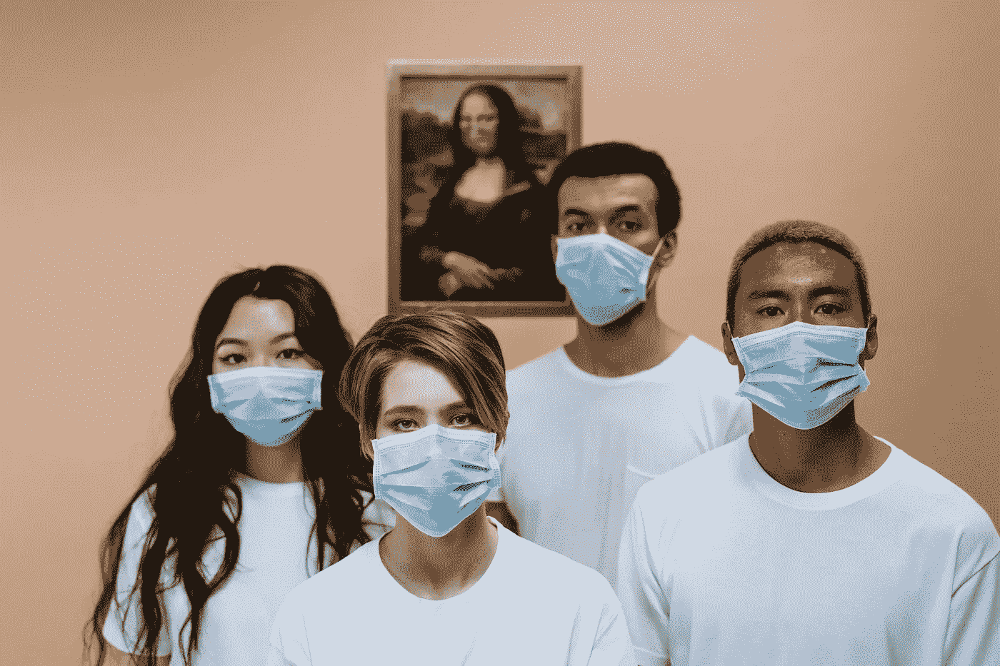
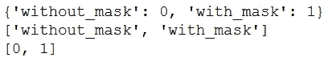
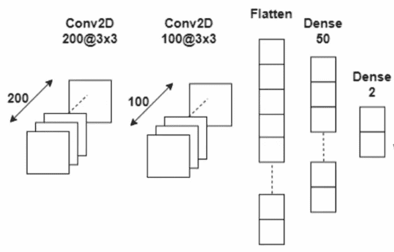
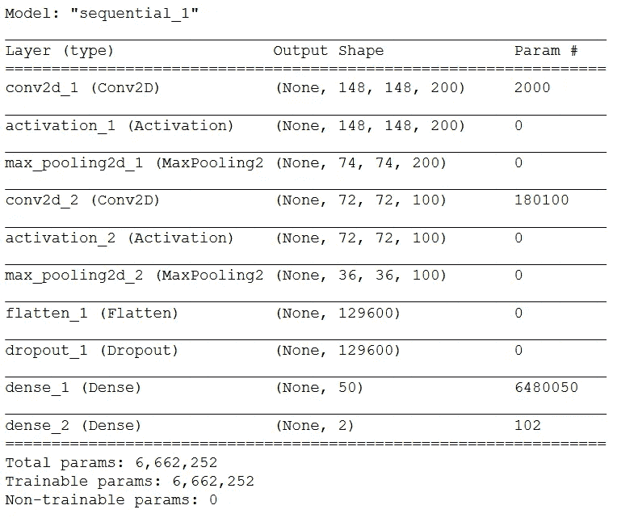
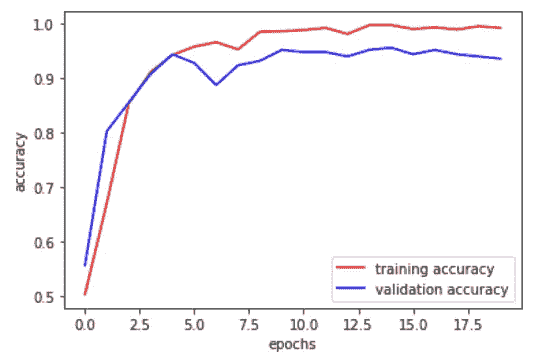
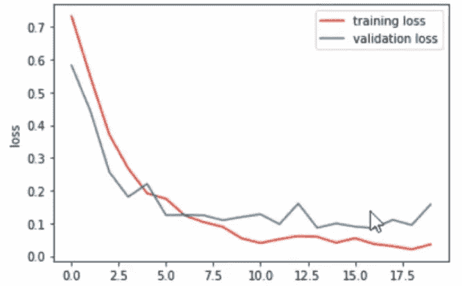
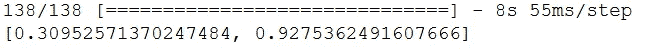
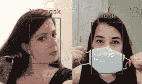

# 新冠肺炎:使用深度学习和 OpenCV 的人脸面具检测

> 原文：<https://pub.towardsai.net/covid-19-face-mask-detection-using-deep-learning-and-opencv-9e554c380e23?source=collection_archive---------1----------------------->

## [计算机视觉](https://towardsai.net/p/category/computer-vision)、[深度学习、](https://towardsai.net/p/category/machine-learning/deep-learning)、[现实世界中的数据科学](https://medium.com/towards-data-science/data-science-in-the-real-world/home)

## 构建一个 CNN 模型，实时检查一个人是否戴着面具



图片来自 [**像素**](https://www.pexels.com/photo/health-workers-wearing-face-mask-3957987/?utm_content=attributionCopyText&utm_medium=referral&utm_source=pexels)

新冠肺炎严重影响了整个世界。它对我们的日常生活产生了巨大的影响，这种危机与日俱增。在不久的将来，似乎很难彻底根除这种病毒。

为了对抗这种病毒，口罩已经成为我们生活中不可或缺的一部分。这些口罩能够阻止这种致命病毒的传播，这将有助于控制传播。随着我们开始在这个“新常态”的世界中前进，口罩的必要性增加了。因此，在这里，我们将建立一个模型，将能够分类的人是否戴着面具。这种模式可以用在拥挤的地方，如商场、公交车站和其他公共场所。

# 让我们从面罩检测器开始:

**步骤 1:导入要使用的库:**

```
import cv2,os
import numpy as np
from keras.utils import np_utils
from keras.models import Sequential
from keras.layers import  Dense, Activation, Dropout, Conv2D, Flatten, MaxPooling2Dfrom keras.callbacks import ModelCheckpoint
from sklearn.model_selection import train_test_split
from matplotlib import pyplot as plt
from keras.models import load_model
```

**第二步:添加数据路径并标记类别:**

为了建立这个模型，我们将使用由[般若班达瑞](https://www.linkedin.com/feed/update/urn%3Ali%3Aactivity%3A6655711815361761280/)提供的面具数据集。它由大约***1376 张*** 图像与 ***690 张*** 图像包含带面具的人和 ***686 张*** 图像包含不带面具的人组成。

```
#*use the file path where your dataset is stored*
data_path = r'C:\Users\admin\Desktop\face mask detection\face-mask-detector\dataset'categories = os.listdir(data_path)
labels = [i for i in range(len(categories))]label_dict = dict(zip(categories,labels))
print(label_dict)
print(categories)
print(labels)
```

*输出:-*



(作者供图)

**第三步:列出数据和目标:**

```
img_size = 150
data = []
target = []for category in categories:
    folder_path = os.path.join(data_path,category) 
    img_names = os.listdir(folder_path)

    for img_name in img_names:
        img_path = os.path.join(folder_path,img_name)
        img = cv2.imread(img_path)
        try:
            gray = cv2.cvtColor(img,cv2.COLOR_BGR2GRAY)
            resized = cv2.resize(gray,(img_size,img_size))
            data.append(resized)
            target.append(label_dict[category])

        except Exception as e:
            print("Exception: ",e)
```

形成的列表(数据和目标)被转换成 NumPy 数组，以便于数据预处理。数据阵列被重新整形，以便它可以作为输入提供给神经网络结构。之后，这些文件被保存为. npy 文件。

```
data = np.array(data)/255.0  #*data values are normalized*#*reshaping of data* data = np.reshape(data,(data.shape[0],img_size,img_size,1))target = np.array(target)
new_target = np_utils.to_categorical(target)#saving the files                                np.save('data',data)
np.save('target',new_target)
```

**第四步:建立神经网络模型:**

首先，我们将从上一步创建的文件中加载数据。然后我们正在使用卷积层和最大池层制作一个神经网络。最后，输出被平坦化，并被馈送到具有 50 个神经元的完全连接的密集层中，最后被馈送到具有 2 个神经元的层中，因为它将分别输出一个人戴面具或不戴面具的概率。



使用的神经网络模型(作者提供照片)

```
data = np.load('data.npy')
target = np.load('target.npy')model = Sequential()
model.add(Conv2D(200,(3,3),input_shape=data.shape[1:]))
model.add(Activation('relu'))
model.add(MaxPooling2D(pool_size=(2,2)))model.add(Conv2D(100,(3,3)))
model.add(Activation('relu'))
model.add(MaxPooling2D(pool_size=(2,2)))model.add(Flatten())
model.add(Dropout(0.5))
model.add(Dense(50,activation='relu'))
model.add(Dense(2,activation='softmax'))model.compile(optimizer='adam', loss='categorical_crossentropy', metrics = ['acc'])model.summary()
```

模型总结如下:



模型摘要(作者照片)

**第四步:拆分数据和目标并放入模型:**

然后将数据和目标划分为训练数据，测试数据保留 10%的数据作为测试数据，90%作为训练数据。

```
train_data, test_data, train_target, test_target = train_test_split(data, target, test_size=0.1)
```

创建一个检查点，它将保存模型，这将具有最小的验证损失。然后将训练数据拟合到模型中，以便在未来进行预测。

```
checkpoint=ModelCheckpoint('model-{epoch:03d}.model', monitor='val_loss', verbose = 0, save_best_only = True,mode='auto')history = model.fit(train_data,train_target,epochs = 20, callbacks = [checkpoint], validation_split = 0.2)
```

拟合模型后，绘制训练和验证数据的准确性和损失图表

```
plt.plot(history.history['acc'],'r',label='training accuracy')
plt.plot(history.history['val_acc'],'b',label='validation accuracy')
plt.xlabel('epochs')
plt.ylabel('accuracy')
plt.legend()
plt.show()plt.plot(history.history['loss'],'r',label='training loss')
plt.plot(history.history['val_loss'],'b',label='validation loss')
plt.xlabel('epochs')
plt.ylabel('loss')
plt.legend()
plt.show()
```



准确度图(作者提供照片)



损失图(作者照片)

我们可以看到一些过度拟合的迹象，可以通过调整参数来解决。否则，这个模型在实时情况下也能很好地工作。

**注意:-** 不用自己做神经网络 arch，可以使用互联网上的 arch，像 ResNets，MobileNetV2 等。他们一定会表现得很好。

现在，根据测试数据评估模型:

```
print(model.evaluate(test_data,test_target))
```

*输出:*



模型对测试数据的评估(作者照片)

我们可以看到，该模型对测试数据的准确率约为 93%，损失为 0.309。

现在我们可以实时应用这个模型了。

**第六步:通过网络摄像头实时使用模型:**

首先，通过回调加载保存为最佳模型的模型。现在我们将使用 Haar Cascade 分类器在视频的每一帧中查找人脸(*使用您存储 XML 文件的路径)。*另外，为两个不同的类别制作标签和颜色字典，即蒙版和无蒙版。

可以从下面的 [*链接*](https://github.com/opencv/opencv/blob/master/data/haarcascades/haarcascade_frontalface_default.xml) *下载 XML 文件。*

```
model = load_model('model-017.model') *#load the best model*faceCascade=cv2.CascadeClassifier(r'C:\Users\admin\Desktop\capstone\HaarCascade\haarcascade_frontalface_default.xml')video_capture = cv2.VideoCapture(0)  *#starts the webcam*
labels_dict = {0:'NO MASK',1:'MASK'}
color_dict  = { 0:(0,0,255),1:(0,255,0)}
```

在一个无限循环中，从视频流中捕获每一帧，并将其转换为灰度以便更好地处理，然后应用级联来找到 ROI(感兴趣的区域)，在我们的 case- faces 中。调整每个 ROI 图像的大小并使其正常化，然后将其交给模型进行预测。通过这个，你将得到有无屏蔽的概率。选择概率较高的一个。在脸部周围画一个框，也表示一个人有没有戴面具。要关闭网络摄像头，请按 Esc 按钮。

```
while(True):
    ret,frame = video_capture.read()
    gray = cv2.cvtColor(frame,cv2.COLOR_BGR2GRAY)
    faces = faceCascade.detectMultiScale(gray,1.3,5)

    for x,y,w,h in faces:
        face_img = gray[y:y+w,x:x+h]
        resized = cv2.resize(face_img,(img_size,img_size))
        normalized = resized/255.0
        reshaped = np.reshape(normalized,(1,img_size,img_size,1))
        result = model.predict(reshaped)

        label = np.argmax(result,axis=1)[0]
        cv2.rectangle(frame,(x,y),(x+w,y+h),color_dict[label],2)
        cv2.putText(frame,labels_dict[label],(x,y-10),cv2.FONT_HERSHEY_SIMPLEX,0.8,(255,255,255),2)

    cv2.imshow('Video',frame)
    key=cv2.waitKey(1)

    if(key==27):
        break;

cv2.destroyAllWindows()
video_capture.release()
```



模型的样本输出

万岁！！我们开发了一个模型，可以描述一个人是否戴了面具。这些类型的模型可以在公共场所实施，这将有助于当局容易地监测情况。我希望你喜欢制作这个模型，并愿意在未来看到更多…:)