# 新冠肺炎封锁影响分析

> 原文：<https://pub.towardsai.net/covid-19-lockdown-impact-analysis-using-python-and-plotly-cff5c2c38964?source=collection_archive---------0----------------------->

## [数据科学](https://towardsai.net/p/category/data-science)，[观点](https://towardsai.net/p/category/opinion)

## 使用谷歌的社区移动数据分析新冠肺炎封锁如何影响日常活动。

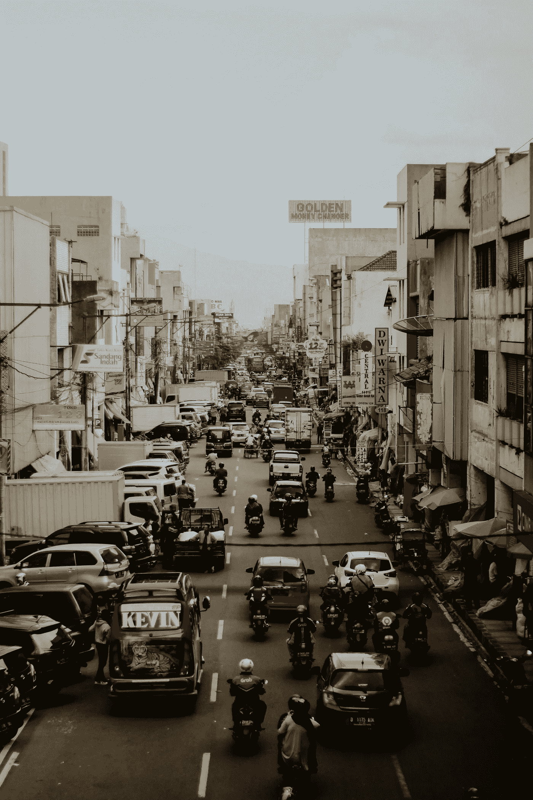

照片由[法拉克·拉祖尔迪](https://unsplash.com/@falaqkun?utm_source=unsplash&utm_medium=referral&utm_content=creditCopyText)在 [Unsplash](https://unsplash.com/s/photos/crowded-places?utm_source=unsplash&utm_medium=referral&utm_content=creditCopyText) 拍摄

封锁。直到 2020 年 3 月，我才听说过这个词。我被一个事实吓了一跳，5 个月前一个未知的实体已经成为我们生活中不可或缺的一部分！新冠肺炎一级防范禁闭在很多方面影响了世界。在与新冠肺炎的战斗中，大多数政府实施了全国范围的封锁，使生活陷入停顿。随着时间的推移，一些国家放松了封锁措施，尽管病例有所增加，但人们已经慢慢开始回到日常生活中。在这篇文章中，我将分析和比较我国(印度)两个邦的社区流动性。

**机动性** —自由移动的能力。

> 或者对代码不感兴趣的人，你可以浏览可视化并复制本文末尾提供的笔记本。如果您对分析感兴趣，您还可以在笔记本上记录您所在州/国家的详细信息。

# 数据

最近，谷歌发布了谷歌社区移动报告，帮助人们了解不同地点的访问者的变化。杂货店和药店、工作区等。谷歌使用与谷歌地图相同的方法收集这些数据。这些报告为卫生保健官员提供了见解，从而帮助他们有效地处理疫情。你可以在这里找到数据集。

该数据集包括六个类别，以及相对于给定州/国家的基线，该特定日游客流动增加/减少的百分比。

```
import pandas as pd
df = pd.read_csv('data.csv')
```

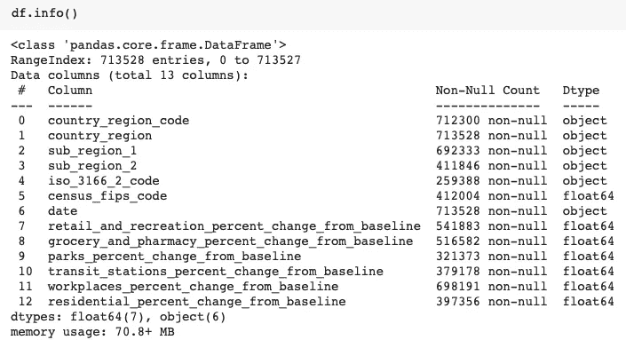

如您所见，共有 7L 个条目，包括所有国家和州。在上述数据集中，从 2 月 15 日到 7 月 21 日跟踪移动性(该数据定期更新)。

跟踪流动性的六个类别是-
1。娱乐——包括酒吧、剧院、咖啡馆等。
2。杂货和药房
3。公园——包括国家森林、公共花园等。
4。公交车站——包括地铁站、海港、出租车站等。
5。工作空间
6。住宅区。

在移除不必要的列并仅提取印度的统计数据后，我们的新数据集`df_india`看起来像是—

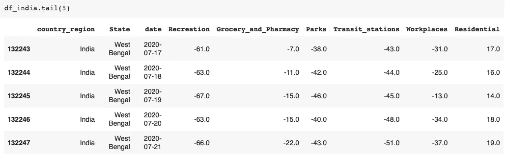

如您所见，相对于印度西孟加拉邦的基线，有 6 个由移动百分比组成的类别。类似地，我们的数据集包含从 2 月 15 日到 7 月 21 日印度所有邦的详细信息。

## 基线是什么？

基线值是当天的*正常*值。基线值是 2020 年 1 月 3 日至 2 月 6 日这 5 周的中值。例如，在 2020 年 7 月 17 日(星期五)的上图中，你可以看到娱乐活动减少了 61%。这 61%的下降是相对于 2020 年 1 月 3 日至 2 月 6 日期间所有星期五观察到的中值而言的。类似地，所有 7 个工作日都有不同的基线值，即。星期日有不同的基线值，星期一有不同的值，依此类推。

## 为什么是 2020 年 1 月 3 日-2 月 6 日？

这是因为这一时期世界上大多数地方的生活都很正常。这些报告的主要目的是表明相对于生活正常的日子，流动性的变化。

## 为什么不同的日子有不同的基线值？

现在让我们考虑工作空间的例子。如果我们有一个通用的基线值，如果我们比较星期五和星期六，移动性将下降 100%,因为星期六工作区关闭。因此，将周六的流动性与其前一个周六而非其他任何一天进行比较是合适的。

## 插入锁定指示器

在印度，封锁始于 2020 年 3 月 22 日。所以我们可以把封锁前的日期和 3 月 22 日之后到封锁后的日期分开。我们将创建一个列来指示锁定前或锁定后。

首先，让我们编写一个函数，它将日期作为输入，并对它是锁定前还是锁定后进行分类。接下来，我们将在日期列上应用这个函数。

封锁也分 4 个阶段实施。到目前为止，解锁分两个阶段实施。我们将创建另一列来表示阶段。

我们修改后的数据集看起来像—

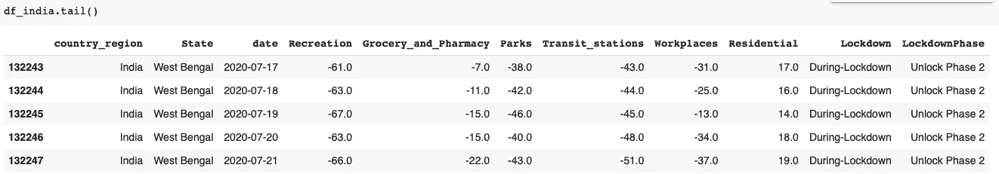

## 箱线图

> 箱线图用于可视化数据中的分布、中值和异常值。

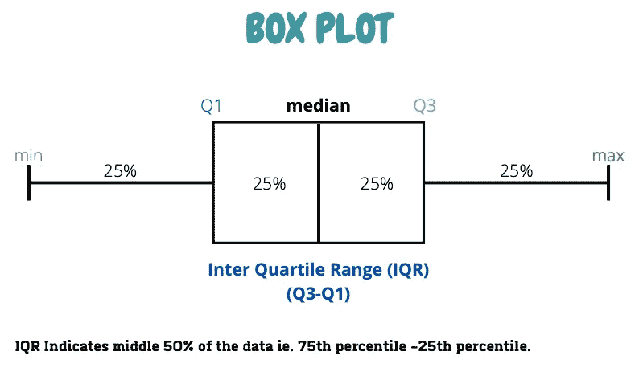

我们将分析印度特伦甘纳邦和安得拉邦这两个邦的流动性。首先让我们从`df_india.`中过滤出这两种状态的数据

```
df_india_Telangana_and_AP = df_india[(df_india["State"] == "Telangana") | (df_india["State"] == "Andhra Pradesh")]
```

现在，让我们为所有 6 个类别创建箱线图，并比较锁定前和锁定期间的状态。

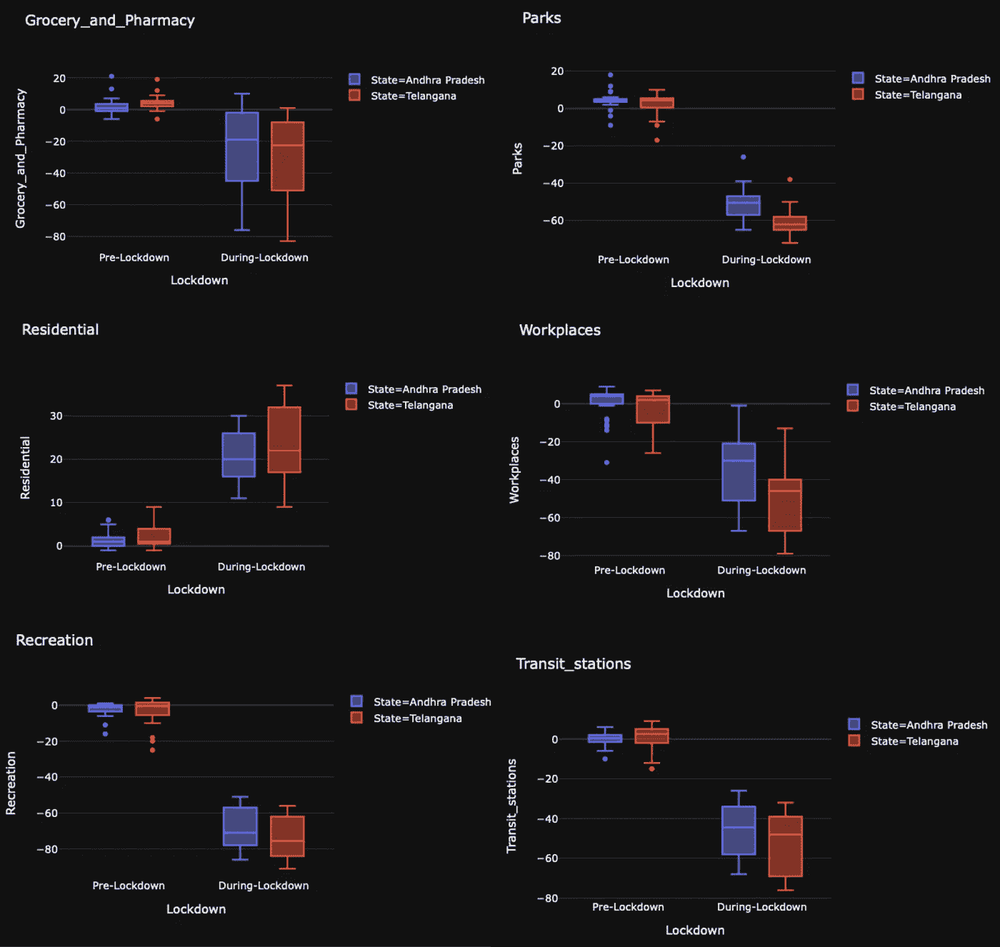

移动用户可以点击图片并缩放。

在上图中，我们可以看到不同类别的不同盒状图。从所有箱线图中可以明显看出的一点是，在锁定期间，这两种状态的大多数类别的移动性百分比都有所下降。而在住宅类别中，我们可以看到流动性明显增加。公园和娱乐场所最少。盒子的长度描述了扩散。而食品杂货在封锁期间的价差最高，从 0 到-80。

**需要记住的一点是，在锁定阶段还包括解锁 1.0 和 2.0 阶段**，这也是杂货店和工作场所更加普及的原因。

让我们计算每个类别的平均移动百分比，并绘制一个条形图。

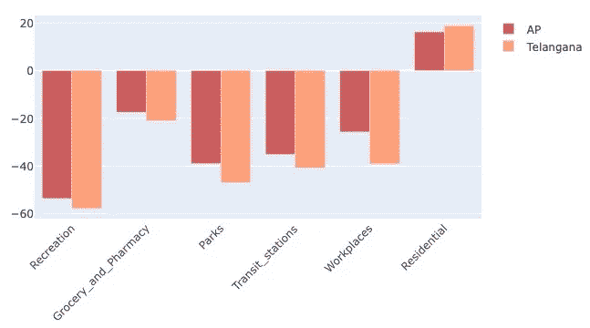

在上面的条形图中，我们可以注意到两个州的工作场所移动性的平均百分比存在显著差异。还可以清楚地看到，无论是流动性的减少还是增加，特伦甘纳邦都领先安得拉邦。

## 逐相分析

正如我之前提到的，印度的锁定分 4 个阶段实施，解锁分 2 个阶段实施，让我们比较一下各阶段的移动趋势。我们将绘制一个线状图，将百分比的周平均值作为视觉上吸引人的图表。我们将为每个州创建单独的地块。

/

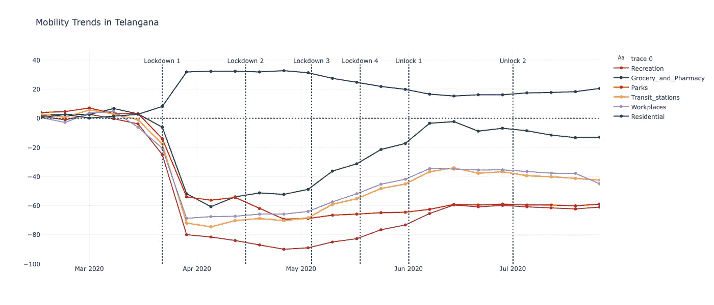

手机用户可以点击图片进行缩放。

我们可以看到，在锁定期间，所有类别的移动性都急剧下降，而住宅类别的移动性突然上升。据了解，娱乐中心在特伦甘纳州受到的影响最大。

从所有类别的锁定 3 中可以观察到移动性的稳步上升。食品店和药店在解锁 1 后已达到基线值。而公园和娱乐中心在解锁 2 后下降了 60%,这表明人们仍然不愿意自由移动。安得拉邦也有类似的趋势。

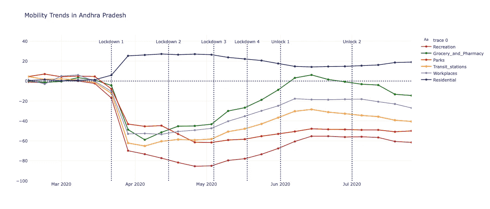

手机用户可以点击图片进行缩放。

## 尽管有限制，人们还是被叫去工作了吗？

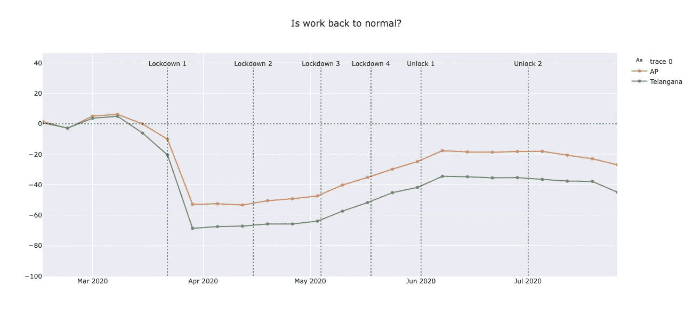

在前两次锁定期间，有一个下降，这表明人们在家工作或没有工作。然而，在一级防范禁闭 3 之后，当旅行限制被部分解除时，在这两个邦，尤其是安得拉邦，参观工作场所的人数增加了。人们现在被要求以分级的方式工作，以减少办公场所的聚集。

正如你所看到的，流动性在急剧下降的同时也在上升，这可能是上述工作场所类别在箱线图中分布较高的原因(对于两个州)。

## 最后但同样重要的是…这两个州的病例增加了吗？

在 Kaggle [这里](https://www.kaggle.com/sudalairajkumar/covid19-in-india)有一个众包数据集。在收集和过滤数据集后，如果我们绘制每天病例数上升的线图，就会得到下面的图。

下图包含每天病例的增加，而不是累计计数。例如，2000 表示该日的病例数，而不是该日之前的病例总数。

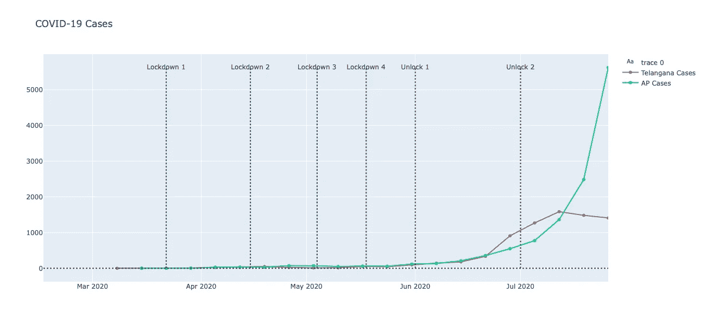

我估计你们大部分人看了上面的线剧情都很惊讶。正如预期的那样，在封锁期间病例略有增加，但在安得拉邦的解锁阶段 2，你可以看到一天内增加了 5000 多个病例，这间接表明了病例的增加与流动性增加之间的关系，正如我们在上面看到的那样。

我们还注意到，与特伦甘纳邦相比，安得拉邦人口流动的下降幅度较小，而上升幅度较大，这也可以从病例数量中反映出来。

完整的代码可以在 [Github](https://github.com/kurasaiteja/COVID-19-Lockdown-Impact-Analysis) 上找到。

# 结论

在这篇文章中，我分析了封锁对安得拉邦和特伦甘纳邦流动性的影响，并对它们进行了比较。我们知道，随着限制的放松，越来越多的人开始自由流动，这也导致了病例数量的上升。公园和娱乐中心很大程度上受到不愿意去的人的影响。

我希望你今天带回家一些新概念！如果您想联系，**请在**[**LinkedIn**](https://www.linkedin.com/in/saiteja-kura-49803b13b/)**上联系我。**

**免责声明-观察和观点纯粹是基于数据的个人观点。**