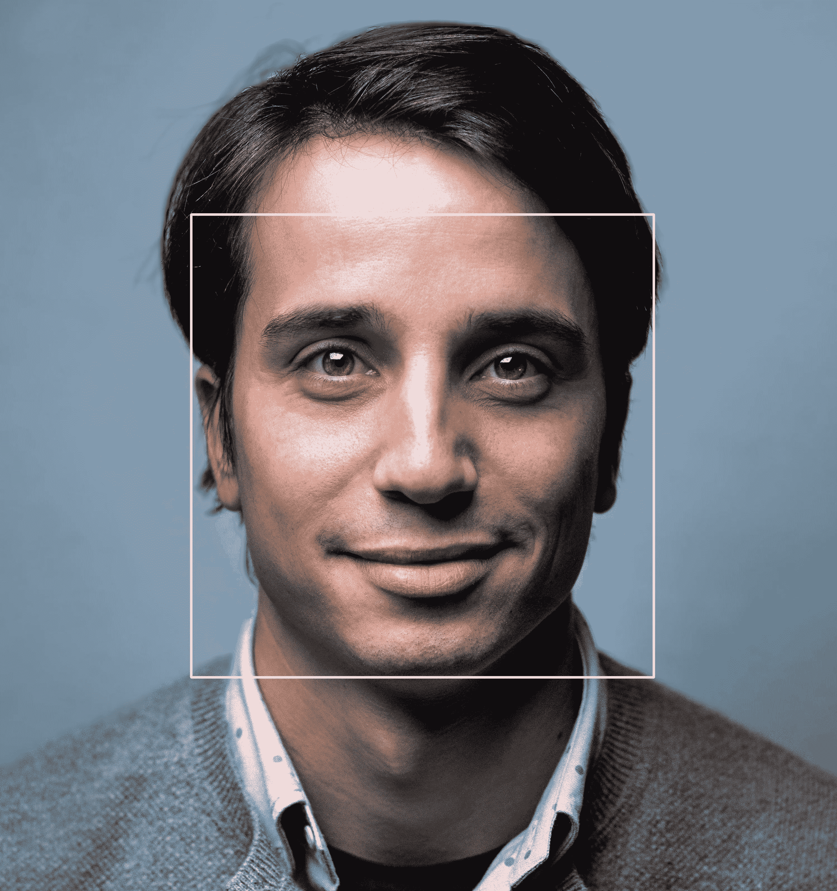
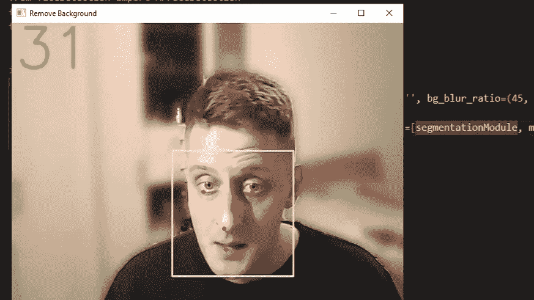

# 用 Python 实现 CPU 实时人脸检测

> 原文：<https://pub.towardsai.net/cpu-real-time-face-detection-with-python-21e0473451c4?source=collection_archive---------1----------------------->

## 本教程将教我们使用 MediaPipe 库检测图像、视频或网络视频流中的人脸和人脸标志，并显示出来！

**您见过的最先进的数据科学路线图！附带数以千计的免费学习资源和 ChatGPT 集成！**

**有可能在没有 GPU 的情况下实现实时性能对象检测模型吗？MediaPipe 人脸检测是一个概念验证，它使得在几乎任何 CPU 上实时运行单类人脸检测成为可能。**

****

**来源:图片由 [Unsplash](https://unsplash.com/photos/7YVZYZeITc8) 上的 [juricakoletic](https://unsplash.com/@juricakoletic) 提供**

## **有什么问题？**

**可能有许多需要单个类对象检测的情况。例如，我们想要检测属于一个类的所有对象的位置。例如，我们可以为人脸识别系统检测人脸，或者在实时相机对话中跟踪人脸。**

**此外，大多数时候，我们希望实时运行这些模型。为了实现这一点，我们必须快速捕捉帧，我们的模型应该更快地对这些帧进行推理！这使我们能够在图像可用时立即对其进行处理。**

**几年前，解决这一任务最容易获得和使用的解决方案(以及计算机视觉中的许多其他解决方案)是在先前训练的模型上执行[转移学习](https://en.wikipedia.org/wiki/Transfer_learning)(通常，在大规模数据集上训练的标准模型，如在 [Tensorflow Hub](https://www.tensorflow.org/hub/) 或 [TF 对象检测 API](https://github.com/tensorflow/models/blob/master/research/object_detection/g3doc/detection_model_zoo.md) 中找到的那些)。**

**没有 GPU，通用对象检测模型(如上所述)无法实时运行。许多经过训练的对象检测架构(如 YOLO、FasterRCNN、SSD)在 GPU 上运行的实时推理中实现了令人印象深刻的准确性。但是，仅仅为了好玩而拥有一个专用的 GPU 来实现实时推理是不可行的，也是不值得的。**

**我提到的模型致力于解决多类检测问题。只检测图像中的人脸比检测汽车、人、交通标志和狗(都在同一模型中)更简单。如果我们定义更详细的任务，我们可以假设网络需要学习更少的特征来执行工作。**

## **简介:**

**本教程将教我们使用 MediaPipe 库检测图像、视频或网络视频流中的人脸。大量相似的算法和模型可以完成同样的任务。在这里，我们将借助 Mediapipe 库遍历检测管道，并经历一步一步的代码解释。**

**在继续之前，不要混淆面部检测和面部标志检测。面部检测检测您的整个面部，并绘制一个矩形框。面部标志检测面部特征，例如鼻子、眼睛、嘴和耳朵。在本教程中，我们将同时捕捉两者，因为 MediaPipe 人脸检测算法在一个模型中提供了两者。**

## **少数人脸检测应用:**

*   **人脸检测只是人脸识别之前的一个步骤，因为在我们能够识别人脸之前，我们首先需要定位它；**
*   **人脸情感识别是人脸检测的另一个广泛应用的用例；**
*   **因此，当我们使用智能手机的锁屏时，该应用程序可以识别我们的面部。人脸检测是要遵循的第一步；**
*   **保安公司使用面部识别来保护他们的场所；**
*   **移民检查站使用面部识别来加强更智能的边境控制；**
*   **车队公司可以使用面部识别来保护他们的车辆；**
*   **拼车公司可以使用面部识别来确保正确的司机搭载正确的乘客；**
*   **面部识别对物联网很有用，因为它允许改善家庭中的安全措施和自动访问控制；**
*   **面部识别技术作为人工智能监控系统的一部分，可以被执法部门使用；**
*   **零售商可以使用面部识别来定制线下产品，理论上可以将在线购买习惯与在线购买习惯进行映射；**

**面部检测和识别技术已经成为许多行业使用的某种商品，我相信不可能列出所有可用的应用程序。**

## **基于 MediaPipe 库的人脸检测**

**在本教程中，我们将使用 [Mediapipe 的人脸检测模型](https://google.github.io/mediapipe/solutions/face_detection.html)执行人脸检测功能。如果我们打开这款机型给定的深度概览，可以发现它完全基于 BlazeFace 机型，性能良好，轻量级。该模型侧重于在低端 CPU 和移动 GPU 上运行，以产生实时推理。它说推断速度是每秒 200-1000 帧，这取决于设备的规格。**

**如果你学习了我的关于[实时自拍分割](../remove-background)的教程，你应该已经熟悉我写的代码了。如果你没有机会看的话，我建议你快速浏览一下，因为我会继续做同一个项目。这一次，我将重点创建面部检测对象，我们将在该引擎上使用。**

**以下是使用 MediaPipe 人脸检测器的完整人脸检测对象:**

**在使用 Mediapipe 面部检测模型之前，我们必须首先初始化该模型。为此，我们将使用简单的语法作为`mp.solution.face_detection`，在初始化模型后，我们将使用一些参数调用人脸检测函数。初始化模型时有两个基本参数:**

*   ****model_selection** :该参数取整数索引(0 或 1)。对于近距离人脸，建议使用 0，它在距离相机 2 米以内效果最好。全范围模型推荐使用 1，它最适合 5 米以内的人脸。如果未指定，默认值为 0。**
*   ****min _ detection _ confidence**:该参数取 0.0 到 1.0 范围内的浮点值。这里的默认值是 0.5，相当于 50%的置信度。例如，当检测人脸时，结果应该至少有 50%的置信度表明人脸在那里；否则，它什么也检测不到。**

**因此，当我们定义我们的`MPfaceDetection`对象时，我们在内存中创建我们的模型。在下一步中，我们需要将我们的帧提供给这个对象。现在，当我们向我们的对象提供图像时，我们将使用来自`FaceDetection`对象的`process()`函数。如果我们仔细观察我们的结果，我们会看到每个检测到的人脸有六个坐标。这些坐标代表右眼、左眼、鼻尖、嘴中心、右耳区域和左耳区域。**

**为了在我们的脸周围绘制一个矩形，MediaPipe 有一个名为`mp.drawing`的内置函数，我们在对象初始化步骤中初始化了这个函数。要画出矩形和主要人脸部分就像每次人脸检测调用`mp_drawing.draw_detection`函数一样简单。**

**我还加了一个参数“`mp_drawing_utils = True`”，有了这个参数，我们就用上了`mp.drawing` utils。否则，我们可以使用 OpenCV `cv2.rectangle`函数用我们的颜色和厚度在我们的框架上绘制检测。此外，有时我们只对获取检测坐标感兴趣。当我们调用我们的对象时，我们可以通过设置`return_tlbr` bool 选项来获得它们。因此，我们可以只返回不同情况下的检测结果，而不是在一个帧上绘制矩形，这取决于用例。**

**下面是一个简单的代码示例，仅使用摄像头流上的人脸检测对象运行我们的引擎:**

**由此，我们应该看到与我相似的观点:**

****

# **结论:**

**在本教程中，我们了解了使用 MediaPipe 库来检测图像、保存的视频或实时网络摄像头流中的人脸是多么简单。我向您介绍了如何创建一个自定义对象，以便在我的引擎对象中使用。类似地，我们可以为任何其他人脸检测实现创建一个对象，并将其用于相同的引擎。**

**有了所有这些代码，我们已经将检测到的人脸结果与一些标志如嘴、耳朵、眼睛和鼻子可视化了。对于不同的角度，地标的结果可能不是那么精确，但是对于正面来说是方便的。**

**在下一个教程中，我将创建另一个对象，它将允许我们自己绘制草图或制作动画。那太棒了！**

**感谢阅读！一如既往，本教程给出的所有代码都可以在我的 [GitHub](https://github.com/pythonlessons/background_removal) 页面找到，并且免费使用！**

***原载于*【https://pylessons.com/face-detection】**