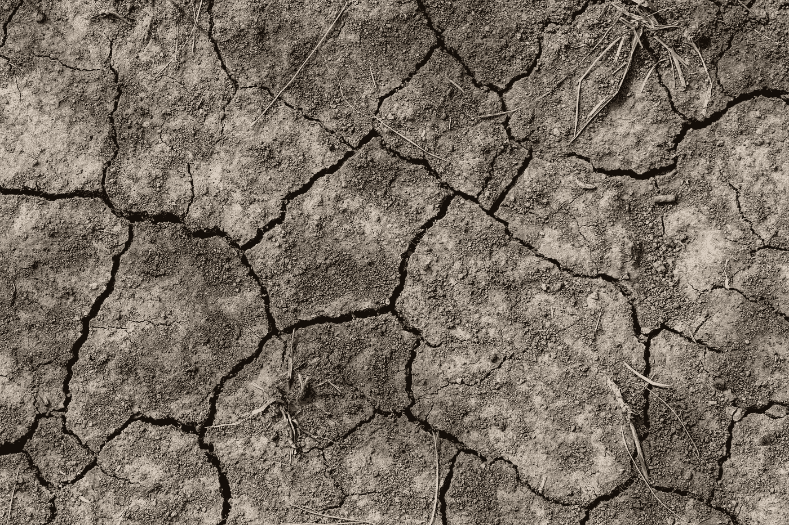
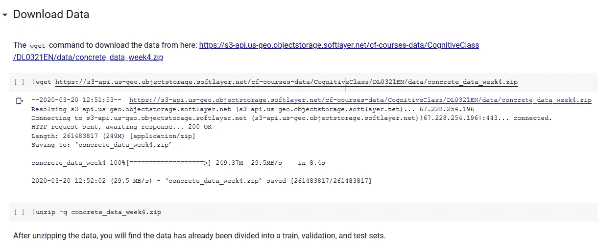
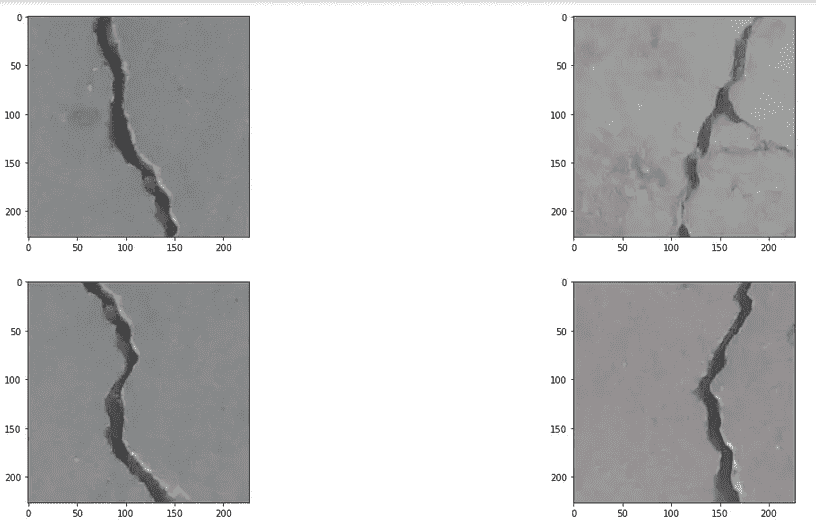
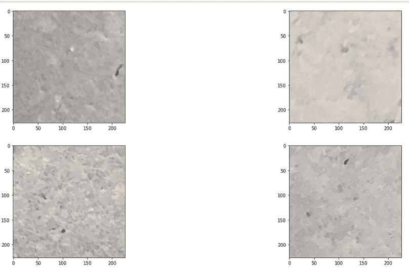

# 混凝土裂缝检测

> 原文：<https://pub.towardsai.net/crack-detection-in-concrete-2c7ff1539742?source=collection_archive---------3----------------------->

莫德·科雷亚在 [Unsplash](https://unsplash.com?utm_source=medium&utm_medium=referral) 上拍摄的照片

## 计算机视觉

## 使用计算机视觉

# **简介**

裂缝检测对于监测基础设施建筑的健康至关重要。随着季节的变化，湿度水平在一年中保持不一致，并且由于建筑材料的质量差，建筑物的墙壁和道路通常也会出现裂缝。因此，在达到更严重的退化状态之前，最明显的迹象是混凝土表面出现裂缝。混凝土的梁、墙和道路通常会受到应力，从而导致裂缝，这可以在表面的微观层面上正式观察到。在这些小裂缝之后，由于负荷，裂缝慢慢变宽，长度和宽度都增加了。我们可以得出结论，在更多的损害发生之前，我们可以及早发现裂缝，以便采取预防措施，导致结构健康的快速恢复。

决定重要因素的是在结构表面发现的裂缝的类型、数量、宽度和长度。这有助于确定混凝土结构的退化程度、结构健康状况和承载能力。

裂缝检测可通过人工检查完成，测试官员将观察每个裂缝，人工测量其尺寸，这将有助于进一步计算其对结构健康退化的影响程度。人工人工检查的缺点是 1)花费大量时间。2)人工检查经常会遗漏可能进一步变宽的微小裂纹。3)经常会遗漏很多需要监测的裂缝。这就产生了对快速、强大、自动和可靠的裂纹检测和分析策略的需求。因此，自动裂纹检测系统被开发出来，以克服传统的人工检测方法速度慢的缺点。

基本上，裂纹是可见的实体，因此基于图像的裂纹检测算法可以适用于检查。此外，由于裂纹的随机形状、不规则尺寸以及图像中的噪声，基于图像的检测过程也面临一些困难。不规则的光照条件、阴影和瑕疵。深度学习算法可以应用于解决图像分类中许多具有挑战性的问题。因此，现在我们使用图像处理方法、深度学习算法和计算机视觉来克服检测裂缝的问题。

通过使用具有迁移学习的图像分类的简单方法来解决问题，以将图像分类为两类:**负的**(不包含裂纹)和**正的**(包含裂纹)。

# 资料组

数据集是用于分类的混凝土裂缝图像，来源是 mendeley.com，引用将在底部提供，当然，我要感谢作者的贡献。我们将有两类图像，其中有裂缝的混凝土表面将被归类为阳性，而表面没有裂缝的图像将被归类为阴性。让我们回顾一下数据集:有 40，000 幅 RGB 图像，其中 20，000 幅是正面的，其余 20，000 幅是负面的。75%的图像将用于训练，25%的图像将用于测试，其中约 23%用于验证，其余约 2%用于测试。

# 可视化数据

可视化数据的代码:

## 包含裂纹的图像(正片)

## 不含裂纹的图像(底片)

# 培养

图像将在 VGG16 模型上训练。因此，第一个图像将被转换为(244，244，3)即。VGG16 型号的默认尺寸。

由于内存问题，将使用目录中的流直接从目录中读取图像。

模型的架构包含连接到线性层的 VGG16 模型，10 个神经元进一步连接到具有 softmax 激活的 2 个输出节点的线性层。

该模型将被训练 10 个时期，批量大小为 100。

进一步的训练和验证损失和准确性是图。

# 测试

测试是在直接从目录中获取的 500 个图像上完成的。

计算损失和准确度，并且还计算测试集的预测概率。

# 结论

10 个时代的分数

## 火车

损耗:0.0040--精度:0.9991

## 确认

损耗:0.0146--精度:0.9969

## 试验

损耗:0.0017--精度:1.0000

这里是整个笔记本代码…

另外，你可以在 [Github](https://github.com/chittalpatel/Crack-Detection-in-Concrete) 上找到这个库。

## 参考

1.  A.M. A. Talab，Z. Huang，，L. HaiMing，“使用 Otsu 方法和图像处理技术中多重滤波检测图像中的裂纹”，*Optik-国际光电子光学杂志*，第 127 卷第 3 期，第 1030–1033 页，2016 年。查看:[发布者站点](https://doi.org/10.1016/j.ijleo.2015.09.147) | [谷歌学术](https://scholar.google.com/scholar_lookup?title=Detection%20crack%20in%20image%20using%20Otsu%20method%20and%20multiple%20filtering%20in%20image%20processing%20techniques&author=A. M. A. Talab&author=Z. Huang&author=F. Xi&author=&author=L. HaiMing&publication_year=2016)
2.  R.S. Adhikari、O. Moselhi 和 A. Bagchi，“基于图像的混凝土裂缝特性检索，用于桥梁检测”，*《施工自动化*，第 39 卷，第 180–194 页，2014 年。查看:[发布网站](https://doi.org/10.1016/j.autcon.2013.06.011) | [谷歌学术](https://scholar.google.com/scholar_lookup?title=Image-based%20retrieval%20of%20concrete%20crack%20properties%20for%20bridge%20inspection&author=R. S. Adhikari&author=O. Moselhi&author=&author=A. Bagchi&publication_year=2014)
3.  米（meter 的缩写））M. Torok、M. Golparvar-Fard 和 K. B. Kochersberger，“灾后建筑评估中基于图像的自动化三维裂缝检测”，*《土木工程计算杂志》*，第 28 卷第 5 期，第 A4014004 页，2014 年。查看:[发布者站点](https://doi.org/10.1061/(asce)cp.1943-5487.0000334) | [谷歌学术](https://scholar.google.com/scholar_lookup?title=Image-based%20automated%203D%20crack%20detection%20for%20post-disaster%20building%20assessment&author=M. M. Torok&author=M. Golparvar-Fard&author=&author=K. B. Kochersberger&publication_year=2014)
4.  D.Thatoi，P. Guru，P. K. Jena，S. Choudhury 和 H. C. Das，“裂纹检测领域 CFBP、FFBP 和径向基函数网络的比较”，*工程建模与仿真*，2014 年第 1 卷，文章 ID 292175，13 页，2014 年。查看:[发布网站](https://doi.org/10.1155/2014/292175) | [谷歌学术](https://scholar.google.com/scholar_lookup?title=Comparison%20of%20CFBP,%20FFBP,%20and%20RBF%20networks%20in%20the%20field%20of%20crack%20detection&author=D. Thatoi&author=P. Guru&author=P. K. Jena&author=S. Choudhury&author=&author=H. C. Das&publication_year=2014)
5.  C.Koch，K. Georgieva，V. Kasireddy，B. Akinci 和 P. Fieguth，“混凝土和沥青土木基础设施基于计算机视觉的缺陷检测和状况评估综述”，*《高级工程信息学》*，第 29 卷，第 2 期，第 196–210 页，2015 年。查看:[发布网站](https://doi.org/10.1016/j.aei.2015.01.008) | [谷歌学术](https://scholar.google.com/scholar_lookup?title=A%20review%20on%20computer%20vision%20based%20defect%20detection%20and%20condition%20assessment%20of%20concrete%20and%20asphalt%20civil%20infrastructure&author=C. Koch&author=K. Georgieva&author=V. Kasireddy&author=B. Akinci&author=&author=P. Fieguth&publication_year=2015)
6.  B.Y. Lee、Y. Y. Kim、S.-T. Yi 和 J.-K. Kim，“用于检测和分析混凝土表面裂缝的自动图像处理技术”，*结构和基础设施工程*，第 9 卷，第 6 期，第 567–577 页，2013 年。查看:[发布者站点](https://doi.org/10.1080/15732479.2011.593891) | [谷歌学术](https://scholar.google.com/scholar_lookup?title=Automated%20image%20processing%20technique%20for%20detecting%20and%20analysing%20concrete%20surface%20cracks&author=B. Y. Lee&author=Y. Y. Kim&author=S.-T. Yi&author=&author=J.-K. Kim&publication_year=2013)
7.  H.Kim，E. Ahn，S. Cho，M. Shin，S.-H. Sim，“混凝土结构裂缝识别的图像二值化方法对比分析”，*水泥与混凝土研究*，第 99 卷，第 53–61 页，2017 年。查看:[发布网站](https://doi.org/10.1016/j.cemconres.2017.04.018) | [谷歌学术](https://scholar.google.com/scholar_lookup?title=Comparative%20analysis%20of%20image%20binarization%20methods%20for%20crack%20identification%20in%20concrete%20structures&author=H. Kim&author=E. Ahn&author=S. Cho&author=M. Shin&author=&author=S.-H. Sim&publication_year=2017)
8.  H.Zakeri、F. M. Nejad 和 A. Fahimifar，“基于图像的沥青路面裂缝检测、分类和量化技术:综述”，*《工程计算方法档案》*，第 24 卷第 4 期，第 935–977 页，2016 年。查看:[发布网站](https://doi.org/10.1007/s11831-016-9194-z) | [谷歌学术](https://scholar.google.com/scholar_lookup?title=Image%20based%20techniques%20for%20crack%20detection,%20classification%20and%20quantification%20in%20asphalt%20pavement:%20a%20review&author=H. Zakeri&author=F. M. Nejad&author=&author=A. Fahimifar&publication_year=2016)
9.  A.Mohan 和 S. Poobal，“使用图像处理的裂纹检测:关键回顾和分析”，*亚历山大工程杂志*，2017 年。查看:[发布者站点](https://doi.org/10.1016/j.aej.2017.01.020) | [谷歌学术](https://scholar.google.com/scholar_lookup?title=Crack%20detection%20using%20image%20processing:%20a%20critical%20review%20and%20analysis&author=A. Mohan &author=S. Poobal&publication_year=2017)
10.  名词（noun 的缩写）Chaki、S. H. Shaikh 和 K. Saeed，“二值化的应用”，载于*探索图像二值化技术*，第 65–70 页，Springer，新德里，印度，2014 年。查看地点:[谷歌学术](https://scholar.google.com/scholar_lookup?title=Applications%20of%20binarization&author=N. Chaki&author=S. H. Shaikh&author=&author=K. Saeed&publication_year=2014)
11.  名词（noun 的缩写）Otsu，“灰度直方图的阈值选择方法”， *IEEE 系统、人和控制论汇刊*，第 9 卷第 1 期，第 62–66 页，1979 年。查看:[发布者站点](https://doi.org/10.1109/tsmc.1979.4310076) | [谷歌学术](https://scholar.google.com/scholar_lookup?title=A%20threshold%20selection%20method%20from%20gray-level%20histograms&author=N. Otsu&publication_year=1979)
12.  A.林库斯、a .波德维兹科和 v .格里布尼亚克，“钢筋混凝土构件裂纹定位的数字图像处理”， *Procedia 工程*，第 122 卷，第 239–243 页，2015 年。查看:[发布网站](https://doi.org/10.1016/j.proeng.2015.10.031) | [谷歌学术](https://scholar.google.com/scholar_lookup?title=Processing%20digital%20images%20for%20crack%20localization%20in%20reinforced%20concrete%20members&author=A. Rimkus&author=A. Podviezko&author=&author=V. Gribniak&publication_year=2015)
13.  T.俞，a .朱，y .陈，“基于红外图像的隧道衬砌表面裂缝高效检测方法”，*土木工程计算学报*，第 31 卷第 3 期，p. 04016067，2017。查看:[发布者站点](https://doi.org/10.1061/(asce)cp.1943-5487.0000645) | [谷歌学术](https://scholar.google.com/scholar_lookup?title=Efficient%20crack%20detection%20method%20for%20tunnel%20lining%20surface%20cracks%20based%20on%20infrared%20images&author=T. Yu&author=A. Zhu&author=&author=Y. Chen&publication_year=2017)
14.  长度 Ying 和 E. Salari，“基于小波变换的路面裂缝检测和分类技术”，*计算机辅助土木与基础设施工程*，第 25 卷，第 8 期，第 572–580 页，2010 年。查看:[发布网站](https://doi.org/10.1111/j.1467-8667.2010.00674.x) | [谷歌学术](https://scholar.google.com/scholar_lookup?title=Beamlet%20transform-based%20technique%20for%20pavement%20crack%20detection%20and%20classification&author=L. Ying &author=E. Salari&publication_year=2010)
15.  B.桑蒂、g .克里希纳穆蒂、s .西达尔特和 P. K .拉马克里希南，“使用边缘检测算子自动检测路面裂缝”，*《理论和应用信息技术期刊》*，第 36 卷，第 199-205 页，2012 年。查看:[谷歌学术](https://scholar.google.com/scholar_lookup?title=Automatic%20detection%20of%20cracks%20in%20pavements%20using%20edge%20detection%20operator&author=B. Santhi&author=G. Krishnamurthy&author=S. Siddharth&author=&author=P. K. Ramakrishnan&publication_year=2012)
16.  A.Ayenu-Prah 和 N. Attoh-Okine，“用二维经验模式分解评估路面裂缝”，*《欧洲信号处理进展杂志》*，2008 年第 1 卷，第 861701 页，2008 年。查看:[发布网站](https://doi.org/10.1155/2008/861701) | [谷歌学术](https://scholar.google.com/scholar_lookup?title=Evaluating%20pavement%20cracks%20with%20bidimensional%20empirical%20mode%20decomposition&author=A. Ayenu-Prah &author=N. Attoh-Okine&publication_year=2008)
17.  邹，曹永国，李，毛，王，“裂缝树:路面图像裂缝的自动检测”，*模式识别文字*，第 33 卷第 3 期，第 227-238 页，2012。查看:[发布者站点](https://doi.org/10.1016/j.patrec.2011.11.004) | [谷歌学术](https://scholar.google.com/scholar_lookup?title=CrackTree:%20automatic%20crack%20detection%20from%20pavement%20images&author=Q. Zou&author=Y. Cao&author=Q. Li&author=Q. Mao&author=&author=S. Wang&publication_year=2012)
18.  W.尼布莱克，*数字图像处理介绍*，斯特兰德伯格出版公司，丹麦伯克罗德，1986 年。
19.  K.Bose 和 S. K. Bandyopadhyay，“混凝土结构中的裂缝检测和分类”，*研究期刊*，第 2 卷，第 29–38 页，2016 年。查看地点:[谷歌学术](https://scholar.google.com/scholar_lookup?title=Crack%20detection%20and%20classification%20in%20concrete%20structure&author=K. Bose &author=S. K. Bandyopadhyay&publication_year=2016)
20.  米（meter 的缩写））Kamaliardakani，L. Sun 和 M. K. Ardakani，“使用启发式阈值法的密封裂缝检测算法”，*土木工程计算杂志*，第 30 卷第 1 期，第 04014110 页，2016 年。查看:[发布网站](https://doi.org/10.1061/(asce)cp.1943-5487.0000447) | [谷歌学术](https://scholar.google.com/scholar_lookup?title=Sealed-crack%20detection%20algorithm%20using%20heuristic%20thresholding%20approach&author=M. Kamaliardakani&author=L. Sun&author=&author=M. K. Ardakani&publication_year=2016)

感谢您阅读这篇文章。我很乐意回答评论中的任何问题。

***学习←→分享***