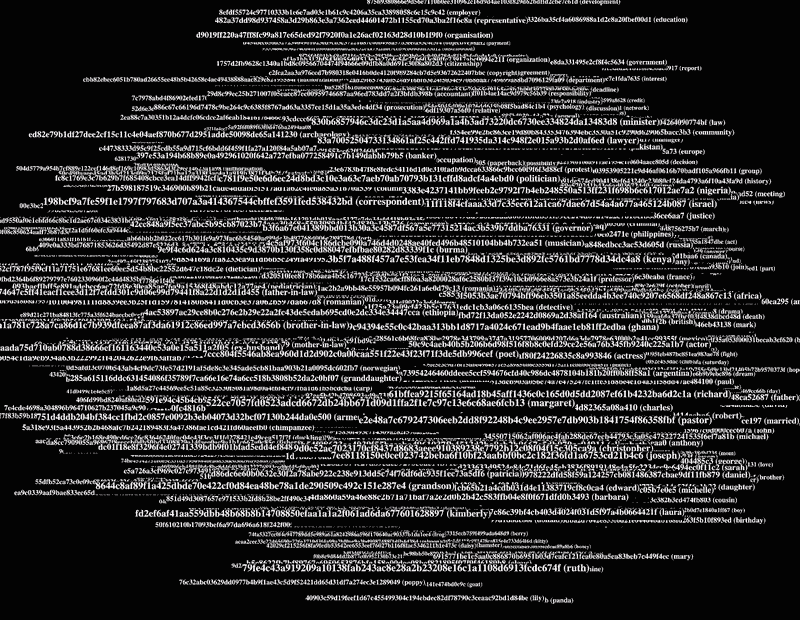
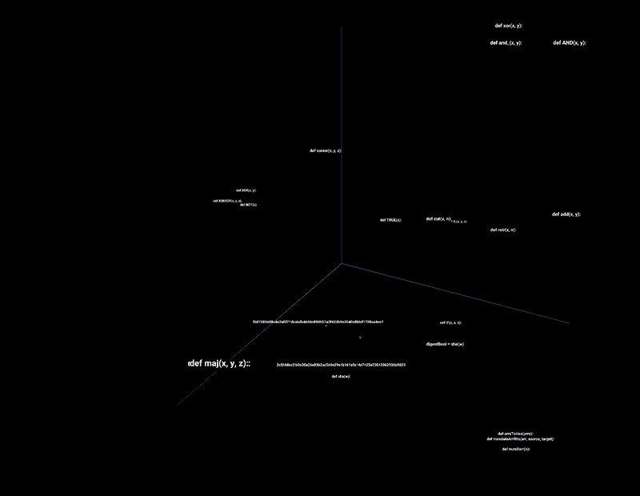
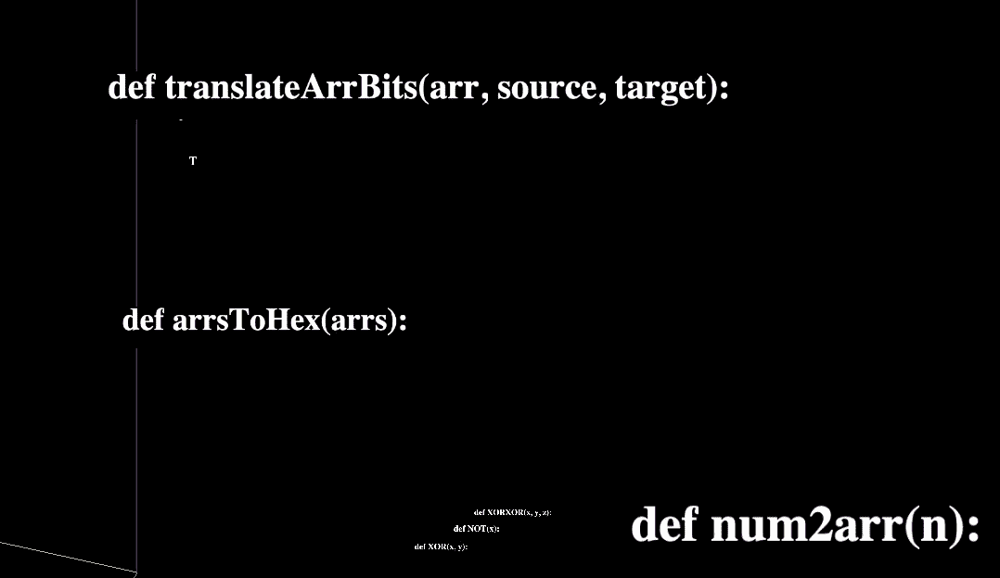
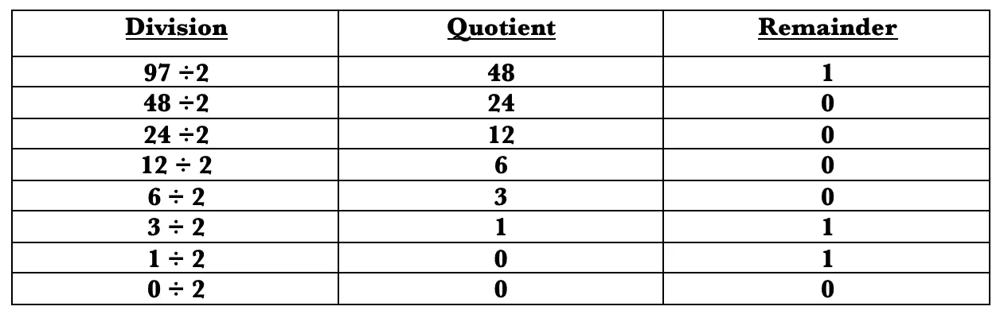

# 用人工智能破解开放比特币

> 原文：<https://pub.towardsai.net/cracking-open-bitcoin-with-artificial-intelligence-4a196cdc604?source=collection_archive---------0----------------------->

## [密码术](https://towardsai.net/p/category/cryptography)

## 可视化 SHA256


来源:[维基共享](https://commons.wikimedia.org/wiki/File:Bitcoinas.svg)，根据[知识共享](https://en.wikipedia.org/wiki/en:Creative_Commons) [署名-分享 4.0 国际](https://creativecommons.org/licenses/by-sa/4.0/deed.en)许可授权。

在比特币挖矿中，区块、私钥、公钥都可以找到一些和某处提到的 SHA256 的联系。这使得研究 SHA256 很有趣。在本文中，我们将重点关注 SHA256。我们将深入 SHA256 的代码，同时研究加密哈希函数的语义。我们还将把 SHA256 分解成它的基本组件，并做一些有趣的机器学习。本文的目的是对 SHA256 有一个大致的了解，sha 256 是比特币和整个互联网中一个重要的加密哈希函数。

希望到本文结束时，读者会发现一些与 SHA256 相关的有趣研究。这篇文章也将为那些对机器学习感兴趣的人提供一个方向。这篇文章没有强调破解比特币，而是强调打开比特币看看里面有什么。SHA256 是比特币内部发生的事情的重要组成部分。SHA256 在本文中也被称为“哈希”。让我们先看看单词“hello”的散列，然后再看看单词“Hello”。我们可以通过简单地导入 SHA256，然后编写一个小函数来做到这一点

```
**from** hashlib **import** sha256
def hash(text):
  word= (text)
  hex=(sha256(word.encode('utf-8')).hexdigest())
  return(hex)
```

我们可以看到散列函数接受一个字符串值，并输出一个十六进制值。仔细检查下面的两个散列结果，我们可以看到该函数是区分大小写的。这意味着，即使字母的大小写稍有变化，加密哈希函数也会有不同的响应。

```
>>> **print**(hash("Hello"))
185f8db32271fe25f561a6fc938b2e264306ec304eda518007d1764826381969>>> **print**(hash("hello"))
2cf24dba5fb0a30e26e83b2ac5b9e29e1b161e5c1fa7425e73043362938b9824
```

这里出现了一个有趣的问题，密码哈希函数和单词的含义有什么关系吗？我们从上面的散列中看到，散列的形态学并不与原始单词保持关系。所以，单词的散列值会随着单词的细微变化而变化，但是意思相似的单词在它们对应的散列值之间有什么模式吗？为了分析这一点，我们将使用一些向量，这些向量是根据 twitter 数据计算出来的。这些向量来自研究人员称之为“手套”的算法。手套向量有几个维度；我们将简单地下载并可视化一些十六进制散列(链接[此处](https://nlp.stanford.edu/projects/glove/))。



图片由作者提供(完整的可视化可在[这里](https://projector.tensorflow.org/?config=https%3A%2F%2Fgist.githubusercontent.com%2Fseanjudelyons%2F63e6bdb8174599e295d39bd92e94116d%2Fraw%2F09a3a8ba63f061124367a7cbec9e2c04e30ed1e1%2Fgistfile1.txt&fbclid=IwAR2RB6p2gUZ_a8PUtuz5XIl3QiT65l50tsULgD7I_hRwSWY8ZR0bJ60TYJU)获得)

通过分析一些语义相似的词，如“狗”和“猫”或“澳大利亚”和“加拿大”，我们可以看到 SHA256 的词法与原始字符串没有语义相似性。这意味着意思相似的单词有完全不同的哈希值，这种怀疑现在得到了这种观想的经验支持。好了，让我们深入一点，看看 SHA256 加密哈希是如何创建的。

一位理论物理学家用 python 从头开始编写了加密哈希函数的代码。这个 git 要点的链接可以在[这里](https://gist.github.com/Nikolaj-K/388e643d1f5e6989072a21e469d10a48)找到。代码是在知识共享许可下发布的，所以让我们写一些评论并想象一下这个算法。我们可以按照 S-BERT 的类似技术来可视化算法。关于算法可视化器的文章可以在[这里](https://medium.datadriveninvestor.com/visualise-algorithm-bd5c6d1634d9)找到。



作者提供的图片(可在此[获得完整的可视化效果](https://projector.tensorflow.org/?config=https://gist.githubusercontent.com/seanjudelyons/f9bd72959cedfd900819517347868f15/raw/04ab168d5503d5e5ae9d09ec076777195c7ae019/gistfile1.txt))

在检查算法时，我们可以看到一些重要的函数，它们将十六进制转换为比特，反之亦然(见下图)。这一点很重要，因为算法使用布尔逻辑来运行它的过程。



作者图片

让我们稍微跑题一下，讨论一下布尔逻辑。也许对读者最友好的布尔逻辑和二进制位的阐述是莱布尼茨写的

> “但我多年来一直使用最简单的级数，即两个一组的级数，而不是十个一组的级数，因为我发现这有助于完善数字科学。因此，除了 0 和 1，我没有使用其他字符，当达到 2 时，我重新开始”(链接[此处](http://www.leibniz-translations.com/binary.htm))。

莱布尼茨发现所有的字符都可以用 0 和 1 来表示。这实质上是二进制背后的思想，其中“bini”是拉丁语中的“二”。接下来，我们可以用“0”和“1”来表示单词中的每个字符。这样做的过程将包括找到 ASCII 值并除以 2，如下图所示。余数从下到上以字母“a”的二进制表示形式读取(ASSCI 表示“a”= 97)。



作者图片

ASCII 值可以简单地认为是数字标准。ASCII 代表美国信息交换标准代码。' a '的 ASCII 值是 97，' b '是 98，' c '是 99，' d '是 100，依此类推。为了将 ASCII 值转换成二进制，我们遵循如上所示的方法，其中有两个基数(0 和 1)。在除以 2 形成数字的二进制数之后，余数从底部向上读取。接下来我们可以写一个小函数，将单词转换成二进制并返回它-

```
def ascitobin(n):
    l=[]
    for i in n:        
        if i == 'a':
            l.append('01100001')
        elif i == 'b':
            l.append('01100010')
        elif i == 'c':
            l.append('01100011')
        elif i == 'd':
            l.append('01100100')
#...and so on
```

按照类似的计算，我们可以编写另一个函数，将 SHA256 中的十六进制值转换为二进制数字。随着文章的深入，这样做的原因会变得更加清楚。

```
def HexToBin(hexdec):
    l=[]
    for i in hexdec:        
        if i == '0':
            l.append('0'+'0'+'0'+'0')
        elif i == '1':
            l.append('0'+'0'+'0'+'1')
        elif i == '2':
            l.append('0'+'0'+'1'+'0')
        elif i == '3':
            l.append('0'+'0'+'1'+'1')
        elif i == '4':
            l.append('0'+'1'+'0'+'0')
#...and so on
```

让我们继续讨论机器学习。为了简单起见，我们将测试并观察一个简单的神经网络是否能够识别关于 SHA256 的任何信息。为此，我们将使用梯度下降优化网络，同时使用 sigmoid 函数激活它。

```
model = tf.keras.Sequential([tf.keras.layers.Dense(256, activation='sigmoid')])model.compile(loss='mean_squared_error', optimizer='sgd', metrics=['accuracy'])
```

我们在这里看到，这个神经网络只有 256 个单元。这些单位将对应于 SHA256 算法中的 256 位。我们现在可以编写一个小函数，按照 SHA256 预处理协议的一些概念对字符串进行预处理。

```
def shapre(word):
    wordbinlist=ascitobin(word)
    wordbin=""
    for j in wordbinlist:
      wordbin=wordbin+j
    c=0
    wordarr = ['0' for _ in range(256)]
    wordarr[255]=len(word)
    wordarr[len(wordbin)]='1'
    c=0
    for i in wordbin:
      wordarr[c]=i
      c=c+1
    return wordarr
```

编写这个函数的原因将在本文的后面部分看到并解释，但一般来说，我们将把一个字符串分解成相应的位(如前面的函数所示)。然后，我们将在数组末尾追加一个“1”，用“0”填充数组。最后，在数组的末尾，我们将附上字符串的长度。让我们考虑单词“a”的例子(见下文)。

```
0\. 1\. 1\. 0\. 0\. 0\. 0\. 1\. 1\. 0\. 0\. 0\. 0\. 0\. 0\. 0\. 0\. 0\. 0\. 0\. 0\. 0\. 0\. 0\.  0\. 0\. 0\. 0\. 0\. 0\. 0\. 0\. 0\. 0\. 0\. 0\. 0\. 0\. 0\. 0\. 0\. 0\. 0\. 0\. 0\. 0\. 0\. 0\.  0\. 0\. 0\. 0\. 0\. 0\. 0\. 0\. 0\. 0\. 0\. 0\. 0\. 0\. 0\. 0\. 0\. 0\. 0\. 0\. 0\. 0\. 0\. 0\.  0\. 0\. 0\. 0\. 0\. 0\. 0\. 0\. 0\. 0\. 0\. 0\. 0\. 0\. 0\. 0\. 0\. 0\. 0\. 0\. 0\. 0\. 0\. 0\.  0\. 0\. 0\. 0\. 0\. 0\. 0\. 0\. 0\. 0\. 0\. 0\. 0\. 0\. 0\. 0\. 0\. 0\. 0\. 0\. 0\. 0\. 0\. 0\.  0\. 0\. 0\. 0\. 0\. 0\. 0\. 0\. 0\. 0\. 0\. 0\. 0\. 0\. 0\. 0\. 0\. 0\. 0\. 0\. 0\. 0\. 0\. 0\.  0\. 0\. 0\. 0\. 0\. 0\. 0\. 0\. 0\. 0\. 0\. 0\. 0\. 0\. 0\. 0\. 0\. 0\. 0\. 0\. 0\. 0\. 0\. 0\. 0\. 0\. 0\. 0\. 0\. 0\. 0\. 0\. 0\. 0\. 0\. 0\. 0\. 0\. 0\. 0\. 0\. 0\. 0\. 0\. 0\. 0\. 0\. 0\.  0\. 0\. 0\. 0\. 0\. 0\. 0\. 0\. 0\. 0\. 0\. 0\. 0\. 0\. 0\. 0\. 0\. 0\. 0\. 0\. 0\. 0\. 0\. 0\.  0\. 0\. 0\. 0\. 0\. 0\. 0\. 0\. 0\. 0\. 0\. 0\. 0\. 0\. 0\. 0\. 0\. 0\. 0\. 0\. 0\. 0\. 0\. 0\.  0\. 0\. 0\. 0\. 0\. 0\. 0\. 0\. 0\. 0\. 0\. 0\. 0\. 0\. 0\. 1.
```

上述数据将形成一个主要的数据条目。输入模型的另一个主要数据条目是 SHA256，它被分解成二进制数字。所以如果我们考虑同一个例子 a-

```
word='a'
SHA256=ca978112ca1bbdcafac231b39a23dc4da786eff8147c4e72b9807785afee48bbca978112ca1bbdcafac231b39a23dc4da786eff8147c4e72b9807785afee48bbBinary
1\. 1\. 0\. 1\. 1\. 1\. 0\. 1\. 0\. 0\. 0\. 0\. 1\. 0\. 1\. 1\. 1\. 1\. 0\. 0\. 1\. 0\. 0\. 1\.  1\. 0\. 0\. 0\. 0\. 0\. 0\. 0\. 0\. 1\. 0\. 0\. 0\. 0\. 1\. 0\. 1\. 0\. 0\. 1\. 0\. 1\. 1\. 0\.  0\. 1\. 1\. 1\. 0\. 1\. 0\. 1\. 1\. 0\. 0\. 0\. 1\. 0\. 1\. 1\. 1\. 0\. 1\. 1\. 0\. 1\. 1\. 0\.  1\. 0\. 1\. 1\. 1\. 1\. 1\. 1\. 1\. 0\. 0\. 0\. 0\. 1\. 0\. 1\. 0\. 1\. 1\. 1\. 1\. 1\. 0\. 1\.  0\. 0\. 1\. 1\. 0\. 0\. 0\. 0\. 1\. 0\. 0\. 0\. 1\. 0\. 0\. 1\. 1\. 1\. 1\. 0\. 0\. 1\. 0\. 1\.  0\. 1\. 1\. 1\. 0\. 0\. 1\. 0\. 1\. 1\. 1\. 0\. 1\. 0\. 1\. 0\. 0\. 0\. 0\. 1\. 1\. 1\. 0\. 0\.  0\. 1\. 0\. 1\. 0\. 0\. 0\. 1\. 0\. 0\. 0\. 0\. 1\. 0\. 0\. 1\. 1\. 1\. 0\. 0\. 0\. 1\. 0\. 0\.  0\. 1\. 0\. 1\. 0\. 1\. 1\. 1\. 0\. 1\. 1\. 0\. 1\. 1\. 1\. 1\. 1\. 0\. 1\. 1\. 1\. 1\. 1\. 0\.  1\. 0\. 1\. 0\. 1\. 0\. 1\. 0\. 0\. 1\. 0\. 1\. 0\. 0\. 1\. 1\. 1\. 1\. 0\. 1\. 1\. 0\. 1\. 0\.  0\. 1\. 0\. 0\. 0\. 1\. 0\. 0\. 0\. 1\. 1\. 0\. 1\. 1\. 1\. 0\. 0\. 1\. 0\. 0\. 1\. 1\. 1\. 0\.  0\. 1\. 1\. 0\. 0\. 1\. 0\. 0\. 0\. 1\. 0\. 0\. 1\. 0\. 1\. 0.
```

为了训练我们的模型，我们将使用来自 Github 的大约 50 万个单词。这些文字是免费的，可以在开放许可下获得(链接[此处](https://github.com/dwyl/english-words))。这个想法很简单。我们将把 SHA256 分解成它的基本组件(“1”&“0”)，然后沿着原始字符串训练一个模型。原始字符串将遵循前面讨论的预处理。在字符串准备好应用 SHA256 算法之前，必须对其进行预处理。在这种情况下，我们只是遵循一些 SHA256 先决条件来测试和分析机器学习(参见下面为机器学习准备的数据)。

```
data shape=(416296, 256)
word="abaddon"SHA256 tf.Tensor( [1\. 1\. 0\. 1\. 1\. 1\. 0\. 1\. 0\. 0\. 0\. 0\. 1\. 0\. 1\. 1\. 1\. 1\. 0\. 0\. 1\. 0\. 0\. 1\.  1\. 0\. 0\. 0\. 0\. 0\. 0\. 0\. 0\. 1\. 0\. 0\. 0\. 0\. 1\. 0\. 1\. 0\. 0\. 1\. 0\. 1\. 1\. 0\.  0\. 1\. 1\. 1\. 0\. 1\. 0\. 1\. 1\. 0\. 0\. 0\. 1\. 0\. 1\. 1\. 1\. 0\. 1\. 1\. 0\. 1\. 1\. 0\.  1\. 0\. 1\. 1\. 1\. 1\. 1\. 1\. 1\. 0\. 0\. 0\. 0\. 1\. 0\. 1\. 0\. 1\. 1\. 1\. 1\. 1\. 0\. 1\.  0\. 0\. 1\. 1\. 0\. 0\. 0\. 0\. 1\. 0\. 0\. 0\. 1\. 0\. 0\. 1\. 1\. 1\. 1\. 0\. 0\. 1\. 0\. 1\.  0\. 1\. 1\. 1\. 0\. 0\. 1\. 0\. 1\. 1\. 1\. 0\. 1\. 0\. 1\. 0\. 0\. 0\. 0\. 1\. 1\. 1\. 0\. 0\.  0\. 1\. 0\. 1\. 0\. 0\. 0\. 1\. 0\. 0\. 0\. 0\. 1\. 0\. 0\. 1\. 1\. 1\. 0\. 0\. 0\. 1\. 0\. 0\.  0\. 1\. 0\. 1\. 0\. 1\. 1\. 1\. 0\. 1\. 1\. 0\. 1\. 1\. 1\. 1\. 1\. 0\. 1\. 1\. 1\. 1\. 1\. 0\.  1\. 0\. 1\. 0\. 1\. 0\. 1\. 0\. 0\. 1\. 0\. 1\. 0\. 0\. 1\. 1\. 1\. 1\. 0\. 1\. 1\. 0\. 1\. 0\.  0\. 1\. 0\. 0\. 0\. 1\. 0\. 0\. 0\. 1\. 1\. 0\. 1\. 1\. 1\. 0\. 0\. 1\. 0\. 0\. 1\. 1\. 1\. 0\.  0\. 1\. 1\. 0\. 0\. 1\. 0\. 0\. 0\. 1\. 0\. 0\. 1\. 0\. 1\. 0.], shape=(256,), dtype=float32)String in Binary tf.Tensor( [0\. 1\. 1\. 0\. 0\. 0\. 0\. 1\. 0\. 1\. 1\. 0\. 0\. 0\. 1\. 0\. 0\. 1\. 1\. 0\. 0\. 0\. 0\. 1\.  0\. 1\. 1\. 0\. 0\. 1\. 0\. 0\. 0\. 1\. 1\. 0\. 0\. 1\. 0\. 0\. 0\. 1\. 1\. 0\. 1\. 1\. 1\. 1\.  0\. 1\. 1\. 0\. 1\. 1\. 1\. 0\. 1\. 0\. 0\. 0\. 0\. 0\. 0\. 0\. 0\. 0\. 0\. 0\. 0\. 0\. 0\. 0\.  0\. 0\. 0\. 0\. 0\. 0\. 0\. 0\. 0\. 0\. 0\. 0\. 0\. 0\. 0\. 0\. 0\. 0\. 0\. 0\. 0\. 0\. 0\. 0\.  0\. 0\. 0\. 0\. 0\. 0\. 0\. 0\. 0\. 0\. 0\. 0\. 0\. 0\. 0\. 0\. 0\. 0\. 0\. 0\. 0\. 0\. 0\. 0\.  0\. 0\. 0\. 0\. 0\. 0\. 0\. 0\. 0\. 0\. 0\. 0\. 0\. 0\. 0\. 0\. 0\. 0\. 0\. 0\. 0\. 0\. 0\. 0\.  0\. 0\. 0\. 0\. 0\. 0\. 0\. 0\. 0\. 0\. 0\. 0\. 0\. 0\. 0\. 0\. 0\. 0\. 0\. 0\. 0\. 0\. 0\. 0\.  0\. 0\. 0\. 0\. 0\. 0\. 0\. 0\. 0\. 0\. 0\. 0\. 0\. 0\. 0\. 0\. 0\. 0\. 0\. 0\. 0\. 0\. 0\. 0\.  0\. 0\. 0\. 0\. 0\. 0\. 0\. 0\. 0\. 0\. 0\. 0\. 0\. 0\. 0\. 0\. 0\. 0\. 0\. 0\. 0\. 0\. 0\. 0\.  0\. 0\. 0\. 0\. 0\. 0\. 0\. 0\. 0\. 0\. 0\. 0\. 0\. 0\. 0\. 0\. 0\. 0\. 0\. 0\. 0\. 0\. 0\. 0\.  0\. 0\. 0\. 0\. 0\. 0\. 0\. 0\. 0\. 0\. 0\. 0\. 0\. 0\. 0\. 7.], shape=(256,), dtype=float32) 
```

让我们只训练几个时期来测试和观察模型的损失和准确性的变化。正如我们在下图中看到的，损耗在逐渐减少，而在第一次循环后精度达到大约 100%。

```
history=model.fit(x, y, epochs=10)Epoch 1/10 13010/13010 [==============================] - 24s 2ms/step - loss: 0.4527 - accuracy: 0.9159 Epoch 2/10 13010/13010 [==============================] - 22s 2ms/step - loss: 0.3709 - accuracy: 0.9999 Epoch 3/10 13010/13010 [==============================] - 22s 2ms/step - loss: 0.3684 - accuracy: 1.0000 Epoch 4/10 13010/13010 [==============================] - 22s 2ms/step - loss: 0.3664 - accuracy: 1.0000 Epoch 5/10 13010/13010 [==============================] - 22s 2ms/step - loss: 0.3664 - accuracy: 0.9999 Epoch 6/10 13010/13010 [==============================] - 22s 2ms/step - loss: 0.3659 - accuracy: 0.9999 Epoch 7/10 13010/13010 [==============================] - 21s 2ms/step - loss: 0.3656 - accuracy: 0.9999 Epoch 8/10 13010/13010 [==============================] - 22s 2ms/step - loss: 0.3649 - accuracy: 0.9999 Epoch 9/10 13010/13010 [==============================] - 22s 2ms/step - loss: 0.3644 - accuracy: 0.9999 Epoch 10/10 13010/13010 [==============================] - 22s 2ms/step - loss: 0.3655 - accuracy: 0.9999
```

有几个原因可以让我们对这 99%的准确性持怀疑态度。主要原因是模型的大小。该型号只有 256 台。所以，我们不会把注意力放在机器学习和架构上。相反，让我们看看这种方法是否有任何模式识别。现在，如果我们只使用`predict`方法，我们将获得任何给定散列的一系列 256 个浮点值。因此，我们将使用`np.where`进行舍入，并查看单词“a”的散列的输出模式。

```
word='a'
hash_1=hash(word)
ca978112ca1bbdcafac231b39a23dc4da786eff8147c4e72b9807785afee48bbvecs=model.predict(hash_1)
predict=np.where(vecs > 0.4, 1, 0)
[[0 1 1 0 0 1 1 1 0 1 1 0 1 1 0 1 0 1 1 0 0 1 0 1 0 1 1 0 0 1 0 1 0 1 1 0   0 1 1 1 0 1 1 0 0 1 0 1 0 1 1 0 0 1 0 1 0 1 1 0 0 0 0 0 0 1 1 0 0 0 0 0   0 0 1 0 0 0 0 0 0 0 0 0 0 0 0 0 0 0 0 0 0 0 0 0 0 0 0 0 0 0 0 0 0 0 0 0   0 0 0 0 0 0 0 0 0 0 0 0 0 0 0 0 0 0 0 0 0 0 0 0 0 0 0 0 0 0 0 0 0 0 0 0   0 0 0 0 0 0 0 0 0 0 0 0 0 0 0 0 0 0 0 0 0 0 0 0 0 0 0 0 0 0 0 0 0 0 0 0   0 0 0 0 0 0 0 0 0 0 0 0 0 0 0 0 0 0 0 0 0 0 0 0 0 0 0 0 0 0 0 0 0 0 0 0   0 0 0 0 0 0 0 0 0 0 0 0 0 0 0 0 0 0 0 0 0 0 0 0 0 0 0 0 0 0 0 0 0 0 0 0   0 0 0 1]]
```

总的来说，模型预测了一个有趣的模式。该模式在某种程度上对应于“a”的原始预处理字符串。然而，这个预测没有一点是准确的，甚至长度也不准确，因为`np.where`实际上是对大约 10 的浮点小数进行舍入。但是我认为这个实验是成功的。这是因为模型被输入了“0”和“1”的任意散列，并且它仍然设法输出某种模式，而这种模式对于其输入来说并不是任意的。这是这个实验的目标，即，看看机器学习在学习关于 SHA256 的任何东西时是否有任何潜力。

# 总结

在撰写这篇文章的过程中，我学到了三个要点。

1.  我怀疑 SHA256 是可以预测的。
2.  SHA256 是语言问题。
3.  如果我不得不重写这篇文章，我会做不同的事情。

关于第一点，一旦一个字符串被散列，就没有办法回到原来的字符串。然而，模型可以在高维空间中将语义相似的向量并置在一起。这就是 TensorFlow 嵌入式投影仪擅长的，即可视化机器学习。

关于第 2 点，SHA256 可以作为一个语言问题被机器学习。想象一个名叫“约翰·多伊”的人在一张纸上写下签名。现在将 SHA256 视为该签名的代表。这意味着该名称具有唯一的 SHA256 哈希，它链接并标识原始名称。约翰·多伊签名的这一特性意味着签名中有一些与姓名相关的信息。

关于第三点，对我来说，语言模型成功背后的秘密是对沃尔夫密码类型的识别。隐型是一个深层的意义，它不是在一个词的形态学中给出的。换句话说，它是一个在散列中看不到或识别不到的意义，但它存在于将原始字符串连接到散列的过程中。这种意义可以并且已经被具有语义向量的机器学习成功捕获。

它是在手套中用它们的共现矩阵学习的沃尔夫隐型，在我看来它也是在伯特中用掩蔽技术学习的。意义不能被解释或明确指出，但它可以通过并列来对比和阐明。读者可能会有兴趣将此作为一个语言问题来处理，所以让我们来看看我会如何以不同的方式做事情。

首先，我会重写预处理函数，把字符串的长度变成二进制。

```
def shapre(word):
    wordbinlist=ascitobin(word)
    wordbin=""
    for j in wordbinlist:
      wordbin=wordbin+j
    c=0
    wordarr = ['0' for _ in range(256)]
    a=[]
    x=bin(len(word))
    for i in x[2:]:
      a.append(i)
    wordarr[(256-len(a)):256]=a
    wordarr[len(wordbin)]='1'
    c=0
    for i in wordbin:
      wordarr[c]=i
      c=c+1
    return wordarr
```

第二，我对摆弄 LSTMs 感兴趣。

```
vocab_size=416296
embedding_dim=256model = tf.keras.Sequential([
    tf.keras.layers.Embedding(vocab_size, embedding_dim, input_length=256),
    tf.keras.layers.Bidirectional(tf.keras.layers.LSTM(64, return_sequences=True)),
    tf.keras.layers.Bidirectional(tf.keras.layers.LSTM(124, return_sequences=True)),
    tf.keras.layers.Bidirectional(tf.keras.layers.LSTM(32, dropout=0.8)),
    tf.keras.layers.Dense(256)
])
```

这是一个有趣的实验，我没有尝试过，但我认为它仍然不会产生太多关于 SHA256 的任何东西。我觉得用 TensorFlow 和 PyTorch 探索变形金刚会很有意思。但是我想我将把探索 ML 架构的工作留给读者。我写这篇文章的目的是让读者对比特币、ML 和加密哈希函数的未来有所了解。本文的代码可以在 Apache 2.0 许可下获得，可以在这里找到。