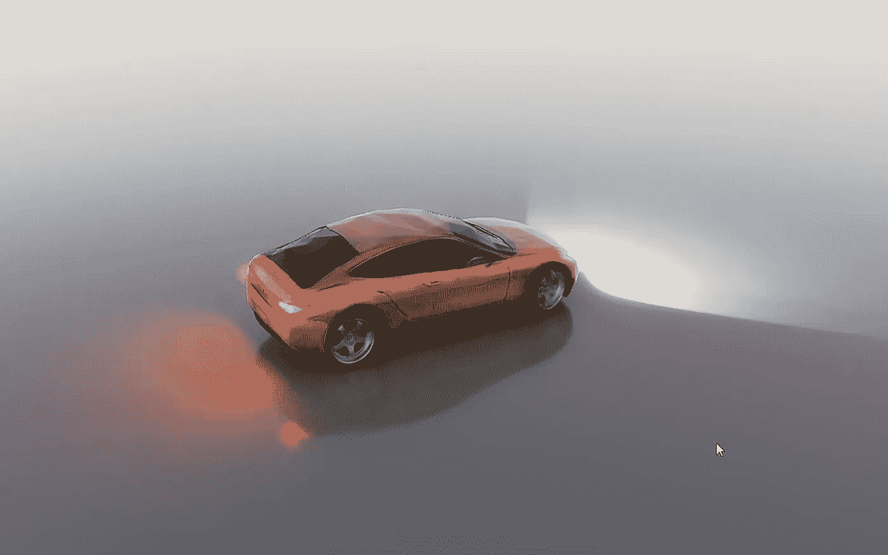
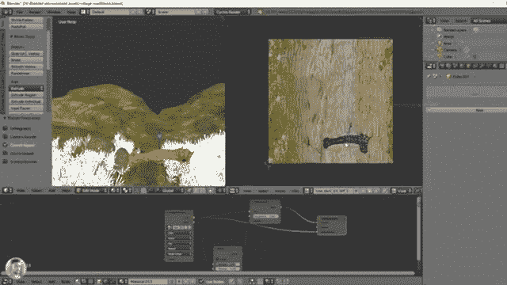
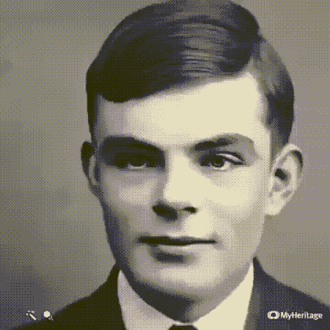
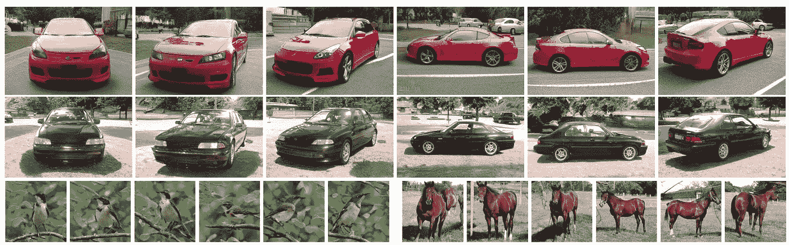
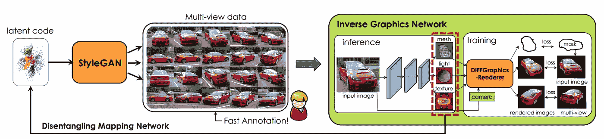
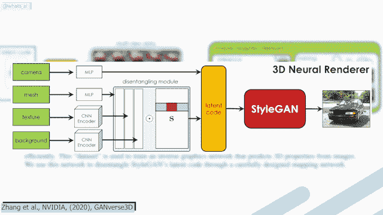
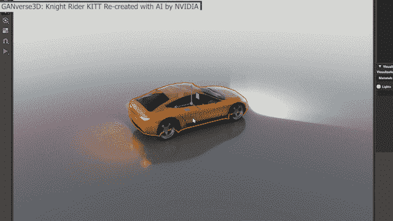

# 从图像创建三维模型！人工智能和游戏开发，设计…

> 原文：<https://pub.towardsai.net/create-3d-models-from-images-ai-and-game-development-design-1835785b8563?source=collection_archive---------0----------------------->

## [人工智能](https://towardsai.net/p/category/artificial-intelligence)，[机器学习](https://towardsai.net/p/category/machine-learning)

## 这个被称为 GANverse3D 的有前途的模型只需要一个图像就可以创建一个可以定制和动画的 3D 人物！

> 最初发表于 [louisbouchard.ai](https://www.louisbouchard.ai/ganverse3d/) ，前两天在[我的博客](https://www.louisbouchard.ai/tag/artificial-intelligence/)上看到的！

[GANverse3D:英伟达用 AI 重新打造的霹雳游侠 KITT](https://youtu.be/yf1guvkMznc)。经允许重新发布。

听听这个故事！

你在下面看到的是有人在小心翼翼地为电子游戏创造场景。仅仅是像这样的一件物品就需要专业人员花费数小时的工作。

3D 场景的创建。[1ne ManShow——用 Blender-Timelapse 制作了这个 3d 场景和环境](https://youtu.be/H5Fk1w_JEfU)

在互联网上拍一张物体的照片，比如一辆汽车，然后在不到一秒钟的时间内自动将 3D 物体插入到你的游戏中，这多酷啊？这很酷，对吧？想象一下，在几秒钟内，你甚至可以让这辆车动起来，让轮子转动，让灯闪烁，等等。如果我告诉你人工智能已经可以做到这一点，你会相信吗？如果视频游戏还不够，这个新的应用程序适用于你正在处理的任何 3D 场景，插图，电影，建筑，设计等等！去除专业设计人员数百甚至数千小时的长时间反复测试，让小型企业能够以更低的成本进行快速模拟！

当你喝一口咖啡的时候，这个模型将已经处理了一个汽车的图像，并生成了一个完整的 3D 动画版本，带有逼真的前灯、尾灯和闪光灯！此外，你甚至可以在 Omniverse 这样的虚拟环境平台中驾驶它，正如你在这里看到的。

NVIDIA Omniverse

为了介绍在最近的 GTC 活动中展示的这一新工具，Omniverse 是为依赖虚拟环境来测试新想法和在创建最终产品之前可视化原型的创作者而设计的。您可以使用该工具通过实时光线跟踪来模拟复杂的虚拟世界。因为这篇文章不是关于 Omniverse 的，omni verse 本身就很棒，所以我不会深入这个新平台的细节。我在下面的参考资料中链接了更多关于它的资源。

GANverse3D。 [GANverse3D:英伟达用 AI 重新打造的霹雳游侠 KITT](https://youtu.be/yf1guvkMznc)。经允许重新发布。

在这里，我想重点介绍 NVIDIA 在 ICLR 和 CVPR 2021 年发布的 3D 模型生成技术背后的算法。事实上，这个名为 GANverse3D 的有前途的模型只需要一个图像就可以创建一个可以定制和动画的 3D 人物！仅仅从它的名字来看，我认为如果我说它使用 GAN 来实现这一点，您不会感到惊讶。在这里，我不会进入 GANs 是如何工作的，因为我在[以前的文章](https://medium.com/@whats-ai)中已经多次提到过。

甘训练与潜在空间表征。图片由作者提供。

生成网络在从 2D 图像生成 3D 模型中是相对较新的，也称为“逆图形”,因为需要使用物体的多个视点来理解深度、纹理和照明以生成这种精确的 3D 模型的任务是复杂的。好吧，研究人员发现，生成敌对网络在训练中隐含地获得了这种知识。这意味着关于物体的形状、光照和纹理的信息已经被编码在 GAN 模型的潜在代码中。这种潜在代码是 GAN 架构的编码器部分的输出，通常被发送到解码器以生成控制特定属性的新图像。

正如在以前的研究中观察到的，我们知道不同的层控制图像中的不同属性，这就是为什么在过去的一年中你会看到这么多不同的和酷的应用程序使用 GANs，其中一些可以控制面部的风格来生成卡通图像。相比之下，其他人可以让你的头动起来，而这一切都来自于你自己的一张照片。

(左)[动画模型](https://youtu.be/zB_jQ8SUjKE)，以及(右) [MyHeritage 深度怀旧](https://www.myheritage.com/deep-nostalgia)动画工具。作者图片。

在这种情况下，他们使用了众所周知的 StyleGAN 架构，这是一个强大的生成器，用于你在互联网和我的频道上看到的许多不同的 buzz 应用程序。研究人员通过实验发现，前四层可以通过固定其余层来控制相机视点。因此，通过操纵 StyleGAN 架构的这一特性，他们可以使用前四层来自动生成这种新颖的视点，以便仅从一张图片中进行渲染！同样，正如您在下图的前两行中看到的，反过来固定前四层，它们可以生成具有相同视点的不同对象的图像。

多视图生成。[张等，英伟达，(2020)，GANverse3D](https://arxiv.org/pdf/2010.09125.pdf) 。经允许重新发布。

这个特性，加上不同的损失函数，不仅可以控制图像的形状和视点，还可以控制纹理和背景！这一发现非常具有创新性，因为大多数关于反向图形的工作在其渲染网络的训练期间使用 3D 标签或至少同一对象的多视图图像。这种类型的数据通常很难获得，因此非常有限。由于缺乏训练数据，这些方法在训练、合成图像和这些真实图像之间存在领域差距，因此难以处理真实照片。正如您所看到的，只需要一张图片就可以生成这些看起来像真的一样的惊人的转换，将数据注释的需求减少了 10，000 倍以上。当然，这种产生如此重要的新颖观点的 GAN 架构也需要在大量数据上进行训练，才能实现这一点。幸运的是，它的成本要低得多，因为它只需要物体本身的许多例子，并且不需要同一张图片的多个视点，但是这仍然限制了我们使用这种技术可以对什么物体建模。

GANverse3D 架构概述。【张等，英伟达，(2020)，GANverse3D 。经允许重新发布。

正如您在这里看到的，StyleGAN 被用作多视图生成器来构建缺失的数据，以训练渲染架构。

在进入渲染器之前，让我们往回跳一点，了解整个过程。你可以看到这个架构不是从一个常规的图像开始的，而是从一个潜在的代码开始的。

使用 StyleGAN 的 3D 神经渲染器。【张等，英伟达，(2020)，GANverse3D 。经允许重新发布。

这种潜在的代码基本上就是他们在训练中学到的。你在这里看到的 CNN 和 MLP 网络只是基本的卷积神经网络和多层感知器，用于创建一个代码，解开图像的形状、纹理和背景。这意味着该代码将独立地包含将在呈现模型中使用的所有这些特征。在训练过程中，这段代码被更新，通过使用不同的 StyleGAN 层来控制这些功能，正如我们刚才看到的。

当你使用这个模型并发送一个图像时，它将通过 StyleGAN 编码器并创建包含我们需要的所有信息的潜在代码。然后，这些信息将被提取出来，使用我们刚刚谈到的解缠模块来提取相机视点、3D 网格、纹理和图像背景。这些特征被单独发送给产生最终模型的渲染器。

GANverse3D 架构概述。[张等，英伟达，(2020)，GANverse3D](https://arxiv.org/pdf/2010.09125.pdf) 。经允许重新发布。

在这种架构中，渲染器是一种最先进的可区分渲染器，称为 DIB-R，这里称为 DIFFGraphicsRenderer。它被称为可微分渲染器，因为这项技术也是由 NVIDIA 开发的，就像 StyleGAN 和这篇论文一样，是首批允许在整个图像上分析计算梯度的技术之一，使训练神经网络生成 3D 形状成为可能。你可以看到，他们主要为每个单独的任务使用最先进的模型，因为整体架构比这些模型本身更重要和创新，这些模型本身已经非常强大。

GANverse3D。 [GANverse3D:英伟达](https://youtu.be/yf1guvkMznc)用 AI 重新创造的霹雳游侠 KITT。经允许重新发布。

这就是这篇新论文与 NVIDIA 新的 3D 平台 Omniverse 相结合的方式，它将允许世界各地的建筑师、创作者、游戏开发者和设计师轻松地将新的动画对象添加到他们的模型中，而不需要任何 3D 建模专业知识或在渲染上花费大量预算。

请注意，这个应用程序目前只适用于汽车、马匹和鸟类，因为 GANs 需要大量的数据才能很好地运行，但这是非常有前途的。我只想一年后再回来，看看它会变得多么强大。10 年或 20 年前，谁会想到在你的电脑屏幕上创建一个可控的、逼真的汽车动画版本只需要不到一秒钟的时间？要做到这一点，它只需要在你的口袋里放一个闪亮的小玩意，拍下照片并上传。这太疯狂了。我迫不及待地想看看研究人员在未来 10-20 年内会拿出什么！

## 观看视频中的更多示例

来我们的 [**Discord 社区与我们聊天:** **一起学习 AI**](https://discord.gg/learnaitogether)和*分享你的项目、论文、最佳课程、寻找 Kaggle 队友，以及更多！*

如果你喜欢我的工作，并想与人工智能保持同步，你绝对应该关注我的其他社交媒体账户( [LinkedIn](https://www.linkedin.com/in/whats-ai/) 、 [Twitter](https://twitter.com/Whats_AI) )并订阅我的每周人工智能[简讯](http://eepurl.com/huGLT5) ！

## 支持我:

*   支持我的最好方式是在[**Medium**](https://medium.com/@whats-ai)**上关注我，或者如果你喜欢视频格式，在[**YouTube**](https://www.youtube.com/channel/UCUzGQrN-lyyc0BWTYoJM_Sg)**上订阅我的频道。****
*   ****支持我在 [**上的工作**](https://www.patreon.com/whatsai)****
*   ****加入我们的 [**Discord 社区:** **一起学 AI**](https://discord.gg/learnaitogether)和*分享你的项目、论文、最佳课程、寻找 Kaggle 队友等等！*****

# ****参考****

*   ****视频演示:[https://youtu.be/dvjwRBZ3Hnw](https://youtu.be/dvjwRBZ3Hnw)****
*   ****卡拉斯等人，(2019)，“斯泰勒根”:[https://arxiv.org/pdf/1812.04948.pdf](https://arxiv.org/pdf/1812.04948.pdf)****
*   ****陈等，(2019)，" DIB-R": [，](https://arxiv.org/pdf/1908.01210.pdf)****
*   ****英伟达的 omniverse(2021):[https://www.nvidia.com/en-us/omniverse/](https://www.nvidia.com/en-us/omniverse/)****
*   ****张等，(2020)，“图像满足逆图形的可微绘制和可解释的三维神经绘制”:【https://arxiv.org/pdf/2010.09125.pdf】****
*   ****ganverse 3d NVIDIA 官方视频:[https://youtu.be/0PQnrnUIBlU](https://youtu.be/0PQnrnUIBlU)****
*   ****NVIDIA 的 GANverse 3D 博客文章:[https://blogs . NVIDIA . com/blog/2021/04/16/gan-research-knight-rider-ai-omni verse/](https://blogs.nvidia.com/blog/2021/04/16/gan-research-knight-rider-ai-omniverse/)****