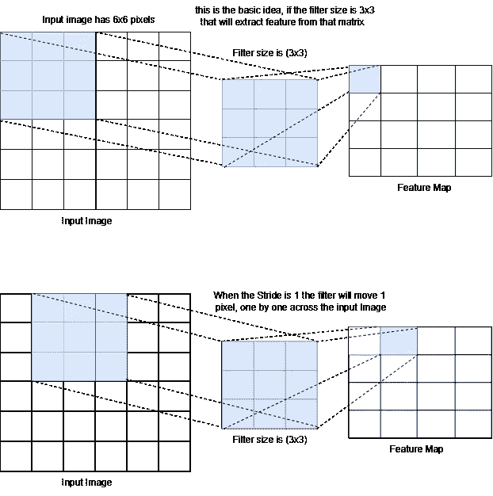
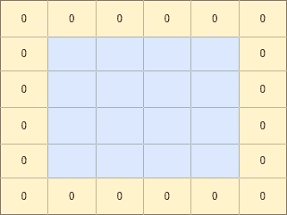
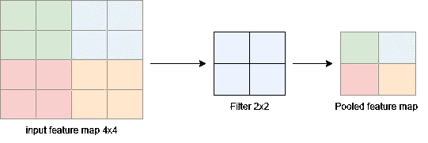
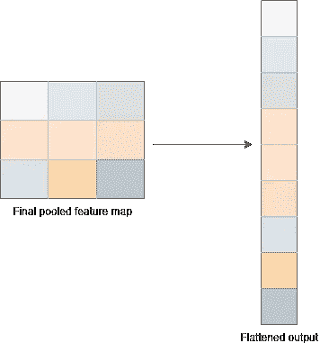
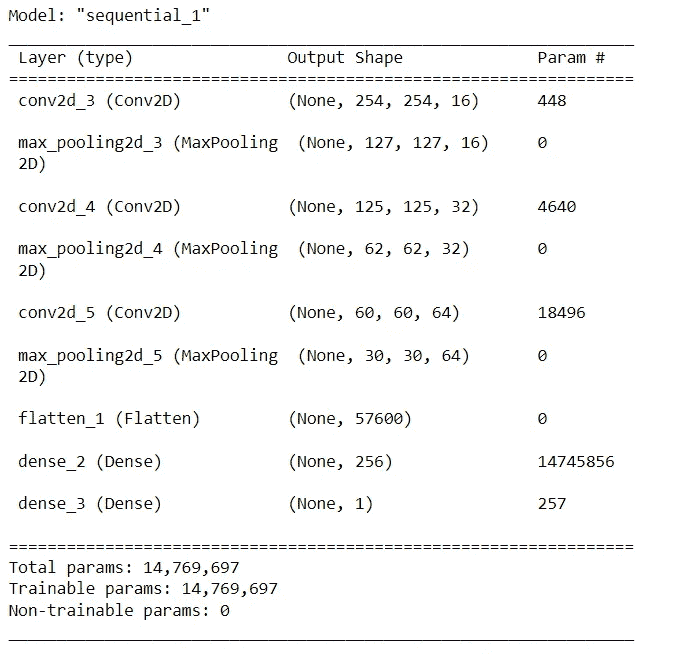
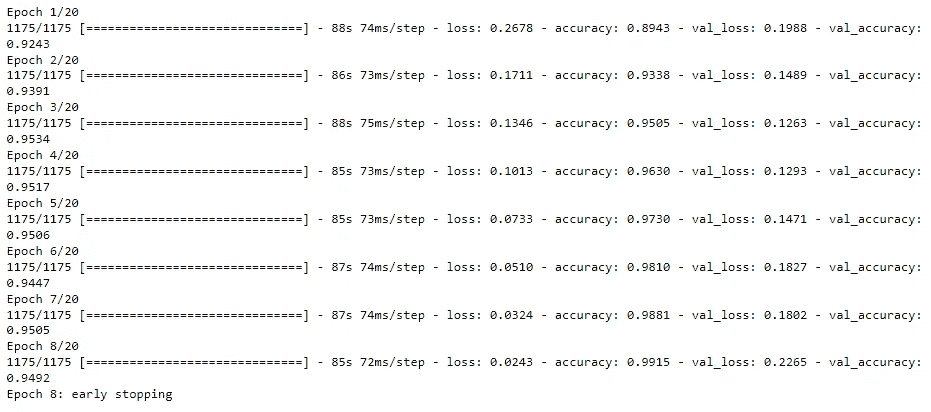
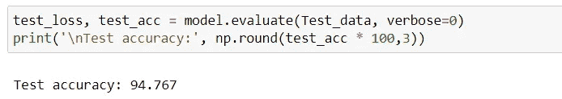
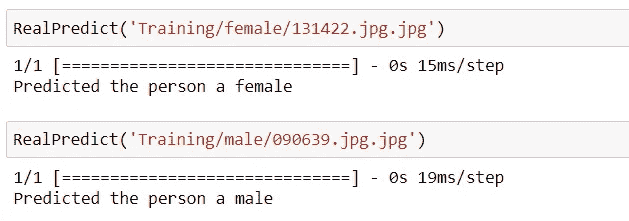

# 创建一个布尔图像分类器快速与任何数据集，与卷积神经网络(CNN)与代码的简要说明

> 原文：<https://pub.towardsai.net/create-a-boolean-image-classifier-fast-with-any-data-set-with-a-brief-explanation-of-the-4b1265b5b33f?source=collection_archive---------1----------------------->


[雷锐](https://unsplash.com/@ray30?utm_source=medium&utm_medium=referral)在 [Unsplash](https://unsplash.com?utm_source=medium&utm_medium=referral) 上拍照

**大家好**，在本帖中，我们将探讨一种叫做卷积神经网络的神经网络。在这里，我们将详细了解它是如何工作的，以及在构建它时应该考虑什么。为了让事情变得有趣，我们将训练一个机器学习模型，并实时做出预测。

**目录**

*   [CNN 概述](#0ea3)
*   [先决条件](#6c68)
*   [CNN 架构](#7613)
*   [实施](#f64e)

**你将学到什么**

*   CNN 如何工作
*   如何为培训准备图像
*   如何实现一个 CNN

## **CNN** 概述

卷积神经网络，也称为 **ConvNet** ，是一种深度神经网络，旨在寻找图像中的模式，图像识别和计算机视觉任务。虽然 CNN 是专门为处理图像而设计的，但它们也可以用于分类非图像数据，如音频数据。然而，在这篇文章中，我们将重点关注用 CNN 处理图像

## **深入 CNN 之前你应该熟悉的事情**

**1。批量大小** 批量大小是将通过网络传播的样本数量。假设你有 160 个训练样本，你的批量是 32。在这种情况下，网络从训练数据集(第 1 个到第 31 个)中获取前 32 个样本，并将训练网络。接下来，它将从训练数据集中获取下一组样本(第 33 到 65 个),并训练网络。这个过程一直持续到所有批次都被处理和训练

**2。输入 _ 形状** 输入形状包含 4 个参数；这些是批量大小，高度，宽度和渠道。批量大小、高度和宽度是在图像处理阶段选择的，在这个阶段，我们调整图像的大小，并对数据集提出一些其他必要的要求。第四个参数“通道”取决于我们使用的图像类型。如果我们使用灰度图像，通道是 1，对于 RGB 图像，通道是 3，因为 RGB 图像被表示为 3D 张量。
**想象一下**你使用的是 RGB 图像，预处理图像的大小是 256，那么 input_shape 应该是这样的 input_shape=(256，256，3)，正如你所看到的，我们没有指定 batch_size，所以我们可以在训练模型时使用任何 batch_size。我们将在稍后构建模型并浏览模型摘要时讨论这一点。

**3。滤镜** 所谓的特征检测器是一个网格矩阵，它在图像像素上移动，从输入图像中提取特征，创建输出特征图。该特征地图是下一个池层的输入。(当我们讨论架构时，我们将深入了解关于池层的更多细节。)一个卷积层可以有多个滤波器，滤波器的大小在每一层都有规定，滤波器的移动用 **Stride** 描述。

**4。步幅**
是滤波器为了提取特征而在输入图像上采取的步骤数
**示例:** 假设我们有一个 6×6 的输入图像，我们选择滤波器大小为 3×3，步幅为 1。这意味着 3×3 滤波器将在 6×6 图像上逐个像素地移动，以形成输出特征图。让我们想象一下:



作者图片

这个例子基于灰度图像。如果图像是 RGB 图像，则过滤器应该具有 3 个通道，因为 RGB 图像有 3 个通道深，并且每个过滤器将通过其对应的通道，并且将通过将其全部加到一个通道来创建输出特征图。

**5。填充** 将零像素的附加外层添加到输出特征图的每一侧，以保持特征图与输入图像相同。



作者图片

*我们* ***在实现我们的模型时不会使用填充，但是让我们看看如何给卷积层添加填充。添加填充最简单的方法是使用“有效”和“相同”，* ***有效*** *表示没有填充，* ***相同*** *表示添加填充。***

**6。Sigmoid 激活函数**
sigmoid 激活函数用于向 ML 模型添加非线性，简单来说，它获取实际输出数字，并将其转换为 0 到 1 之间的范围。

**7。Relu 激活功能**

被称为 **Relu** 的整流线性单元，是深度学习神经网络中最常用的非线性激活函数。这是通过将所有负输出值转换为默认值 0 并保留所有正值来克服消失梯度问题，这也允许模型更快地学习。

## **CNN 架构**

让我们从创建 CNN 时所涉及的图层类型开始；通常，一个简单的 CNN 有 3 层:卷积层、汇集层和完全连接层，紧接着是致密层之前的平坦层，以及添加到每个卷积和致密层的激活层。让我们看看每一层都做了什么…

**卷积层**

这是 CNN 的主要组成部分。CNN 中可以有多个卷积层。CNN 的第一层必须是卷积层。该层将图像作为输入来开始该过程。在实现这一层时，我们应该考虑的要点是:输入图像的形状、滤波器和步长。我们已经在这篇文章的先决条件部分讨论过这个问题，但是不管怎样，让我们重温一下。

1.  **输入图像形状:** 此处您应考虑图像的批量大小、宽度、高度和深度，因为图像的深度会根据我们使用的图像类型而变化。因此，该参数取决于我们使用的图像类型.. [**向上滚动查看更多**](#8db1)
2.  **滤镜** 在一个卷积层中可以有多个滤镜/内核，因此，你应该描述滤镜的数量、每个滤镜的大小以及每个滤镜的**步距**。过滤器用于扫描图像并提取重要特征。 [**向上滚动查看更多**](#6f94)

简而言之，该卷积层的目的是从图像中提取重要的特征，并创建需要输入到汇集层的输出特征地图

## **汇集层**

CNN 中使用的第二个最重要的层，汇集层，获取**特征图**并将其通过另一个**过滤器**以减少特征图的维度，并在从输入特征图中提取最重要的特征后生成**汇集特征图**。

**两种类型的池层:**

**最大池:**
在最大池中，过滤器将从过滤器覆盖的输入特征地图中获取最大元素

**平均池:**
在平均池中，过滤器将计算过滤器覆盖的输入特征图的平均值

**示例:**假设输入特征图为 4x4，池过滤器的大小为 2x2(默认),默认步幅的输出如下:



作者图片

## **展平图层**

该图层将最终汇集的要素地图转换为一维地图。为了准备下一个密集层的输入



作者图片

## **致密层**

CNN 中可以有密集的多层。该图层使用展平的要素地图从中提取检测到的要素。 **Relu** 激活功能将用于除最后一层之外的每个密集层，因为它是进行最终分类的层。

## **连接圆点**

CNN 从卷积层开始。事实上，CNN 可以有多个卷积层，每个卷积层后面都有一个汇集层。第一个卷积层将图像作为输入，当该过程开始时，卷积和池层的工作是从图像中提取重要的特征。接下来是展平层，这是完全连接层开始的地方。来自最后一个汇集层的输出将被馈送到该层，以将最后一个汇集的特征地图转换成一维数据，该数据然后将通过密集层，以便对图像进行分类。CNN 中可以有多个密集层，Relu 激活也用于每个卷积和密集层，除了最后一个密集层，其中 softmax(或其他)激活函数将根据我们的需要使用。

## **实施**

为了演示，我们将使用 Kaggle 的性别分类数据集，您可以从这里获得:[https://www . ka ggle . com/datasets/cashutosh/gender-classification-dataset](https://www.kaggle.com/datasets/cashutosh/gender-classification-dataset)

下载并解压缩工作目录中的 archive.zip 文件。这个数据集有两个文件夹，培训和验证；在每个文件夹中，还有两个名为“男性”和“女性”的文件夹，其中有许多符合正确性别的图像。

在这里，我们将使用 python 编程的强大功能来获取这些图像，处理它们，并创建和训练我们的模型。

让我们开始吧。

**导入所需的库**

```
import tensorflow as tf
import numpy as np
from tensorflow.keras.preprocessing.image import ImageDataGenerator
from tensorflow.keras.models import Sequential
from tensorflow.keras.layers import Conv2D, MaxPooling2D, Dense, Flatten, Dropout
```

**加载数据和处理图像**

为了使事情变得快速简单，我们将使用 TensorFlow 的 ImageDataGenerator API 来加载和设置用于训练的数据集。

将批量设置为 32 — **这里解释了**

```
BATCH_SIZE = 32
```

初始化 ImageDataGenerator API。在训练数据集生成器中，我们将验证拆分设置为 2%，稍后我们将使用它作为测试数据集。

```
TrainTest_Datagen = ImageDataGenerator(
      rescale=1./255,
      validation_split=0.2 # we will use this as test data
)
Validation_datagen = ImageDataGenerator(
    rescale=1./255,
) 
```

使用所需的信息调用 API，比如数据目录、图像大小、batch_size 和类模式。
设置图像尺寸为 256x256，class_mode 为二进制。让我们看看代码。

```
train_data = TrainTest_Datagen.flow_from_directory(
    './Training',
    target_size=(256,256),
    batch_size=BATCH_SIZE,
    class_mode='binary',
    subset='training'
)
Test_data = TrainTest_Datagen.flow_from_directory(
    './Training', 
    target_size=(256,256),
    batch_size=BATCH_SIZE,
    class_mode='binary',
    subset='validation'# set as test data
) 
Val_data = Validation_datagen.flow_from_directory(
    './Validation',
    target_size=(256,256),
    batch_size=BATCH_SIZE,
    class_mode='binary',
)
```

检查图像生成器生成的目标变量

```
train_data.class_indices
```

**建模与培训**

我们将使用 TensorFlow sequential API 来创建我们的模型，在我们构建它之前，让我们讨论一下它的架构。

*   三个卷积层，过滤器的数量从 16、32 增加到 64，并且在每个卷积层之后，每个层都应用了 Relu 激活函数，然后是最大池层。三个卷积层和三个汇集层。
*   接下来，展平图层。
*   两个致密层。首先，一个具有应用了 Relu 激活函数的 256 个神经元，第二个具有应用了 sigmoid 激活函数的 1 个神经元

让我们看看代码。

```
model = Sequential([
    Conv2D(16, (3,3), 1, activation='relu', input_shape = (256,256,3)),
    MaxPooling2D(),

    Conv2D(32, (3,3), 1,  activation='relu'),
    MaxPooling2D(),

    Conv2D(64, (3,3), 1,activation='relu'),
    MaxPooling2D(),

    Flatten(),
    Dense(256, activation='relu'),
    Dense(1, activation='sigmoid')
])
```

编译模型并查看摘要。

```
model.compile(optimizer="adam",loss='binary_crossentropy',metrics = ['accuracy'])
model.summary()
```



作者图片

训练模型对于训练数据集，我们将在 20 个时期和每个时期 1175 个步骤下训练我们的模型，对于验证数据集，我们将在每个时期 364 个步骤下训练我们的模型。此外，我们将使用早期停止来避免在训练模型时过度拟合。

```
es = tf.keras.callbacks.EarlyStopping(monitor='val_loss', patience=5, verbose=1)
history = model.fit(
      train_data,
      steps_per_epoch=1175,
      epochs=20,
      validation_data = Val_data,
      validation_steps=364,
      callbacks=[es]
)
```



作者图片

在这里，我们可以看到，我们的模型已经停止训练，一旦它达到第 8 纪元。

**评估我们的模型**

在这里，我们将使用我们的测试数据集来评估我们的模型，并检查其准确性。下一段代码就是这样做的

```
test_loss, test_acc = model.evaluate(Test_data, verbose=0)
print('\nTest accuracy:', np.round(test_acc * 100,3))
```



作者图片

我们有 94.7%的准确率，这太棒了。但是等等，我们怎样才能实时使用这个模型呢？

**实时预测**

首先，让我们编写一个函数来处理我们的图像，调用模型并打印出结果。

```
def RealPredict(img_path):
  img_test = tf.io.read_file(img_path)
  img_test = tf.io.decode_jpeg(img_test , channels = 3)
  img_test = tf.image.resize(img_test , [256 , 256] , method="nearest")
  yhat = model.predict(np.expand_dims(img_test, 0))
  if yhat < 0.5: 
    print(f'Predicted the person a female')
  else:
      print(f'Predicted the person a male')
```

让我们运行这个函数，看看我们是否得到正确的结果。



作者图片

***耶，万岁*** ，*我们的模型完美地工作着..干得好*

好了，关于 CNN 和图像分类的教程到此结束，希望你喜欢。别忘了关注我，因为我将发布关于机器学习和全栈开发的精彩指导教程。

**链接到 Github 回购**:[https://github.com/nafiu-dev/boolean_image_classifier_FAST-](https://github.com/nafiu-dev/boolean_image_classifier_FAST-)

你可以在这里和我联系:

[https://www.instagram.com/nafiu.dev](https://www.instagram.com/nafiu.dev)

**Linkedin**:【https://www.linkedin.com/in/nafiu-nizar-93a16720b 

**我的其他帖子:**

[](https://medium.com/@nafiu.dev/end-to-end-full-stack-project-from-backend-frontend-and-machine-learning-to-ethical-hacking-series-3e53779e5aff) [## 从后端、前端和机器学习到道德黑客的端到端全栈项目…

### 嗨，欢迎大家参加这个从后端开发、前端开发到构建端到端项目的系列

medium.com](https://medium.com/@nafiu.dev/end-to-end-full-stack-project-from-backend-frontend-and-machine-learning-to-ethical-hacking-series-3e53779e5aff) [](https://medium.com/@nafiu.dev/stock-market-prediction-using-lstm-will-the-price-go-up-tomorrow-practical-guide-d1df2d54a517) [## 用 LSTM 预测股票市场:明天价格会上涨吗？实用指南

### 本教程的目标是创建一个机器学习模型来预测股票交易的未来价值

medium.com](https://medium.com/@nafiu.dev/stock-market-prediction-using-lstm-will-the-price-go-up-tomorrow-practical-guide-d1df2d54a517)