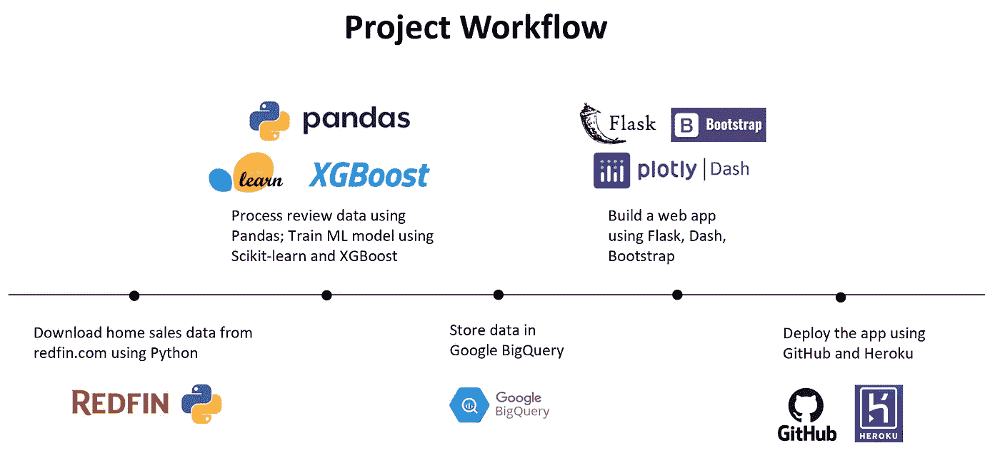
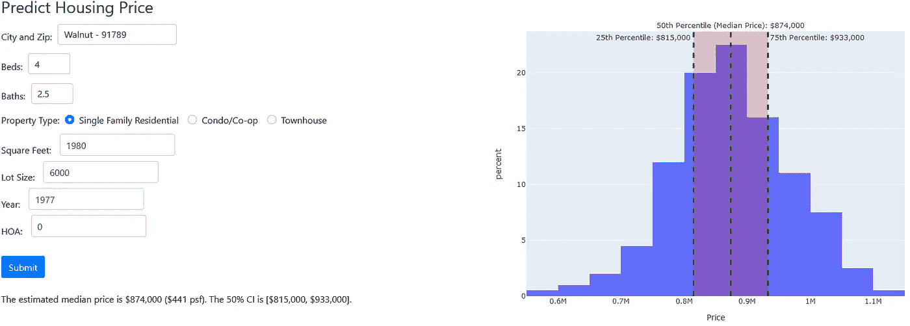
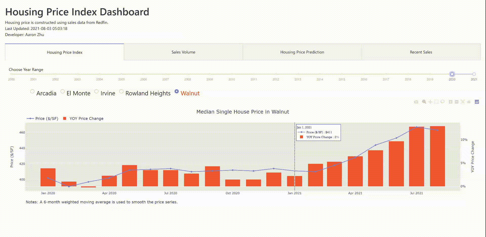
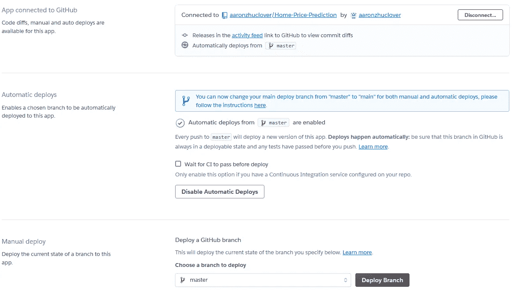

# 使用 Plotly-Dash、Google BigQuery 和机器学习创建一个房屋价格预测应用程序

> 原文：<https://pub.towardsai.net/create-a-home-price-prediction-app-with-plotly-dash-google-bigquery-and-machine-learning-c86b715f8f04?source=collection_archive---------1----------------------->

## [机器学习](https://towardsai.net/p/category/machine-learning)

## 使用实时销售数据通过 XGBoost 预测房价


由 [Tierra Mallorca](https://unsplash.com/@tierramallorca?utm_source=medium&utm_medium=referral) 在 [Unsplash](https://unsplash.com?utm_source=medium&utm_medium=referral) 上拍摄的照片

查看 [**Web App**](https://dsprojectapp.herokuapp.com/) 和我的 [**GitHub**](https://github.com/aaronzhuclover/Home-Price-Prediction-forPublic) 上的代码，如果有任何问题，请随时告诉我！

# **项目背景**

无论你是买房还是卖房，房价的变化都会影响你的住房计划。密切关注房价可以让你知道，如果你打算近期买卖房子，会发生什么。

因此，在这个项目中，我想利用我的数据科学技能来创建一个有趣的应用程序，它可以跟踪房屋价格、销售量，并使用机器学习进行价格预测。更有趣的是，它还会告诉用户新上市的房子的价格是高还是低。



(作者创作)

# **后端:构建数据管道**

**收集 redfin.com 的销售数据**

对于这个项目，我编写了一个 Python 脚本来从 redfin.com 下载房屋销售数据。该脚本将使用 windows 计算机中的任务计划程序每天自动运行。


redfin.com

在给定的 redfin 页面上，我们可以复制下载链接，如下所示。我们可以扭曲参数，比如“num_homes”。“region_id”和“sf”来下载我们感兴趣的数据集。

```
[https://www.redfin.com/stingray/api/gis-csv?al=1&market=socal&min_stories=1&num_homes=350&ord=redfin-recommended-asc&page_number=1&region_id=25415&region_type=6&sf=1,2,3,5,6,7&status=9&uipt=1,2,3,4,5,6,7,8&v=8](https://www.redfin.com/stingray/api/gis-csv?al=1&market=socal&min_stories=1&num_homes=350&ord=redfin-recommended-asc&page_number=1&region_id=25415&region_type=6&sf=1,2,3,5,6,7&status=9&uipt=1,2,3,4,5,6,7,8&v=8)
```

使用 Python 中的“requests”库可以直接从 redfin 下载 CSV 格式的房屋销售数据。

```
import pandas as pd
import requestsurl = r’https://www.redfin.com/stingray/api/gis-csv?al=1&market=socal&min_stories=1&num_homes=350&ord=redfin-recommended-asc&page_number=1&region_id=25415&region_type=6&sf=1,2,3,5,6,7&status=9&uipt=1,2,3,4,5,6,7,8&v=8’file = requests.get(url, headers={‘User-Agent’: ‘Mozilla/5.0’}).contentdf = pd.read_csv(io.StringIO(file.decode(‘utf-8’)))
```

**Redfin API**

除了房屋销售数据之外，我们还可以在 ML 模型中包含其他控制个人房屋效应的解释变量。 [Redfin API](https://pypi.org/project/redfin/) 为在 redfin.com 上市的资产提供附加数据，如学校评级、步行评分、交通评分和自行车评分。

```
from redfin import Redfinclient = Redfin()
address = ‘628 Castlehill Dr, Walnut, CA 91789’
response = client.search(address)
url = response[‘payload’][‘exactMatch’][‘url’]
initial_info = client.initial_info(url)
property_id = initial_info[‘payload’][‘propertyId’]
listing_id = initial_info[‘payload’][‘listingId’]
mls_data = client.below_the_fold(property_id)
schools_rating = mls_data[‘payload’][‘schoolsAndDistrictsInfo’][‘servingThisHomeSchools’]
```

**弗雷德 API**

控制市场效应的宏观经济变量在 ML 模型中也很重要。引入这些外部经济因素，弗雷德·API 派上了用场。对于这个项目，我使用了两个经济变量，S&P/Case-Shiller CA-洛杉矶房价指数和 30 年期固定利率抵押贷款利率。

```
from fredapi import Fred
fred = Fred(api_key='3e45db934f364bc329aca420c85fa04e')
# extract S&P/Case-Shiller CA-Los Angeles Home Price Index (LXXRNSA)
# [https://fred.stlouisfed.org/series/LXXRNSA](https://fred.stlouisfed.org/series/LXXRNSA)
la_hpi_raw = fred.get_series('LXXRNSA')
la_hpi = la_hpi_raw.to_frame()
la_hpi.columns = ['hpi']
la_hpi['month'] = la_hpi.index
la_hpi = la_hpi.reset_index(drop = True)
la_hpi['month'] = la_hpi.apply(lambda x: x['month'].date(), axis = 1)
weights = np.array([0.2, 0.3, 0.5])
sum_weights = np.sum(weights)
# compute weighted MA from latest 3 months
la_hpi['hpi'] = la_hpi['hpi'].rolling(3).apply(lambda x: np.sum(weights*x) / sum_weights, raw=False).reset_index(drop = True)
month_diff = datetime.now().month - la_hpi['month'].max().month
# reset the month variable so that it can be merged with sales data
la_hpi['month'] = la_hpi['month'] + pd.DateOffset(months=month_diff)
la_hpi['month'] = la_hpi.apply(lambda x: x['month'].date(), axis = 1)

# 30-Year Fixed Rate Mortgage Average in the United States (MORTGAGE30US)
# [https://fred.stlouisfed.org/series/MORTGAGE30US](https://fred.stlouisfed.org/series/MORTGAGE30US)
mort_rate_30yrs_raw = fred.get_series('MORTGAGE30US')
mort_rate_30yrs = mort_rate_30yrs_raw.to_frame()
mort_rate_30yrs.columns = ['mort_rate']
mort_rate_30yrs['date'] = mort_rate_30yrs.index
mort_rate_30yrs = mort_rate_30yrs.reset_index(drop = True)
mort_rate_30yrs['date'] = mort_rate_30yrs.apply(lambda x: x['date'].date(), axis = 1)
mort_rate_30yrs['year'] = mort_rate_30yrs.apply(lambda x: x['date'].year, axis = 1)
mort_rate_30yrs['month'] = mort_rate_30yrs.apply(lambda x: x['date'].month, axis = 1)
mort_rate_30yrs = mort_rate_30yrs.groupby(['year', 'month'])['mort_rate'].mean().reset_index()
mort_rate_30yrs['month'] = mort_rate_30yrs.apply(lambda x: date(int(x['year']), int(x['month']), 1), axis = 1)
mort_rate_30yrs = mort_rate_30yrs.drop(columns = ['year'])
```

**用熊猫清理数据**

一旦收集了所有的数据，我就使用流行的数据操作库“Pandas”来清理、整合和聚集数据。

在这个过程中，我删除了缺少“价格”、“销售日期”的数据，保留了我感兴趣的城市的销售数据。我还修正了公寓/合作公寓的“地段大小”。我从销售数据中提取的特征列表包括“床位数”、“浴室数”、“平方英尺”、“地段大小”、“年龄”、“HOA”、“房产类型”、“邮政编码”、“城市”和“销售月份”。

经济变量可能不会及时公布。例如，S&P/Case-Shiller CA-Los Angeles 5 月份的房价指数要到 6 月底才会公布。因此，没有必要将销售数据与经济变量加入同一个月。相反，我计算了最近 3 个月的加权移动平均值，并加入了本月的销售数据。

```
import pandas as pddata.rename(columns = {'URL (SEE [http://www.redfin.com/buy-a-home/comparative-market-analysis](http://www.redfin.com/buy-a-home/comparative-market-analysis) FOR INFO ON PRICING)':'URL'}, inplace = True)
data = data[~data['CITY'].isnull()]
data = data[data['CITY'].isin(['Irvine', 'Arcadia', 'El Monte', 'Walnut', 'Rowland Heights'])]
data = data[data['PROPERTY TYPE'].str.contains('Single|Condo|Townhouse')]
data = data[~data['SOLD DATE'].isnull()]
data.rename(columns = {'ZIP OR POSTAL CODE': 'ZIP',
                          'HOA/MONTH': 'HOA',
                          'PROPERTY TYPE': 'PROPERTY_TYPE',
                          'SQUARE FEET': 'SQUARE_FEET',
                          'LOT SIZE': 'LOT_SIZE'
                          }, inplace = True)
data = data[~data['PRICE'].isnull()]
data['PRICE'] = data['PRICE'].astype('int')
# SOLD DATE: month
data['SOLD DATE2'] = pd.to_datetime(data['SOLD DATE'], format='%B-%d-%Y')
data['year'] = pd.DatetimeIndex(data['SOLD DATE2']).year
data['mth'] = pd.DatetimeIndex(data['SOLD DATE2']).month
data['month'] = data.apply(lambda x: date(int(x['year']), int(x['mth']), 1), axis = 1)
# YEAR BUILT: age
data['age'] = data['year'] - data['YEAR BUILT']
# HOA/MONTH: if nan, set it to be $0
data['HOA'] = data.apply(lambda x: 0 if (np.isnan(x['HOA']) & bool(re.findall('Single', x['PROPERTY_TYPE'])))  else  x['HOA'], axis =1)
# LOT SIZE: change LOT SIZE to be  SQUARE FEET for non-single house
data['LOT_SIZE'] = data.apply(lambda x: x['LOT_SIZE'] if re.findall('Single', x['PROPERTY_TYPE']) else  x['SQUARE_FEET']    , axis =1)
# ZIP
data = data[~data['ZIP'].isnull()]
data['ZIP'] = data['ZIP'].astype('int')
zip_keep = data['ZIP'].value_counts()
zip_keep = zip_keep[zip_keep/len(data) > 0.01].index
data = data[data['ZIP'].isin(zip_keep)]
data['ZIP'].value_counts(dropna = False)
keep_var = ['PRICE', 'PROPERTY_TYPE', 'CITY', 'ZIP', 'BEDS', 'BATHS', 'SQUARE_FEET', 'LOT_SIZE', 'age', 'HOA', 'year', 'mth', 'month']
data = data[keep_var]
df = data.merge(mort_rate_30yrs, on = 'month', how = 'left')
df = df.merge(la_hpi, on = 'month', how = 'left')
df.columns = [i.lower()  for i in df.columns]
```

**在 Google BigQuery 中存储数据**

一旦数据被清理和预处理，数据将被存储在 Google BigQuery 中，Python 脚本将每天自动更新 SQL 数据库，以便我的应用程序可以访问最新的后端数据。

```
from google.cloud import bigquery
from google.oauth2 import service_account
import json
import tempfile
from pandas_gbq import schema
project = 'testpython-267102'
credentials = service_account.Credentials.from_service_account_file(r'google_creds.json')
client = bigquery.Client(credentials= credentials, project=project)
sql = '''
 DROP TABLE IF EXISTS `sampledata.sales_data`;
 CREATE TABLE `sampledata.sales_data`(
  property_type string,
  address string,
  city string,
  zip FLOAT64,
  price INT64,
  beds FLOAT64,
  baths FLOAT64,
  sq_feet FLOAT64,
  lot_size FLOAT64,
  year_built FLOAT64
  hoa FLOAT64
  sold_date string
 );
 '''
query = client.query(sql)
# insert using pd.to_gbq
# print(schema.generate_bq_schema(master))
schema_ = schema.generate_bq_schema(data)['fields']
data.to_gbq(destination_table = 'sampledata.sales_data',
  project_id = project,
  if_exists = 'append',
  credentials = credentials,
  table_schema=schema_
)
```

# **用 XGBoost 建模**

现在我们来看建模部分。在这个项目中，我使用了一个基于决策树的算法， **XGBoost** 。XGBoost 提供了梯度增强的有效实现，可用于回归预测建模。一次添加几棵树，以校正先前模型产生的预测误差。

为了调整超参数，在整个建模过程中应用了**网格搜索**以获得最佳参数集。

```
from sklearn.model_selection import GridSearchCV
from xgboost import XGBRegressor
from sklearn.metrics import mean_squared_error, mean_absolute_error, make_scorer, r2_score, mean_absolute_percentage_error# split data into training and testing
X_train,X_val,y_train,y_val = train_test_split(X,y,test_size=0.2,random_state=0)
X_train.shape, X_val.shape# need to create function to return accuracy of GridSearchCV
def tuning_para(alg, tuning_para):
    gsearch = GridSearchCV(estimator=alg,
                           param_grid = tuning_para, 
                           scoring=make_scorer(mean_squared_error, squared=False, greater_is_better=False),
                           #scoring=make_scorer(r2_score),
                           n_jobs=-1, 
                           cv=5,
                           verbose = 2)   
    gsearch.fit(X_train, y_train)
    predictions = gsearch.predict(X_val)
    return gsearch#################################    
# step 1: let's test learning rate and n_estimator first
para_test = {'learning_rate':[0.01, 0.05, 0.1, 0.2],
             'n_estimators':[100, 200, 300]}
xgb_model = XGBRegressor(objective = 'reg:squarederror', random_state =27)
xgb_model_deploy = tuning_para(xgb_model, para_test)

# step 2: Tune max_depth and min_child_weight
para_test = {
 'max_depth':range(3,10,2), # max depth of each tree
 'min_child_weight':range(1,6,2) # cover 
}
xgb_model = XGBRegressor(objective = 'reg:squarederror', 
                         random_state =27,
                         learning_rate = 0.05,
                         n_estimators = 300
                         )
xgb_model_deploy = tuning_para(xgb_model, para_test)

# Step 3: Tune gamma
para_test= {
    'gamma':[i/10.0 for i in range(0,5)] # the min gain requried to split
}
xgb_model = XGBRegressor(objective = 'reg:squarederror', 
                         random_state =27,
                         learning_rate = 0.05,
                         n_estimators = 300,
                         max_depth = 7,
                         min_child_weight = 1
                         )
xgb_model_deploy = tuning_para(xgb_model, para_test)# Step 4: Tune subsample and colsample_bytree
para_test = {
 'subsample':[i/10.0 for i in range(6,10)],  # number of samples allowed 
 'colsample_bytree':[i/10.0 for i in range(6,10)] # number of fields allowed in each tree
}
xgb_model = XGBRegressor(objective = 'reg:squarederror', 
                         random_state =27,
                         learning_rate = 0.05,
                         n_estimators = 300,
                         max_depth = 7,
                         min_child_weight = 1,
                         gamma = 0
                         )
xgb_model_deploy = tuning_para(xgb_model, para_test)#################################
# final model 
xgb_model = XGBRegressor(objective = 'reg:squarederror', 
                         random_state =27,
                         learning_rate = 0.05,
                         n_estimators = 300,
                         max_depth = 7,
                         min_child_weight = 1,
                         gamma = 0,
                         colsample_bytree = 0.8,
                         subsample = 0.9
                         )
```

在回归问题中，XGBoost 等机器学习模型会预测单个值，但不会给出该值的确定性。有时，能够测量**预测**的确定性水平是有用的。特别是，对于房屋价格预测模型，我没有包括单个房屋的特征，如游泳池、太阳能电池板、厨房改造、新屋顶、新地毯等。

为了计算**预测区间**，我们需要产生一个预测和该预测的估计误差。为了简化，我假设期望的预测遵循正态分布，并且正态分布的标准偏差是常数。因此，我们可以用 RMSE 来估计标准差。(实际上，误差并不总是恒定的。我还在最后的注释中包含了一个改进的模型)

```
xgb_model_deploy = xgb_model.fit(X_train.append(X_val), y_train.append(y_val))
prediction  = xgb_model_deploy.predict(X_train.append(X_val))
st_dev = (mean_squared_error(prediction, y_train.append(y_val)) ** 0.5 ).round(-3)
```

我们可以将 90%的预测区间计算为[预测-1.64*SD，预测+1.64*SD]。



预测间隔(由作者创建)

# 前端:创建 Web 应用程序

**打造 Dash App**

在“Dash”的帮助下，创建一个 web 应用程序变得很容易。 **Dash** 让数据科学家能够在交互式网络应用中展示他们的分析，并扩展了传统“仪表板”的概念。它使用 Dash 核心组件、HTML 组件、Bootstrap 组件和回调来构建交互式应用。



(作者创作)

在这个项目中，我在本地 windows 机器上预处理数据和预训练模型。所以 Dash app 非常轻量级，速度也很快。它只需要请求并显示来自 Google Bigquery 的数据。

```
import dash
import dash_core_components as dcc
import dash_html_components as html
from dash.dependencies import Input, Output, State
import dash_bootstrap_components as dbcexternal_stylesheets = [dbc.themes.BOOTSTRAP]
app = dash.Dash(__name__, external_stylesheets=external_stylesheets)
app.title = 'Housing Price Dashboard'
server = app.server
app.layout = html.Div([
dcc.Tabs(style = {'width': '100%'}, children=[
        dcc.Tab(label='Housing Price Index', children = [
        html.Div([
        html.Br(),
        dbc.Row([html.Div(children='Choose Year Range', style = {"margin-left": "30px"})]),
        dbc.Row([
            dbc.Col(
            dcc.RangeSlider(
            id='year-range-slider',
            min=2000,
            max=2021,
            step=1,
            value=[2020, 2021],
            marks = {i: str(i) for i in range(2000,2022, 1)}
            )
            )
        ]),
        html.Br(),
        dbc.Row([
        dbc.Col(
            dbc.Checklist(
            id="checklist",
            options=[{"label": x, "value": x} for x in all_locations],
            value=all_locations,
            labelStyle={'display': 'inline-block'},
            labelCheckedStyle={"color": "red"},
            inline=True, # arrange list horizontally
            style={"justify-content":"space-between", "font-size":"24px", "margin-left": "100px"}
            )
        )]),
        dbc.Row([
            dbc.Col(html.Div(dcc.Graph(id='line-graph'), style = {'width': '100%'}))
        ])
        ])
        ])
    ], style = {'padding': '20px'})

# create callback for line graph
[@app](http://twitter.com/app).callback(
Output('line-graph', 'figure'),
Input('checklist', 'value'),
Input('year-range-slider', 'value')
)
def update_line_graph (cities, year_range):
    selected_df = df[df.location.isin(cities)]
    selected_df = selected_df.query(f'year>={year_range[0]} & year<={year_range[1]}')
    fig = px.line(selected_df, x="month", y="price_med_ma6", color = 'location', title='6-Month Weighted Moving Average of Median Housing Price',
    labels = {'price_med_ma6':'Media Housing Pirce ($/SF)', 'location': 'City', 'month': ''}, height=500
)
# edit hover effects
fig.update_traces(mode="lines", hovertemplate=None)
# update figure layout
fig.update_layout(
    title = {'x':0.5, 'xanchor': 'center', 'yanchor': 'top', 'font': {'size': 20}},
    legend = {'orientation': 'h', 'yanchor': "top", 'xanchor': "left", 'x': 0, 'font': {'size': 20} },
    legend_title='',
    hovermode="x unified",
    hoverlabel = {'font_size': 12, 'font_family': "Rockwell", 'namelength': 20}
)
return fig# run the app
if __name__ == '__main__':
app.run_server(debug=True)
```

**使用 GitHub 和 Heroku 部署应用**

**Heroku** 与 **GitHub** 集成，使得将 GitHub 上的代码部署到 Heroku 上托管的应用程序变得更加容易。当我们在 GitHub 上修改代码时，它会自动在 Heroku 上的 app 上部署更新。



(作者创作)

# 最终注释

*   实际上，误差并不总是恒定的。为了改进模型，我们可以拟合一个模型来预测误差本身。直觉告诉我们，有更多房间、更大平方英尺或更好社区的房子往往会有更多的价格变化。
*   Redfin API 还提供了属性的文本描述。它将包括关键字，如，“安静的社区”，“新改建的厨房”，“新粉刷的外墙”，可以解释房价。为了将来的改进，我可以使用 NLP 模型，比如 Word2Vec，将文本转换成 ML 模型中的特性。

# 感谢您的阅读！！！

如果你喜欢这篇文章，并且想**请我喝杯咖啡，**请[点击这里](https://ko-fi.com/aaronzhu)。

您可以注册一个 [**会员**](https://aaron-zhu.medium.com/membership) 来解锁我的文章的全部访问权限，并且可以无限制地访问介质上的所有内容。如果你想在我发表新文章时收到电子邮件通知，请 [**订阅。**](https://aaron-zhu.medium.com/subscribe)