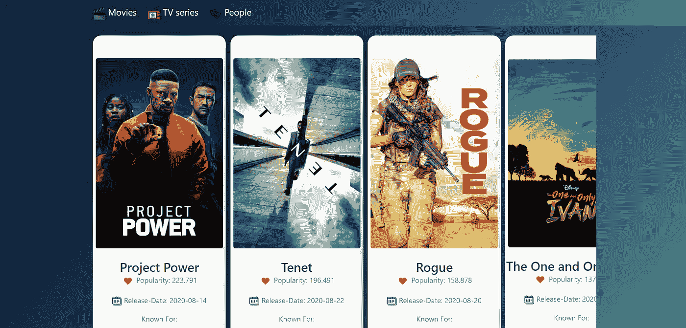
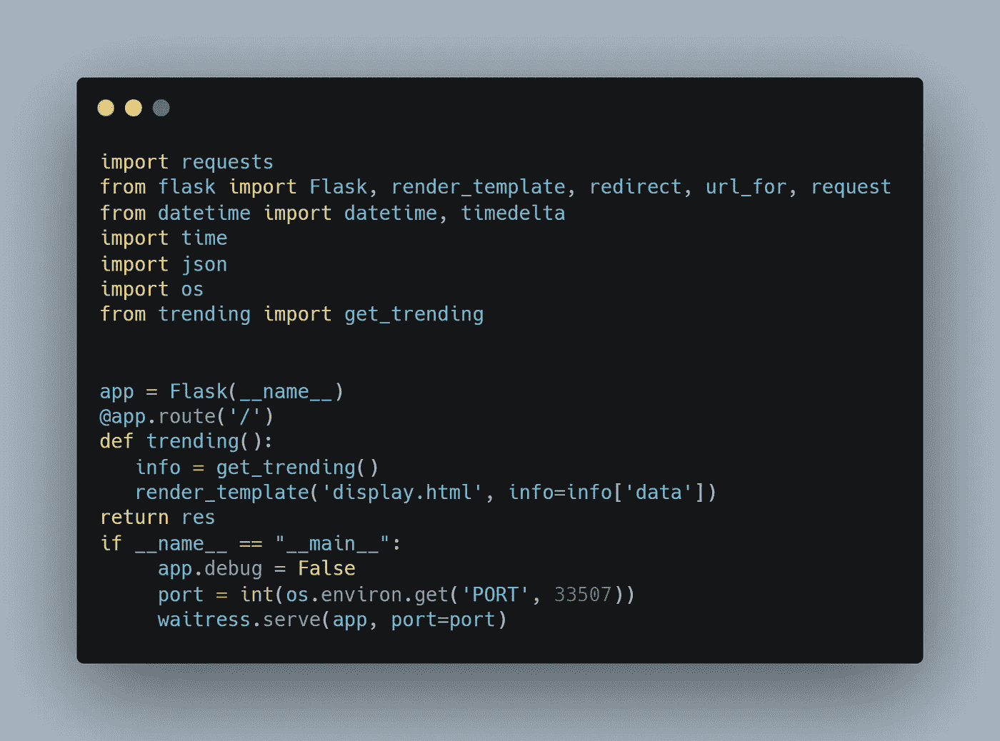
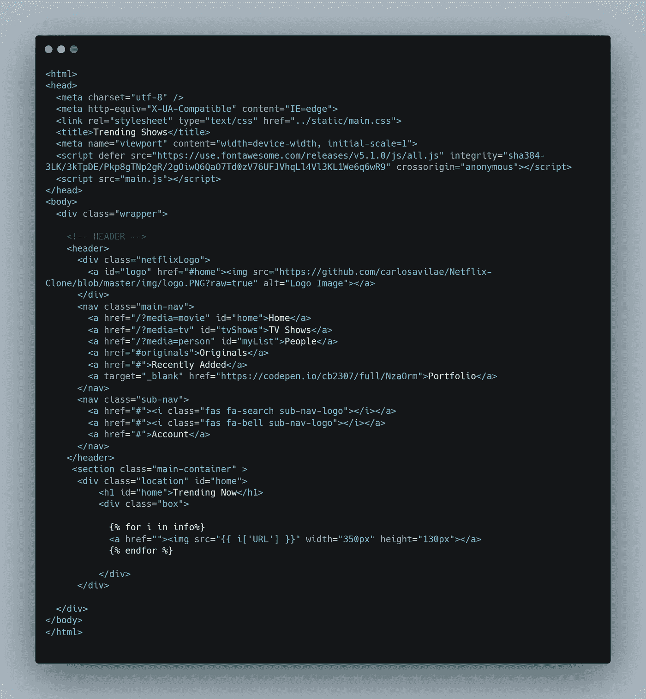

# 使用 Python 和 Heroku 创建并部署您的第一个 Flask 应用程序

> 原文：<https://pub.towardsai.net/create-and-deploy-your-first-flask-app-using-python-and-heroku-aee04eaddc71?source=collection_archive---------0----------------------->

## [编程](https://towardsai.net/p/category/programming)



Flask 是一个用 Python 写的 web 应用框架。在这里，我使用 Python 创建了一个应用程序，并部署在 Heroku 上。

[点击此处](https://trending-shows.herokuapp.com/)启动我的演示网络应用。

## 先决条件

*   [巨蟒](https://www.python.org/downloads/)
*   瓶
*   [Git](https://git-scm.com/downloads)
*   Heroku CLI

## 装置

安装 Python 之后，安装列出的其他框架和库。您可以使用以下命令轻松安装 flask。

```
pip install Flask
#pip install <package_name>
```

# 定义您的 web 应用程序的结构

```
static
    |_main.css
template
    |_display.html
app.py
trending.py
requirements.txt
```

静态目录包含您的 CSS 文件，模板包含用于呈现的 HTML 文件。

您可以创建一个单独的。py 文件为你的逻辑和其他操作或者在同一个 app 里写代码. py 我建议创建一个单独的文件会减少混乱。

# 第一步:

> 创建你的 **app.py** 文件

我使用了 waste 服务，使用这个库的原因是它是一个生产质量的纯 Python WSGI 服务器，具有非常好的性能。除了 Python 标准库中的依赖项之外，它没有其他依赖项。

**安装服务员**

```
pip install waitress
```



app.py

```
import requests
from flask import Flask, render_template, redirect, url_for, request
from datetime import datetime, timedelta
import time
import json
import os
from trending import get_trendingapp = Flask(__name__)@app.route('/')def trending():info = get_trending()
   render_template('display.html', info=info['data'])return resif __name__ == "__main__":
     app.debug = False
     port = int(os.environ.get('PORT', 33507))
     waitress.serve(app, port=port)
```

如上所示，我们使用了 **GET** 方法从服务器发送数据。

还有其他几种可用的方法，它们是

***POST:*** *用于将用户/表单数据发送到服务器，不缓存传输的数据。*

***头:*** *它类似于 GET，但不同的是它是在没有响应体的情况下使用的*

***PUT:*** *它是* *用来用上传的内容替换当前资源*

***删除:*** *用于删除 URL 中提供的目标资源。*

# 第二步:

> ***创建 trending.py 文件，基本上就是在 app.py 文件*** 中创建导入主函数后包含您的业务逻辑的文件

```
from trending import get_trending
```

我的 trending.py 文件如下所示:


trending.py

收集数据后，我们可以使用 HTML 文件呈现输出

输出数据将显示在 HTML 页面上。

# 第三步:

> 创建一个 HTML 文件，用于呈现从响应对象收集的输出。

下面是我的 display.html 文件的样子



display.html

您几乎完成了编码部分，现在是时候部署我们的第一个 flask 应用程序了。

在部署应用程序之前，首先检查本地主机上的 flask 应用程序。

# 部署步骤

1.  **使用 CLI 登录您的 Heroku 帐户**

您可以通过在终端中写入以下命令来登录。

```
heroku login
```

**2。在 Heroku 上创建一个 web 应用程序**

您可以使用以下命令在 Heroku 上创建一个新的应用程序

```
heroku create <your_app_name>
```

**3。** **在同一个项目目录**下创建 *requirements.txt* 文件

要生成 requirement.txt 文件，可以使用下面的命令

```
pip freeze > requirements.txt
```

**4。创建一个过程文件**

**Procfile** 是所有 Heroku 应用程序所需的工艺文件。

Procfile 指定了应用程序在启动时执行的命令。

[点击此处](https://devcenter.heroku.com/articles/procfile)阅读更多关于 **Procfile** 的信息

在 Procfile 中输入以下内容

```
web: gunicorn app:app
```

这里的应用程序是你的主(。py)文件在我的例子中是 app.py

如果您没有安装 gunicorn web 服务器，那么使用以下命令安装它

```
pip install gunicorn
```

> 注意:您必须创建一个没有任何文件扩展名的 Procfile

**5。创建 *runtime.txt* 来指定运行时的 python 版本**

创建 runtime.txt 后，添加您的构建 python 版本，如下所示

```
python-3.8.1
```

现在，我们都准备好了！

6.初始化空的 git 存储库并推送代码

```
git init
```

接下来，是时候使用以下步骤提交您的最终代码了

```
git add .
git commit -m "My first commit"
git push heroku master
```

您的应用程序现已上线，您可以使用生成的 URL 查看您的 web 应用程序

***请查看我的演示网络应用***

[https://trending-shows.herokuapp.com/](https://trending-shows.herokuapp.com/)