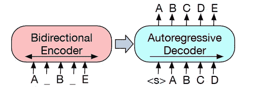
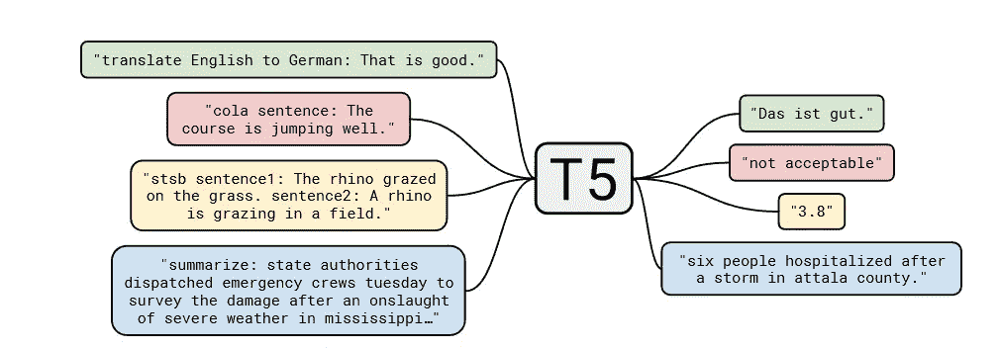

# 通过微调 T5、BART 和 GPT-2 创建印度尼西亚配方生成器

> 原文：<https://pub.towardsai.net/create-indonesian-recipe-generator-by-fine-tuning-t5-bart-and-gpt-2-a7fc0551190e?source=collection_archive---------4----------------------->

## *通过微调 T5、BART、GPT-2 等预训练模型训练的印尼菜谱生成器深度学习模型*


*预览图片来自* [*Unsplash*](https://unsplash.com/photos/HlNcigvUi4Q) *由布鲁克百灵*

大家好！欢迎来到我个人博客上的第一篇技术文章！在这篇文章中，我将写我的一个有趣的项目，印度尼西亚食谱生成器。这是我上一篇[中型文章](/recibrew-find-out-the-foods-ingredients-dbc2a4e37383)的延续，采用了更现代的方法。

这篇文章将告诉你我创建印度尼西亚食谱生成器实验的细节。

此贴转贴自:[https://haryoa.github.io/posts/id-recipe-generator/](https://haryoa.github.io/posts/id-recipe-generator/)

你可以去参观一下，以获得良好的阅读体验。

# 存储库和演示

我会提供最好的模型，也是训练它的代码。

放心尝试下载吧:)。

*   🤗拥抱面部空间(演示):[空间](https://huggingface.co/spaces/haryoaw/id-recigen)
*   🤗拥抱脸模型(下载模型):[模型](https://huggingface.co/haryoaw/id-recigen-bart)
*   ✨库(训练模型): [GitHub 库](https://github.com/haryoa/idrecibrew2)

# 介绍

过去，我通过使用 seq2seq 深度学习方法，如门控循环单元(GRU)和变压器，在我的[中期帖子](/recibrew-find-out-the-foods-ingredients-dbc2a4e37383)中创建了一个印度尼西亚配方生成器。我想重温我过去的工作，并加以改进。所以，这篇文章将会对前一篇文章做一些改进。

我上一篇文章中的模型是原始的，没有经过预先训练。所以，它在训练过程中没有任何先验知识可以利用。我在以前的博客中提到的可以提高模型质量的改进之一是使用预先训练的模型。许多先进的研究工作实现它，以提高非预训练模型的质量。此外，目前是深度学习中预训练模型的时代。如今，当模型在目标数据集上再次训练(我们称之为`fine-tune`)时，许多预训练模型出现并具有突出的结果。因此，在我的 recipe generator 项目中尝试它很有意思。

在这个实验中，我将使用现成的公开可用的预训练模型。由于数据是印度尼西亚语言，我需要使用用印度尼西亚数据预先训练的模型。他们还需要处理序列生成问题，因为我要解决的问题是文本生成问题。我搜索了一下，只找到了 T5、巴特和 GPT 型号。因此，我决定使用这些模型进行实验。

# 数据，预处理，勘探数据分析

由于这是我之前项目的延续，我使用了之前使用的相同数据。你可以通过我下面的文章来阅读更多的细节。

[](/recibrew-find-out-the-foods-ingredients-dbc2a4e37383) [## 🍖🍲Recibrew！用深度学习预测食物成分！！🍲🍖

### ▶️▶️一步一步地讲述了我在深度学习中使用 seq2seq 预测食物成分的有趣自我项目…

pub.towardsai.net](/recibrew-find-out-the-foods-ingredients-dbc2a4e37383) 

# 方法

在这一节中，我将描述我已经尝试过并在上面提到的模型。我使用的所有模型都是基于变压器的模型。我将简要描述它们。

# 巴特

BART 是一个基于转换器的模型，通过学习损坏的输入进行预训练。它有一个类似于 Transformer 模型的编码器-解码器架构，并做了一些修改，比如替换了激活函数。BART 的作者尝试了几个被破坏的场景。发布的最终系统是通过*句子洗牌*和*令牌屏蔽*训练出来的模型。这个想法是让 BART 学习扰动，并具有进行因果语言建模的能力。为了将其应用于系统，我根据数据对模型进行了微调。这是一个预先训练好的 BART 是如何建造的图示。



*巴特预训。它使用损坏的输入(句子重排和标记屏蔽)来预测未损坏的输入*

在这个实验中，我使用 IndoBART 作为本文中发布的预训练模型。该模型通过 Indo4B 数据集、通用抓取和维基百科进行预训练。数据包含印度尼西亚语、巽他语和爪哇语。它在 Huggingface 模型中公开提供。

# T5

T5 也是一个基于变压器的模型，使用损坏的输入进行预训练。T5 通过进行*令牌屏蔽*进行预训练。与使用数据进行因果语言模型训练的 BART 不同，T5 使用训练数据作为 seq2seq 问题。数据可能包含翻译、问题回答和分类问题。该模型通过学习这些任务以及学习被破坏的输入来进行反馈。这是一个如何预先训练模型的例子。



*T5 前期训练。它使用几个具有提示风格的任务作为模型的输入。*

我用的是 T5 型号，在 HuggingFace 中有售。通过使用印度尼西亚 mC4 数据集对其进行预训练。

# 通用终端

GPT-2 是一种自动回归预训练模型，通过因果语言建模进行预训练，对输入没有干扰(不同于 BART 和 T5)。然后，根据我们的数据对预训练模型进行微调。我使用了 IndoGPT 模型，该模型也与 IndoBART 一起在同一篇论文中发布。该模型也使用与 IndoBART 相同的数据进行预训练。

由于模型不是编码器-解码器架构，我们需要重塑我们的输入，使之成为一个语言建模问题。

# 设置

我将把这一部分分为代码技术设置、模型设置和超参数设置。

# 代码技术设置

为了制作训练脚本，我使用 Pytorch 作为深度学习框架。我用 Pytorch Lightning [6](https://haryoa.github.io/posts/id-recipe-generator/#fn:pl-lit) 把它们包起来。我使用了 Pytorch Lightning 的模型检查点、提前停止和 16 位精度的实现。

对于度量计算，我使用 BLEU 评分。BLEU 分数是序列间问题的一个流行的度量。我使用来自`sacrebleu` Python 包的现成 BLEU score 实现。

# 模型设置

我对模型的输入进行了一些修改。对于架构，我使用了 Huggingface 提供的现成实现。

对于 **GPT** ，由于它需要一个输入，我用一个特殊的符号`>>>`将食物名称和食谱联系成一个输入。

```
Input: <FOOD> >>> <INGREDIENTS>
Output: Shift the input (e.g.: Input: `Apple Fruit end_of_token`, Output: `Fruit end_of_token`)
```

**T5** 有 seq2seq 架构，所以我对输入做了小修改。据我所知，T5 预先训练了“提示”式输入。例如:`input: summarize: <ARTICLE>`。所以，我跟着它，把数据改成那样。下面是我如何呈现模型的输入输出

```
Input: resep: <FOOD>
Output: <INGREDIENTS>
```

我没有对 **BART** 模型做任何修改，所以我按原样提供输入和输出。

```
Input: <FOOD>
Output: <INGREDIENTS>
```

# 超参数设置

我用亚当作为优化技术。学习速度因架构而异。我根据几个资源精心挑选了几个学习率值，并尝试了其中一些值。我分别选择`1e-4`、`1e-5`和`1e-4`作为 GPT、巴特和 T5 模型的学习率。我使用早期停止标准来避免模型过度拟合。如果验证损失在 5 个时期内没有增加，它将停止训练。为了挑选最佳模型，我使用了验证损失最低的模型。我使用 AdamW 作为模型的优化器。

为了使训练更快，我使用 Pytorch 提供的自动混合精度(AMP)。可惜 T5 不能用 AMP。所以，我在微调 T5 车型的时候没有用 AMP。

按照我以前的文章，为了进行公平的比较，我使用贪婪解码器作为解码策略来预测每个模型的输出。你可以在我过去的博客中看到关于贪婪解码器如何工作的细节。

# 实验结果

下面是我实验的结果。


在我的设置下，IndoBART 优于其他型号。T5、IndoBART 和 IndoGPT 的 BLEU 分数高于 transformer vanilla。这表明预训练的 seq2seq 模型可能有助于提高模型的性能。根据 Indobenchmark 的数据训练的所有模型都优于根据 C4 模型(T5)训练的模型。看到每个预训练模型的潜力是很有趣的。

# 分析

请访问我的博客，以获得最佳体验来看到这一部分。

# 结论


*随机猫~。照片由* [*曼雅*](https://unsplash.com/@madhatterzone?utm_source=unsplash&utm_medium=referral&utm_content=creditCopyText) *上*[*Unsplash*](https://unsplash.com/s/photos/cat?utm_source=unsplash&utm_medium=referral&utm_content=creditCopyText)*。*

在这篇文章中，我使用预先训练好的模型试验了一个印度尼西亚食谱生成器。根据 BLEU 评分，IndoBART 的表现优于其他车型。我们还可以得出结论，微调预训练的模型通常比非预训练的模型更好。有趣的是看到它真的有效！

其实这里有很多东西可以探讨。例如，观察 BART、T5 和 GPT 的预训练与非预训练的效果是很有趣的。我还需要对训练好的模型做一些严格的分析。遗憾的是，由于我的资源有限，我现在还做不到。

以后打算写 seq2seq 模型目前的进展。2022 年机器学习会议有很多新的有趣的发表论文。我会研究并在我的博客中写下它。


来源: [Pixabay](https://pixabay.com/illustrations/thank-you-polaroid-letters-2490552/) 作者:[杰洛特](https://pixabay.com/illustrations/thank-you-polaroid-letters-2490552/)