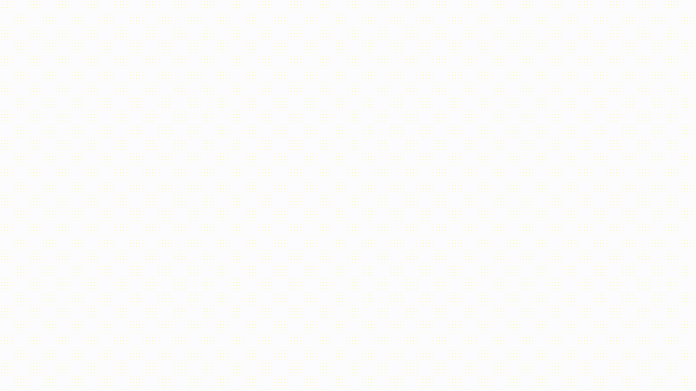
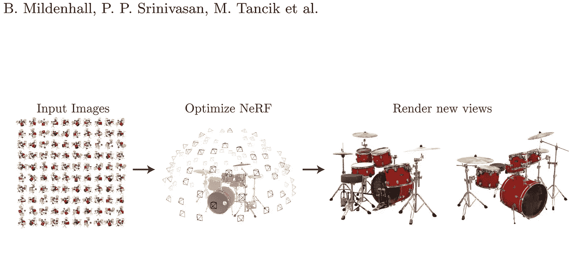
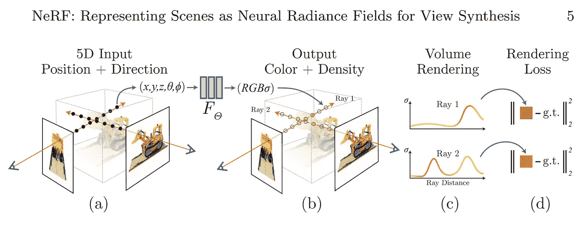
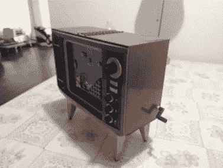
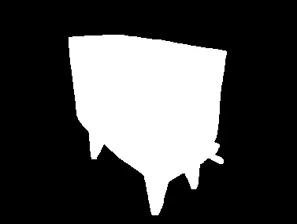
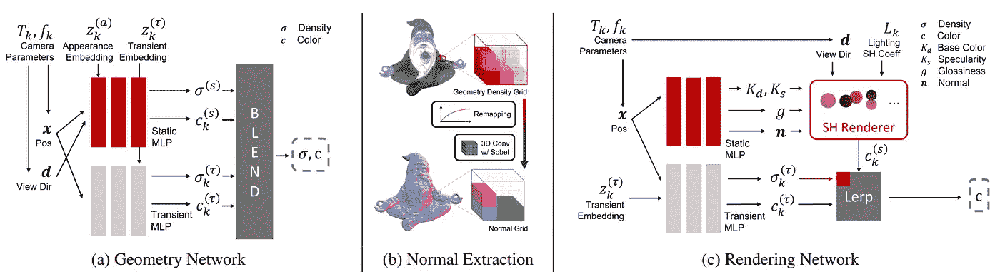
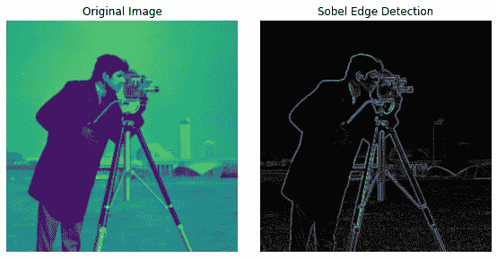
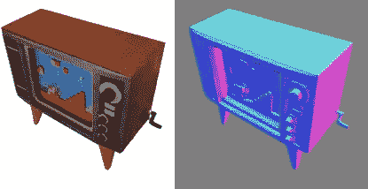

# 用人工智能创建逼真的 3D 效果图！

> 原文：<https://pub.towardsai.net/create-realistic-3d-renderings-with-ai-e92a063381d9?source=collection_archive---------0----------------------->

## [人工智能](https://towardsai.net/p/category/artificial-intelligence)

## 从几张图片到使用 AI 的 3D 模型！

> 原载于 [louisbouchard.ai](https://www.louisbouchard.ai/neroic/) ，前两天在[我的博客](https://www.louisbouchard.ai/neroic/)上看到的！

## 观看视频

神经渲染。神经渲染是从感兴趣的物体、人或场景的图片中生成一个像这样的空间真实感模型的能力。在这种情况下，你会有一些这个雕塑的照片，并要求机器理解这些照片中的物体在太空中应该是什么样子。你基本上是在要求一台机器从图像中理解物理和形状。这对我们来说很容易，因为我们只知道真实世界和深度，但对于一台只能看到像素的机器来说，这是一个完全不同的挑战。

使用模型(NeROIC)的新颖视图合成。来自[项目页面](https://formyfamily.github.io/NeROIC/)的 Gif。

那么，你可能会问，我们为什么要这么做？我想说答案很明显。对我来说，有很多很酷的应用程序，可以简单地拍摄一些物体的照片，并完美地合成 3D 模型，将其放在图像中，3D 场景中，甚至是视频游戏中。
这确实很有前景，但要让这些模型逼真，照明是这些应用带来的另一个挑战。

生成的模型看起来很准确，形状逼真，这很好，但是它如何融入新的场景呢？如果拍摄的照片中的光照条件不同，生成的模型看起来也不同，这取决于您查看它的角度，该怎么办？对我们来说，这自然会显得怪异和不切实际。这些是 Snapchat 和南加州大学在这项新研究中应对的挑战。

现在，让我们来看看他们是如何解决从图像中创建虚拟物体所带来的照明和真实感挑战的。该技术建立在神经辐射场的基础上，神经辐射场主要用于许多模型的重建，如我们在[以前的文章](https://medium.com/what-is-artificial-intelligence/generate-a-complete-3d-scene-under-arbitrary-lighting-conditions-from-a-set-of-input-images-9d2fbce63243)中已经介绍过的 NeRF。通常，神经辐射场需要在相同的理想条件下拍摄的图像，但这不是我们在这里想要的。

NeRF 方法。图片来自[纸张](https://arxiv.org/pdf/2003.08934.pdf)。

他们的方法从 NeRF 开始，正如我所说的，我已经在我的频道上介绍过了，所以我不会再介绍了，但是可以休息一下，阅读我的文章来更好地了解 NeRF 是如何工作的。简而言之，NeRF 是一个神经网络，它被训练成使用图像作为输入来推断每个像素的颜色、不透明度和亮度，并猜测图像中不存在的物体小部分的缺失像素。但是这种方法不适用于大量缺失的部分或不同的光照条件，因为它只能从输入图像中进行插值。在这里，我们需要更多的东西来进行推断，并对这里和那里应该出现什么或者这些像素在这种照明下应该看起来如何等做出假设。

许多方法基于 NeRF 来解决这个问题，但总是需要用户更多的输入，这不是我们想要的，并且在许多情况下很难实现，特别是当我们想要建立一个好的数据集来训练我们的模型时。简而言之，这些模型并没有真正理解物体或物体所处的环境。

摄像机参数和 NeRF 模型生成。图片来自[报](https://arxiv.org/pdf/2003.08934.pdf)。

所以我们总是回到照明问题…在这里，他们的目标是在在线图像中使用这种架构。或者，换句话说，不同的灯光、摄像机、环境和姿势的图像。一些 NeRF 很难做到的现实主义。

除了对象本身的图像之外，他们唯一需要的是粗略的前景分割和相机参数的估计，这两者都可以通过其他可用的模型来获得。前景估计基本上只是一个遮罩，告诉您感兴趣的对象在图像上的位置，就像这样:

电视及其分段遮罩的图像。

他们所做的不同之处在于，他们将物体的渲染与输入图像中的环境照明分开。他们关注两件事，分两个阶段完成。

模型的概述，我们将在下面看到。图片来自[报](https://arxiv.org/pdf/2201.02533.pdf)。

首先(a)是物体的形状，或者说它的几何形状，这是与 NeRF 最相似的部分，这里称为几何网络。它将采用我们讨论过的输入图像、分割蒙版和相机参数估计，建立一个辐射场，并找到每个像素的密度和颜色的第一个猜测，就像在 NeRF 中一样，但适用于输入图像中变化的照明条件。这种差异依赖于您在这里看到的两个分支，将静态内容从可变参数(如相机或阴影)中分离出来。这将允许我们教导我们的模型如何正确地将静态内容与其他不需要的参数(如照明)隔离开来。但是我们还没有结束。

在(b)中，我们将从这个学习到的密度场估计表面法线，这将是我们的纹理。或者，换句话说，它将利用我们刚刚产生的结果，找到我们的对象对光的反应。使用具有 Sobel 核的 3D 卷积，它将在这个阶段找到物体的无偏材料属性，或者至少是它的估计。它基本上是一个过滤器，我们在三维空间中应用它来找到所有的边缘以及它们的锐度，在二维图像上看起来像这样(下图，左)，在三维渲染上看起来像这样(下图，右)，给我们关于物体的不同纹理和形状的重要信息。

2D 应用的 Sobel 过滤器(左)和使用 3D Sobel 过滤器产生的表面法线(右)。

下一个阶段(c)是他们将修正学习到的几何图形，并优化我们刚刚使用这个渲染网络生成的法线，这与第一个几何图形网络非常相似。这里也有两个分支，一个用于材质，另一个用于照明。他们将使用球面谐波来表示照明模型，并在训练期间优化其系数。正如他们在论文中解释的，如果你感兴趣的话，还有更多信息，这里使用球谐函数来表示定义在球面上的一组基函数。我们可以在维基百科上查到“定义在球面上的每一个函数都可以写成这些球谐函数的和”。该技术通常用于计算 3D 模型上的光照。它以相对较少的开销产生高度真实的着色和阴影。简而言之，它将简单地减少要估计的参数数量，但保持相同的信息量。

因此，该模型不是从头开始学习如何为整个对象渲染适当的照明，而是学习正确的系数以用于球面谐波，该系数将估计每个像素表面发出的照明，从而将问题简化为几个参数。另一个分支将被训练来改进物体的表面法线，使用标准的 Phong BRDF 遵循相同的技巧，它将基于一些要找到的参数来模拟物体的材质属性。最后，两个分支的输出，因此最终的渲染和照明将合并，以找到每个像素的最终颜色。

这种光线和材质的分离是他们能够将任何光线应用到物体上并让物体做出真实反应的原因。请记住，这仅仅是用互联网上的几张图片完成的，并且可能有不同的照明条件。这太酷了。

瞧！这就是匡和 Snapchat 合作者的这篇新论文如何创建 NeROIC，一种用于在线图像对象的神经渲染模型！

我希望您喜欢这篇论文的简短概述。所有的参考链接如下，以及官方项目的链接，和他们的代码。让我知道你对这个解释、这个技术的看法，以及你将如何在现实世界中使用它！

感谢您的阅读，观看[视频](https://www.youtube.com/watch?v=88Pl9zD1Z78)了解更多示例！

如果你喜欢我的工作，并想与人工智能保持同步，你绝对应该关注我的其他社交媒体账户( [LinkedIn](https://www.linkedin.com/in/whats-ai/) ， [Twitter](https://twitter.com/Whats_AI) )，并订阅我的每周人工智能 [**简讯**](http://eepurl.com/huGLT5) ！

## 支持我:

*   在 [**中**](https://whats-ai.medium.com/) 跟我来
*   想进入 AI 或者提升技能，[看这个](https://www.louisbouchard.ai/learnai/)！

## 参考

*   匡，z .，Olszewski，k .，柴，m .，黄，z .，Achlioptas，p .和 Tulyakov，s .，2022。NeROIC:来自在线图像集合的对象的神经渲染。[https://arxiv.org/pdf/2201.02533.pdf](https://arxiv.org/pdf/2201.02533.pdf)
*   项目链接与伟大的视频演示:[https://formyfamily.github.io/NeROIC/](https://formyfamily.github.io/NeROIC/)
*   代号:[https://github.com/snap-research/NeROIC](https://github.com/snap-research/NeROIC)