# 用 LSTM 在几分钟内创建你的第一个文本生成器

> 原文：<https://pub.towardsai.net/create-your-first-text-generator-with-lstm-in-few-minutes-3b59ee139ca0?source=collection_archive---------3----------------------->

## [深度学习](https://towardsai.net/p/category/machine-learning/deep-learning)，[自然语言处理](https://towardsai.net/p/category/nlp)


[拍照](https://unsplash.com/@retrosupply?utm_source=medium&utm_medium=referral)在[上反溅](https://unsplash.com?utm_source=medium&utm_medium=referral)

如果我告诉你，一整部简短的科幻电影是由一个建立在 LSTM 递归神经网络上的人工智能机器人编写的，它甚至获得了积极的评论和批评，惊讶吧？！嗯，我肯定你是，因为这是我第一次看《太阳之春》的感觉，我的意思是，我知道它不能与史蒂芬·斯皮尔伯格或亚历克斯·嘉兰的编剧质量相比，但难怪在未来几年内，人工智能机器人会在奥斯卡金像奖上与他们竞争。事实上，我们不应该再惊讶于人工智能能够颠覆我们的世界，让它成为一个更好、“更容易”和最舒适的居住地。

在我看来，在所有的人工智能子领域中，NLP 拥有最酷和最令人兴奋的应用。其中之一是文本生成，我们应该深入研究它。

在这篇文章中，我将简要解释 RNN 和 LSTM 是如何工作的，以及我们如何在 Python 中使用 LSTM 生成文本。

在我们开始之前，对于那些还没看的人，我想让你们去看看《太阳之春》[https://www.youtube.com/watch?v=LY7x2Ihqjmc](https://www.youtube.com/watch?v=LY7x2Ihqjmc)

## **目录**

[1。递归神经网络](#df05)
[2。长短期记忆](#83cd)
3。正文生成 t24】∘[1。文字处理](#119a)
∘ [2。创建批次](#3587)
∘ [3。创作&培训模特](#acc5)t33】∘[4。生成文本](#2274)

# 1.递归神经网络

文本、音频、视频、时序数据……它们有什么共同点？答案很清楚，它们每一个都是由有序序列组成的，其中每一个组块都依赖于前面的那些才有意义。这使得传统的前馈网络无法处理这种数据，因为它们没有任何时间依赖性或记忆效应。这就是 rnn 发挥作用的地方，通过引入一个额外的维度，这是它们在处理序列数据以创建预测和生成模型方面比其他类型的 ANN 更有效的时间。

它是这样工作的:每个生成的输出不仅依赖于它的输入，还依赖于在以前的时间步骤中输入到网络的输入的整个历史。这可以归纳为两个主要等式:

**内部状态更新:**

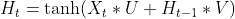

**输出更新:**

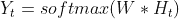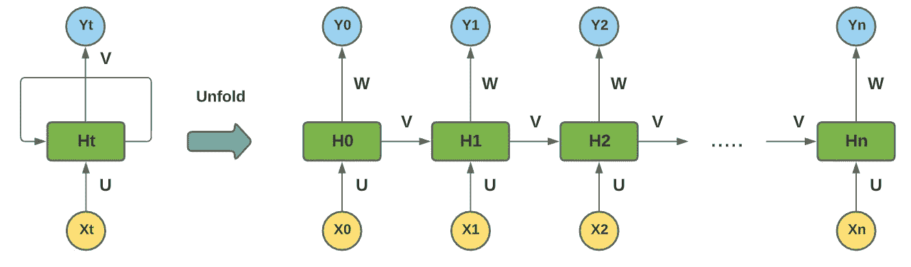

展开的 RNN

*   X(t)是输入，Y(t)是输出，H(t)是当前时间步的内部状态(谁扮演内存的角色)，H(t-1)是前一个时间步的内部状态。
*   u、W 和 V 是网络共享的权重。事实上，在 RNN 中，所有步骤共享相同的参数，这主要减少了参数的数量和计算成本。

在时间步骤 t=0， **X0** 被传递到网络，在网络中被单元分析和处理，以便计算 **H0** 并产生输出 **Y0** ，然后在下一个时间步骤 t=1， **X1** 与 **H0** 合并，以计算新的内部状态 **H1** ，然后产生 **Y1** ，并且相同的过程继续运行，直到第 n 个时间步骤。

## **RNN 问题**

RNN 的应用是多方面的，可以在任何地方找到，它用于股票预测，语音识别，文本摘要和生成，搜索引擎，机器翻译…所以为了给出准确的结果，它必须在“无限”的序列上进行训练，这导致了两个主要问题:

*   **渐变消失**
*   **渐变爆炸**

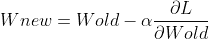

更新权重

我们知道，通过[](https://medium.com/@14prakash/back-propagation-is-very-simple-who-made-it-complicated-97b794c97e5c)****(在这种情况下为 [**通过时间**](https://en.wikipedia.org/wiki/Backpropagation_through_time#:~:text=Backpropagation%20through%20time%20(BPTT)%20is,independently%20derived%20by%20numerous%20researchers.) 的反向传播)计算梯度的目标是找到将最小化每个连接的总损失的最佳权重，因此如果序列太长并且在梯度太小(小于 1)的情况下，权重将保持不变， 意味着网络将无法学习和回忆第一层中发生的事情，这就是**消失梯度的问题，**但是，在梯度过大(大于 1)的相反一侧，学习将会发散，因为权重将远离最佳值，这就是**爆炸梯度的问题。******

# ****2.**长短期** - **期限记忆******

****正如我们所见，rnn 只在小序列上工作良好，因为它们不能长时间记忆信息。这就是 LSTM 加入游戏的地方。由于其**门控细胞结构**，它克服了传统 RNN 的局限性，建立了长期依赖性，并能够在多个时间步长内回忆和记忆数据，这使得 LSTM 成为迄今为止最受欢迎和最有效的递归神经网络模型之一。****

****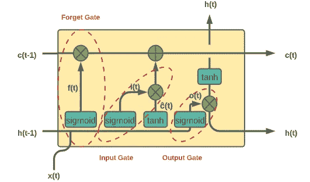****

****LSTM 细胞****

****每个 LSTM 单元由一个简单的 RNN 细胞和另一个负责长期记忆的细胞以及 3 个门组成:输入门、输出门和遗忘门。它们就像过滤器一样，决定哪些信息会被网络记住，哪些信息会被网络遗忘。****

****整个过程是这样的:****

*   ****在第一步中，通过将 **sigmoid 层**应用于当前输入 **x(t)** 和前一时间步 **h(t-1)** 的隐藏状态的组合，遗忘门评估哪些数据将从单元状态中删除，它产生 0 和 1 之间的值，因为 0 意味着该信息将被删除，1 意味着该信息将被保留。****

****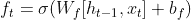****

*   ****在第二步中，输入门通过组合 **sigmoid 层**的输出和 **tanh 层**的输出来控制是否更新存储单元。应用于 **x(t)** 和 **h(t-1)** 的 sigmoid 层产生范围从 0 到 1 的值，其中 1 表示该信息很重要，需要添加到单元状态，而 0 则不然。tanh 层返回-1 和 1 之间的值，以帮助调节网络，并创建一个新的候选值向量**(t)**，可以添加到状态中。****

************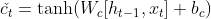****

*   ****然后，在下一步中，基于先前步骤的计算创建新的单元状态。****

****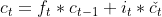****

*   ****最后，在最后一步，输出门选择下一个隐藏状态应该是什么。首先，将先前的隐藏状态和当前输入传递到 **sigmoid 层**以产生 o(t)，然后将其乘以**双曲正切函数**的输出，该函数应用于先前步骤中新计算的单元状态。****

****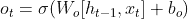********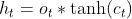****

# ****3.文本生成****

****根据定义，文本生成是基于巨大的文本语料库由神经网络自动产生新文本的机制，所以让我们看看它是如何使用 LSTM 制作的。****

****首先需要导入 **Numpy** 、 **Pandas、**和 **Tensorflow** 库。对于数据集，我们将选择莎士比亚的所有作品，主要有两个原因:****

1.  ****这是一个很大的文本语料库。通常建议您至少拥有总计 100 万个字符的源，以获得逼真的文本生成。****
2.  ****它有非常独特的风格。由于文本数据使用旧式英语，并且是以舞台剧的风格格式化的，如果模型能够再现类似的结果，这对于我们来说将是非常明显的。****

****你可以下载莎翁的数据集，或者从古腾堡获取任何你想要的免费文本:[https://www.gutenberg.org/](https://www.gutenberg.org/)****

****文本看起来是这样的。****

```
 **1   
From fairest creatures we desire increase,   
That thereby beauty's rose might never die,   
But as the riper should by time decease,   
His tender heir might bear his memory:   
But thou contracted to thine own bright eyes,   
Feed'st thy light's flame with self-substantial fuel,   
Making a famine where abundance lies,   
Thy self thy foe, to thy sweet self too cruel:   
Thou that art now the world's fresh ornament,   
And only herald to the gaudy spring,   
Within thine own**
```

## ****1.文本处理****

******文本矢量化******

****我们知道神经网络不能接受原始字符串数据，所以我们需要通过给每个字符分配数字来对其进行编码。让我们创建两个字典，它们可以从数字索引到字符，从字符到数字索引。****

## ****2.创建批处理****

****总的来说，我们试图实现的是让模型预测给定历史字符序列的下一个最高概率的字符。由我们(用户)来选择这个历史序列有多长。太短的序列和我们没有足够的信息(例如，给定字母“a”，下一个是什么)，太长的序列和训练将花费太长的时间，并且很可能对与更远的字符不相关的字符进行排序。虽然没有正确的序列长度选择，但您应该考虑文本本身、正常短语的长度以及什么字符/单词彼此相关的合理想法。****

******训练序列******

****实际的文本数据将是向前移动一个字符的文本序列。例如:****

****顺序输入:“你好，我的名字”顺序输出:“你好，我的名字”****

******batch** 方法将这些单独的字符调用转换成序列，我们可以批量输入。我们使用 seq_len+1 是因为零索引。****

****drop_remainder 的意思是:drop_remainder:(可选。)一个`tf.bool`标量`tf.Tensor`，代表该情况下是否应该丢弃最后一批，它比`batch_size`元素少；默认行为是不丢弃较小的批处理。****

```
**sequences = char_dataset.batch(seq_len+1, drop_remainder=True)**
```

1.  ****抓取输入文本序列****
2.  ****将目标文本序列指定为向前移动一步的输入文本序列****
3.  ****将它们分组为一个元组****

******生成训练批次******

****现在我们有了实际的序列，我们将创建批处理。我们希望将这些序列随机排列，这样模型就不会过度适应文本的任何部分，而是可以在给定任何种子文本的情况下生成字符。****

## ****3.创建和训练模型****

****我们将使用一个具有一些额外功能的基于 LSTM 的模型，包括一个嵌入层和两个 LSTM 层。我们将这个模型架构基于 [DeepMoji](https://deepmoji.mit.edu/) 。****

****嵌入层将作为输入层，它实质上创建了一个查找表，将每个字符的数字索引映射到一个具有“嵌入维数”的向量。可以想象，这个嵌入大小越大，训练就越复杂。这类似于 word2vec 背后的思想，将单词映射到某个 n 维空间。在直接馈入 LSTM 之前嵌入通常会产生更真实的结果。****

## ****4.生成文本功能****

****目前，我们的模型一次只需要 128 个序列。我们可以创建一个新模型，它只要求 batch_size=1。我们可以用这个批量创建一个新模型，然后加载我们保存的模型的权重。那就打电话。在模型上构建()，然后我们创建一个生成新文本的函数。****

****瞧啊。！这是生成的文本的样子****

****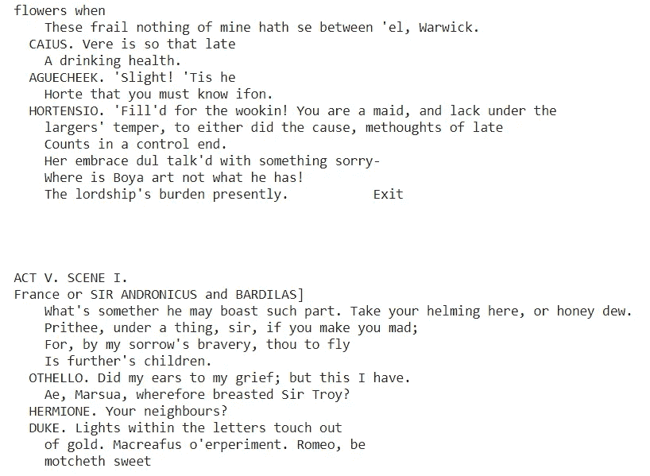****

****你可能会注意到，这些生成的场景有些不真实，但你可以压缩一些参数，还可以添加一个丢弃层以避免过度拟合，然后该模型可以更好地生成文本。****

## ****参考资料和其他资源:****

****[1][https://en.wikipedia.org/wiki/Sunspring](https://en.wikipedia.org/wiki/Sunspring)****

****[2][https://medium . com/analytics-vid hya/understanding-rnns-652 b7d 77500 e](https://medium.com/analytics-vidhya/understanding-rnns-652b7d77500e)****

****[3][https://towards data science . com/understanding-rnns-lst ms-and-grus-ed 62 EB 584d 90](https://towardsdatascience.com/understanding-rnns-lstms-and-grus-ed62eb584d90)****

****[4][https://machine learning mastery . com/text-generation-lstm-recurrent-neural-networks-python-keras/](https://machinelearningmastery.com/text-generation-lstm-recurrent-neural-networks-python-keras/)****