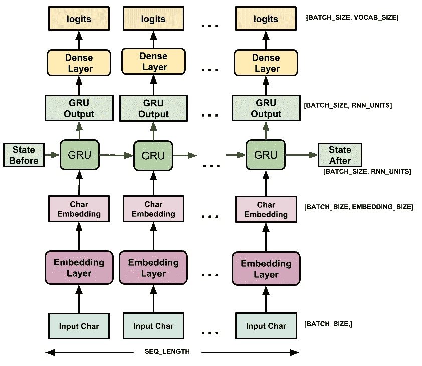
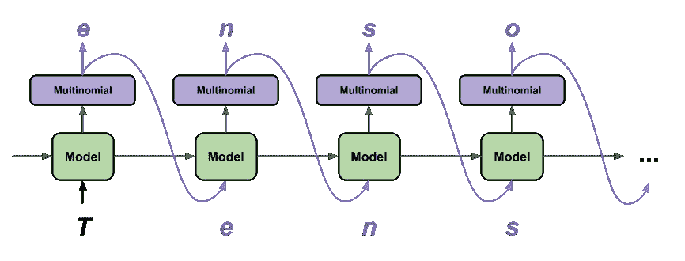

# 使用 RNNs 和 TensorFlow 创建您自己的哈利波特短篇故事

> 原文：<https://pub.towardsai.net/create-your-own-harry-potter-short-story-using-rnn-and-tensorflow-853b3ed1b8f3?source=collection_archive---------1----------------------->

## [数据科学](https://towardsai.net/p/category/data-science)


由 [Rae Tian](https://unsplash.com/@rae_1991?utm_source=medium&utm_medium=referral) 在 [Unsplash](https://unsplash.com?utm_source=medium&utm_medium=referral) 上拍摄

# “当然，它是在你脑子里发生的，哈利，但这究竟为什么意味着它不是真实的呢？”

还在等你的霍格沃茨来信吗？想在大会堂享受盛宴吗？
探索霍格沃茨的秘密通道？从奥利凡德商店买你的第一根魔杖？
*叹*你不是一个人。

我已经(*过了这么久？* ) *一直*痴迷[哈利波特](https://harrypotter.bloomsbury.com/uk/)，最近开始学习神经网络。看到深度学习能让你变得多么有创造力是很有趣的，所以我想为什么不*酝酿*它们呢？

所以我使用 TensorFlow 执行了一个简单的文本生成模型来创建我自己版本的哈利波特短篇小说(不能像 J.K .罗琳那样好，咄！)

本文向您展示了我为实现它而编写的全部代码。
但是对于所有的赫敏，你可以直接在这里找到 github 代码[并自己运行它！](https://github.com/amisha-jodhani/text-generator-harry-potter)

所以这里有一些东西会在你被隔离期间给你的无聊蒙上一层【T21 驱逐咒】。

# 背景

## 什么是 RNN？

递归神经网络不同于其他神经网络，因为它有一个**存储器**，该存储器存储到目前为止它已经处理的所有层的信息，并根据该存储器计算下一层。关于 RNNs 的简单介绍，可以参考[这个](https://www.geeksforgeeks.org/introduction-to-recurrent-neural-network/)。

## GRU 对 LSTM

这两者对文本生成都很好，但是 GRUs 是一个较新的概念…而且实际上没有办法确定哪一个更好。**调整好你的超参数**比选择一个好的架构更能提高你的模型性能。

但是，如果数据量不成问题，LSTMs 的性能会更好。如果你有较少的数据，gru 就有较少的参数，所以它们训练得更快，并能很好地概括较少的数据。

请随意查看这篇[文章](http://www.wildml.com/2015/10/recurrent-neural-network-tutorial-part-4-implementing-a-grulstm-rnn-with-python-and-theano/)以获得更详细的解释。

## 为什么基于字符？

当处理像这样的大型数据集时，**语料库中唯一单词的完整数量远远高于唯一字符的数量**。一个大的数据集将会有很多很多独特的单词，当我们给这样大的矩阵分配一次性编码时，我们很可能会遇到内存问题。光是我们的标签就可以占用数兆兆字节的内存。

所以，你用来预测单词的相同原则也可以应用到这里，但是现在你将使用更小的词汇量。

# 代码

所以让我们开始吧！

## 首先，导入您需要的库

```
import tensorflow as tf
import numpy as np
import os
import time
```

## 现在，读取数据

你可以从这个数据集中找到并下载所有哈利波特书籍的抄本。在这里，我将所有七本书合并成一个名为*‘Harry Potter . txt’的文本文件。如果你愿意，你也可以在任何一本书上训练你的模型。尝试一下吧！*

```
files= [‘1SorcerersStone.txt’, ‘2ChamberofSecrets.txt’, ‘3ThePrisonerOfAzkaban.txt’, ‘4TheGobletOfFire.txt’, ‘5OrderofthePhoenix.txt’, ‘6TheHalfBloodPrince.txt’, ‘7DeathlyHollows.txt’] with open(‘harrypotter.txt’, ‘w’) as outfile:
for file in files:
  with open(file) as infile:
    outfile.write(infile.read())
text = open(‘harrypotter.txt’).read()
```

## 看着这些数据

```
print(text[:300])
```

> 《哈利·波特与魔法石》
> 
> 第一章
> 
> 男孩世卫组织活着
> 
> 女贞路 4 号的德思礼夫妇自豪地说，他们完全正常，非常感谢。他们是你最不可能想到会卷入任何奇怪或神秘事件的人，因为他们“

## 处理数据

我们通过制作两个查找表将`vocab`中的所有唯一字符串映射到数字:

1.  将字符映射到数字(`char2index`)
2.  将数字映射回字符(`index2char`)

然后将我们的文本转换成数字..

```
vocab = sorted(set(text))
char2index = {u:i for i, u in enumerate(vocab)}
index2char = np.array(vocab)
text_as_int = np.array([char2index[c] for c in text])#how it looks:
print ('{} -- characters mapped to int -- > {}'.format(repr(text[:13]), text_as_int[:13]))
```

> “哈利·波特”——映射到 int 的字符→ [39 64 81 81 88 3 47 78 83 83 68 81 3]

我们模型的每个输入序列将包含文本中的`seq_length`个字符，其对应的目标序列将具有相同的长度，所有字符都向右移动一个位置。所以我们把文本分成几段`seq_length+1`。⁴

`tf.data.Dataset.from_tensor_slices`将文本向量转换成字符索引流，`batch`方法让我们将这些字符分组为所需长度的批次。

通过使用`map`方法将一个简单的函数应用于每一批，我们创建了我们的输入和目标。

```
seq_length = 100
examples_per_epoch = len(text)//(seq_length+1)
char_dataset = tf.data.Dataset.from_tensor_slices(text_as_int)
sequences = char_dataset.batch(seq_length+1, drop_remainder=True)def split_input_target(data):
  input_text = data[:-1]
  target_text = data[1:]
  return input_text, target_textdataset = sequences.map(split_input_target)
```

在将这些数据输入到模型中之前，我们对数据进行洗牌，并将其分成几批。`tf.data`维护一个缓冲区，它在其中混洗元素。

```
BATCH_SIZE = 64
BUFFER_SIZE = 10000dataset = dataset.shuffle(BUFFER_SIZE).batch(BATCH_SIZE, drop_remainder=True)
```

## 构建模型

给定到目前为止计算的所有字符，下一个字符会是什么？这是我们将训练我们的 RNN 模型来预测的。

我使用了`**tf.keras.Sequential**`来定义模型，因为模型中的所有层只有一个输入并产生一个输出。使用的不同层是:

*   `**tf.keras.layers.Embedding**`:这是输入层。嵌入用于将所有独特的字符映射到多维空间中的向量，具有`embedding_dim`维度。
*   `**tf.keras.layers.GRU**`:一种带有`rnn_units`数量单位的 RNN。(您也可以在此处使用 LSTM 图层来查看最适合您的数据的图层)
*   `**tf.keras.layers.Dense**`:这是输出层，有`vocab_size`输出。

另外，**单独定义所有超参数**也很有用，这样您可以更容易地在以后更改它们，而无需编辑模型定义。



文本生成训练示例。[来源](https://www.tensorflow.org/tutorials/text/text_generation)

```
vocab_size = len(vocab)
embedding_dim = 300
# Number of RNN units 
rnn_units1 = 512
rnn_units2 = 256
rnn_units= [rnn_units1, rnn_units2]def build_model(vocab_size, embedding_dim, rnn_units, batch_size):
  model = tf.keras.Sequential([
    tf.keras.layers.Embedding(vocab_size, embedding_dim,
       batch_input_shape=[batch_size, None]), tf.keras.layers.GRU(rnn_units1, return_sequences=True,
       stateful=True,recurrent_initializer='glorot_uniform'), tf.keras.layers.GRU(rnn_units2, return_sequences=True,
       stateful=True,recurrent_initializer='glorot_uniform'), tf.keras.layers.Dense(vocab_size) ])
  return modelmodel = build_model(
vocab_size = vocab_size,
embedding_dim=embedding_dim,
rnn_units=rnn_units,
batch_size=BATCH_SIZE)
```

## 训练模型

标准的`tf.keras.losses.sparse_categorical_crossentropy`损失函数最适合我们的模型，因为它应用于预测的最后一层。我们将`from_logits`设置为 True，因为模型返回 logits。然后我们选择`adam`优化器并编译我们的模型。

```
def loss(labels, logits):
  return tf.keras.losses.sparse_categorical_crossentropy(labels,
         logits, from_logits=True)model.compile(optimizer='adam', loss=loss, metrics=['accuracy'])
```

您可以像这样配置检查点，以确保在训练期间保存检查点。

```
# Directory where the checkpoints will be saved
checkpoint_dir = ‘./training_checkpoints’
# Name of the checkpoint files
checkpoint_prefix = os.path.join(checkpoint_dir, “ckpt_{epoch}”)
checkpoint_callback=tf.keras.callbacks.ModelCheckpoint(
   filepath=checkpoint_prefix, save_weights_only=True)
```

每个时期的训练时间取决于您使用的模型层和超参数。我已经将纪元设置为 50，以观察准确性和损失如何随时间变化，但可能不需要对所有 50 个纪元进行训练。当你看到你的损失开始增加或在几个时期内保持不变时，一定要停止训练。您训练的最后一个纪元将存储在`latest_check`中。如果使用 Google Colab，将运行时间设置为 **GPU** 以减少训练时间。

```
EPOCHS= 50
history = model.fit(dataset, epochs=EPOCHS, callbacks=[checkpoint_callback])
latest_check = tf.train.latest_checkpoint(checkpoint_dir)
```

## 文本生成

如果您希望使用不同的批处理大小，则需要在运行之前重建模型并重新加载检查点。为了简单起见，我使用了 1 的`batch_size`。

(您可以运行`model.summary()`来深入了解您的模型层以及每层之后的输出形状)

```
model = build_model(vocab_size, embedding_dim, rnn_units, batch_size=1)
model.load_weights(latest_check)
model.build(tf.TensorShape([1, None]))
model.summary()
```

下面的函数现在生成文本:

*   它接受一个`start_string`，初始化 RNN 状态，并将输出字符数设置为`num_generate`
*   使用`start_string`和 RNN 状态获得下一个字符的预测分布。然后，它计算预测字符的索引，这是我们对模型的下一个输入。
*   模型返回的输出状态被反馈到模型中，这样它就有了更多的上下文，(如下所示)。预测完下一个字符后，循环继续。通过这种方式，RNN 在从之前的输出中建立记忆的同时进行学习。⁴



文本生成抽样。[信号源](https://www.tensorflow.org/tutorials/text/text_generation)

*   较低的`scaling`产生更可预测的文本，而较高的`scaling`给出更令人惊讶的文本。

```
def generate_text(model, start_string): num_generate = 1000  #can be anything you like input_eval = [char2index[s] for s in start_string]
  input_eval = tf.expand_dims(input_eval, 0) text_generated = [] scaling = 0.5 #kept at a lower value here # Here batch size == 1
  model.reset_states()
  for i in range(num_generate):
    predictions = model(input_eval)
    # remove the batch dimension
    predictions = tf.squeeze(predictions, 0)
    predictions = predictions / scaling
    predicted_id = tf.random.categorical(predictions, 
       num_samples=1)[1,0].numpy()
    input_eval = tf.expand_dims([predicted_id], 0)
    text_generated.append(idx2char[predicted_id])return (start_string + ‘’.join(text_generated))
```

你完了！

# 输出

您可以尝试给它不同的开始字符串，以获得不同的输出。

下面是使用我最喜欢的字符输出的一部分:

```
print(generate_text(model, start_string=u”Severus Snape“))
```

> **西弗勒斯·斯内普**搬到猩红色霍格沃茨的学生。赫敏说，“嗯，我觉得没事了，没事了，以前有点死了。。。."
> “我想我得去别的地方，而不是你去帮他问职员的问题，桌子和门开了，他盯着钟看哈利。”我想这是格兰芬多的剑，他也在那里，他在枕头上，他和罗恩盯着他看。“我确信我们可以打扰那个男孩——”
> “你应该在那里，”罗恩说，他面带奇怪之色。
> “我是说，他真的很棒 **…**

你也可以尝试不同的句子:

> **伏地魔死于冠状病毒。**
> “你不知道该做什么，”哈利说，“那是一件环绕的斗篷，是他支撑你走到那条路上的。“是啊，好吧，我想你可能已经这么做了！”她说，大步走上台阶，他的力量是如此之大，因为他是一个相当大的帐篷，这是他们可能第一次意识到我看到他被摧毁和尖叫的人群穿过黑暗的时间喊叫声和沉默。
> “你看，哈利！“我不知道，看得出你和魔法部的一个混蛋没有任何关系”

这里有一个例子，如果你只使用第一本书*魔法石:*来训练模型

> **邓布利多**在破釜酒吧，现在空无一人。哈里以前从未去过伦敦。尽管海格的眼睛看起来很冷很绿。他还在发抖。
> 
> 哈利在那碗豌豆旁边坐了下来。“你跟邓布利多教授谈了些什么。”
> 
> 她用既震惊又怀疑的眼光看着他。
> 
> “谁在那里？”当他们爬上街道时，他突然说道。他只能看见四号台阶上的毯子。
> 
> 达力最喜欢的出气筒是哈利，但是他不能经常抓住他。哈利什么也没说**……**

你会看到这个模型知道何时将单词大写，创建一个新段落，并且它模仿了一个*神奇的*写作词汇！

*恶作剧成功了。*

为了使句子更加连贯，您可以通过以下方式改进模型

*   改变不同的参数值，如`seq_length`、`rnn_units`、`embedding_dims`、`scaling`，以找到最佳设置
*   为更多的时代训练它
*   添加更多的 GRU / LSTM 层

这个模型可以在你喜欢的任何其他系列上训练。一定要在评论里分享你自己的故事，玩得开心！

## **参考文献:**

**【1】**j . k .罗琳， [*哈利波特与死亡圣器*](https://www.bloomsbury.com/uk/harry-potter-and-the-deathly-hallows-9780747591054/) *，2007 年*

**【2】***递归神经网络教程，第四部分——用 Python 和 Theano 实现一个 GRU/LSTM RNN*，[2015 年 10 月 27 日](http://www.wildml.com/2015/10/recurrent-neural-network-tutorial-part-4-implementing-a-grulstm-rnn-with-python-and-theano/)作者[丹尼·布里兹](http://www.wildml.com/author/dennybritz/)

**【3】**j . k .罗琳， [*《哈利波特与魔法石》*](https://shop.scholastic.com/parent-ecommerce/books/harry-potter-and-the-sorcerers-stone-9780545582889.html) ，1998 年

****[*文本生成与 RNN*](https://www.tensorflow.org/tutorials/text/text_generation) *、张量流*****