# 使用 Pytorch 从头开始创建迷你单词嵌入

> 原文：<https://pub.towardsai.net/create-your-own-mini-word-embedding-from-scratch-c7b32bd84f8e?source=collection_archive---------2----------------------->

## [机器学习](https://towardsai.net/p/category/machine-learning)

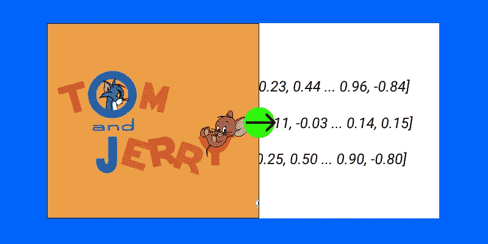

作者插图

# 简介:

更简单地说，特定单词**(高维)**的嵌入只不过是该单词**(低维)的向量表示。**凡词义相近的词 ***Ex。*** “喜气洋洋”和其他密切相关的词如 ***Ex。“钱”和“银行”*** ，在低维投影时得到更接近的矢量表示。

从单词到向量的转换称为 [*单词嵌入*](https://en.wikipedia.org/wiki/Word_embedding)

因此，创建迷你单词嵌入的基本概念可以归结为用一些文本数据训练一个简单的自动编码器。

# 一些基础知识:

在我们继续创建迷你单词嵌入之前，最好重温一下深度学习社区迄今为止提供的单词嵌入的基本概念。

流行的和最先进的单词嵌入模型如下

1.  Word2Vec(谷歌)
2.  手套(斯坦福大学)

他们在维基百科或整个网络搜集的海量文本语料上接受训练，高达***60 亿字*** **(高维)**，并将其投影到低至 *100、200、300***(低维)。**

在我们的模型中，我们将它们投射到两个密集嵌入中。

# 使用的技术:

上述最先进的模型使用两种主要技术中的任何一种来完成任务。

1.  连续词袋
2.  跳跃图

## 1.CBOW:

CBOW 试图从其相邻单词(上下文单词)中猜测输出(目标单词)。窗口大小在这里是一个超参数。

## 示例:

句子:猫和老鼠是好朋友

目标词(输出):**老鼠**(比方说)

语境词(输入):**猫和** _ **是好朋友**

## 2.跳过程序:

Skip-Gram 根据目标单词猜测上下文单词。我们将在本帖中实现这一点。

句子:猫和老鼠是好朋友

目标词(输出):**和**，**老鼠…**

上下文单词(输入):**猫**，**猫……**

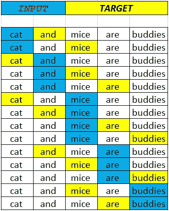

稍后将详细介绍这些技术。

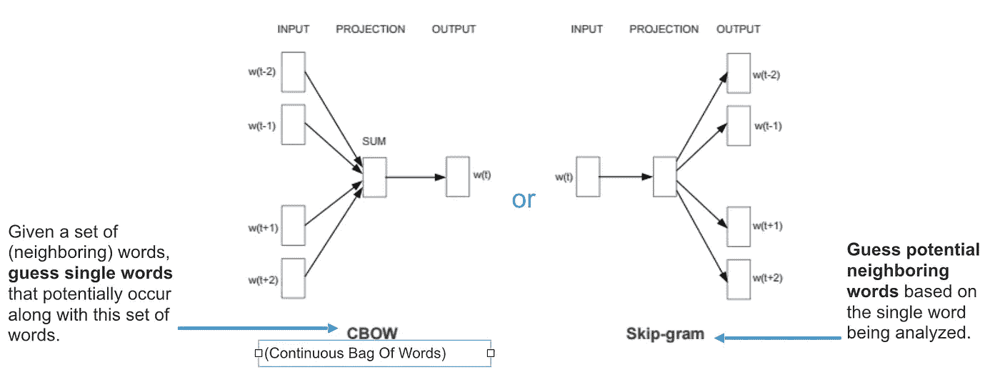

CBOW 与 Skip-gram

# 迷你单词嵌入过程:

## 1.数据准备和数据预处理

## 2.超参数选择和模型建立

## 3.模型推理

# 1.数据准备和数据预处理

有趣的部分来了，正如我之前所说，模型的上述状态使用了大量的文本数据来训练这些模型，因为我们对它的迷你版本感兴趣，所以我们选择一个小数据集。

为了使事情更令人兴奋，我选择了汤姆和杰里卡通剧作为我们的数据语料库。

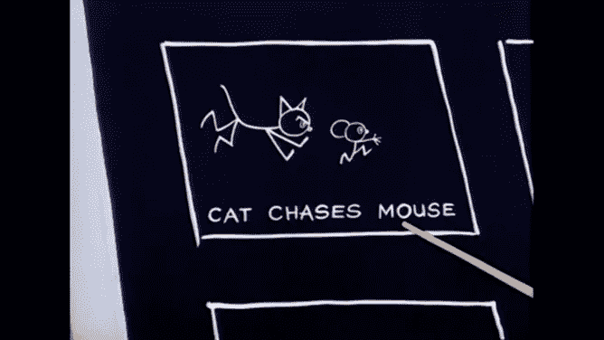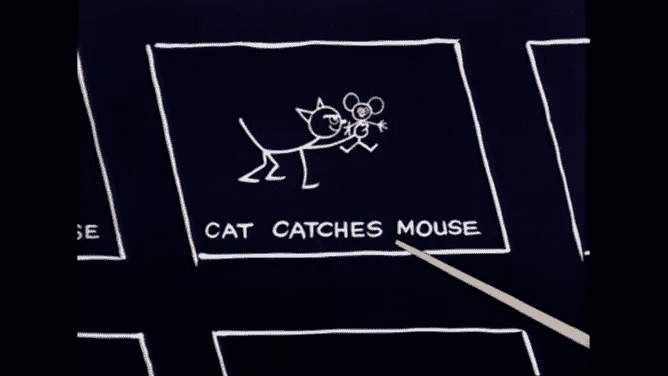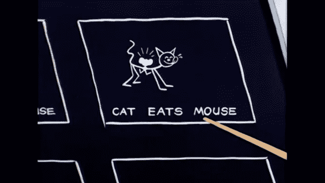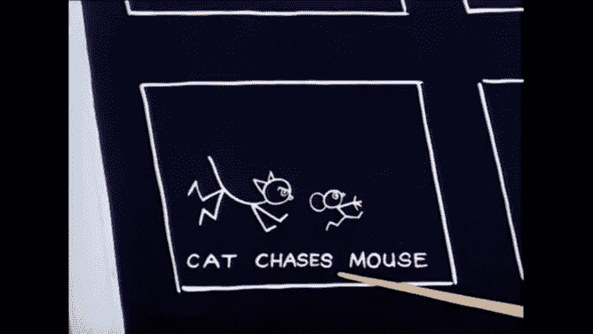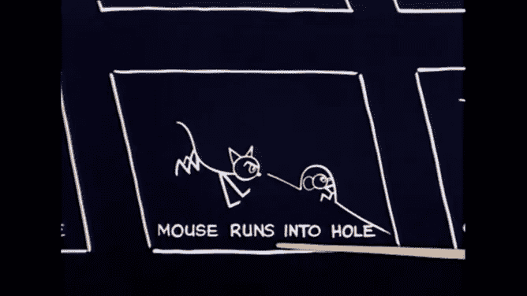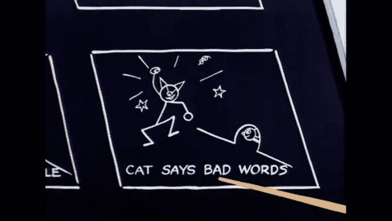

汤姆和杰瑞——玩

我们的迷你数据集看起来像这样，

因此，我们将使用上述数据，现在我们将开始预处理步骤。

1.  首先，我们需要将每个唯一的单词映射到一个整数中，然后将这个整数映射到一键编码中。

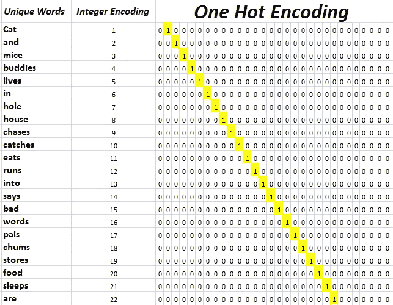

数据预处理

2.然后，一旦我们为每个单词创建了整数和一个热映射，现在我们将为训练创建批处理。

由于我们具有有限的数据并实现了迷你单词嵌入，我们将考虑具有 2 的**窗口大小的**跳格**模型(考虑相邻的 2 个单词作为目标)**，并在给定上下文单词(输入)的情况下预测目标单词。

参考下图来了解我们的 skip-gram 模型。


我们的训练批次

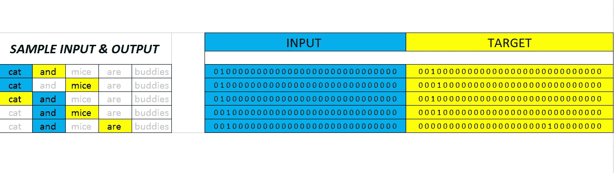

样本数据格式

上述批量准备的代码实现如下所示。

# 2.超参数选择和模型建立

既然我们已经完成了批处理的创建，现在让我们为训练构建一个简单的自动编码器类型的模型。简而言之，它是一个神经网络，将高维压缩到低维，然后解压缩到高维。

因此可以理解，较低的维度捕获了输入的重要特征，在我们的情况下，这是我们的 ***单词嵌入了目标单词的*** 。

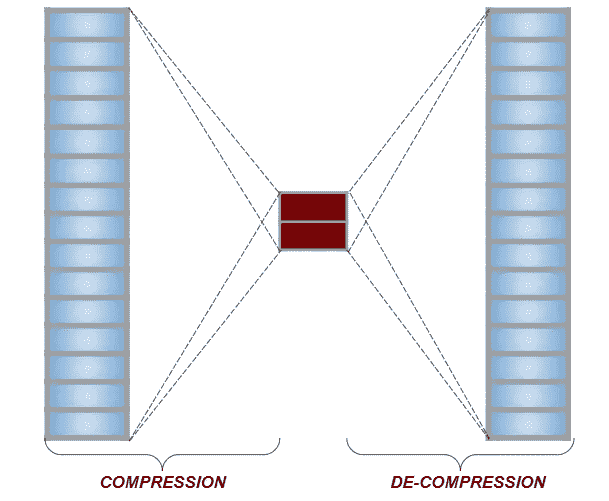

自动编码器设计

这里从上面的设计，我已经修改了我们的神经网络功能，以提供最终层(30D)的输出，以及中间层(2D) **【我们的单词嵌入】的输出。**

为了设计神经网络，我将使用 PyTorch 框架。

## 超参数选择:

1.  input_size = 30(输入和输出维度)
2.  hidden_size = 2(隐藏层尺寸)
3.  learning_rate = 0.01 (lr 用于权重优化)
4.  num_epochs = 5000(对整个数据训练模型的次数)

因此，对于上述规格，我已经在 Pytorch 中设计了模型。

请参见下面的代码实现。

现在让我们开始训练过程。

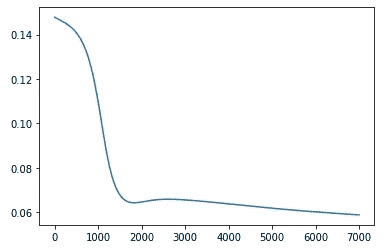

培训损失

损失图看起来很好，我们的模型不会过拟合或欠拟合。现在，让我们传递所有输入，并获得输入单词的 2D [ **单词嵌入** ](低维表示)，并绘制它们，以查看我们的模型是否已经学习了我们的数据语料库中的语义。如果你有更大的训练数据，你必须训练它更多的时期。

## 损失函数的选择(可选阅读) :

因为我们所有的向量都是一位热编码的，这意味着，在我们的输出中，我们有一个 30 个数组的向量，其中“1”表示索引词，“0”表示其他地方。

## 示例:

单词—猫

整数编码:1

一键编码:0 1 0 0 0 0 0 0 0 0 0 0 0 0 0 0 0 0 0 0 0 0 0 0 0 0 0 0 0 0 0 0 0 0 0 0

由于这是**而不是**多类或多标签分类，我们将使用 **BCELoss** (Pytorch)或**BinaryCrossEntropy**(Keras/tensor flow)作为我们的损失函数。

在最后一层，在输出之前，我使用了 **Softmax Activation** 函数，因为我们想比较输出(实际)和概率(预测)。

**SoftMax** — Soft(较低的值被软处理成较低的概率，而不是归零)，Max(较高的值被投影到较高的概率< 1)。

我经常搞不清楚是使用 Softmax 还是 sigmoid，其中输出 softmax 在总和为 1 时得分，Sigmoid 在 0-1 的范围内挤压输出。因此，我提供了一个代码片段供您考虑输出损失，我想用 softmax，因为它适合我。

## 使用 Softmax:

预测值→ (0.9，0.0，0.0)

预测+ SOFTMAX → (0.5515，0.2242，0.2242)

实际目标→(1.0，0.0，0.0)

损失值→ 0.36

```
m = nn.Softmax()
loss = nn.BCELoss()input = torch.tensor([0.9,0.0,0.0])
target = torch.tensor([1.0,0.0,0.0])
output = loss(m(input), target)print(input, m(input), target) 
print("Loss",output)### DISPLAYED OUTPUTS ###tensor([0.9000, 0.0000, 0.0000]) 
tensor([0.5515, 0.2242, 0.2242]) 
tensor([1., 0., 0.])Loss([0.36])
```

## 使用乙状结肠:

预测值→ (0.9，0.0，0.0)

预测+ SIGMOID → (0.7109，0.5000，0.5000)

实际目标→(1.0，0.0，0.0)

损失值→ 0.57

```
m = nn.Sigmoid()
loss = nn.BCELoss()input = torch.tensor([0.9,0.0,0.0])
target = torch.tensor([1.0,0.0,0.0])
output = loss(m(input), target)print(input, m(input), target) 
print("Loss",output)### DISPLAYED OUTPUTS ###tensor([0.9000, 0.0000, 0.0000]) 
tensor([0.7109, 0.5000, 0.5000]) 
tensor([1., 0., 0.])Loss([0.5758])
```

# 3.模型推理

这里，我们将传递语料库中的每个单词，并提取由模型学习的 2D 潜在表示(**单词嵌入**)。

## 比较图-训练与未训练模型:

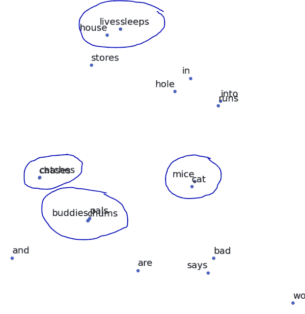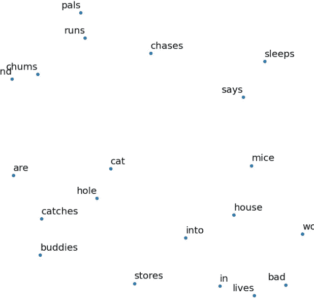

已训练模型与未训练模型的输出。

我们做到了，正如我们所料，我们可以看到单词**“Mice&Cat”**在嵌入维度上非常接近，这一特征是从数据语料库中学习的，因为它们一个接一个地出现得非常频繁。

此外，**“哥们、伙伴和密友”、** **“生活、睡眠&房子”和“捕捉、追逐”**这些词在嵌入维度上也更接近。

原因是那些加粗的单词之间带有某种语义。例如**“哥们、伙伴和密友”，**通常指相同的意思——朋友/伙伴，我们的模型捕捉到了这一点。

同样，我们知道汤姆(**猫**)和杰瑞(**老鼠**)这两个词经常出现，所以模型解释了它们之间的关系，并将它们投射到潜在维度的附近。

这正是 word2vec 模型内部在更大规模上发生的事情，但是它有不同的架构(具有不同窗口大小和多个目标单词的 CBOW 或 Skip-gram ),并且它是在大容量数据上训练的。

# **改进空间:**

## 1.改变模型的架构:

这个模型不能从大量的数据语料库中获取特征，所以我们需要改变模型的架构来完成这个任务。

在上面的实现中，我们对每个输入单词使用单个目标单词进行预测，但它可以像右图一样进行扩展，其中相同的神经网络可以用于对给定输入单词的多个目标单词进行预测，这使得模型可以捕捉数据集中的细微差别。

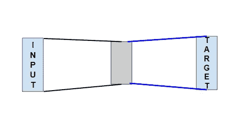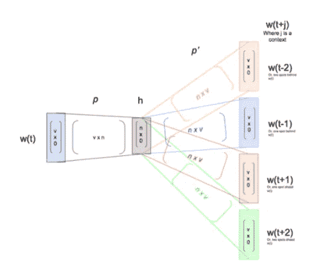

我们的旧建筑与新建筑，来源-作者

因为我希望这篇文章在媒体上的其他单词嵌入文章中简单而独特，所以我使用了单个目标单词预测模型，但现在如果你牢固地理解了基本概念，你可以很容易地理解其他文章。

## 2.子采样:

在上面的实现中，由于我们只有非常少的数据(Vocab size< 30), we converted each word into One-Hot Encodings of length 30, with the value 1 for the corresponding word and the rest of them 0\. Imagine we had 6 billion words to train and having applied the same concept would not be so useful. So one solution to minimize the issue is to do sub-sampling to remove the rare and frequent words.

In the corpus words such as ***“of，the，and，for，etc……”(停用词)*** )，所以没有为附近的词提供太多的上下文。由于我们感兴趣的是找到单词之间的语义，我们可以安全地丢弃它们，从而从数据中去除噪声，这反过来为我们提供了更高的准确性、更快的训练和更好的表示。这个过程被称为子采样。

再次，识别每个单词并手动删除它们是一项艰巨的任务，因此我们寻求概率的帮助，我们可以实际计算每个单词的概率，并设置一个阈值来考虑或丢弃它。

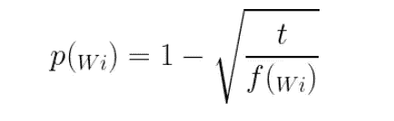

一个词的概率

其中，
T5 p(Wi)→该词被丢弃的概率
(如果 1 →丢弃，0.3→保留)

*t →阈值参数(比方说 0.001)
f(Wi) →一个词在总数据集中的出现频率(Wi)
一个词的出现频率=(该词在文档中出现的次数/文档中的总字数)。*

出于考虑，假设我们在文档中的总字数是 60，并且单词*(the，cat，floccinaucinihilipilification)*出现了(12，5，1)次。

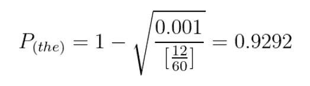

p(*“the”*)丢弃概率

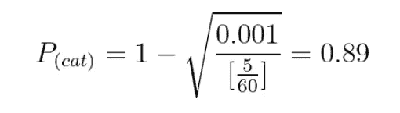

P( *“猫”*)丢弃概率

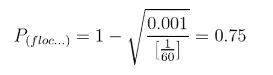

p(*“floccinaucinihililification”*)丢弃概率

因此，从上面的值，我们可以明智地设置，以抽样的话，位于概率 0.80-0.90。整体数值见图。

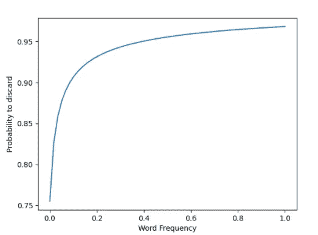

## 3.负采样:

在我们处理大型文本语料库的实时实现中，如果我们查看输出层，假设有 10，000 个编码的独热标签，即使我们只有一个真实示例(..0010000..)，这使得培训的效率非常低。因此，一种解决方法是只更新一小部分权重，其中我们更新正确标签和少量不正确标签的权重。这种技术被称为负采样，它已经在训练时用于 word2vec 模型。

我希望我能够为我们的迷你单词嵌入提供一些视觉上的理解，让我知道你在评论区的想法。

查看包含全部代码实现的笔记本，并随意破解它。

参见 GitHub 中的**，**

[](https://github.com/bala-codes/Mini_Word_Embeddings/blob/master/codes/Mini_Word_Embedding.ipynb) [## 巴拉码/迷你词嵌入

### permalink dissolve GitHub 是超过 5000 万开发人员的家园，他们一起工作来托管和审查代码，管理…

github.com](https://github.com/bala-codes/Mini_Word_Embeddings/blob/master/codes/Mini_Word_Embedding.ipynb) 

运行在 **Google Colab，**

[](https://colab.research.google.com/github/bala-codes/Mini_Word_Embeddings/blob/master/codes/Mini_Word_Embedding.ipynb) [## 谷歌联合实验室

### 编辑描述

colab.research.google.com](https://colab.research.google.com/github/bala-codes/Mini_Word_Embeddings/blob/master/codes/Mini_Word_Embedding.ipynb) 

或者如果你喜欢 **Kaggle** ，

[](https://www.kaggle.com/balakrishcodes/create-mini-word-embedding-from-scratch) [## 从头开始创建迷你单词嵌入

### 使用 Kaggle 笔记本探索和运行机器学习代码|使用来自非数据源的数据

www.kaggle.com](https://www.kaggle.com/balakrishcodes/create-mini-word-embedding-from-scratch) 

在那之前，下次见。

**文章作者:**

**BALAKRISHNAKUMAR V**