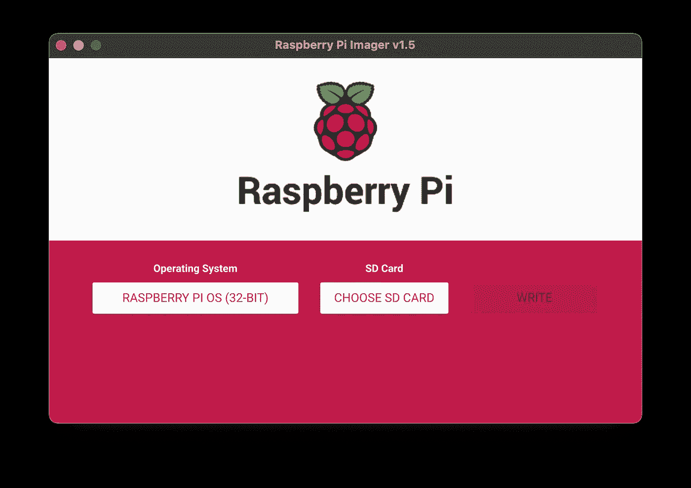

# 在 Raspberry Pi 上创建您的 NAS 数据库服务器

> 原文：<https://pub.towardsai.net/create-your-own-nas-on-raspberry-pi-6892025996cb?source=collection_archive---------2----------------------->


数据库，但我们需要把它放进树莓派里——照片由[扬·安东宁·科拉尔](https://unsplash.com/@jankolar?utm_source=medium&utm_medium=referral)在 [Unsplash](https://unsplash.com?utm_source=medium&utm_medium=referral) 上拍摄

## [数据科学](https://towardsai.net/p/category/data-science)、[物联网](https://towardsai.net/p/category/iot)、[技术](https://towardsai.net/p/category/technology)

## 带有 PostGIS 和时标的容器化 Postgres 服务器 b

网络附加存储(NAS)是一个集中的数据存储库，可由同一计算机网络中的其他设备访问。对于那些不熟悉它的人来说，可以把它想象成 Google Drive 或 dropbox，可以通过网络访问数据。由于其可访问性，NAS 是以数据库形式跨设备共享数据的最佳解决方案之一，无论是关系数据库还是非 SQL 数据库。

在这篇博客中，我们将介绍如何在 Raspberry Pi 上组装和设置您自己的 NAS。我们的数据库服务器将是 Docker 容器中的 Postgres 数据库，以确保可移植性和健壮性。我们还将使用 PostGIS 和 TimescaleDB 扩展 Postgres。PostGIS 将使我们能够有效地处理和存储地理空间数据，而 TimescaleDB 可以被视为 Postgres 上的时间序列专业知识。由于涵盖了 GIS 和时间序列，这种 NAS 应该可以满足我们对集中式数据库的大多数日常需求。

> 但是，我们为什么需要 NAS 呢？

## 个人动机

很长时间以来，我一直将数据保存为 pickle、平面文件，偶尔保存在本地数据库中。虽然这比较容易开始，但它很快就失去了控制，导致了三个主要问题:

*   重复数据占用了额外的空间
*   数据集中缺乏版本控制，这导致了各种不一致和不匹配
*   项目相互交叉引用，以访问相同的数据片段，从而绕过第一个点
*   数据只在我的桌面上可用，而在其他设备上不可用，这意味着我可能需要将数据提交给 Git，这是一个大禁忌

所有这些纠结都导致了难以想象的痛苦，尤其是当我不小心删除了一个很多人都在引用的个人项目文件夹时。几个月的工作付之东流。如果只有数据位于 NAS 中，上述所有问题都不会存在，而且更重要的是，可以避免挫折。

## 面向未来的动机

想象一下，你开始收集数据，无论是财务、天气、日历，还是智能家居传感器，如湿度传感器、温度传感器等。将它存储在平面文件中是不可伸缩的。您将无法高效、轻松地处理已有的数据。

然而，房间里仍然有一个大象:为什么不只是一个数据库托管在我的电脑上？公平点！事实上，如果你不介意让你的电脑全天候运行，这是一个可行的选择。但是 NAS 为您节省的是电费和与延长 PC 运行时间相关的维护成本。

> 那么我们有什么选择呢？

打包的 NAS 通常很贵，例如 [Synology](https://amzn.to/3pryeMN) ，但是它们有非常好的规格和配套软件，所以基本上，它们可以立即投入运行。插上硬盘和电源线和 viola！如果您对获得这些 NAS 解决方案感兴趣，请在这里查看。

> 但是当所有东西都是预先包装好的时候，有什么乐趣呢？

跳进食谱就像——来源:[吉菲](https://giphy.com/gifs/14uzPzKMOuVIPu)

## 硬件成分

*   树莓派 3B+: 我有一个 3B+型号，是我从另一个副业项目中退役的。虽然这是完全有能力推动我们正在建设的，随时可以用一个模型 4 交换一些额外的力量。链接到[车型 3B+](https://amzn.to/3ddb61L) 和[车型 4](https://amzn.to/3tVxQcG)
*   **保护壳(可选):**好的保护壳的两大优点(1)散热更好，(2)更美观。链接到[型号 2/3/3B+](https://amzn.to/37dWRGl) 和[型号 4](https://amzn.to/3rR3sOQ)
*   **Micro SD 卡:**只是用来启动 Pi 的，不需要很花哨。即使是普通的 16 GB 卡也足够了！记得检查你是否有连接到你的电脑的适配器，因为我们需要把操作系统刷新到卡上。链接到带有 SD 适配器的 [16GB 微型 SD 卡](https://amzn.to/3rTwopw)
*   **外部存储器:**这是存储实际数据的地方。我选择了 1TB 的外置硬盘，但也可以根据您的需求随意扩展！一般来说，我会避免 SSD，因为 HDD 会给你更好的性价比，而且 SSD 只允许有限数量的读写操作。如果你不介意通过额外的电缆工程，你也可以去与硬盘驱动器，可以提供更好的速度和性能！链接到 [1TB 外置硬盘](https://amzn.to/2Na5T05)和 [1TB 3.5 英寸硬盘](https://amzn.to/3rQ5j6z)

除上述之外，您还需要一些额外的电缆来为构建供电:

*   **电源线:** Raspberry Pi 需要 5V 3A 的电源连接，所以在开始组装之前，请确保你已经有了。如果您计划构建多个 Raspberry Pi，例如一个用于媒体中心，一个用于智能镜像，一个用于 VPN 服务器等，您可能需要一个 USB 集线器和单独的电缆。链接到[单电源电缆](https://www.amazon.co.uk/gp/product/B07PMJ9C1W/ref=as_li_qf_asin_il_tl?ie=UTF8&tag=louischan08-21&creative=6738&linkCode=as2&creativeASIN=B07PMJ9C1W&linkId=756aeea3ba894463ddb5e4726e720bc2)、 [USB 集线器](https://www.amazon.co.uk/gp/product/B00YSA0WI8/ref=as_li_qf_asin_il_tl?ie=UTF8&tag=louischan08-21&creative=6738&linkCode=as2&creativeASIN=B00YSA0WI8&linkId=d4baab6f0a5ef5e8d39beea587c95352)和[电缆包](https://www.amazon.co.uk/gp/product/B07Q2WJMQK/ref=as_li_qf_asin_il_tl?ie=UTF8&tag=louischan08-21&creative=6738&linkCode=as2&creativeASIN=B07Q2WJMQK&linkId=24c3f6435aac37d738a344a12187c166)
*   **局域网线缆:**用于连接局域网。我不建议在 NAS 上使用 WIFI，因为这会大大降低性能。链接到 [CAT7 LAN 电缆](https://amzn.to/2N9cE2n)
*   **SATA 线缆:**用于连接硬盘。在我的情况下，我去了一个带有 USB 电缆的外置硬盘，所以我不需要这个。
*   **HDMI 线、显示器和键盘:**这些对于 Pi 的第一次开机会很有用。

## UBUNTU 图像

我们需要首先准备图像。首先将 SD 卡插入您的电脑。Raspberry Pi 有一个成像仪，我们可以在这里下载[来更新我们的 SD 卡。](https://www.raspberrypi.org/software/)



Raspberry Pi 成像仪

在操作系统下，选择**其他通用 OS**>**Ubuntu**>**Ubuntu Server 20.10 64 Bit**。在 SD 卡下，选择您刚刚插入的卡。点击写，拿一杯咖啡，这可能需要一段时间！

完成后，在 SD 卡的根目录下创建一个名为 **ssh** 的空文件。这将允许我们在将来 SSH 到 Pi。现在，是时候组装硬件了。将 micro SD 卡插入您的 Raspberry Pi，连接硬盘、键盘、显示器和**，然后连接**电源线。

## 连接到您的 Pi

当提示输入密码时，只需键入`ubuntu`；您还会被要求更改密码。接下来，执行`ip a`。你应该可以在以`192.168.`开头的`eth0`下看到你的 IP 地址。在我的案例中，IP 是`192.168.1.100`。现在尝试使用`ssh ubuntu@192.168.1.100`从 PC SSH 到您的 Pi。当出现关于`ECDSA key fingerprint`的提示时，键入`yes`，然后尝试使用新密码登录。如果成功了，你应该得到这样的问候:

```
Welcome to Ubuntu 20.10 (GNU/Linux 5.8.0-1006-raspi aarch64)* Documentation:  https://help.ubuntu.com* Management:     https://landscape.canonical.com* Support:        https://ubuntu.com/advantageSystem information as of Sun Feb 14 00:13:59 UTC 2021System load:              0.03Usage of /:               23.8% of 28.98GBMemory usage:             43%Swap usage:               0%Temperature:              52.6 CProcesses:                165Users logged in:          1IPv4 address for eth0:    192.168.1.100
```

如果您知道如何为您的 Pi 分配一个静态 IP，现在是在您的路由器上分配与您已获得的 IP 完全相同的 IP 的最佳时机。拥有静态 IP 意味着当连接到路由器时，您的 Pi 将始终拥有相同的 IP，这样，当动态 IP 租约到期或您需要重新启动 Pi 时，您就不必时不时地检查路由器是否有新的 IP。您应该能够通过浏览器浏览`192.168.1.1`来访问您的路由器。一旦您设置了静态 IP，让我们尝试重新启动 Pi

```
$ sudo reboot now
```

给它几分钟时间，并尝试使用与以前相同的 IP 进行 SSH。如果成功，那么您已经成功分配了静态 IP。否则，请查看路由器文档，了解如何分配静态 IP。

## 设置您的 Pi

现在我们可以 SSH 到 Pi，我们不再需要显示器和键盘了。在 SSH 会话中，让我们从更新 Pi 开始:

```
$ sudo apt update && sudo apt full-upgrade
$ sudo usermod -aG sudo ubuntu
$ sudo whoami# this should print root
```

下一步是检查我们的外部硬盘的文件系统。从跑步开始

```
$ sudo lsblk -o NAME,FSTYPE,SIZE,MOUNTPOINTNAME        FSTYPE SIZE   MOUNTPOINT        
loop0              48.8M  /snap/core18/1888 
loop1              48.9M  /snap/core18/1990 
loop2              61M    /snap/lxd/17938 
loop3              62.9M  /snap/lxd/19390 
loop4              27M    /snap/snapd/11043 
loop5              26.9M  /snap/snapd/9730 
sda                931.5G 
└─sda1      ntfs   931.5G                   
mmcblk0            29.8G 
├─mmcblk0p1 vfat   256M   /boot/firmware    
└─mmcblk0p2 ext4   29.5G  / writable
```

我们可以在`sda`(存储设备 A 的简称)下看到我的 1TB HDD。如果`FSTYPE`如果`ntfs`那么您需要将文件系统更改为`ext4`(一个原生的 Linux 文件系统)以确保 Postgres 可以在您的硬盘上顺利运行:

> 注:这将删除硬盘上的所有数据。如果你用的是 Windows 桌面，把它换成 ext4 也意味着你不能再把硬盘插到你的 Windows 机器上了。

```
$ sudo mkfs.ext4 /dev/sda1
```

完成后，再次检查文件系统:

```
$ sudo lsblk -o NAME,FSTYPE,SIZE,MOUNTPOINTNAME        FSTYPE SIZE   MOUNTPOINT        
loop0              48.8M  /snap/core18/1888 
loop1              48.9M  /snap/core18/1990 
loop2              61M    /snap/lxd/17938 
loop3              62.9M  /snap/lxd/19390 
loop4              27M    /snap/snapd/11043 
loop5              26.9M  /snap/snapd/9730 
sda                931.5G 
└─sda1      ext4   931.5G                   
mmcblk0            29.8G 
├─mmcblk0p1 vfat   256M   /boot/firmware    
└─mmcblk0p2 ext4   29.5G  / writable
```

文件系统排序后，让我们将 HDD 安装到 Pi，以便 Pi 和访问驱动器。首先创建一个目标文件夹，作为存储设备的挂载点。这种情况下使用的挂载点名称是`postgres`。您可以指定自己选择的名称:

```
$ sudo mkdir /mnt/postgres
```

通过列出以下内容来验证存储设备是否已成功装载:

```
$ ls /mnt/postgres
```

更改驱动器的权限，以便我们对其进行写入:

```
$ sudo chown -R $USER:$USER ~/postgres
```

## 设置 Docker

如果我们需要将 NAS 迁移到其他地方，我们将使用 Docker 来设置我们的数据库，以确保环境是可移植的，并且更易于调试。

```
$ curl -fsSL https://get.docker.com -o get-docker.sh
$ sudo sh get-docker.sh
```

确保`ubuntu`是`docker`用户组的一部分，这样当我们需要运行`docker`命令时，就不需要每次都使用`sudo`

```
$ sudo usermod -aG docker ubuntu
$ sudo reboot now
```

SSH 返回到 Pi，并验证您可以运行以下内容:

```
$ docker run hello-world Unable to find image 'hello-world:latest' locally
latest: Pulling from library/hello-world
256ab8fe8778: Pull complete 
Digest: sha256:95ddb6c31407e84e91a986b004aee40975cb0bda14b5949f6faac5d2deadb4b9
Status: Downloaded newer image for hello-world:latestHello from Docker!
This message shows that your installation appears to be working correctly.To generate this message, Docker took the following steps:
 1\. The Docker client contacted the Docker daemon.
 2\. The Docker daemon pulled the "hello-world" image from the Docker Hub.
    (arm64v8)
 3\. The Docker daemon created a new container from that image which runs the
    executable that produces the output you are currently reading.
 4\. The Docker daemon streamed that output to the Docker client, which sent it
    to your terminal.To try something more ambitious, you can run an Ubuntu container with:
 $ docker run -it ubuntu bashShare images, automate workflows, and more with a free Docker ID:
 [https://hub.docker.com/](https://hub.docker.com/)For more examples and ideas, visit:
 [https://docs.docker.com/get-started/](https://docs.docker.com/get-started/)
```

## **带 PostGIS 的 Postgres&时标 DB**

作为本教程的一部分，我们将使用 PostGIS(任何地理空间分析的基本工具)和 TimescaleDB(任何时间序列数据的基本工具)来设置我们的 Postgres 服务器。幸运的是，Eddie 有一个包含 Docker 映像的[存储库](https://github.com/dekiesel/arm7v32_timescaledb)，其中包含所有关键组件，并且是为像我们的 Pi 这样的 ARM 芯片定制的。向埃迪致敬！

让我们定义我们自己的 Postgres 配置文件来传递给 Eddie 的映像:

```
$ cd /mnt/postgres
$ mkdir data
$ vim .env
```

在 vim 的终极迷宫中，键入:

```
POSTGRES_PASSWORD=password
```

要退出 vim，按下`Esc`，然后按下`Shift + Z + Z`。

现在让我们试着打开容器:

```
docker run --name pi-postgres -p 5432:5432 --env-file .env -v data:/var/lib/postgresql/data dekiesel/timescaledb-postgis:1.7.4-pg12
```

如果您能看到这条消息，那么我们就快到了:

```
LOG:  database system is ready to accept connections
```

现在在你的电脑上打开另一个终端。在不进入您的 Pi 的情况下，尝试:

> 注意:您需要在本地安装 Postgres 才能运行该行。如果您没有 Postgres，请遵循此处的说明。

```
$ psql -h pi.postgres -p 5432 -U postgres postgres
```

如果它提示输入密码，那么我们只需要返回 Pi 再做一件事！

## TMUX:会议万岁

为了完成这个难题，我们将从 Tmux 运行 docker 容器。对于那些不熟悉它的人来说，Tmux 允许在一个窗口中同时访问多个终端会话。Tmux 还允许远程会话保持活动状态，这样即使我们与 Pi 断开连接，我们仍然能够使用`tmux attach`访问同一个会话，否则这是不可能的。保持会话活动使我们能够更容易地调试和监控后端。为此，运行以下命令:

```
$ tmux
$ docker stop pi-postgres
$ docker rm pi-postgres
$ docker run --name pi-postgres -p 5432:5432 --env-file .env -v data:/var/lib/postgresql/data dekiesel/timescaledb-postgis:1.7.4-pg12
```

要从 Tmux 会话中分离，请运行`tmux detach`。这不会停止容器，只是在视觉上隐藏了终端会话。要重新连接到会话，请尝试`tmux attach`。你也可以尝试断开 SSH，重新 SSH，尝试`tmux attach`看看容器是否还在运行。

瞧啊。这就是 Raspberry Pi 上的 NAS Postgres 服务器，带有 PostGIS 和 TimescaleDB。PostGIS 和 TimescaleDB 应该可以满足我们的大部分需求，但是您可以随时使用 docker 容器，并向您的堆栈中添加新的组件。

这是这个博客的内容。希望你觉得博客或代码有用！如果我错过了什么，或者如果你有任何问题，请随时回复或 pm。如果你想了解更多关于 Python、数据科学或机器学习的知识，你可能想看看这些帖子:

*   [神经网络初始化的 3 个常见问题](/3-common-problems-with-neural-network-initialisation-5e6cacfcd8e6)
*   [谷歌的 RFA:近似于变形金刚中的 Softmax 注意力机制](https://towardsdatascience.com/google-deepminds-rfa-approximating-softmax-attention-mechanism-in-transformers-d685345bbc18)
*   [改进数据科学工作流程的 7 种简单方法](https://towardsdatascience.com/7-easy-ways-for-improving-your-data-science-workflow-b2da81ea3b2)
*   [熊猫数据帧上的高效条件逻辑](https://towardsdatascience.com/efficient-implementation-of-conditional-logic-on-pandas-dataframes-4afa61eb7fce)
*   [常见 Python 数据结构的内存效率](https://towardsdatascience.com/memory-efficiency-of-common-python-data-structures-88f0f720421)
*   [与 Python 并行](https://towardsdatascience.com/parallelism-with-python-part-1-196f0458ca14)
*   [数据科学的基本 Jupyter 扩展设置](https://towardsdatascience.com/cookiecutter-plugin-for-jupyter-easily-organise-your-data-science-environment-a56f83140f72)
*   [Python 中高效的根搜索算法](https://towardsdatascience.com/mastering-root-searching-algorithms-in-python-7120c335a2a8)

如果你想了解更多关于将机器学习应用于投资的知识，这里有一些你可能想看看的其他帖子:

*   [Python 中交易策略优化的遗传算法](https://medium.com/towards-artificial-intelligence/genetic-algorithm-for-trading-strategy-optimization-in-python-614eb660990d)
*   [遗传算法——停止过度拟合交易策略](https://medium.com/towards-artificial-intelligence/genetic-algorithm-stop-overfitting-trading-strategies-5df671d5cde1)
*   [人工神经网络选股推荐系统](https://medium.com/towards-artificial-intelligence/ann-recommendation-system-for-stock-selection-c9751a3a0520)

[](https://www.linkedin.com/in/louis-chan-b55b9287) [## Louis Chan—FTI Consulting | LinkedIn 数据科学总监

### 雄心勃勃的，好奇的和有创造力的个人，对分支知识和知识之间的相互联系有强烈的信念

www.linkedin.com](https://www.linkedin.com/in/louis-chan-b55b9287) [](https://www.buymeacoffee.com/louischan)

> 声明:如果您通过博客中的链接购买零件，我们将不胜感激。但是如果你不习惯使用这些链接，你可以自己在亚马逊上用关键词搜索。