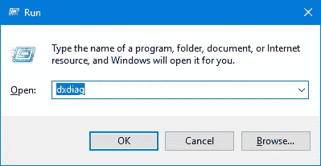
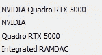
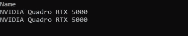
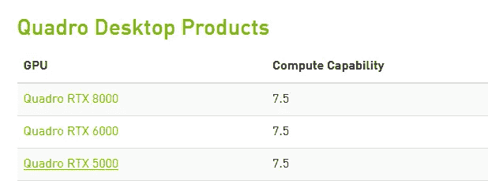
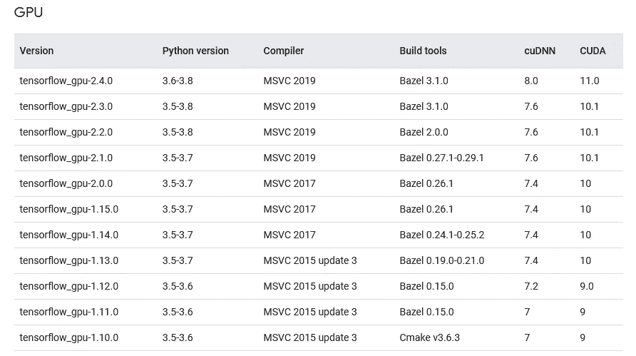
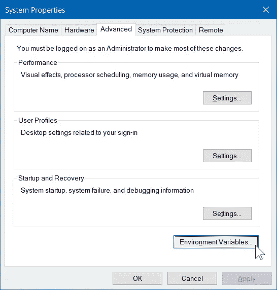
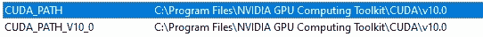
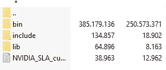
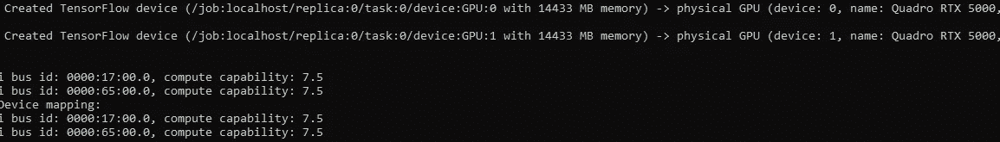

# 使用 TensorFlow GPU 创建深度学习环境

> 原文：<https://pub.towardsai.net/creating-a-deep-learning-environment-with-tensorflow-gpu-c16980ed1f67?source=collection_archive---------3----------------------->

## [深度学习](https://towardsai.net/p/category/machine-learning/deep-learning)

嗨！在本文中，我们将讨论如何为我们的机器创建深度学习环境。在开始这篇文章之前，我将给出关于我使用的操作系统和图形处理器的信息。所以我们开始吧！

由[克里斯蒂安·威迪格](https://unsplash.com/@christianw?utm_source=medium&utm_medium=referral)在 [Unsplash](https://unsplash.com?utm_source=medium&utm_medium=referral) 上拍摄的照片

我正在使用的机器使用 Windows 10 Pro 作为操作系统。如果你想学习你的显卡的特性，你可以通过输入 dxdiag 而不是搜索来学习你的显卡的特性。

⚙️**OS:**windows 10 pro
⚙️**cuda 工具包:**10
⚙️**cud nn:**7.4
⚙️**tensor flow GPU:**1 . 14 . 0
⚙️**keras:**2 . 2 . 5

**第一步:获取显卡信息**

图像由[参考文献【1】](https://www.top-password.com/blog/how-to-run-directx-diagnostic-tool-in-windows-10/)

作者图片

如果您愿意，您可以通过将下面的代码写入终端，在短时间内学会这一步。

然后我们需要去 NVIDIA 的网站进行必要的下载。在输出中，您将看到图形卡的名称，如下图所示。

作者图片

**步骤 2:检查图形处理器**

在[https://developer.nvidia.com/cuda-gpus#collapse4](https://developer.nvidia.com/cuda-gpus#collapse4)确定适合您机器的处理器。例如，在下图中，我们通过检查我积极工作的机器的处理器，了解了处理能力。

控制夸德罗 RTX 5000 处理器

**第三步:安装 CUDA 工具包和 cuDNN 工具**

现在我们需要在这一步非常小心地行动。我们将需要安装 CUDA 和 cuDNN 工具，它与我们将使用的 TensorFlow 版本相匹配。在此警告大家，如果下载不同版本，会遇到很多错误。

[来源【3】](https://www.tensorflow.org/install/source_windows)

我最初安装了 **tensorflow-gpu==1.15.0** ，因为我与 TensorFlow 2.x 版本有很多冲突。然而，我在运行 Mask RCNN 时遇到了几个版本冲突。在这篇文章中，我纠正了错误。如果您严格按照这些步骤操作，您的代码将不会出错。

💎 **tensorflow-gpu==1.14.0** 所需的编译显示 **cuDNN** 的 **7.4** 和 **CUDA 工具包**的版本 **10** 。

要访问 cuDNN 版本，请访问[链接](https://developer.nvidia.com/rdp/cudnn-archive)。

CUDA 10.0 的兼容 cuDNN 版本

👉您可以点击[链接](https://developer.nvidia.com/cuda-10.0-download-archive?target_os=Windows&target_arch=x86_64&target_version=10&target_type=exelocal)下载所选版本。

安装完这些工具后，我们需要将它们添加到 path 变量中。

[图像来源](https://www.architectryan.com/2018/08/31/how-to-change-environment-variables-on-windows-10/)

CUDA 路径设置

如果它没有作为**路径变量**添加，您需要检查这些设置。控制系统环境变量是非常重要的🧷

第四步:创建虚拟环境

此外，由于我使用了 Anaconda 提示符，所以我用 conda 创建了虚拟环境。然后我们用 activate 命令进入虚拟环境。

**第五步:安装 Tensorflow-gpu**

然后我们去 tensorflow-gpu 设置。在这个阶段，让我们注意使用 conda 安装，而不是 pip。这样做的原因是您在安装时得到了您的批准。我们也将看到 CUDA 和 cuDNN 版本安装，而给予这一批准。

**第五步:cuDNN 和 CUDA 文件交换** ⛓

当我们打开我们下载的 cuDNN 归档文件时，我们将看到以下文件夹。

作者图片

我们将这些文件夹复制到安装 CUDA 的文件夹中。比如我把它复制到了***C:\ Program Files \ NVIDIA GPU Computing Toolkit \ CUDA \ v 10.0***中的文件夹。

在所有这些阶段之后，必须安装 TensorFlow GPU。如果您愿意，可以使用以下命令控制终端。对于这一点，先别忘了写 python 到终端！

物理 GPU 控制

另外我想提出一个警告。如果您像我一样得到由 **Skimage** 库的版本引起的警告或错误，运行下面的命令。

🔮经过所有这些阶段，你的深度学习环境将毫无问题地工作！祝你健康美好的日子。

🎉*你也可以关注我*[***GitHub***](https://github.com/BuseYaren)*[***YouTube***](https://www.youtube.com/channel/UCzAODG3wgdKtRov8VvyXvtw)*和*[***Twitter***](https://twitter.com/BuseYarenTekin)*占更多内容！**

# *参考*

1.  *[https://en.wikipedia.org/wiki/DxDiag](https://en.wikipedia.org/wiki/DxDiag)*
2.  *[https://towards data science . com/tensor flow-GPU-installation-made-easy-use-conda-instead-of-pip-52e 5249374 BC](https://towardsdatascience.com/tensorflow-gpu-installation-made-easy-use-conda-instead-of-pip-52e5249374bc)*
3.  *[https://www.tensorflow.org/install/source_windows](https://www.tensorflow.org/install/source_windows)*
4.  *[https://www.tensorflow.org/](https://www.tensorflow.org/)*
5.  *[https://developer.nvidia.com/cuda-toolkit-archive](https://developer.nvidia.com/cuda-toolkit-archive)*
6.  *[https://www . architectryan . com/2018/08/31/how-to-change-environment-variables-on-windows-10/](https://www.architectryan.com/2018/08/31/how-to-change-environment-variables-on-windows-10/)*