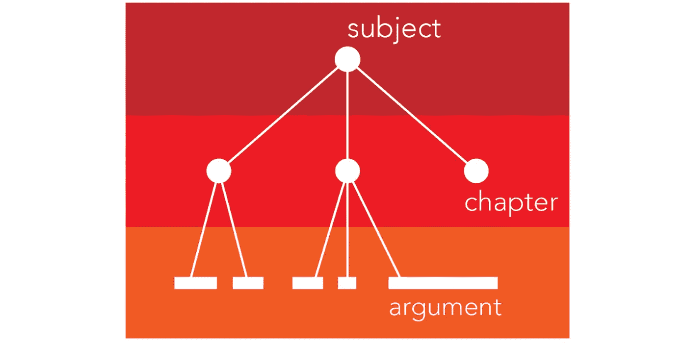
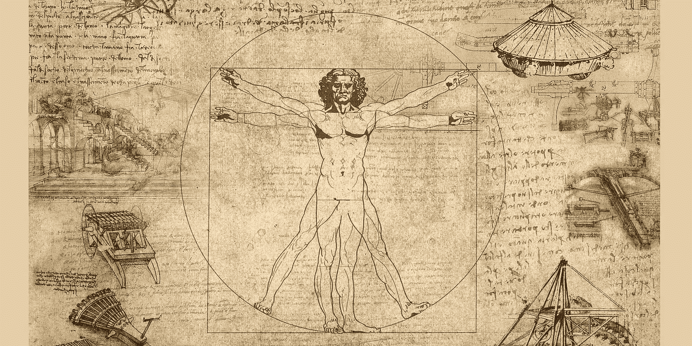

# 创建一个公式来评估知识

> 原文：<https://pub.towardsai.net/creating-a-formula-to-value-knowledge-51974b07e7ff?source=collection_archive---------4----------------------->

## [数学](https://towardsai.net/p/category/mathematics)

## 创造性地尝试创造一个公式来评估你所研究的事物

在这篇文章中，我将试着分离出一些变量，综合考虑这些变量，就可以计算出你通过学习获得的任何信息的价值。我将使用术语**参数**来指代你通过学习获得的任何数据分区。

## 知识树

一个主题的知识树，分为多个章节，每个章节都有多个原子论点

这意味着信息是按主题组织的。你可能正在学习数学、金融、计算机科学、编程……每一门学科都被组织成层次分明的子组件。在最新的水平上，我们拥有我可以定义为信息的东西:**非固定长度的知识的最小原子组成部分，足以构成一个学科的定义分区。**

比如统计学(学科)，正态分布可以认为是一个论点。导数、极限、积分、函数也是如此……每个学科都有无数位于知识树不同层次的论点。

每个参数必须是:

*   **非固定长度**(例如，积分可以比方程式长)
*   **原子**(不能再分成更小的组件:正态分布可能需要其他先决条件参数，但这是一个不能再小的参数)

# 有些知识比其他知识更重要

由于各种原因，论点彼此不同:一些需要更长的时间来学习，一些需要更多的前提论点来达到他们的水平，另一些被认为更重要，因为它们更受欢迎。

我们如何给单个论点赋值，并最终给整个知识树赋值？首先，我需要确定什么是最重要的变量，可以作为每个论点的指标，与主题无关。

达芬奇的笔记本|来源:[日常工作原理](https://www.howitworksdaily.com/da-vincis-amazing-notebook-inventions/)

## 时间

*   学习+编码时间

是时候学习这个论点了。这受到你目前的知识和掌握程度、智商、学习该论点的先决条件以及许多其他变量的影响。编码时间是将一个参数转换成注释并封装到我的注释数据库中的必要时间。

*   保留时间

这个论点在你手中的时间。没过多久，知识就开始褪色了。

*   折旧时间

是时候让这个论点变得过时并被一个更新的版本所取代了。这在数学中几乎从未发生过，但在编程中却很常见。他们都是两个主题，因此论点的概念可以适用于两者。

*   重新学习时间

当忘记时，是时候再次学习该论点/章节了。第二次，如果有笔记帮助我们，就容易得多，也快得多。但这仍然需要我们一些时间。

## 市场价值

所有的论点都有市场价值。提倡不应该有任何市场价值的知识就像把百叶窗放在你的眼前，假装问题不存在。

*   电流需量

关于当前市场状态的论点的市场价值。

*   预期需求

几年后我的论点会值多少钱？知识是多方面的，市场的需求也是多方面的。学生们应该在专攻一门学科之前问自己同样的问题。

*   预期复杂性降低

例如，人工智能每年都变得越来越容易:为什么现在研究它在未来会更容易？

## 适应现有的知识

关于知识(争论)的一个有趣的事实是，光靠知识几乎是没有意义的。懂 5%的会计、编程或数学几乎没用，尤其是在其他人眼里。

*   整体价值

如果你能把一件作品添加到你已经知道的主题中，它就更有价值。一个主题中所有论点的总和比它们各自的总和更有价值。

*   掌握该科目的预期时间

只有掌握了整个主题才有价值。声称自己是 80%的程序员并不能让你成为专家，只是在招聘者的眼中不受欢迎。只有当你能声称对某个主题有全面的专业知识时，这才变得有价值。

# 分析变量的因素

这些是我在学习一门新学科时需要考虑的一些变量，或者只是一些论点。例如，在编程这个不幸的例子中，主题太大，变化太快，以至于不能 100%掌握。这同样适用于数学、医学、历史……我们需要做出明智的选择，在一门学科中学习哪些章节，而不仅仅是学科本身。

例如，在编程中，章节(主题本身的划分)可以表示为库。可以学习的库数不胜数。例如，要构建人工智能，可以选择 fastai 和 TensorFlow，它们互为替代，都是神经网络库。然而，学习任何一门课程都很费时间。编程有各种用途的库，用来构建东西，分析数据，挖掘数据…

到目前为止，我只估计了一些变量，这是我在接触新事物时通常会考虑的变量，只是为了了解我的时间是否值得。正确的方法应该是提出大量与知识相关的变量，然后分析结果，最后得出有限数量的非任意维度。

在我的例子中，我只选择了 3 个。

# 结论

我的理解是，所有的知识都可以归结为 3 个主要变量:时间、市场价值、适合度。拥有多个维度可以帮助我们更好地选择如何处理一个新的主题，并知道这是否是我们的正确选择。然而，我确信还有其他变量可以考虑。对一些人来说，研究一门学科是令人愉快的，并有其他目的而不是市场价值。然而，我是一个更实际的人，我认为这是学习某些东西的第一动力。

你会增加哪些维度？