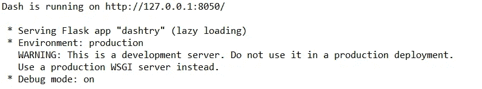
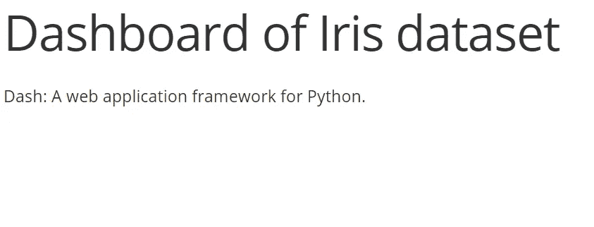
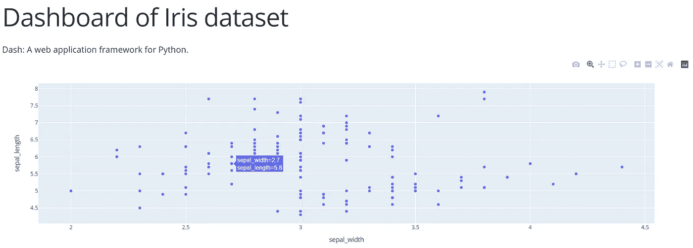
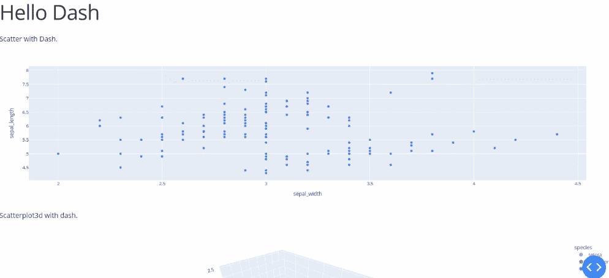
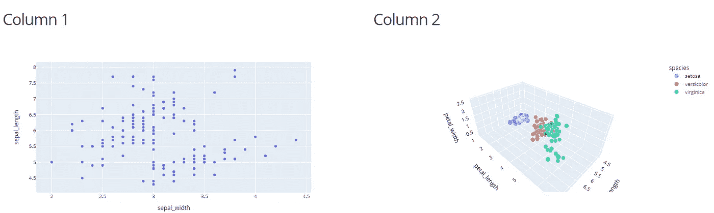
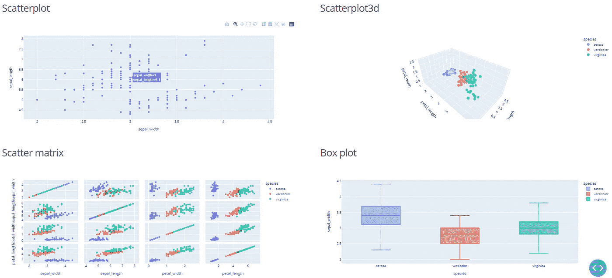

# 使用 Plotly Express 和 Dash 创建令人惊叹的交互式仪表盘

> 原文：<https://pub.towardsai.net/creating-a-stunning-interactive-dashboard-with-plotly-express-and-dash-7e3dddcb955?source=collection_archive---------0----------------------->

## [数据可视化](https://towardsai.net/p/category/data-visualization)

## 是时候构建您的第一个 web 分析应用程序了

由[米利安·耶西耶](https://unsplash.com/@mjessier)在 [Unsplash](https://unsplash.com/photos/eveI7MOcSmw) 上拍摄的照片

在我的大部分数据科学硕士课程中，图表都被低估了，被放在了角落里。另一方面，我在实习期间开始明白数据可视化的重要性。起初，它们看起来真的很无聊，但同时，它们让你获得你只看原始数据永远也不会知道的知识。这是您在修改数据集和应用 ML 算法之前需要检查的第一件事。它会伴随你寻找真理。

在我之前的[文章](/matplotlib-is-dead-long-life-to-plotly-express-e1671dce0d18)中，我介绍了一个产生交互式可视化的库。你能猜到我在说什么吗？是 **Plotly Express** 。通过这个软件包，你可以获得美丽的情节，在这里你可以看到每一个简单的移动鼠标或放大你感兴趣的图像部分的细节。但是单独一个图在你的 Jupiter 笔记本上占了很大的空间，有时你会更喜欢在一个单独的页面上查看同一数据集的更多图。因此，需要一个仪表板。

幸运的是，还有 **Dash** ，一个允许使用 Python 构建 web 界面的开源软件。这些网络应用在网络浏览器中可视化，就像 Chrome 一样。不需要 Java、HTML 或 CSS。但是我认为一些关于 HTML 的**基础知识对于理解 Python 中的部分代码是有用的。我还写了一篇关于它的[帖子](https://betterprogramming.pub/understanding-html-basics-for-web-scraping-ae351ee0b3f9)，对这种标记语言有一个概述/刷新。**

# 目录:

1.  [**要求**](#3993)
2.  [**库和数据集**](#c994)
3.  [**初始化 app**](#633a)
4.  [**一个情节的 Web app**](#7a43)
5.  [**页面上的三个地块**](#85f2)
6.  [**两个地块并排**](#47b9)
7.  [**显示带回调的地块**](#294b)
8.  [**汇总**](#7700)

# 1.要求

*   在使用命令`pip install <package-name>`开始本教程之前，您需要安装**熊猫**、**plottly、**和 **dash** 。
*   **用所有代码创建一个 file.py** 。我也试着用了木星笔记本，但是好像不行。但是既然官网上的 [dash 教程](https://dash.plotly.com/layout)建议了格式。py，我宁愿留着它。

# 2.库和数据集

完成所需的安装后，我们可以导入以下库:

库 dash 包含了 python 类以及 web 应用程序的所有组件，比如`dash_html_components`和`dash_core_components`。

`dash_html_components`提供 HTML 标签的组件，而`dash_core_components`HTML 标签的组件是通过 React.js 库用 JavaScript、HTML、CSS 生成的。

我们还导入了 Plotly express 和 pandas 库。

之后，我们导入著名的虹膜数据集，就像我写的关于 Plotly Express 的教程一样。我的目的是使用 Dash 将之前获得的情节组合成一个独特的页面。

# 3.初始化应用程序

正如你可以从段落的标题中推断出的，我们通过初始化开始构建应用程序。

换句话说，应用程序使用定制的 CSS 样式表([https://codepen.io/chriddyp/pen/bWLwgP.css](https://codepen.io/chriddyp/pen/bWLwgP.css'))来修改元素的默认样式。

# 5.只有一个图的 Web 应用程序

让我们开始展示代码，产生一个只有两句话，没有任何情节的网页。我们指定应用程序中需要的布局:

当您运行代码时，应该会返回此输出。当它出现时，你应该在你的网络浏览器中复制 [http://127.0.0.1:8050/](http://127.0.0.1:8050/) ，你会看到这样的内容:

您可以观察到代码行`html.H1(children=''Dashboard of Iris dataset'')`类似于在 HTML 中编写`<h1>Dashboard of Iris dataset</h1>`，其中标签< h1 >通常用于标题。

HTML 中对应于`
Dashboard of Iris dataset
`的`html.Div(children=''Dash: A web application framework for Python'')`也是如此。

如果我们想把剧情添加到 app 中，就应该添加组件`dcc.Graph`。在定义布局之前，我们首先使用 Plotly express 库创建一个散点图。我们把图传入`dcc.Graph`后

上面是修改代码后应该获得的仪表板。

# 6.页面上的三个情节

在前面的段落中，我在页面上只显示了一个情节，从最简单的情况开始。但是如您所知，仪表板通常用于包含多个图。出于这个原因，让我们在页面上放三个图，每行一个图。

现在，可以在一个独特的页面上观察这三个情节了！但同时，每个情节在应用程序中占据了很大的空间。一排两块地不是更好吗？

# 7.页面内同一行中的两个图

现在，我想并排展示两个图。用

标签定义两个块是可能的。在每个块中，我们指定类名“六列”，这是宽度，而不是要显示的图的数量。包含这两个图形的行的类名是“row”。

我们也可以用同样的方法添加两个额外的图:

这样，我们有两行和两列，其中每行将包含两个图。

# 7.用回调显示绘图

在前面的段落中，我展示了如何使用`app.layout`，它提供了应用程序的层次结构，示例大多是静态的。现在，我们的目标是构建一个动态的应用程序，您可以在其中更改绘图的 x 变量和 y 变量。这可以通过`callback`函数实现，它允许改变输入组件的属性。让我们开始一个例子:

在本例中，当输入属性的输入变量发生变化时，我们可以使用函数 update_graph。`@app.callback`装饰器描述了应用程序接口的输入和输出。我们将 id 为“x 轴列”和“y 轴列”的组件的“值”属性作为输入，而输出是图形的“图形”属性。

# 8.总结:

我做了一个总结来快速查看我们在前面段落中创建的应用程序:

*   示例 1:一个地块

*   示例 2:网页中的三个绘图

*   示例 3:并排的两个图

*   示例 4:使用回调显示绘图

# 最终想法:

不错的结果，你不觉得吗？我只展示了最简单的例子，只关注布局，但是可以添加其他高级属性。官网上的 [dash 教程](https://dash.plotly.com/layout)里有很多例子。我希望这个指南能帮助你理解如何应用 dash 和 Plotly express 来创建一个仪表板。起初，这似乎很难，但经过一些尝试后，它真的很直观。感谢阅读。祝您愉快！

你喜欢我的文章吗？ [*成为会员*](https://eugenia-anello.medium.com/membership) *每天无限获取数据科学新帖！这是一种间接的支持我的方式，不会给你带来任何额外的费用。如果您已经是会员，* [*订阅*](https://eugenia-anello.medium.com/subscribe) *每当我发布新的数据科学和 python 指南时，您都可以收到电子邮件！*