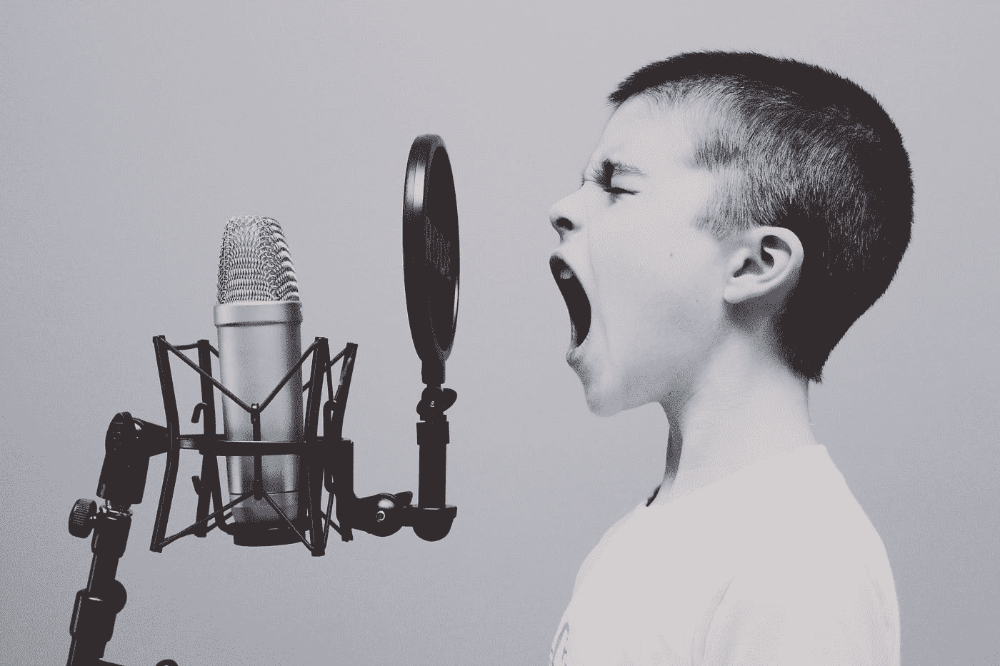
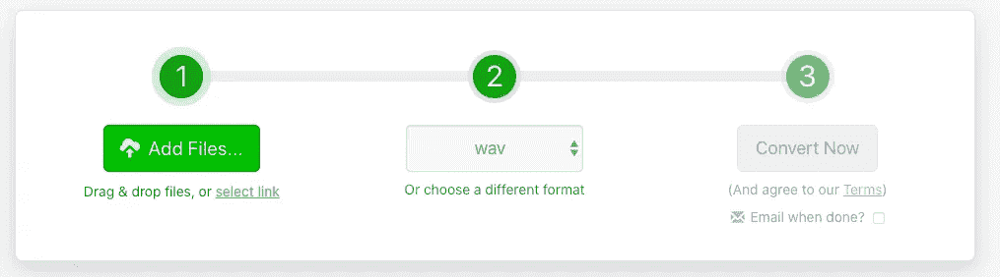
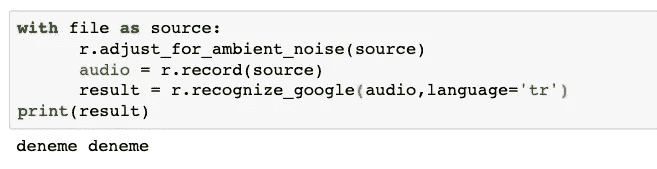
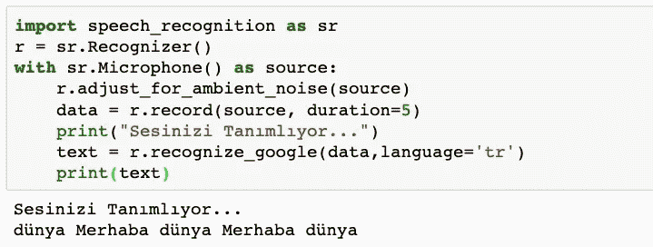
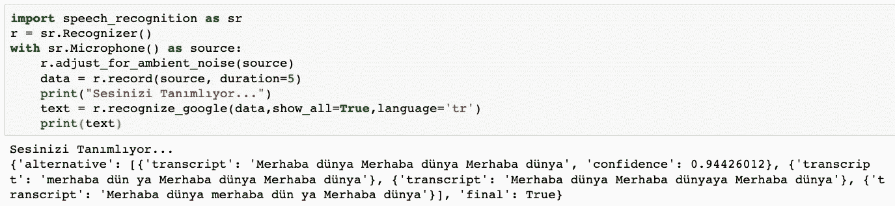

# 用 Python 创建语音识别应用程序

> 原文：<https://pub.towardsai.net/creating-a-voice-recognition-application-with-python-57d8c3e55256?source=collection_archive---------0----------------------->

## 编程；编排

## 用 Python 把你的音频文件和演讲转换成文本



杰森·罗斯韦尔在 [Unsplash](https://unsplash.com/?utm_source=medium&utm_medium=referral) 上的照片

# 什么是语音识别？

它被称为**语音**或**语音识别**。它包括通过采样、人工神经网络、机器学习使音频信号有意义。

我们非常了解这些做法。苹果 Siri，谷歌助手，亚马逊 Alexa 等应用程序在我们大多数人身上都有。这些应用当然是遥遥领先的，并且有严肃的工程背景。除了使声音信号在其应用中有意义之外，还使用 NLP - **自然语言处理**算法。

**语音转文本，**语音转文本**的过程**，是创建语音助手的第一步。所以首先，我们希望应用程序能够理解我们在说什么，对吗？如果它能发送声音，它理解它的引擎为文本，处理这个声音数据的第一步就结束了。在本文中，我们将通过 **Python** 并通过使用几个库来实现两个应用程序，并将重点放在语音到文本部分。

# 1.应用程序—将音频文件转换为文本

在这个应用中，我们将尝试**将音频文件转换成文本**。将音频文件转换成文本尤其是数据科学的主题之一。例如，您可以通过处理语音来创建聊天机器人，或者通过运行 NLP 来对呼叫中心的记录进行分类。

我们的前端库，演讲识别库，我们将在那里处理我们的声音。从这个库名可以理解，它是基于语音识别的，与很多 API 进行通信。

该库支持的 API 有:

*   CMU 狮身人面像(离线工作)
*   谷歌语音识别
*   [谷歌云语音 API](https://cloud.google.com/speech/)
*   [Wit.ai](https://wit.ai/)
*   [微软必应语音识别](https://www.microsoft.com/cognitive-services/en-us/speech-api)
*   [验证 API](https://houndify.com/)
*   [IBM 语音转文字](http://www.ibm.com/smarterplanet/us/en/ibmwatson/developercloud/speech-to-text.html)
*   [Snowboy 热词检测](https://snowboy.kitt.ai/)(离线工作)

**让我们开始编码吧！**

1-让我们安装语音识别模块。

```
pip install SpeechRecognition
```

2-让我们下载库。

```
import speech_recognition as sr
```

3-让我们将识别器分配给将执行识别过程的变量。

```
r = sr.Recognizer()
```

4-让我们创建我们的音频文件。

在创建音频文件之前，了解该库支持哪些文件类型是非常重要的。**支持的格式**如下。

*   声音资源文件
*   AIFF
*   AIFF-C
*   无损音频编解码器

如果我们使用 mp3、m4a 或其他类型的音乐，那也没关系。我们可以使用音频文件转换器网站。我在这个过程中使用了 **zamzar** 。我们上传现有的文件，并以. wav 格式输出。



zamzar.com

我们将创建的声音文件赋给 file 变量。

```
file = sr.AudioFile(‘deneme.wav’)
```

现在，我们可以将声音转换成文本。

```
with file as source:
 r.adjust_for_ambient_noise(source)
 audio = r.record(source)
 result = r.recognize_google(audio,language=’tr’)
print(result)
```

这里我们使用了 recognize_google 方法。这个方法使用了**谷歌云语音 API** 。此外，我们已经将语言设置为 language = 'tr '，以便它可以更好地感知土耳其语的声音。

6-运行代码，我们的输出现在已经准备好了。

在我们的例子中，我们将我们的小文件，我们称之为“deneme deneme”(土耳其语单词)，放入声音处理，结果正是我们所期望的。

你也可以看到，它可以转换更复杂和更长的音频文件到文本很容易。为此，您可以记录不同长度和复杂性的声音，将它们分配给文件变量，并体验结果。



# 2.应用——立即将我们的麦克风声音转换成文本

在这个应用程序中，我们将尝试使用计算机的麦克风将这些声音立即转换成文本。为此，我们将再次使用**speecher recognition**库。我们还有一个新模块。 **Pyaudio** 。该模块需要能够接收声音。

**开始编码吧！**

1-让我们加载模块

```
pip install SpeechRecognition
pip install pyaudio
```

如果你在 mac 上这么做，你必须把它安装在 **portaudio** 上。我们将用**酿造**来做这件事。

```
brew install portaudio
pip install pyaudio
```

如果您在之前的应用程序中下载了 SpeechRecognition，则无需再次下载。

2-让我们下载库并将识别器赋给变量。

```
import speech_recognition as sr
r = sr.Recognizer()
```

同样，如果您在之前的应用程序中执行了这些步骤，您不需要执行这些步骤。

3-让我们把声音转换成文本。

```
with sr.Microphone() as source:
 r.adjust_for_ambient_noise(source)
 data = r.record(source, duration=5)
 print(“Sesinizi Tanımlıyor…”)
 text = r.recognize_google(data,language=’tr’)
 print(text)
```

我们在使用音频文件创建的应用程序中引入了这个文件作为源。这里我们引入麦克风作为源，为此，我们使用 sr.Microphone()方法。同样，我们将语言设置为土耳其语。如果我们愿意，我们可以调整音频收听时间。在本例中，它被设置为 5 秒。如果我们愿意，我们可以把秒钟保持得更长。

4-运行代码，我们的输出现在已经准备好了。

我们重复了五秒钟的“Merhaba Dünya”(土耳其语单词)循环，结果如下。你可以看到它适用于更长的句子。



为了理解该模块如何工作，我们可以更好地了解引擎如何使用 show_all = True 选项来生成替代项。

```
text = r.recognize_google(data,show_all=True,language=’tr’)
```



我们实现的这两个应用是声音处理的两个简单例子。我们所做的和我们使用的源是**谷歌云语音 API** 。有可能为这些应用程序添加更多内容。如果你想以某种方式在你的项目中使用声音，研究和专门研究这些模块是很容易的。特别是如果**数据科学家**想要处理音频文件并在机器学习项目中使用它们，他们可以在预处理数据阶段使用这些库。我希望这两个应用程序是有用的初步信息。感谢您的阅读！

我的 Linkedin 个人资料；

[](https://www.linkedin.com/in/onur-okyol-ba253b72/) [## ONUR OKYOL - Bahcesehir 大学-土耳其| LinkedIn

### 我在商业智能、数据科学和分析领域有超过 7 年的工作经验。我是做生意的…

www.linkedin.com](https://www.linkedin.com/in/onur-okyol-ba253b72/)