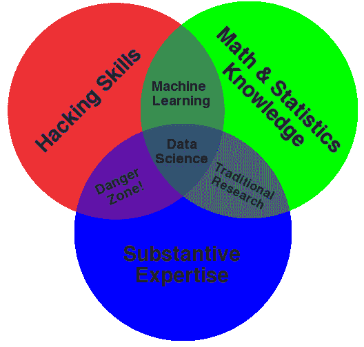
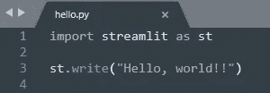
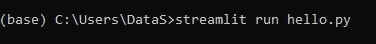
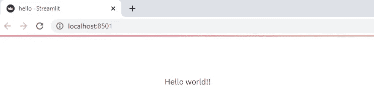

# 使用 Streamlit 创建 Web 应用程序:入门

> 原文：<https://pub.towardsai.net/creating-a-web-app-with-streamlit-getting-started-c73a9608d0aa?source=collection_archive---------2----------------------->

## [编程](https://towardsai.net/p/category/programming)

## 关于创建 web 应用程序的 10 集系列文章


[万花筒](https://unsplash.com/@kaleidico?utm_source=medium&utm_medium=referral)在 [Unsplash](https://unsplash.com?utm_source=medium&utm_medium=referral) 上拍摄的照片

假设您训练了一个回归模型，它可以根据卧室、浴室的数量、建造年份和位置来预测房价。然而，你从来没有公开让其他人真正使用它来预测现实世界。

或者，也许你创建了一个时间序列预测模型；任何感兴趣的人只需在网上拖放一个`csv`文件，就可以实时查看预测值，而无需编写任何代码。

作为一名数据科学家，您总是希望超越 Jupyter 笔记本电脑和台式机环境，创造其他人可以使用的产品。但是有些事阻碍了你。

也就是说，你认为你需要学习 HTML、CSS、JS、Flask、Django 等等，这样你就可以在野外创建和部署一个应用。你其实没有错。人们普遍认为一个数据科学家需要是一个“百事通”的独角兽。还记得著名的[数据科学维恩图](http://drewconway.com/zia/2013/3/26/the-data-science-venn-diagram)吗？



数据科学维恩图。(来源:[德鲁·康威](http://drewconway.com/zia/2013/3/26/the-data-science-venn-diagram)，知识共享许可)

仅仅因为你擅长为数据科学问题编写代码，不一定你也会有 web 开发和软件工程技能。将代码投入生产需要完全不同的技能，你可能有也可能没有。

# 细流来救援了！

*细流*前来救援；确实！这是生产流程中的一条捷径。现在，您可以成为一名出色的数据科学家，并且仍然能够部署您的项目，而无需具备前端经验和软件工程技能。

所有的序言都是说我正在为绝对的初学者写一系列关于 Streamlit 的文章。如果这是你第一次听说 *Streamlit* ，或者你以前听说过但还没开始学(是的，我们都是拖延症！)这个系列可能对你有用。在这个系列的最后，我不能保证你会成为一名专家，但是如果你坚持下去，我可以告诉你你会有动力。

我将这个系列分为 10 个部分(我们可以称之为#10daysofcode 吗？)关注不同的实际方面:

**01)开始(今天)**

02)显示文本和图像

03)创建交互式小部件

04)描述性统计/EDA

05)数据可视化

06)时间序列分析

07)创建应用程序— I(回归问题)

08)创建应用程序— II(分类问题)

09)在 Heroku 上部署应用程序

10)进一步学习的资源

# 环境设置

实际上，一开始只需要很少的设置。在本系列课程中，我们将根据需要安装数据科学库，但是现在，只需确保您安装了最新版本的 Python(Python 3.6 或更高版本)。

打开命令提示符，在你的电脑上安装 *Streamlit* :

```
pip install streamlit
```

现在，在 Python IDE 或文本编辑器上创建一个新文件，写下“Hello，world！!"。然后用名称 *hello.py.* 将 python 文件保存在您的计算机上



现在进入命令提示符，将目录更改为 *hello.py* 所在的位置，并运行`streamlit run hello.py`



一个新的标签会在你的浏览器中打开，上面写着“Hello World！!"。



瞧啊。！你写了你的第一个应用！

感谢您的阅读，我很乐意听到任何反馈或问题，欢迎在这里发表评论或联系 [Twitter](https://twitter.com/DataEnthus) 或 [LinkedIn](https://www.linkedin.com/in/mab-alam/) 。

直到下一次…