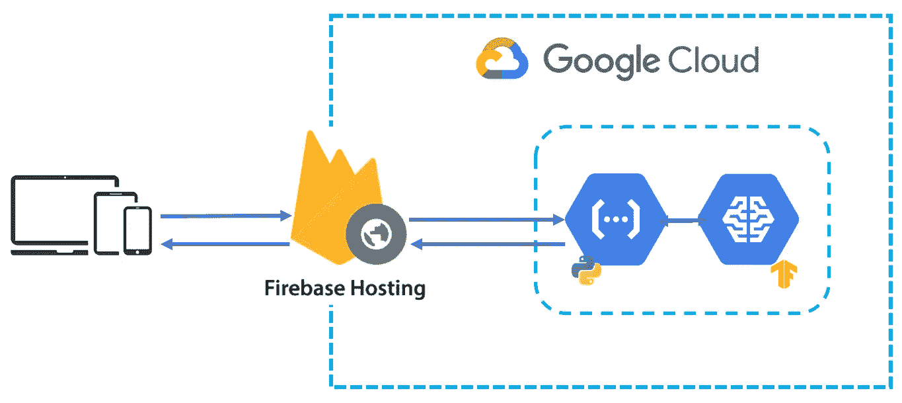
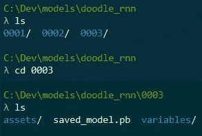
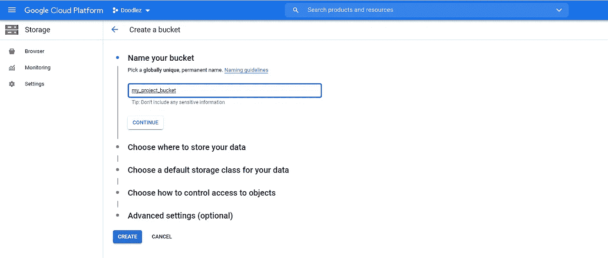
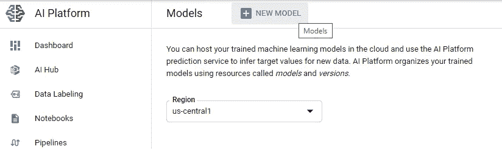
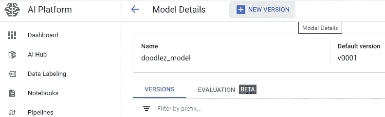
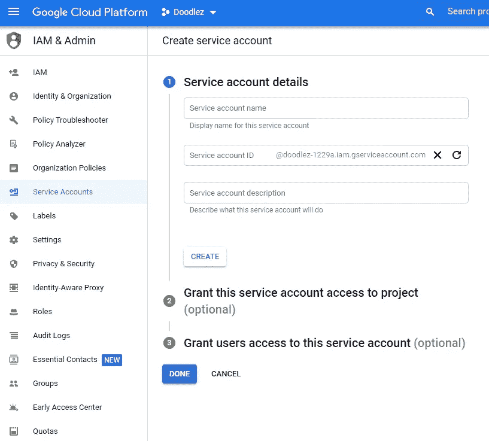
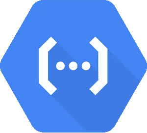
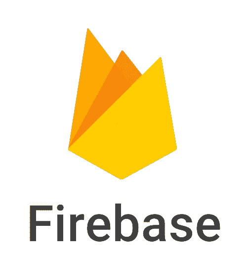
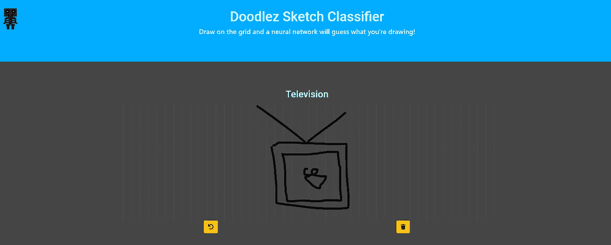

# 使用 TensorFlow、Google 云平台和 Firebase 创建人工智能 Web 应用程序

> 原文：<https://pub.towardsai.net/creating-ai-web-apps-using-tensorflow-google-cloud-platform-and-firebase-127b0c1b2c2e?source=collection_archive---------1----------------------->

## [机器学习](https://towardsai.net/p/category/machine-learning)，[云计算](https://towardsai.net/p/category/cloud-computing)

## 从沙盒到云:如何轻松地将机器学习模型部署到生产 Web 应用程序中

[李中清](https://unsplash.com/@picsbyjameslee?utm_source=medium&utm_medium=referral)在 [Unsplash](https://unsplash.com?utm_source=medium&utm_medium=referral) 上拍照

# 介绍

为具有 ML 功能的 web 应用程序训练机器学习模型只是整个项目开发范围的一部分。一个经常被忽视的方面是超越沙盒，进入生产环境。在本文中，我将演示如何使用谷歌云平台(GCP)人工智能平台和云功能，通过预测服务轻松服务于张量流模型。之后，我将展示如何使用 Firebase 部署和托管 web 客户机，以使用 HTTP 请求查询模型。

最终的项目架构将类似于下图:

项目架构概述

> 免责声明:本文将帮助您开始。这不是 Firebase 或者 Google 云平台的教程。要了解更多细节，我强烈建议读者访问官方文档。TensorFlow 官方文档是获得更深入视图和细节的绝佳资源。

# 模型训练和保存

## 用于模型训练的 Google Colab

Google Colab 是使用硬件加速器训练深度学习模型的优秀资源。最棒的是:它是免费的！

训练深度学习模型的一个很好的资源是 [Google Colab](http://colab.research.google.com) 。他们提供免费的 GPU 和 TPU，两者都可以显著提高训练时间。这些都是免费提供的，对于更高级的用例，还有付费选项。训练之后，可以下载模型进行进一步的处理和部署。关于如何使用 Colab 并开始训练你的模型的细节，我推荐[这篇教程](https://colab.research.google.com/github/tensorflow/docs/blob/master/site/en/tutorials/quickstart/beginner.ipynb)。

以下代码定义了一个要使用的张量流模型示例:

使用 Keras 的示例模型

## SavedModel 格式

训练结束后，可以使用 TensorFlow 的 **SavedModel** 格式保存。该文件代表模型的**版本**，包含计算图和其他相关数据。参见[此处](https://www.tensorflow.org/guide/saved_model)了解使用 SavedModel 的更多细节。以下代码片段显示了如何以保存的模型格式保存 TensorFlow 模型:

版本化模型是机器学习工程中的一个重要实践。任何改进或变更都将更容易监控、记录和跟踪。

**版本化**您的模型使您能够跟踪变更和改进。这使得将应用程序部署或回滚到先前已知的良好模型变得更加容易。例如，这里显示的图显示了包含目录`doodle_rnn`中模型的三个版本的目录。

# 预测服务

将训练好的模型部署到生产环境中的一个简单方法是使用 GCP AI 平台创建一个**预测服务**。web 应用程序**请求**对一些查询数据(例如，用户输入)进行预测，预测服务将提供模型的预测作为**响应**。首先，您需要登录 GCP 并创建一个项目。参见[此处](https://cloud.google.com/appengine/docs/standard/nodejs/building-app/creating-project)了解在 GCP 创建项目的更多细节。

## 为您的项目创建存储桶

创建项目后，将保存的模型存储在**桶**中。按照[这个例子](https://cloud.google.com/storage/docs/creating-buckets)创建桶，进行快速简单的演练。

根据官方文件:

> 存储桶是保存数据的基本容器。您存储在云存储中的所有内容都必须包含在一个桶中。

GCP 桶创作形式。

准备好 bucket 后，将 SavedModel 的目录上传到其中。例如，如果您有一个目录`~/models/doodle_rnn`，其中包含模型版本`0001`、`0002`和`0003`，您将上传根目录(换句话说，`doodle_rnn`，以及所有版本)。

## 创建模型

将保存的模型上传到项目桶后，在 AI 平台上创建一个**模型**。使用左侧导航菜单，在人工智能部分下，导航到人工智能平台，然后单击“创建模型”。或者，点击[此处](http://console.cloud.google.com/ai-platform/models)进入同一页面。

GCP 人工智能平台上的新模型创建形式

> 关于在人工智能平台上创建模型的更多细节，见[这个例子](https://cloud.google.com/ai-platform/prediction/docs/deploying-models#deploy_models_and_versions)

在创建了**模型资源**之后，通过点击您的模型资源，然后点击`NEW VERSION`，创建一个**模型版本**。填写所有必需的版本详细信息，包括机器类型和模型资源的完整路径。这是桶、**中**位置的完整路径，包括版本目录**(例如`doodle_rnn/0003`)。**

> **重要事项**:选择机器类型时要小心。对于更实惠的选项，请确保选择低端机选项，以避免高成本。

在创建了模型版本之后，您就已经成功地将您的模型部署到了云中。

# 应用后端

我们可以编写一个 GCP 云函数来监听预测请求，加载模型，并生成和返回预测。

## 服务帐户

GCP 上的服务帐户创建表单

需要一个 [**服务帐户**](https://cloud.google.com/iam/docs/understanding-service-accounts) 来认证客户端代码和访问部署的模型。在左侧导航菜单中，转到 IAM &管理部分，然后单击服务帐户。这将显示一个表格，其中包含与您的项目关联的所有服务帐户。填写表格并创建一个新的服务帐户。然后，给它分配 **ML 引擎开发人员角色**。这将允许服务帐户使用部署的模型进行预测，除此之外别无其他。

> 根据需要分配权限是一种很好的做法，这样可以避免将来的冲突或意外的访问权限。

## 云函数

我们将使用云功能来处理我们的 web 应用程序的后端。这是 Python 中的一个无服务器函数，每次我们向指定的 URL 发送 web 请求时都会触发这个函数。查看[此处](https://cloud.google.com/functions)了解更多关于谷歌云功能的细节。

谷歌云功能徽标

要开始使用:

*   [下载并安装](https://cloud.google.com/sdk/docs/install)Google Cloud SDK。这将使您能够部署您的云功能。
*   下载 [Google API Python 客户端](https://github.com/googleapis/google-api-python-client)。我们将需要它从 Python 云函数代码中与我们部署的模型进行交互。
*   可选，强烈推荐:下载 Python 的[函数框架。这是一个轻量级框架，允许你在本地运行云功能。这对于开发和调试来说**非常有用**。](https://github.com/GoogleCloudPlatform/functions-framework-python)

下面是一个 Python 云函数，它处理 HTTP 请求，加载我们的模型，并返回一个预测:

需要记住的一些重要变量是:

*   `GOOGLE_APPLICATION_CREDENTIALS_FILE`:用于**本地调试**的环境变量。如果在本地运行，将其设置为**服务帐户密钥文件**所在的路径(例如，使用. env 文件)。
*   `GOOGLE_APPLICATION_CREDENTIALS`:该环境变量是**使用 ML 服务**所必需的。如果在本地运行云功能，则如上所述用`GOOGLE_APPLICATION_CREDENTIALS_FILE`进行设置。否则，当您通过`service-account`选项部署该功能时，可以通过 CLI 直接设置该值**，如部署示例所示。**
*   `WEB_CLIENT_URL`:这个环境变量是 web 客户端的 URL。这是**安全启用**[**CORS**](https://developer.mozilla.org/en-US/docs/Web/HTTP/CORS)**所需要的，否则，客户端请求会失败。**
*   **`model_path = request.json[“model_path”]`:这是一个让客户指定使用哪个型号版本的有用方法。例如，当进行 A/B 测试时，web 客户端根据一些环境变量告诉云函数使用什么模型(参见下面的 Web 客户端部分的示例)。云函数只是加载指定的模型并返回预测结果。**

**要将您的功能部署到云中，请在您的终端中执行以下命令:**

**使用 gcloud SDK 部署云功能的 CLI 命令**

**一些重要且有用的命令选项:**

*   **确保这是您新创建的服务帐户。这样，当功能被部署时，它被部署了正确的角色和权限(在本例中，是 *ML 引擎开发人员*角色)**
*   **`--trigger-http`:如果您希望您的函数由 HTTP 请求触发(例如，而不是 [RPC](https://en.wikipedia.org/wiki/Remote_procedure_call) )，请指定此项。**
*   **`--env-vars-file`:这允许你用环境变量指定一个`env.yaml`文件。这是一个非常有用的特性，可以用任何您想打包的值来部署您的应用程序(例如，上面的云函数中显示的`WEB_CLIENT_URL`的值)。**

> **关于**部署**云功能时设置环境变量的更多细节，请参见[这里的](https://cloud.google.com/functions/docs/env-var)。**

# **用 Firebase 托管 Web 客户端**

**Firebase 是谷歌开发的一个平台，用于创建网络和移动应用。它提供了许多有用的功能，并与 web 应用程序中通常需要的工具(如身份验证、监控、存储等)很好地集成在一起。**

****

**Firebase 徽标**

**我们将使用 Firebase 的托管服务来部署和托管我们的 web 应用程序。要开始使用:**

*   **下载 Firebase SDK**
*   **从现有的 CGP 项目中创建一个 Firebase 项目。点击添加项目，然后输入您的 GCP 项目名称，并创建 Firebase 项目。**
*   **在您的终端中，执行`firebase login`登录 Firebase。**
*   **执行`firebase init`来初始化您的项目。选择托管功能。选择选项`Use an existing project`，然后选择您新创建的项目。**注意:**在填写下面的`What do you want to use as your public directory?`部分时，确保指定正确的构建目录。例如，如果您使用一个类似于 [npm](https://www.npmjs.com/) 的工具，您可以将`build` 目录指定为公共目录。通过这种方式，Firebase 知道在哪里寻找 web 应用程序的生产就绪构建版本，并将其推送到云中。**
*   **执行`firebase deploy`进行部署。**

**就是这样！部署就是这么简单！**

# **真实世界应用程序:草图绘制分类器**

****

**使用本文介绍的方法创建的 AI web 应用程序示例。**

**我使用本文中介绍的完全相同的方法创建并部署了一个 web 应用程序，从使用 Colab 进行培训到使用 Python Cloud 函数处理 HTTP 请求，以及这两者之间的一切。希望，这将作为一个指南，让你开始创建和部署惊人的人工智能网络应用程序。**

# **结论**

**在本文中，我展示了一个使用预测服务的 web 应用程序的部署和产品化的端到端演练。具体来说，我讲述了如何:**

*   **使用 Colab 免费培训模型**
*   **使用 SavedModel 格式保存模型**
*   **使用人工智能平台创建预测服务**
*   **使用云函数创建轻量级后端**
*   **使用 Firebase 主机部署现有的 web 客户端**

**这种方法将使您能够以非常实惠的成本选项轻松快速地部署任何未来的机器学习项目。**

## **小心成本**

**记住你的应用程序的使用，并留意你的预算。尽管对于大多数用户项目来说，价格范围是相当合理的，但总是存在运行意外的大成本的风险。一个强有力的建议是 [**创建一个预算，并设置闹铃**](https://cloud.google.com/billing/docs/how-to/budgets) 一旦你的预算达到一定的阈值(例如 0.50 美元)就会自动触发。这将允许您在需要时监控和断开服务。**