# 以简化的方式创建对象检测模型

> 原文：<https://pub.towardsai.net/creating-an-object-detection-model-the-streamlined-way-840a4806f7af?source=collection_archive---------2----------------------->

## [计算机视觉](https://towardsai.net/p/category/computer-vision)

## 关于如何创建象棋对象检测模型的深入指导。培训数据可在我的回购处[获得。](https://github.com/arditoibryan/Projects/tree/master/20210901_nexus_object_detection)

无代码接口正在彻底改变 ML 工程师处理机器学习技术必须提供的最困难任务的方式。我遇到的最艰难的编码任务之一是编码必要的结构来解决计算机视觉问题，如分类或物体检测。在整篇文章中，我将用来执行对象检测实验的接口被称为**数据**(可通过链接获得[)。](https://datature.io/blog/inspect-model-inferences-on-images-and-videos-with-portal)

数据横幅

在本文中，我将使用一组预先标记的棋盘图像来创建我的对象检测模型。图像中的每个棋子都被赋予了正确的标签。

## 目标检测

目标检测是计算机视觉的可能任务之一。对象检测模型能够在图像中找到对象，然后给它们分配正确的标签。尽管如此，不管我们使用的是什么库，这仍然是最难用代码构建的解决方案之一。

## 对解决方案进行硬编码

对这种解决方案进行硬编码的第一个问题是代码本身相当困难，尤其是图像的预处理阶段。图像必须以正确的形式输入，然后进行预处理和增强，最后输入神经网络模型进行训练。对于给定的任务，建立一个卷积神经网络(用于计算机视觉任务的模型)需要几个小时。

在使用最新和更先进的模型进行图像检测时，最令人沮丧的问题是有太多的事情可能出错。我记得我第一次使用 ResNet 进行对象检测时，我无法安装以前版本的错误库，因为它与最新的 TensorFlow 版本冲突。

将代码用于计算机视觉的最新问题是对计算能力的要求。简单地说，免费的笔记本版本或您自己的计算机(即使具有非常强大的 GPU)没有足够的计算能力来在一天内训练一个具有挑战性的对象检测模型(具有 200 个图像的训练集)。这使它成为一个真正的噩梦，而您可以使用的唯一解决方案是使用虚拟机。

# 关系

在寻找运行我自己的对象检测算法的替代品时，我找到了 nexus。一个无代码平台，让您可以轻松设置您的计算机视觉算法。该平台旨在与您的 MLOps 流程集成，因此，一旦您的模型经过训练，就可以作为工件导出，以便使用 Kubernetes 等容器化服务进行部署。

正如在使用计算机视觉解决方案的硬编码的问题中所概述的，该平台允许您的算法有很大程度的个性化，包括几个预处理选项，并为您提供处理密集型工作负载所需的计算能力。

免费层为您提供 500 分钟的免费计算能力，这足以运行几个模型，尤其是如果您想尝试对象检测。我的包含 230 张图片的模型花了 14 分钟来训练。

## MLOps:成就或毁灭你的 ML 团队

MLOps 是一种工作流，已被业界用于创建和开发机器学习模型。使用平台来遵循这一过程的优势在于，我们可以轻松地创建一个与其他云工具集成的管道，并且足够灵活，可以在未来维持快速变化。当您单独处理模型时，这听起来可能并不重要，但是想象一下跨多个团队使用多个模型——每个团队都有自己的“最佳实践”。这就是事情变得混乱的时候。

MLOps 周期的一个非常普遍采用的适应被称为 CD4ML(机器学习的连续交付)，这是一个旨在最大化 MLOps 效率的框架。

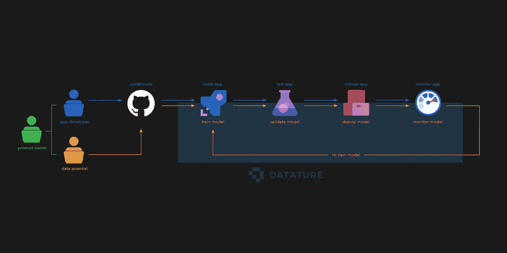

CD4ML 之后的 MLOps 流程

这相当于使用 Nexus 平台的 CD4ML 管道。

# 创建对象检测模型

现在，我将为您提供使用 Nexus 平台构建您自己的对象检测模型的必要说明。

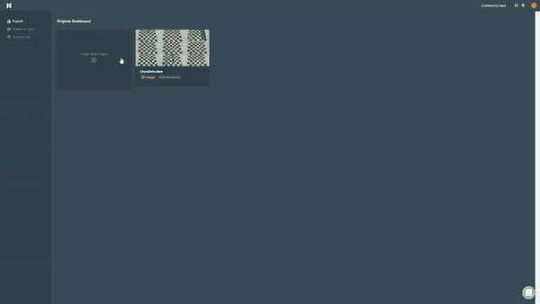

创建新项目 GIF

## 项目管理

登录 Nexus 后，您将能够创建您的第一个项目。该平台允许您拥有多个项目，如果您管理许多不同的数据集并有特定的团队成员在其上工作，这可能会很有帮助(在训练模型时，这也是试验不同参数的好方法)。

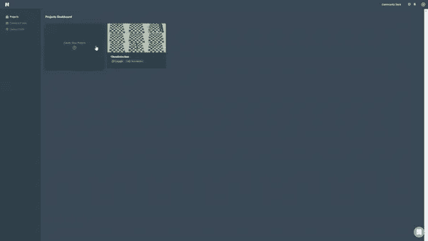

Nexus 平台截图

## 文件

在我的 repo 中，你会发现一个文件夹，里面有我在这个实验中使用的所有文件:

*   [训练图像](https://github.com/arditoibryan/Projects/tree/master/20210901_nexus_object_detection/train)
*   [训练图像标注](https://github.com/arditoibryan/Projects/tree/master/20210901_nexus_object_detection)

## 上传图像

上传图片到平台的过程非常简单。在我的例子中，我将选择包含在 training 文件夹中的 231 个图像。整个过程可能需要几分钟才能完成。该平台将允许我按照自己选择的分割比例(默认情况下，测试集的分割比例为 0.3)将图像集分割成训练集和测试集。

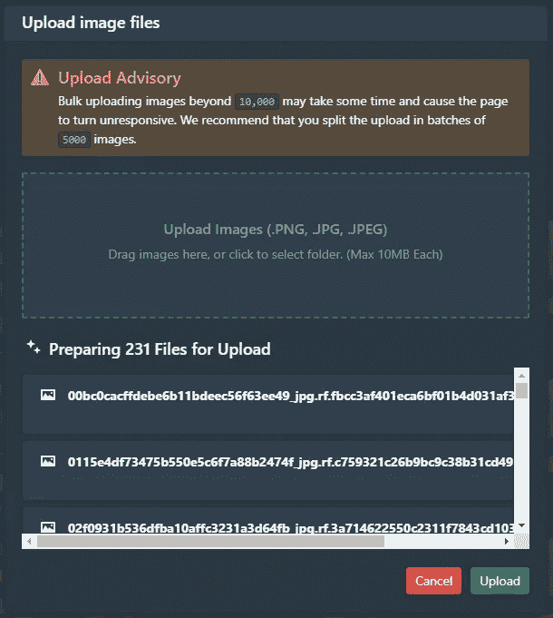

上传图像界面

## 上传标签

到目前为止，我已经可以在平台上上传图片，但我还没有标记它们。如果图像保持未标记，则不可能训练监督学习算法，因为它需要特征和标记才能成功运行。

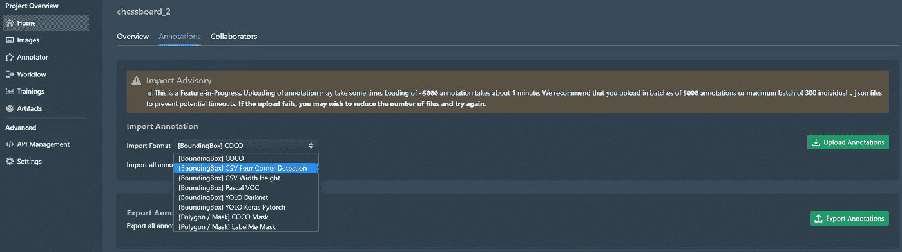

上传注释界面

对于该数据集，标签将存储在包含相应图像名称的 CSV 文件中。这是图像处理的一种常见格式，事实上，该平台允许您导入多个对象遮罩的标签，每个对象遮罩表示一个棋子，如果需要，还可以导出。

一旦导入了标签，我们就可以进行简单的探索性数据分析(值计数操作),从而深入了解标签在数据集中的分布情况。我们可以看到，只有 2 个图像不包含任何标签，因此我们将继续给它们加标签。

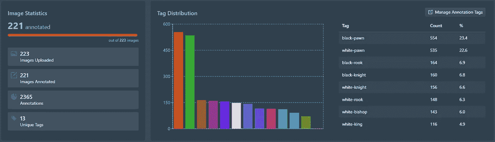

贴标过程的 EDA

如果我们想在以前从未见过的数据上验证模型，在上传验证集时要小心，因为平台不会对你的训练图像进行区分(模型验证是在门户上完成的，我将在下面介绍)。

## 内置注释器

如果我们希望详细研究每个图像，注释器部分允许我们检查每个图像中的所有相关标签，并在需要时更改标签。他们有各种各样的工具，但因为我只是训练一个对象检测模型，一个边界框就可以了。

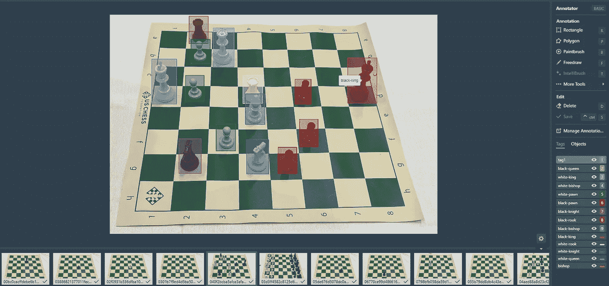

平台注释器的屏幕截图

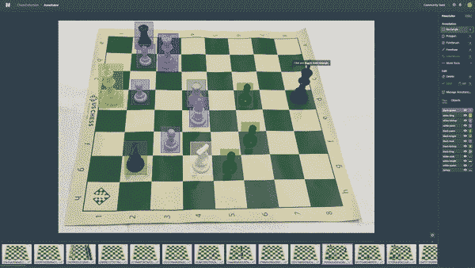

手动平台注释器的 GIF

## 训练模型

培训阶段是这个平台有趣的地方。按照规定，设置整个培训过程所需的工作量是最小的。它将为你节省 1 到 5 个小时的工作时间(尤其是如果你是第一次编写复杂的 CNN 的话)。该平台简化了模型构建过程，只需点击几下鼠标就可以删除复杂的代码，同时还允许您灵活选择预处理和增强方法。

有大量的预处理方法可供选择。通常，当训练数据集非常小或者具有很小的变化时，需要扩充图像的过程。目标是使您的模型更加灵活，以适应现实世界图像中可能出现的变化。

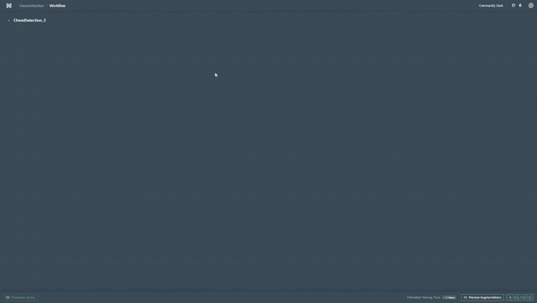

工作流创建的 GIF

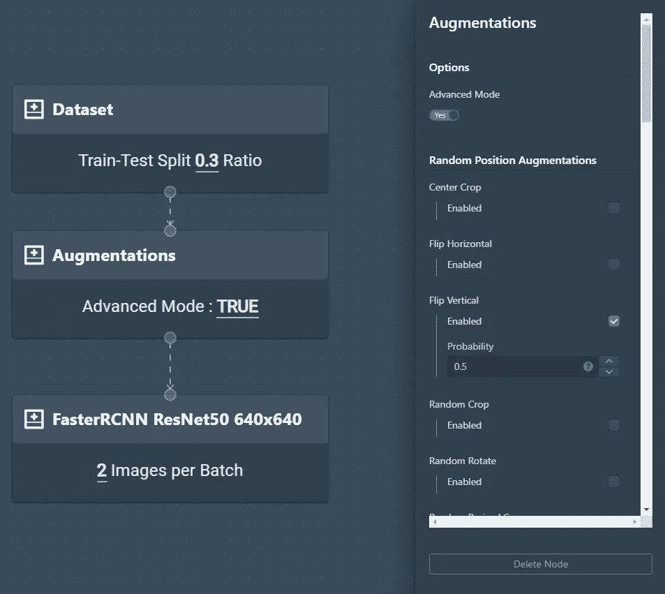

完整培训工作流程的屏幕截图

在我的例子中，我将选择一种简单的数据扩充技术，为每张可以预览的垂直翻转图像分配 0.5 的概率。当模型训练时，这些增强是在运行中完成的。

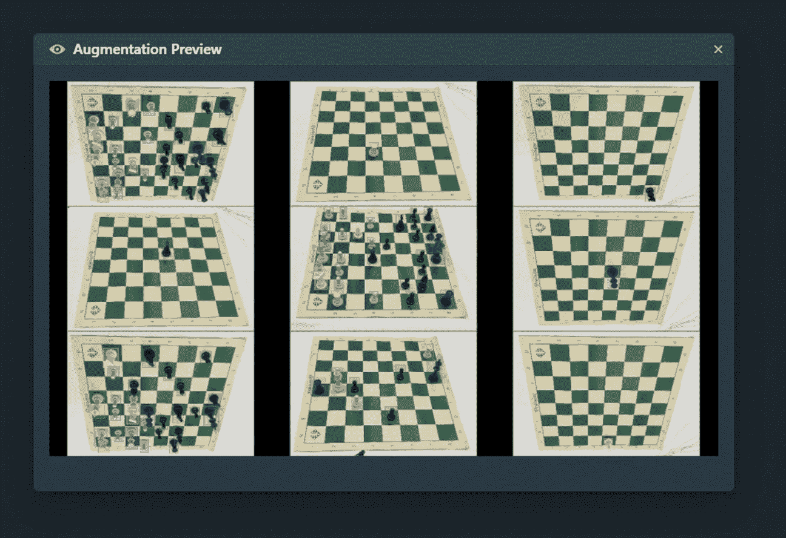

增强预览

一旦正确设置了我的工作流，我将能够预览我的扩充，并选择必要的超参数，如时期数/批量大小，甚至是检查点策略(我为该模型选择了最低的验证损失)。

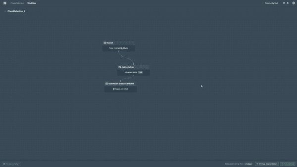

开始培训

快速检查参数后，我将开始训练。请注意，在使用代码时，除非您可以将其连接到现有的虚拟机，否则您将需要等待长达 24 小时的时间来正确训练对象检测模型。该平台允许我在不到 15 分钟的时间内训练它，使用它的 GPU。

## 模型性能

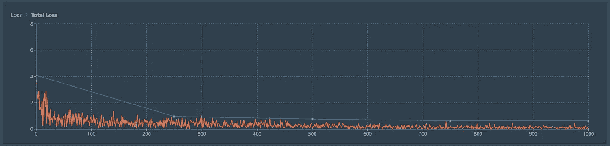

多个时期的总损失

从函数中可以看出，模型的精度似乎随着历元数的增加而缓慢增加。1000 个纪元似乎是一个非常合理的数字，相比之下，400 个纪元的模型损失几乎减少了一半。

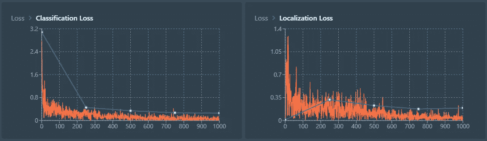

分类和本地化损失

我们总是可以通过我们训练过的模型来访问这些统计数据，这些数据现在出现在一个专门的部分，以便于团队成员参考。

## 导出工件

一旦一个模特经过适当的训练，我手里的东西就叫做神器。该模型必须集成到构成整个 MLOps 流程的管道中，以便在经过适当验证后可以轻松用于生产。例如，我们可能希望使用 Kubernetes 作为 MLOps 流程的下一步。

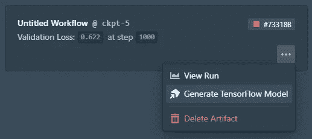

如何创建张量流模型的屏幕截图

## 验证模型

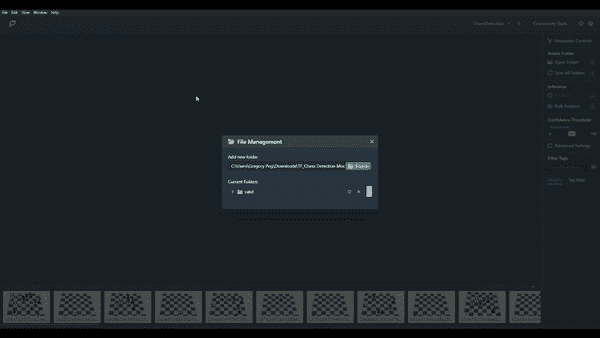

验证后浏览图像

Datature 很酷的一点是，它不仅仅停留在模型训练上，许多团队认为模型训练和注释是全部，但这只是一半。我使用他们的开源平台(门户)来验证模型是如何进行预测的。

我所要做的就是将我的模型和图像加载到 Portal 中，模型将根据棋盘上棋子的位置和类型做出推断。我们走吧！我们刚刚以无缝的方式训练了一个象棋检测模型。

## 实例分段呢？

我仅有的几个想法之一是如何将这转化为实例分割项目。首先，注释必须作为分割/多边形单独更新——但这是一项非常耗时的任务。幸运的是，我是 Datature 的 IntelliBrush 早期访问的一部分，并在我的实验中摆弄它。

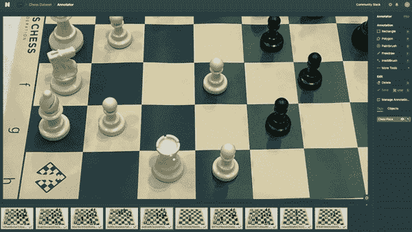

IntelliBrush(一键式注释器)预览

IntelliBrush 的前提是，用户只需选择“内部”区域，即点击一个人或动物的身体，就会自动生成一个多边形来限定它。更有趣的是，用户还能够选择感兴趣区域“外部”的区域来微调对象的多边形选择。这在注释紧密排列在一起的对象时特别有用，因为不同对象之间容易发生重叠。

如果您认为 IntelliBrush 将有助于您的注释工作流程，请考虑尝试一下！