# 使用机器学习的信用卡欺诈预测

> 原文：<https://pub.towardsai.net/credit-card-fraud-prediction-using-machine-learning-f47e52a0dbc2?source=collection_archive---------1----------------------->

[rupixen.com](https://unsplash.com/@rupixen?utm_source=medium&utm_medium=referral)在 [Unsplash](https://unsplash.com?utm_source=medium&utm_medium=referral) 上拍照

## [机器学习](https://towardsai.net/p/category/machine-learning)

## 探索逻辑回归和朴素贝叶斯的使用

随着新冠肺炎·疫情的出现，一种新的数字常态已经从对常规惯例和行为的破坏中出现。不可预见的情况促使个人和企业加快数字化转型，并采用创新方法来应对动荡和不确定的形势。作为消费者，我们的购物模式随着电子商务领域的繁荣而发展，从而使在线杂货店购物和食品配送的信用卡支付成为新的便利。

根据领先的分析软件公司 FICO 在 2020 年 1 月进行的一项最新调查[,调查强调](https://www.fico.com/blogs/real-time-payments-fraud?utm_source=social&utm_medium=social_platforms&utm_campaign=APAC_banks)

> 随着包括个人对个人(P2P)转账和移动支付平台在内的新的近即时支付平台在亚太地区的发展，实时支付欺诈已经激增。
> 
> 我们最近对该地区的银行进行了一项调查，发现 5 家银行中有 4 家(78%)的欺诈损失有所增加。此外，近四分之一(22%)的受访者表示，欺诈行为将在未来 12 个月内显著增加，另有 58%的受访者表示，他们预计欺诈行为将适度增加。

根据全球领先的信用卡和移动支付行业出版物《尼尔森报告》(,

> 2018 年，全球信用卡欺诈损失达到 278.5 亿美元，预计五年后将上升至 356.7 亿美元，10 年后将达到 406.3 亿美元。

# 信用卡欺诈检测面临的挑战

信用卡交易中的欺诈检测领域提出了几个挑战。随着每天处理大量的信用卡交易，机器学习算法和技术需要具有非常高的准确性，并且可扩展以处理海量数据。

另一个挑战是难以在记录的信用卡数据集中检测欺诈，因为数据在更高的水平上是倾斜的。这导致了不平衡的数据集，其中真实信用卡交易的数量远远多于欺诈交易。

在这篇文章中，我想分享我对机器学习如何用于**预测信用卡交易是否欺诈的见解。**

机器学习是人工智能的一种应用，它为系统提供了自动学习和根据经验改进的能力，而无需显式编程。机器学习的 3 个主要类别是监督学习、非监督学习和强化学习。我们将关注分类问题的监督学习。

**监督学习**从过去的数据中学习，并将学习应用于当前数据，以预测未来事件。在分类问题的上下文中，输入数据被标注或标记为正确的答案，以实现准确的预测。

让我们来处理一个信用卡交易欺诈预测问题，探索两种监督学习算法(逻辑回归和朴素贝叶斯)的基础，如何微调超参数以优化逻辑回归，并发现哪种监督学习算法更适合解决该问题。

# 监督学习算法

**逻辑回归**用于预测目标变量的概率。目标变量或因变量的性质是二分法，只有两个可能的类别。逻辑回归试图找到最佳的决策边界，最好的分类。

逻辑回归的一个优点是易于实现，并且提供了很高的训练效率。用这种算法训练模型不需要很高的计算能力。但是，逻辑回归需要一个大型数据集，其中包含足够的训练样本来识别所有需要识别的类别。

**朴素贝叶斯**假设一个类中特定特征的存在与任何其他特征的存在无关。它是一种统计方法，基于[贝叶斯定理](https://en.wikipedia.org/wiki/Bayes'_theorem)的应用来计算某个特征属于某个类别的概率。

当“天真”假设成立时，分类器与其他模型相比具有优势，可以用较少的训练数据更好地执行。朴素贝叶斯的一个局限是独立预测的假设。在现实世界中，几乎不可能获得一组完全独立的预测器。

# 问题陈述:预测信用卡交易是否欺诈。

# 资料组

[数据集](https://www.kaggle.com/mlg-ulb/creditcardfraud/home)由欧洲持卡人在 2013 年 9 月两天内进行的匿名信用卡交易组成。

信用卡交易仅包含数字输入变量，这些变量是主成分分析转换的结果。由于保密问题，无法提供数据的原始特征和更多背景信息。虽然 V1、V2…v 28 等特征是通过五氯苯甲醚获得的主要成分，但唯一没有通过五氯苯甲醚转化的特征是“时间”、“数量”和“类别”。

*   **‘Time’**包含数据集中每个事务与第一个事务之间经过的秒数。
*   **‘金额’**为交易金额。
*   **‘Class’**是响应变量，在欺诈的情况下取值 1，否则取值 0。

# 开始编码吧！

# 数据准备

加载数据集并显示前 5 行以检查数据。

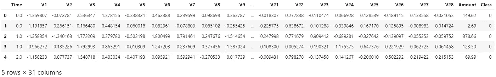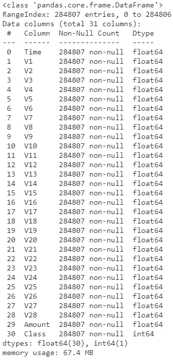

# 探索性数据分析

绘制一个条形图来可视化数据集中的类分布。

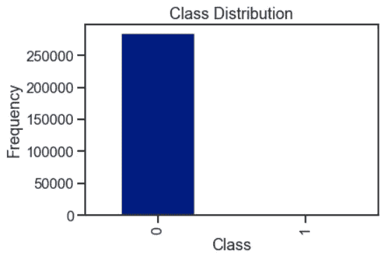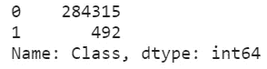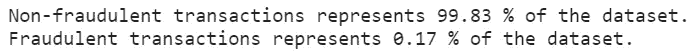

数据集显然是不平衡的，如上所述，这对信用卡欺诈检测构成了挑战。

时间对数据集的影响呢？非欺诈交易的趋势与欺诈交易有何不同？

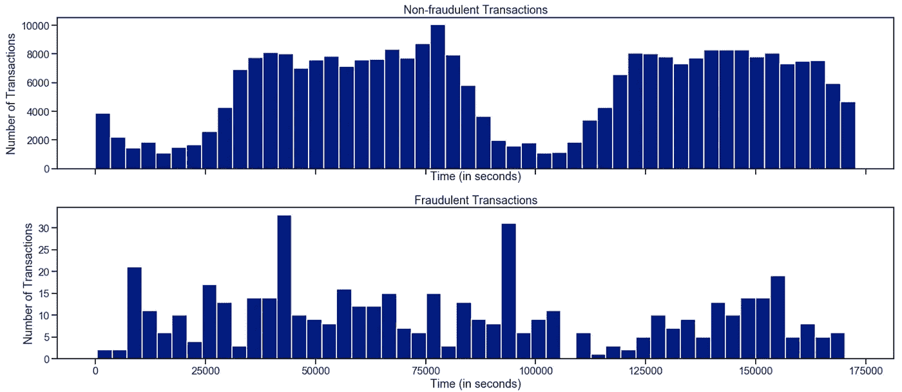

从上面的直方图可以看出，非欺诈交易的趋势本质上是周期性的。而对于欺诈交易，尝试是随机的，有几个峰值。这就好像犯罪分子在碰运气，在尽可能短的时间内做尽可能多的交易而不被抓住。

# 本福德定律的力量

[本福德定律](https://www.acfeinsights.com/acfe-insights/what-is-benfords-law)又称 ***第一位数定律*** 或 ***反常数定律。*** 它陈述了在任何一个大的、随机产生的自然数集合中，都会出现某种模式。大约 30%的数字以数字 1 开头，18%以数字 2 开头，以此类推，最小的百分比以数字 9 开头。

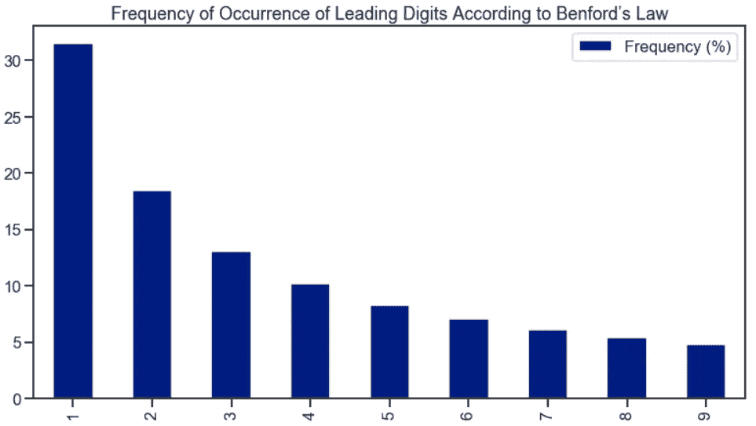

本福德定律广泛应用于分析财务记录中统计数据的有效性，也常用于查看大量发票和发现虚构的供应商。这种技术对于欺诈检测很有用，因为人为生成的数字通常不符合本福特定律。

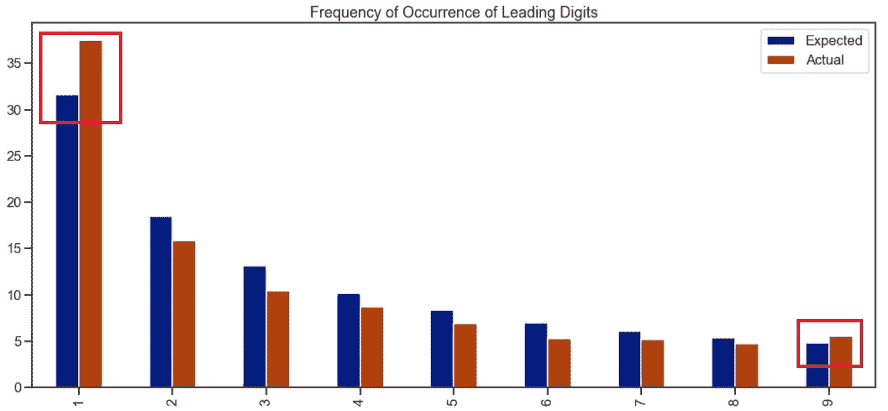

让我们应用本福德定律的概念，在数据集上运行一个测试。数据集的实际前导数字“1”和“9”高于预期的本福特定律预测。我们可以推断，犯罪人故意想做大交易，交易金额为 1000 美元或 999 美元，而不是 200 美元或 800 美元。如果这样做的次数足够多，那么根据本福特定律，数字出现的自然顺序就会被打乱。

# 实验设计

观察不同的因素如何影响每个分类器的性能将是有趣的。考虑以下两个因素:

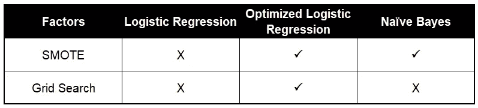

*   **合成少数过采样技术(“SMOTE”):**不平衡的数据集会导致训练后的模型有偏差。对于这个特定的数据集，我们看到 99.83 %的分布代表多数类(即非欺诈交易)和剩余的 0.17%代表少数阶级(即欺诈交易)。

在训练模型时，我们将使模型达到属于多数类的高分类精度。为了解决类不平衡的问题，我们将执行 SMOTE，它创建新的合成点以获得平衡的数据集。

*   **网格搜索:**为了最大化逻辑回归的性能，我们可以对最佳超参数进行网格搜索，优化模型性能。

# 数据建模

[**数据集的标准化**](https://scikit-learn.org/stable/modules/preprocessing.html) 是 scikit-learn 中实现的许多机器学习估值器的常见需求。如果单个要素或多或少看起来不像标准的正态分布数据，数据集可能表现不佳，即。均值和单位方差为零的高斯分布。

唯一没有被 PCA 转化的特征是“时间”、“数量”。因此，我们将对这两列进行标准化。

执行数据集的初始加载和分割，以训练和测试基线逻辑回归模型。

# 模型 1:基线逻辑回归模型

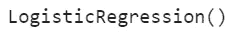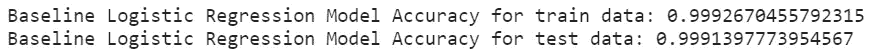

由于严重不平衡的数据集，基线逻辑回归模型能够几乎完美地对每个训练点和测试点进行分类。99.83 %的分布代表多数阶级(即非欺诈性交易)，几乎 100%的时间都会做出正确的预测。

# 奋力营救

我们为 SMOTE 的实施选择了以下参数:

*   **sampling_strategy:** 采样信息对数据集进行重采样。

> 当`**str**`时，指定重采样的目标类别。不同类别中的样本数量将会相等。可能的选择有:
> 
> `**'minority'**`:只对少数类重新采样；
> 
> `**'not minority'**`:对除少数类以外的所有类进行重新采样；
> 
> `**'not majority'**`:对除多数类以外的所有类进行重新采样；
> 
> `**'all'**`:对所有类进行重采样；
> 
> `**'auto'**`:相当于`**'not majority'**`

*   **random_state:** 控制算法的随机化。

> 如果 int，`**random_state**`是随机数生成器使用的种子；
> 
> 如果`**RandomState**`实例，random_state 是随机数生成器；
> 
> 如果`**None**`，随机数生成器就是`**np.random**`使用的`**RandomState**`实例

*   **k_neighbors:** SMOTE 选择少数类的最近邻居之间的距离，并在这些距离之间创建合成点。

> 如果`**int**`，用于构建合成样本的最近邻数量。If object，继承自`**sklearn.neighbors.base.KNeighborsMixin**`的一个估计器，将用于查找 k_neighbors。

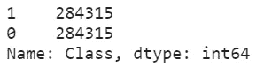

# 热图相关矩阵

相关性说明了特征之间或与目标变量之间的关系。相关性可以是正的(增加一个特征值会增加目标变量的值)，也可以是负的(增加一个特征值会减少目标变量的值)。一个**热图**使得**识别哪些特征与目标变量**最相关变得容易。

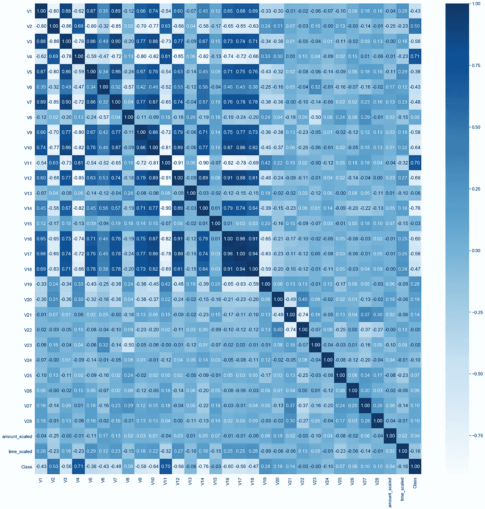

*   **正相关:****特征值越高，**欺诈交易的概率越大**。**
*   ****负相关:****特征值越低**，欺诈交易的概率**越低**。**

**对于前 4 个最高正相关和负相关中的每一个，我们将创建箱线图来帮助我们可视化异常值的程度。**

# **箱线图**

****箱线图**非常有用，因为它们显示了数据集中整数数据类型的异常值。一个**异常值**是一个在数值上远离其余数据的观察值。查看箱线图时，异常值被定义为位于箱线图触须外部的数据点。**

**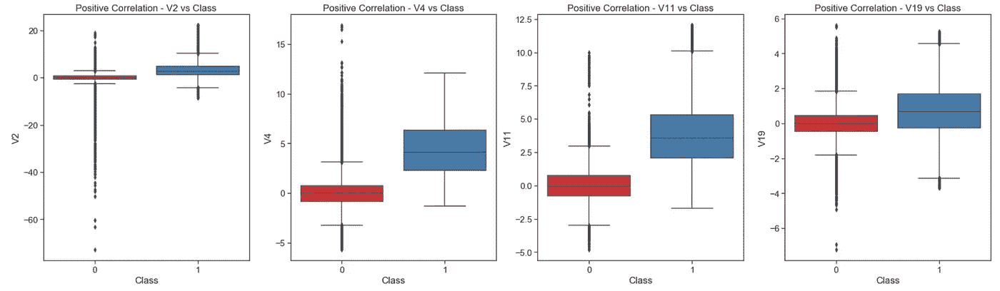****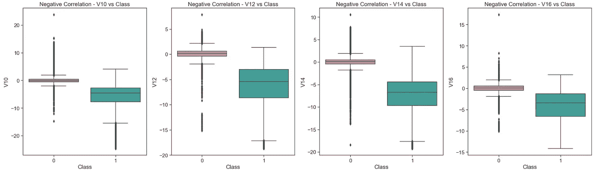**

# **分布图**

****分布图**显示了数据分布的变化。通过使用 Seaborn 库，连续数据变量的总体分布由一个直方图表示，并结合一条线表示高斯分布(即正态)分布。**

**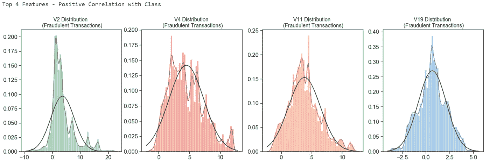****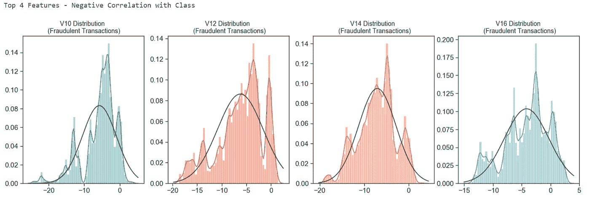**

# **极端异常值的去除**

**为了获得良好的模型性能，需要从与我们的类高度相关的特征中识别并移除极端离群值。这个清理过程有助于确保观察结果最好地代表问题。**

**其中一种技术是使用 Jason Brownlee 博士的[机器学习大师博客文章](https://machinelearningmastery.com/how-to-use-statistics-to-identify-outliers-in-data/)中分享的**四分位间距方法**:**

> **概括非高斯分布数据样本的一个好的统计量是四分位距，或简称为 IQR。IQR 计算为数据的第 75 个和第 25 个百分位数之间的差值，并在盒须图中定义盒子。**
> 
> **通过定义低于第 25 个百分点或高于第 75 个百分点的 IQR 因子 *k* 的样本值限制，IQR 可用于识别异常值。系数 k 的**公共值是值 1.5** 。**

**去除异常值的阈值被确定为 1.5，以防止信息丢失的风险，这将导致模型具有较低的准确性(即装配不足)。**

**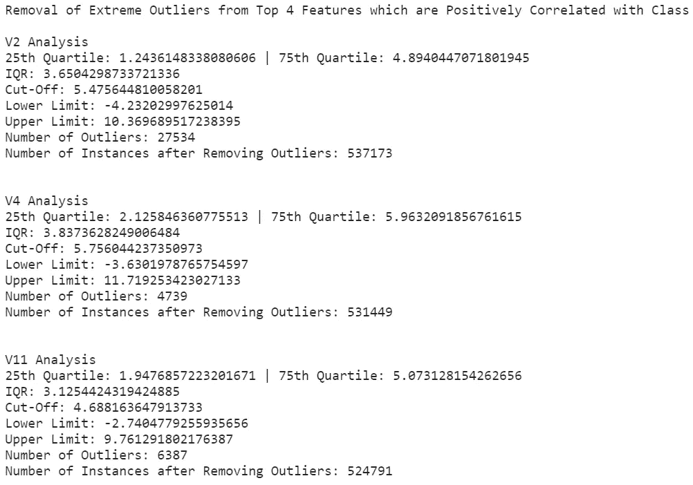****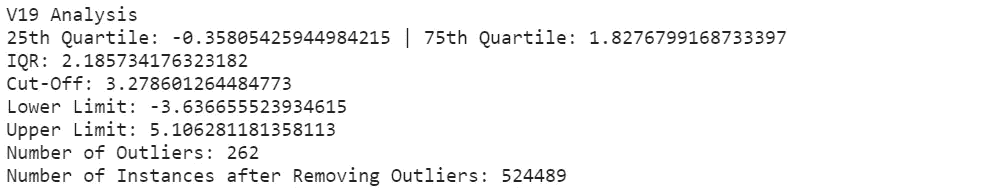****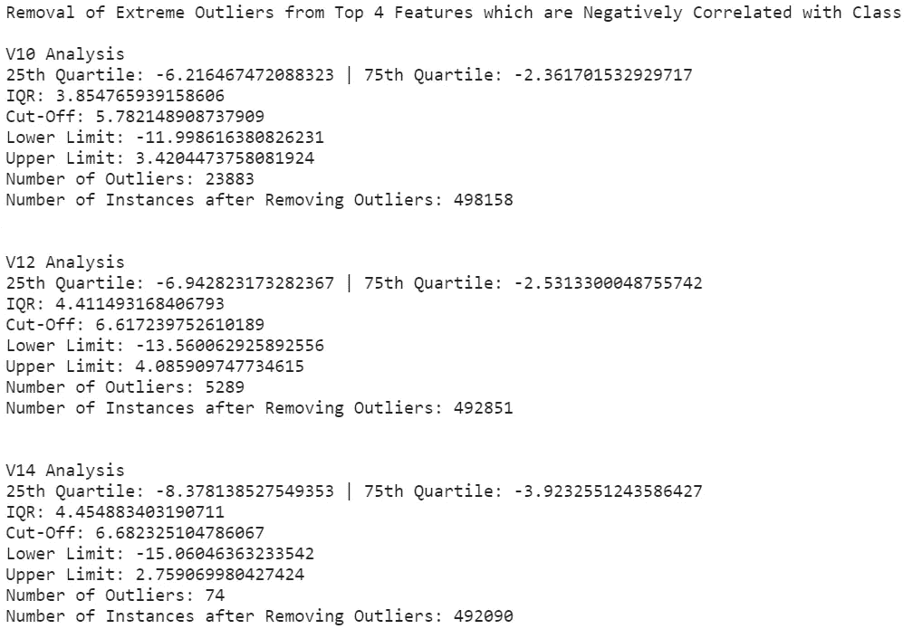****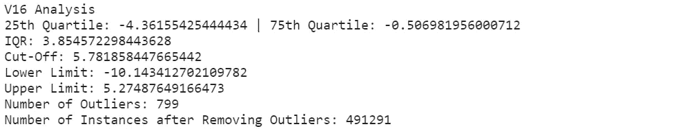**

# **模型 2:优化的逻辑回归模型**

**逻辑回归模型通过**网格搜索**进行优化，网格搜索**是对估计器**的指定参数值进行穷尽搜索。它从网格中选择超参数的组合，使用训练数据的交叉验证对它们进行评估，并返回表现最佳的值。**

**我们为网格搜索选择了以下[模型参数](https://scikit-learn.org/stable/modules/generated/sklearn.linear_model.LogisticRegression.html):**

> ****刑罚:** 用来指定刑罚所用的定额。**
> 
> ****C:**Cs 中的每个值描述了正则化强度的倒数。如果 Cs 为整数，则在 1e-4 和 1e4 之间的对数标度中选择 Cs 值的网格。较小的值指定较强的正则化。**

**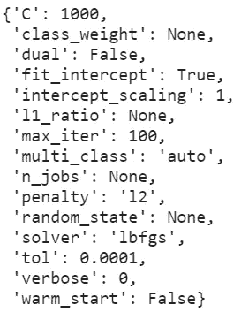**

**基于网格搜索，最佳超参数值不是默认值。这显示了针对特定数据集优化模型的重要性。每个数据集都有不同的特征，在一个数据集上表现最好的模型不一定在所有数据集上都表现最好。**

# **使用最佳模型优化逻辑回归**

**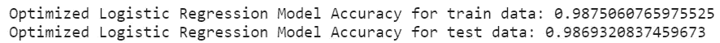**

**虽然优化模型实现的性能略低于基线模型，但它代表了学习曲线的更真实拟合，而不是训练和测试数据的几乎完美的 100%准确度。**

# **模型 3:朴素贝叶斯模型**

**根据 [Scikit-Learn](https://scikit-learn.org/stable/modules/naive_bayes.html) 文档，**

> ****BernoulliNB** 为按照多元伯努利分布分布的**数据实现朴素贝叶斯训练和分类算法；即，可能有多个特征，但每个特征都被假设为二进制值(伯努利、布尔)变量。因此，该类要求将样本表示为二进制值特征向量；如果传递任何其他类型的数据，BernoulliNB 实例可能会将其输入二进制化(取决于二进制化参数)。****

**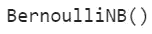****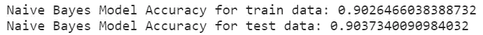**

**与优化的逻辑回归模型相比，朴素贝叶斯模型似乎具有不太理想的学习曲线拟合，并且通过在测试数据上使用训练模型实现的准确率较低。**

# **模型的性能评估**

# **1.分类报告**

****分类报告**显示了每个分类基础上的主要分类度量的表示，并给出了对分类器行为的更深层次的直觉，这可以掩盖多类问题中一类的功能弱点。这些指标是根据真阳性和假阳性以及真阴性和假阴性来定义的。**

****精度**是分类器不将实际上为负的实例标记为正的能力。对于每个类别，它被定义为真阳性与真阳性和假阳性之和的比率。**

***对于所有分类为阳性的实例，正确的百分比是多少？***

****回忆**是分类器找到所有肯定实例的能力。对于每个类别，它被定义为真阳性与真阳性和假阴性之和的比率。**

***对于所有实际呈阳性的实例，正确分类的百分比是多少？***

****F1 分数**是精确度和召回率的加权调和平均值，最好的分数是 1.0，最差的是 0.0。一般来说，F1 分数低于准确度，因为它们将准确度和召回率嵌入到计算中。根据经验，F1 分数的加权平均值应该用于比较分类器模型，而不是全局准确性。**

****Support** 是指定数据集中该类实际出现的次数。训练数据中的不平衡支持可能指示分类器的报告分数中的结构弱点，并且可能指示需要分层采样或重新平衡。支持在模型之间不改变，而是诊断评估过程。**

**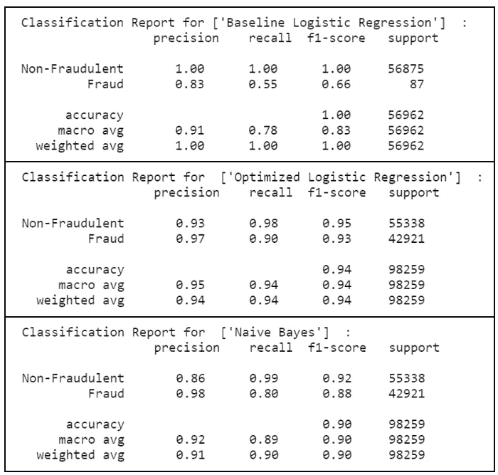**

**总的来说，优化的逻辑回归模型在上述指标中表现良好。特别是，在执行 SMOTE 以保持数据集平衡的情况下，在****的少数民族阶层**(即标签‘1’代表欺诈交易)，其中**召回分数提高了 64%，从 0.55 提高到 0.90，**通过使用优化的逻辑回归模型，与其基线模型相比。****

**凭借**更高的精确度和召回分数**，优化的逻辑回归模型能够正确标记确实为阳性的实例。在这些实际上为阳性的实例中，优化的逻辑回归模型在很大程度上正确地对它们进行了分类。这直接转化为更高的 F1 分数**作为精确度和召回率的加权调和平均值**。**

# **2.混淆矩阵**

****混淆矩阵**采用拟合的 scikit-learn 分类器和一组测试 x 和 y 值，并返回一份报告，显示每个测试值预测的类别与其实际类别相比如何。它们提供的信息与分类报告中提供的信息相似，但它们提供的不是顶级分数，而是对单个数据点分类的更深入了解。**

**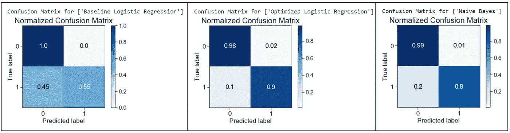**

**优化的逻辑回归模型表现良好，减少了 [**类型 2 错误:假阴性**](https://www.statisticssolutions.com/to-err-is-human-what-are-type-i-and-ii-errors/) (预测非欺诈性交易，但实际上是欺诈性交易)。当将优化的逻辑回归模型的结果与其基线模型进行比较时，**得分从 0.45 到 0.1 显著下降了 78%。****

**然而， [**类型 1 错误:假阳性**](https://www.statisticssolutions.com/to-err-is-human-what-are-type-i-and-ii-errors/) (预测欺诈但实际上非欺诈交易)的**增加了 2%，从 0 到 0.02** ，通过比较优化的逻辑回归与其基线模型。**

**总的来说，假阳性多的影响随着假阴性的显著减少而减轻。这在信用卡欺诈预测场景中非常重要，在这种场景中，错误识别非欺诈交易的风险超过了遗漏真实欺诈交易的可能性。**

**与实际类别相比，预测类别的测试值具有良好的结果，优化逻辑回归模型的标准化混淆矩阵结果优于其他模型。**

# **3.精确回忆曲线**

****精确召回曲线**是用于评估分类器质量的度量。精度-召回曲线显示了精度(结果相关性的度量)和召回(返回多少相关结果的度量)之间的权衡。曲线下的大部分区域表示高召回率和高精度，这是分类器的最佳情况，显示了为其选择的大多数类返回准确结果的模型。**

**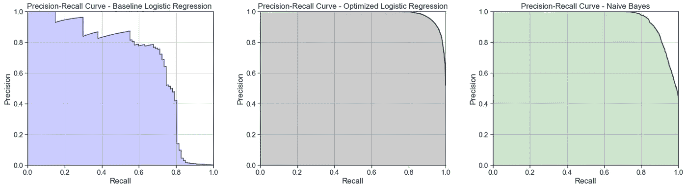**

**优化后的 logistic 回归模型获得了较高的精确-召回曲线下面积。这表示高召回率和高精确度分数，其中高精确度与低假阳性率相关，高召回率与低假阴性率相关。两者的高分表明优化的逻辑回归模型已经返回了准确的结果(高精度)，以及所有阳性结果的大部分(高回忆)。**

# **4.ROC 曲线和 AUC**

**接收器操作特征(“ROC”)/曲线下面积(“AUC”)图允许用户可视化分类器的灵敏度和特异性之间的权衡。**

****ROC** 是对分类器预测质量的一种度量，它比较并可视化了模型的灵敏度和特异性之间的权衡。绘制时，ROC 曲线在 Y 轴上显示真阳性率，在 X 轴上显示假阳性率，包括全球平均值和每个类别。因此，理想点是图的左上角，这里假阳性为零，真阳性为一。**

****AUC** 是假阳性和真阳性之间关系的计算。AUC 越高，模型通常越好。然而，检查曲线的“陡度”也很重要，因为这描述了在最小化假阳性率的同时最大化真阳性率。**

**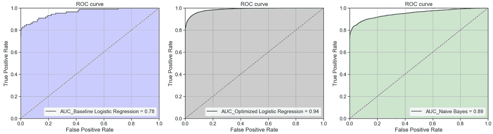**

**所有模型都优于基线猜测，优化的逻辑回归模型获得了最好的 AUC 结果。因此，表明优化的 logistic 回归模型是一个较好的分类器。**

# **5.校准曲线**

**当执行分类时，人们经常希望不仅预测类别标签，而且预测相关的概率。这个概率给出了预测的某种可信度。因此，校准图可用于确定预测概率是否可直接解释为置信水平。**

**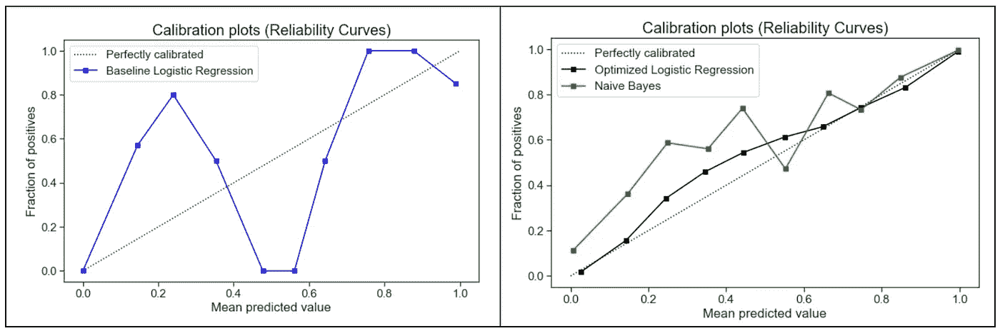**

**与其他两个模型相比，优化的逻辑回归模型的校准图最接近完美校准。因此，优化的逻辑回归模型更可靠，能够更好地推广到新的数据。**

# **结论**

**与其他模型相比，**优化的逻辑回归模型在测试集上具有更好的泛化性能**,并且方差减小。虽然基线逻辑回归过度拟合，但与优化的逻辑回归模型相比，朴素贝叶斯模型无法在分类报告和标准化混淆矩阵中获得更高的分数。**

**逻辑回归优化的**使用**对结果有重大影响，考虑了以下两个因素:**

1.  ****击打**创建新的合成点，以获得平衡的数据集**
2.  ****网格搜索**选择最佳超参数以最大化模型性能**

**尽管如此，这些结果也归因于逻辑回归的独特优势，它旨在用于二元(两类)分类问题。它预测一个实例属于默认类的概率，可以导出为一个**二进制输出变量**(即。0 或 1 分类)。通过优化逻辑回归模型，它产生了一个更适合分类问题的模型。**

**为了进一步增强模型性能，可以进行改进，在优化的逻辑回归模型中使用足够大且通用的数据集进行训练，而不仅仅是 2 天的交易量。**

# **参考**

1.  **[什么是本福特定律，为什么欺诈审查员会使用它](https://www.acfeinsights.com/acfe-insights/what-is-benfords-law)**
2.  **[im learn . over _ sampling 的文档。重击](https://imbalanced-learn.readthedocs.io/en/stable/generated/imblearn.over_sampling.SMOTE.html)**
3.  **[如何使用统计学来识别数据中的异常值](https://machinelearningmastery.com/how-to-use-statistics-to-identify-outliers-in-data/)**
4.  **[sci kit-学习朴素贝叶斯的文档](https://scikit-learn.org/stable/modules/naive_bayes.html)**