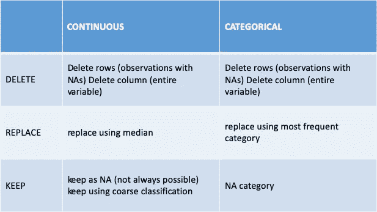
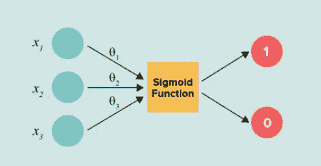
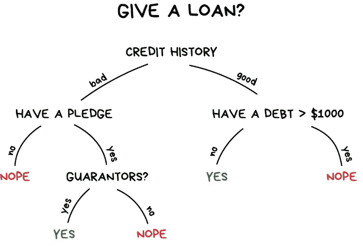
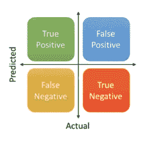
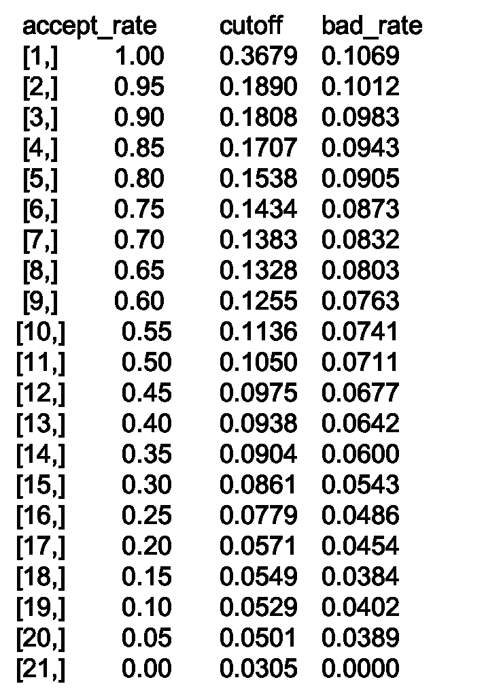
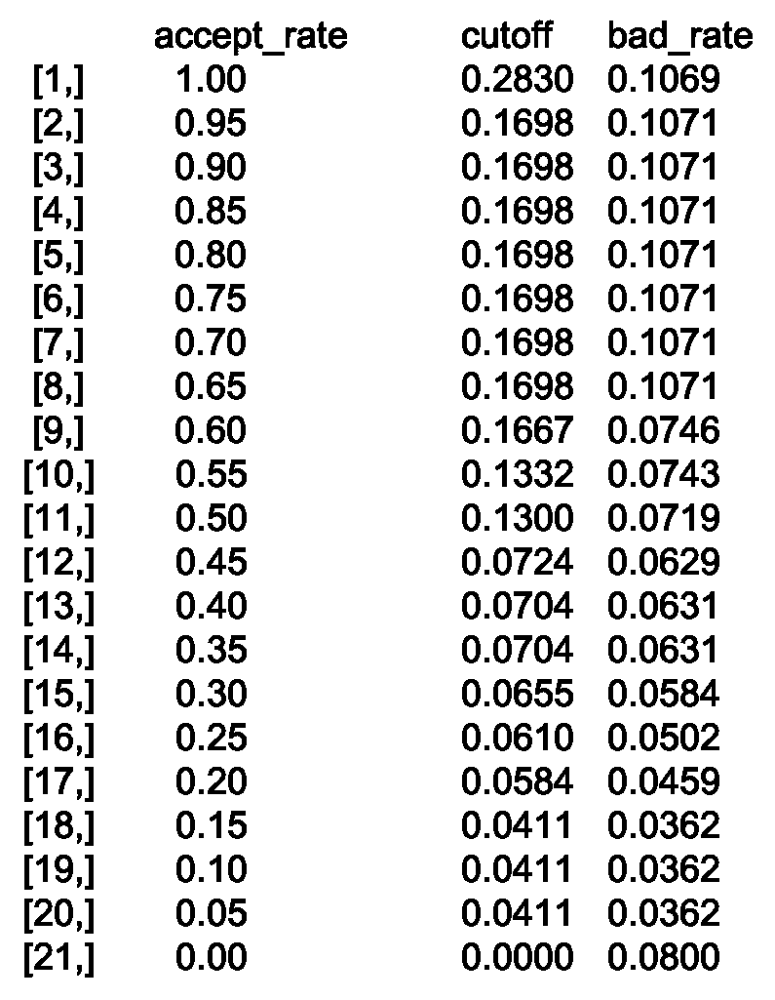
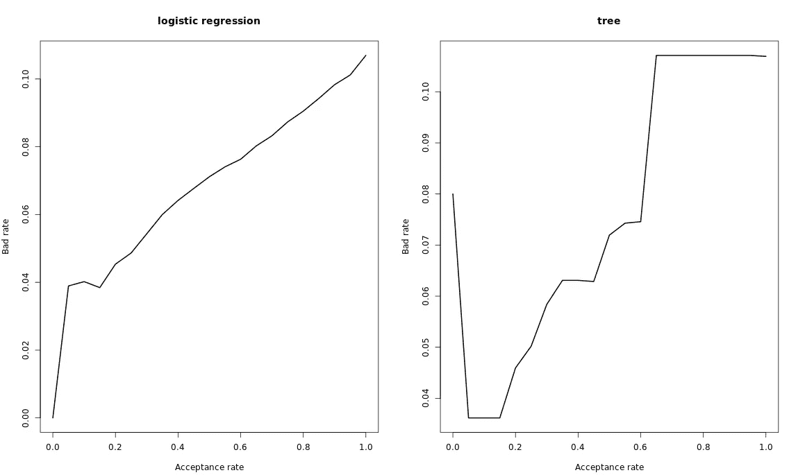
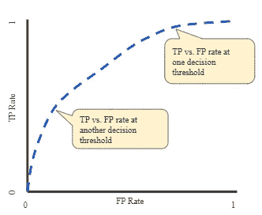
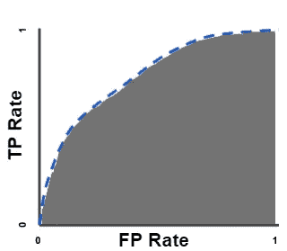

# 信用风险建模——模型预测精度不高怎么办？

> 原文：<https://pub.towardsai.net/credit-risk-modeling-what-if-models-prediction-accuracy-not-high-717f64a5d3d8?source=collection_archive---------1----------------------->

## 现实世界的问题和机器学习

## 最好的模特表演是什么？

> 本文旨在分享概念，而不是方法或代码。


O 当我谈论信用风险建模(贷款支付违约、信用卡支付违约)时，我经常遇到的一个问题是关于算法或模型的预测局限性。

如果预测概率较低，如何实现解决方案？我们如何将模型或算法有效地用于现实世界的问题？

我已经列出了所有可用的预测违约概率的方法，但没有深入细节，因为这不是本文的目的。

让我们快速看一下如何预测违约概率的一些方法。

# 实现# 1:

> 所有预测模型都包含预测误差。**接受吧。**

> 考虑到数据和算法的[随机](https://en.wikipedia.org/wiki/Stochastic)特性，现实世界的问题不可能得到满分。

带着这个想法，让我们继续。

# **贷款违约:组件**

在发放信贷前做出决策的主要措施是**预期损失，**由三部分组成。

**预期损失(EL):**

1.  违约概率
2.  违约风险(EAD)
3.  违约损失(LGD)

## 如何计算预期损失

EL= (PD * EAD * LGD)

我们将在本文中讨论违约相关信息的概率。

## 用于决策的信息:

银行在做出决定之前会使用各种信息。

1.  **申请信息:**收入、婚姻状况、年龄、房主等…

2 **。行为信息:**账户余额、历史付款及时性、违约、借款频率等…

## 示例数据集

我们将使用一个包含如下所示信息的示例数据集来解释以下内容中需要的概念。

```
> head(loan_dat) loan_status loan_amnt int_rate  grade  emp_length   home_ownership
1           0      5000    10.65   B         10           RENT
2           0      2400       NA   C         25           RENT
3           0     10000    13.49   C         13           RENT
4           0      5000       NA   A          3           RENT
5           0      3000       NA   E          9           RENT
6           0     12000    12.69   B         11           OWN
    annual_inc    age
1      24000      33
2      12252      31
3      49200      24
4      36000      39
5      48000      24
6      75000      28
```

## 理解数据:

执行探索性数据分析(EDA)以更好地理解数据集。

1.  ***异常值管理*** :

*   使用异常值检测方法检查异常值(单变量和多变量)—检查这些文章以快速理解。

2. ***缺失数据:策略***

*   删除行/列(不推荐)
*   替换(中位数插补)
*   保留 NA(粗略分类，将变量放入“bin”)

## 快速备忘单:



# 创建模型的一些方法

我们不会深入讨论如何创建模型，而是陈述几个想法来解释这个概念。

[**逻辑回归:**](https://towardsdatascience.com/machine-learning-part-3-logistics-regression-9d890928680f)



1.  输出介于 0 和 1 之间的回归模型。
2.  我们需要一个临界值或阈值来定义一个预测是违约还是非违约。

> 一个带有“年龄”和“房屋所有权”的例子将如下所示，在求解时将具有违约概率值。
> 
> *P(贷款状态= 1 |年龄=32，房屋所有权=租金)*

## 决策树:



很难为信用风险数据建立一个好的决策树。主要原因是数据不平衡。

*克服不平衡数据*，

1.  欠采样或过采样
2.  准确性问题将会消失
3.  仅在训练集上使用
4.  改变先验概率
5.  包括损失矩阵

验证模型，看看什么是最好的！

## 大型决策树的问题:

1.  它们太复杂，不清楚
2.  当模型应用于测试集时，会发生过度拟合

应该考虑修剪技术

# 一些措施



1.  **准确度** =(真阴性+真阳性)/(真阴性+假阳性+假阴性+真阳性)
2.  **灵敏度** =真阳性/(假阴性+真阳性)
3.  **特异性** =真阴性/(真阴性+假阳性)
4.  **精度** =真阳性/(真阳性+假阳性)
5.  **回忆** =真阳性/(真阳性+假阴性)
6.  **F1 得分** = (2 x(精度 x 召回)/(精度+召回))

**如何使用准确度、精密度、召回措施。**

*高精度&高召回:* 良好的&平衡模式

*高精度&低召回:* 不好检测，但检测时准确

*精度低&召回率高:*检测能力好，但误报几率高

> **准确性**衡量样本总数中正确预测样本的数量，而**不是衡量不平衡数据的更好方法。**
> 
> 只有在类标签均匀分布的情况下，使用准确度作为度量才有意义

# 实现# 2:

> 不管有多少贷款申请被拒绝，仍然会有债务人违约

# 策略:

现在，我们意识到这些模型永远不会是 100%完美的，有多少申请会因为这个模型而被拒绝，仍然会有借款人违约。

> 这个问题的替代解决方案是，我们可以使用模型来决定银行应该批准多少贷款，如果他们不想超过一定比例的违约。

让我们假设一家银行基于拟合的违约概率决定**拒绝 20%** 的新申请人。这意味着预测违约概率最高的 20%将被拒绝。

## 截止值:

要获得导致测试集中 20%案例的预测概率为 1(默认)的临界值，我们应该查看预测向量的 80% *分位数*。

使用这个截止点，我们将知道使用 80%的接受率，哪个测试集贷款申请人会被拒绝。

*获得 80%接受率的临界值*

```
cutoff_point <- quantile(prob_default, 0.8)
```

获得二元预测。(如果预测概率>截止值，则标记 1，否则标记 0)

```
bin_pred <- ifelse(prob_default > cutoff_point, 1, 0)
```

如果我们用这个截止值来看一看已经接受的贷款的真实状况，并看看这组*接受的贷款中有多少百分比实际上违约了*(也称为 ***坏账率)***

```
accepted_loans <- test_set$loan_status[bin_pred == 0]
```

获取已接受贷款的坏账率

```
bad_rate <- sum(accepted_loans) / length(accepted_loans)
```

# 策略表和策略曲线

重复我们在上一个练习中对几个接受率所做的计算，我们可以得到一个策略表。

这张表对银行来说是一个有用的工具，因为它能给银行提供更好的洞察力来定义一个可接受的策略。

假设我们有两个不同的模型，策略表可能是这样的。

## 策略表:



左:模型 1 的策略表|右:模型 2 的策略表

## 策略曲线:



# **对非技术人员的模型输出说明**

如果银行不想经历这个艰难的决定，不得不选择接受率或不良率的想法呢？如果他们只想知道总体上哪个是最好的模型呢？

那么建立具有更好 AUC 的模型将是一种解释方式。但应该注意的是，更好的 AUC 并不总是能解决我们在现实世界中的问题。

**优点:**

1.  衡量预测的排名
2.  测量模型预测的质量，而不管选择了什么分类阈值。

**缺点:**

1.  如果我们需要精确校准的概率输出，AUC 不会告诉我们。
2.  在假阴性与假阳性的成本非常重要的情况下，最小化一种分类错误可能是至关重要的。在这种情况下，AUC 不是一个有用的指标。
3.  **ROC 曲线** ( **受试者工作特性曲线**)，显示分类模型在所有分类阈值的性能的图形。

这条曲线描绘了两个参数:真阳性率和假阳性率



ROC 曲线图

5.**AUC(ROC 曲线下面积)，** AUC 测量整个 ROC 曲线下的整个二维面积

*   AUC 值的范围从 0 到 1。
*   具有 100%错误预测的模型将具有 0.0 的 AUC
*   具有 100%正确预测的模型将具有 1.0 的 AUC。



AUC 图

用更简单的术语来说，左边更高的 AUC 曲线通常是更好的模型。

> **警示**:如果问题陈述是为了减少违约，那么应该时刻警惕**假阴性率**。

# 总结:

虽然构建具有高 AUC 的机器学习模型是理想的方式，但本文旨在让那些无法提高模型性能的人知道，无论有什么限制，他们仍然可以尝试将他们的模型与策略曲线和策略表结合起来，以回答一些现实世界的问题。