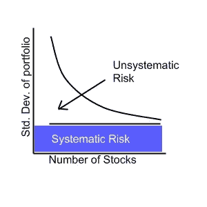
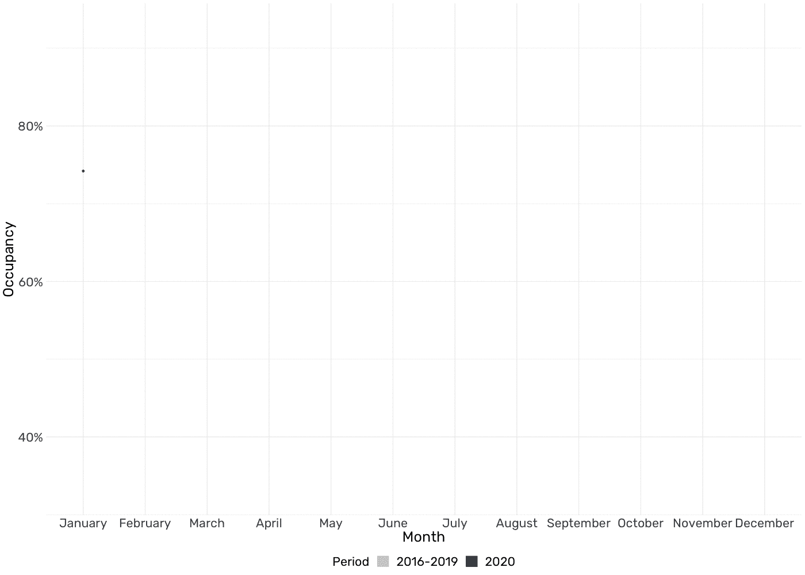
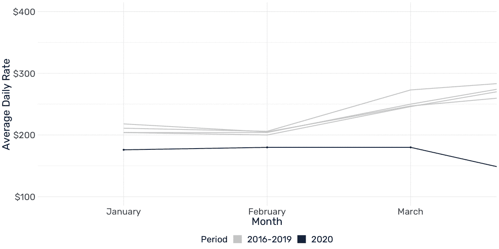
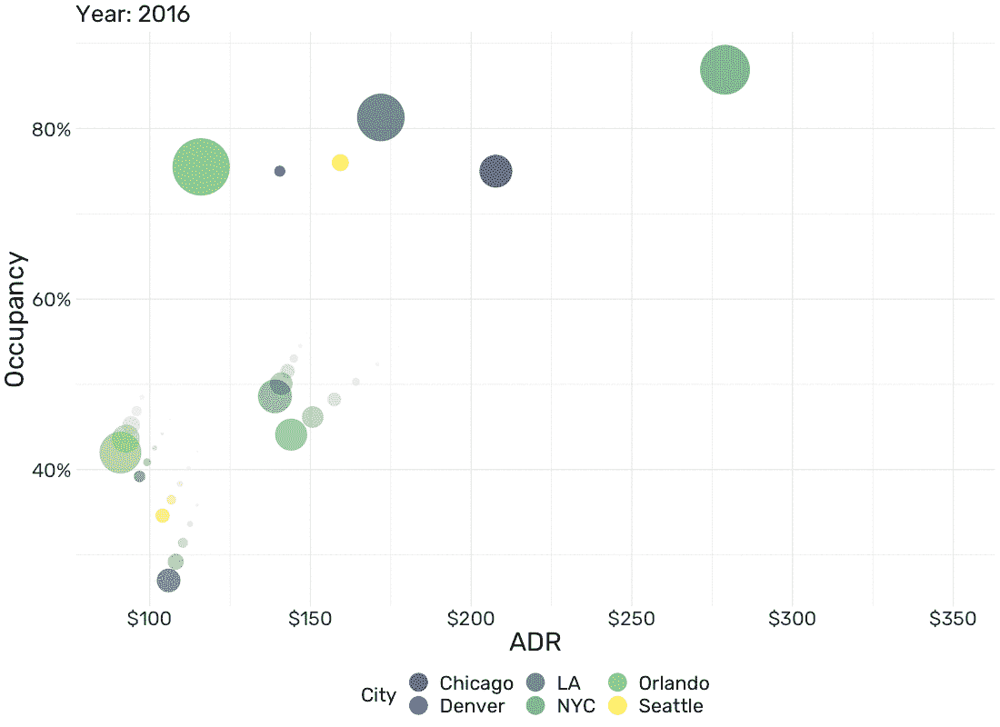
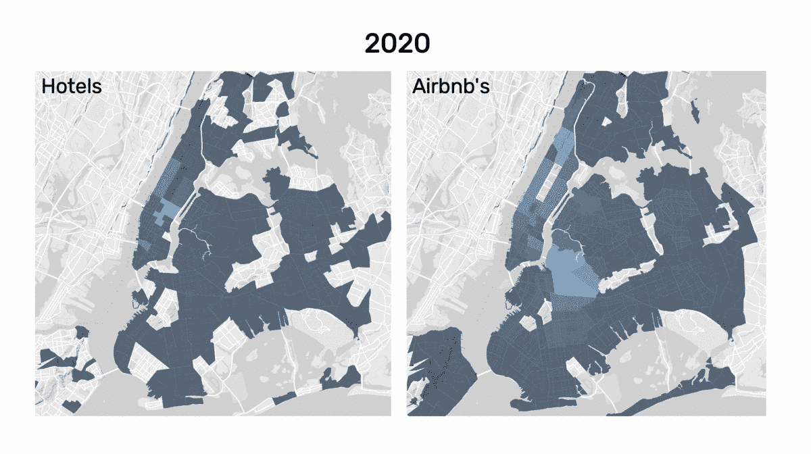
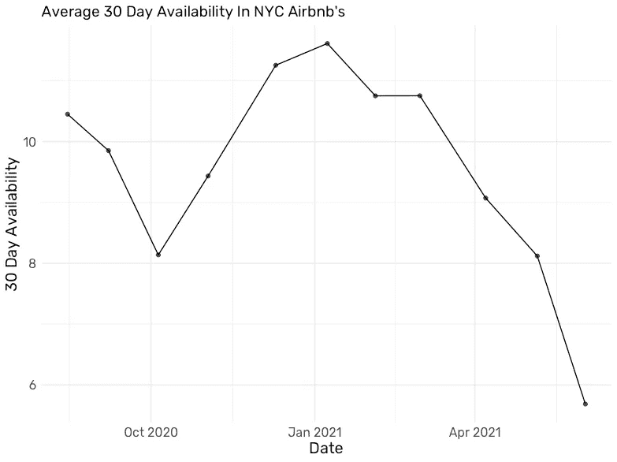

# 酒店业的危机防护

> 原文：<https://pub.towardsai.net/crisis-proofing-the-hospitality-industry-4e6621a00b09?source=collection_archive---------3----------------------->

## [数据可视化](https://towardsai.net/p/category/data-visualization)

## 使用数据可视化寻找降低风险的措施

我自己创造的

# 介绍

像美国和海外的大多数其他主要酒店市场一样，新冠肺炎将平常的一年变成了几十年来最糟糕的一年。旅游限制大大减少了进入这座城市的游客流量，大约有 8500 名无家可归的人被转移到疫情最繁华的酒店，甚至像万豪酒店[这样的酒店业前疫情明星也不得不解雇数百人](https://www.wsj.com/articles/marriott-lays-off-hundreds-of-workers-at-times-square-hotel-11608033611)。现在，随着美国各地的疫苗接种计划允许企业慢慢重新开业，几个问题仍然存在。首先也是最重要的是，调查是否有办法让酒店至少不那么容易受到危机的影响，这应该是最值得关注的问题。虽然酒店业经历了艰难的一年，但其他房地产资产类别一直表现良好。物流，尤其是旨在满足电子商务需求的仓库，对空间的需求已经接近历史最高水平。

由于其商业模式，在危机期间，为了减少损失，酒店不能偏离其预期目的太远。一些酒店试图通过出租房间作为办公室或充当隔离酒店来赚取额外收入。然而，所有上述努力纯粹是反应性的，因此，只能提供这么多的缓解。相反，酒店公司应该采取预防措施，分析新冠肺炎的教训，并将其纳入投资决策，以降低风险。

# 降低非系统风险

本文解决的主要问题是减少非系统风险。借用金融理论，有一个独特的风险与您的特定投资以及一定程度的市场风险相关联。虽然市场风险无法降低，但与投资相关的非系统风险可以降低。

来源:[维基共享资源](https://commons.wikimedia.org/wiki/File:The_difference_between_systematic_and_unsystematic_risk.jpg)

当投资股票时，减少非系统风险的最简单方法是通过购买更多的股票来增加投资组合的多样化，如上所述。继续这个类比，本文将分析哪些方面可能有助于降低酒店投资组合的风险水平。

## 宇宙大爆炸

2020 年的头两个月似乎预示着纽约酒店业完美的普通一年。虽然早在 1 月 23 日就报道了美国的[首例新冠肺炎病例，但入住率却在一个多月后受到影响。在 2020 年 3 月入住率首次下降至 34.5%后，5 月份大幅上升至 47.2%，似乎预示着快速复苏。然而，入住率随后再次开始下降，并在 2020 年下半年保持在 40%以下。](https://en.wikipedia.org/wiki/COVID-19_pandemic#:~:text=The%20first%20cases%20in%20North,case%20on%2016%20April.)

纽约酒店入住率(2016–2019 对比 2020)；我自己创造的

上述事态发展似乎表明，为提高占用率所做的努力，例如出租房间作为办公室，收效甚微，甚至没有效果。这将进一步强调预防性战略的重要性，而不是用反应性措施来应对危机。同样值得注意的是，2020 年 7 月开始的入住率基本保持在略低于 40%的水平。

## 定价(不足)

在正常情况下，价格在接待中非常重要。一年中不同季节的不同需求允许非常动态的定价策略。虽然入住率似乎反映了前几年的情况，但 2020 年 1 月和 2 月的平均每日房价(ADR)是本次分析中包括的 5 年内首次低于 200 美元的 ADR，这可能是由不断增加的客房供应推动的。

纽约酒店的平均每日房价(2016–2019 对比 2020)；我自己创造的

此外，ADR 时间序列通常遵循季节性模式，冬季和秋季平均价格较低，夏季和圣诞节期间价格较高。然而，2020 年的平均每日房价似乎没有显示出季节性模式，从 2020 年 4 月起，大致保持在 130 美元至 140 美元之间。加上类似的静态入住率，纽约市的酒店似乎已经收敛到“疫情最低”收入，在 2020 年下半年保持相对稳定。如果这种最小危机收入假设成立，那么最小化风险暴露将主要遵循两个维度:首先，确定哪个市场在危机期间提供最大保护，其次，哪种类型的酒店投资在经济衰退期间产生最高回报。

## 位置，位置，位置

在分析哪个地区的市场在危机中表现最佳时，一些最重要的维度包括入住率、ADR 和客房供应。下面的 [Gapminder](https://de.wikipedia.org/wiki/Gapminder) 主题可视化比较了六个不同的美国酒店市场，每个泡沫的大小代表了市场的客房供应量。

我自己创造的

有趣的是，除了芝加哥之外，较大的市场似乎比丹佛和西雅图等较小的市场受到疫情的冲击要小。此外，在疫情期间，入住率和 ADR 似乎已经收敛到非常相似的水平。疫情之前，纽约的平均房价几乎是洛杉矶的两倍，而 2020 年疫情的平均房价几乎是一样的。因此，投资于洛杉矶或纽约等接待大量商务和休闲游客的较大市场，似乎能在危机期间提供更大的稳定性。此外，由于危机限制了大多数人和公司的可支配现金数量，与其他市场相比，奥兰多和洛杉矶等生活质量高、天气好的理想地点的市场似乎不太容易出现入住率和 ADR 下降的情况。

## 酒店对 Airbnb

除了市场位置之外，决定私人出租的公寓或酒店在危机期间表现更好也会极大地影响预防性投资决策。放眼纽约，新冠肺炎对这座城市的热情好客的影响显而易见。浅蓝色区域分别代表纽约市附近高密度的酒店和航空旅馆，而深蓝色区域代表较低的密度。

纽约市酒店和机场的密度；我自己创造的

虽然布鲁克林的大多数公寓都有空中旅馆，但酒店却非常集中在曼哈顿市中心。对比 2020 年和 2021 年，酒店密度几乎没有受到影响，略有增加。另一方面，空中旅馆现在在更多的社区出现，但密度已经降低。这可能也是因为在重新规划时，单个公寓比整个酒店建筑提供了更大的灵活性。

虽然 Airbnb 不公布入住率，但 Airbnb 内部的[收集的数据包含了平台上每个可用 Airbnb 的 30 天可用性。虽然这个时间序列相对较短，但很明显，在纽约市的平均 30 天可用性于 2021 年 1 月 8 日达到 11.6 天的峰值后，Airbnbs 似乎在 2021 年恢复得相当快。把 11.6 天变成入住率，2020 年 8 月以来最低的 Airbnb 入住率在 39%左右，比相应时间段的最低酒店入住率高 6%左右。](http://insideairbnb.com/get-the-data.html)

我自己创造的

除了入住率之外，价格在评估新冠肺炎对纽约市 Airbnbs 的影响方面也发挥着关键作用。为了使结果与以曼哈顿为中心的酒店行业更具可比性，下面的方框图按区对价格进行了细分。出于同样的原因，该地块的价格上限为每晚 400 美元。

我自己创造的

不出所料，曼哈顿的 Airbnbs 是最贵的。2020 年 8 月至 12 月期间，曼哈顿 Airbnb 的最高均价是 9 月和 8 月的 163 美元。此外，尽管 Airbnbs 没有集中定价，但平均价格通常会保持相当稳定，并根据市场需求进行调整，就像您希望酒店定价进行调整一样。

# 结论

虽然 2020 年对酒店业来说是残酷的一年，但它也提供了充足的数据，可以用来使该行业更好地抵御危机。从数据中可以明显看出，出租房间作为办公室等反应性措施对危机收入没有显著影响。相反，该行业应该在其投资决策过程中整合更全面的风险状况，以最大限度地减少危机期间的风险敞口。美国更大、更受欢迎的市场似乎为入住率下降提供了一定程度的保护。此外，使酒店组合中的住宿类型更加多样化也有助于降低风险。因此，将重点放在更能抵御危机的市场位置和在一定程度上使住宿类型多样化的不同组合，可以为每个公司的战略提供定制的风险水平。

*来源:*

[1]“5 年趋势报告—疫情版。”纽约公司。2021 年 7 月 18 日进入。【https://nycgo.com】T2。

[2]“数据驱动的解决方案助力酒店业。”海峡。2021 年 7 月 22 日访问。【https://str.com/data-insights/news/press-releases. 

[3]“Airbnb 内部。为辩论添加数据。”Airbnb 内部。2021 年 7 月 24 日进入。[http://insideairbnb.com/.](http://insideairbnb.com/.)

[4]“纽约市开放数据。”纽约开放数据 WP 引擎。纽约市。2021 年 7 月 21 日访问。[https://opendata.cityofnewyork.us/.](https://opendata.cityofnewyork.us/.)

[5]“美国研究与报告。”CBRE 美国。2021 年 7 月 20 日访问。[https://www.cbre.us/research-and-reports.](https://www.cbre.us/research-and-reports.)