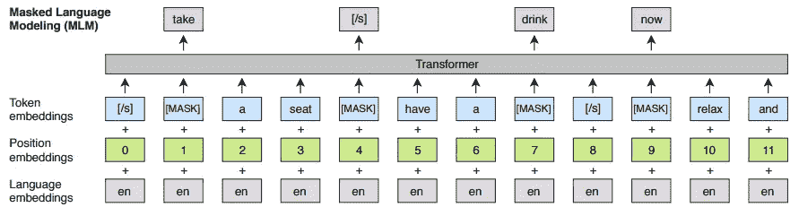
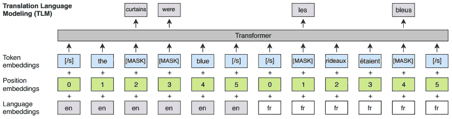
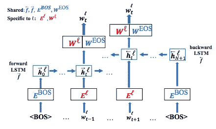
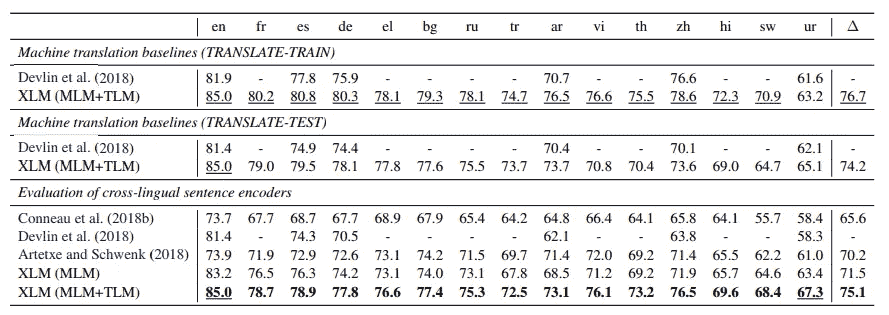
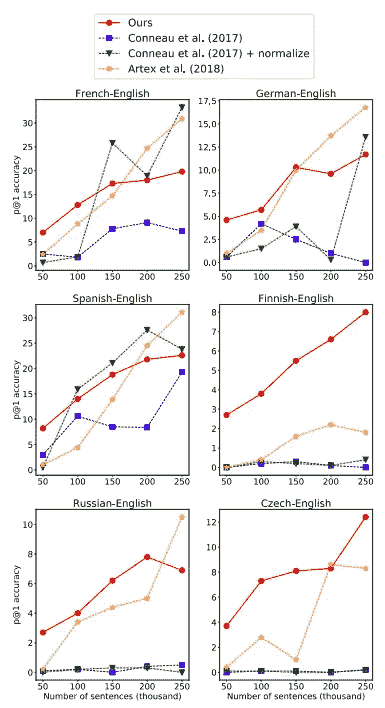

# 跨语言语言模型

> 原文：<https://pub.towardsai.net/cross-lingual-language-model-56a65dba9358?source=collection_archive---------1----------------------->

## XLMs 预训练模型| [朝向 AI](https://towardsai.net)

## 通过多语言神经语言模型讨论 XLMs 和无监督跨语言单词嵌入

[马志威](https://unsplash.com/@makcedward?utm_source=medium&utm_medium=referral)在 [Unsplash](https://unsplash.com?utm_source=medium&utm_medium=referral) 上拍照

预训练模型被证明可以改善下游问题。Lample 和 Conneau 提出了两个新的训练目标来训练跨语言语言模型(XLM)。这种方法在跨语言自然语言推理(XNLI)方面取得了最新的成果。另一方面，Wada 和 Iwata 提出了另一种在没有平行数据的情况下学习跨语言文本表示的方法。他们将其命名为多语言神经语言模型。

本故事将讨论[跨语言语言模型预训练](https://arxiv.org/pdf/1901.07291.pdf) (Lample 和 Conneau，2019)和[多语言神经语言模型的无监督跨语言单词嵌入](https://arxiv.org/pdf/1809.02306.pdf) (Wada 和 Iwata，2018)

将涵盖以下内容:

*   数据
*   跨语言语言模型架构
*   多语言神经语言模型架构
*   实验

# 数据

Lample 和 Conneau 将维基百科转储用于单语数据，而跨语言数据来自:

*   MultiUN (Ziemski 等人，2016 年):法文、西班牙文、俄文、阿拉伯文和中文
*   IIT 孟买语料库(Anoop 等人，2018 年):印地语
*   OPUS (Tiedemann，2012):德语、希腊语、保加利亚语、土耳其语、越南语、泰语、乌尔都语、斯瓦希里语和斯瓦希里语

Wada 和 Iwata 对除芬兰语之外的每种语言使用新闻搜索 2012 单语语料库，而对芬兰语使用新闻搜索 2014。

# 跨语言语言模型架构

## 输入表示

为了处理词汇外(OOV)和跨语言，应用字节对编码( [BPE](https://towardsdatascience.com/how-subword-helps-on-your-nlp-model-83dd1b836f46) )子字算法将一个字分割成子字。不是每种语言使用不同的子词集，而是共享相同的字母、数字、特殊标记和专有名词，以改进跨语言嵌入空格的对齐。

除了子词，XLM 还将位置嵌入(表示句子的位置)和语言嵌入(表示不同的语言)输入到不同的语言模型(LM)中来学习文本表示。这些 LM 是:

*   因果语言建模(CLM)
*   掩蔽语言建模(MLM)
*   翻译语言建模(TLM)

## 因果语言建模(CLM)

CLM 由一个[转换器](https://towardsdatascience.com/combining-supervised-learning-and-unsupervised-learning-to-improve-word-vectors-d4dea84ec36b)组成，通过提供一组先前的特性来学习文本表示。给定当前批次的前一个隐藏状态，模型预测下一个单词。

## 掩蔽语言建模(MLM)

Lample 和 Connea 遵循 Devlin 等人(2018)的方法，随机选取 15%的子词，80%的时间用保留字([掩码])替换，10%的时间用随机工作替换，10%的时间保持不变。

Devlin 等人(2018)的不同之处在于:

*   使用任意数量的句子，而不仅仅是句子对
*   [子样](https://towardsdatascience.com/how-negative-sampling-work-on-word2vec-7bf8d545b116)高频子字

MLM 建筑(Lample 和 Conneau，2019)

## 翻译语言建模(TLM)

CLM 和 MLM 是为单语数据设计的，而 TLM 的目标是跨语言数据。BERT 使用段嵌入来表示单个输入序列中不同句子，同时用语言嵌入来代替它来表示不同的语言。

在两种语言数据中随机选取子词。两种语言子词都可以用来预测任何屏蔽词。

TLM 建筑(Lample 和 Conneau，2019)

# 多语言神经语言模型架构

Wada 和 Iwata 注意到并行数据不适合低资源语言。由于该模型不能从并行数据中学习文本表示，子词嵌入在不同的语言中是不同的。然而，他们共享双向 LSTM 来学习多语言的单词嵌入。由于架构是跨语言共享的，Wada 和 Iwata 认为，如果令牌相同，模型可以学习相似的嵌入。

下图显示了此模型的体系结构，同时:

*   正向和反向 LSTM 网络
*   EBOS:嵌入的初始输入
*   WEOS:指出下一个单词作为句子结尾的可能性有多大
*   El:语言 l 的单词嵌入
*   Wl:语言 El 的线性投影，用于计算下一个单词的概率分布

多语言神经语言模型的架构(Wada 和 Iwata 2018)

# 实验

基本上，XLM (MLM + TLM)取得了跨语言的好成绩。由于作者注意到 CLM 在跨语言问题中没有标度，他们在下面的模型比较中没有包括 CLM 的训练对象。

模型中的 XLM 结果(Lample 和 Conneau，2019)

由于 Wada 和 Iwata 专注于解决只有少量单语数据可用，或者单语语料库的领域在语言场景中是不同的。他们打算用不同的数据集大小来看性能。下图展示了在数据集很小的情况下，该模型优于其他模型。

多语言神经语言模型的比较结果(Wada 和 Iwata 2018)

# 拿走

*   伯特使用语段嵌入(代表不同句子)，而 XLM 使用语言嵌入(代表不同的语言)。
*   CLM 不能扩展到跨语言场景。
*   XLM 可能不适合低资源语言，好像需要并行数据(TML)来提升性能。同时，多语言神经语言模型被设计来克服这个限制。

# 喜欢学习？

我是湾区的数据科学家。专注于数据科学、人工智能，尤其是 NLP 和平台相关领域的最新工作。欢迎在 [LinkedIn](https://www.linkedin.com/in/edwardma1026) 上与 [me](https://makcedward.github.io/) 联系，或者在 [Medium](http://medium.com/@makcedward/) 或 [Github](https://github.com/makcedward) 上关注我。

# 延伸阅读

*   [变压器的双向编码器表示(BERT)](https://towardsdatascience.com/how-bert-leverage-attention-mechanism-and-transformer-to-learn-word-contextual-relations-5bbee1b6dbdb)
*   [3 个子字算法帮助拆分一个字](https://towardsdatascience.com/how-subword-helps-on-your-nlp-model-83dd1b836f46)
*   [创成式预培训](https://towardsdatascience.com/combining-supervised-learning-and-unsupervised-learning-to-improve-word-vectors-d4dea84ec36b)
*   XLM 实现( [PyTorch](https://github.com/facebookresearch/XLM) )

# 参考

*   G.兰普尔和 a .康诺。[跨语言语言模型预训练](https://arxiv.org/pdf/1901.07291.pdf)。2019
*   J.戴弗林，张文伟，李，图塔诺娃。 [BERT:用于语言理解的深度双向转换器的预训练](https://arxiv.org/pdf/1810.04805.pdf)。2018
*   T.和田和岩田聪。[通过多语言神经语言模型进行无监督的跨语言单词嵌入](https://arxiv.org/pdf/1809.02306.pdf)。2018