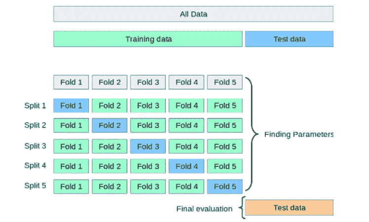
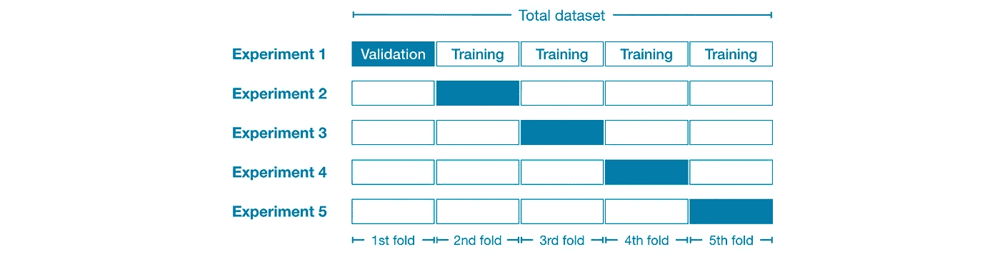

# 交叉验证类型以及何时使用

> 原文：<https://pub.towardsai.net/cross-validation-types-and-when-to-use-it-85617e73256c?source=collection_archive---------1----------------------->

## 测试模型的更好方法

来源: [scikit-learn](https://scikit-learn.org/stable/modules/cross_validation.html)

# 概观

构建机器学习模型是一个伟大的过程，包括几个步骤

1.  **收集数据**
2.  **数据准备&预处理**
3.  **爆炸数据分析**
4.  **特征工程和选择**
5.  **建模与评估**

*   交叉验证是**模型建立和评估最重要的部分之一。**
*   在试验交叉验证之前，让我们看看它是什么，以及为什么我们应该担心使用它。

# 为什么要交叉验证？

*   假设我们有 10000 行(样本)数据集，我们想用它建立一个模型。一个简单的方法是对数据进行训练测试分割，然后用它建立一个模型。对吗？？
*   但是当我们做训练测试分割的时候，我们赋 random_state=某个值。可以是 0，42，69，100。每次你改变 random_state 的值，你都会得到一个不同的训练和测试数据集(你可以随意检查，但你可以相信我的话)。
*   在每个不同的分割中，你会得到不同的精度性能，所以当每个分割都有不同的结果时，你如何确定选择正确的 random_state。
*   这就是交叉验证派上用场的地方，我们使用交叉验证对我们的数据进行不同的分割，以训练和测试我们的模型，我们对这次迭代的整体准确性进行平均，以查看我们模型的整体性能。

# 什么是交叉验证？

*   我们将数据集分成不同的数据块。如果我们有 10000 行，并希望有 5 次迭代。我们可以将前 8000 行作为训练数据，后 2000 行作为测试数据(假设 80/20 分割)。
*   在下一次迭代中，我们可以将前 6000 行和后 2000 行作为训练数据，其余的 2000 行作为测试数据。
*   通过执行相同的过程，我们对具有不同训练和测试数据的数据进行不同的保存。
*   这是一个很好的交叉验证的可视化。(图片来源:Kaggle)

# 交叉验证的类型

**交叉验证主要有 5 种类型**

1.  坚持验证方法
2.  遗漏一个交叉验证
3.  k 倍交叉验证
4.  分层 K 折叠交叉验证
5.  重复随机测试列车分裂

*   保留验证方法是我们常规的训练测试分割方法，其中我们保留部分数据用于测试目的。
*   我们不会在这里讨论遗漏一个交叉验证和重复随机测试序列分割的方法，因为它们很少被使用，并且你可能在你的大多数项目中不需要它们。
*   我将在这里使用乳腺癌威斯康星州数据集进行解释。我不会详细讨论如何实现伟大的特性工程步骤，因为这篇文章的主要目的是交叉验证。

**数据准备**

*   现在我们可以用这些数据建立我们的模型，并使用不同的交叉验证技术

# 坚持验证方法

*   这种模型的结果是 0.920638638867
*   这是我们简单的训练测试分割，我们拿出一部分数据进行验证，其余的用于训练模型。

# k 倍交叉验证

*   分数=[0.9122807 0.92982456 0.89473684 0.98245614 0.98245614 0.98245614 0.96491228 0.96491228 0.96491228 1。]
*   平均分= 0.9578947368421054
*   在 K 倍交叉验证中，我们对数据进行 K 种不同的分割。选择我们的第 k 个折叠的一部分进行验证，并使用其余的数据进行训练。
*   重复这 k 次，每次随机分割我们的数据，产生新的训练和测试数据集。
*   这将给出我们的模型在不同场景中的整体性能。

# 分层 K 折叠交叉验证

*   我们在处理不平衡数据集时使用这种方法。
*   这将给出不同的分割，这将保留类的百分比，因此我们可以有一个合适的数据集来训练和测试我们的模型。

*   分数=[0.98245614 0.89473684 0.94736842 0.94736842 0.98245614 0.94736842 0.94736842 0.94736842 1。
*   平均分= 0.9614035087719298
*   更多关于 it 的深入知识，请查看:

 [## 分层 K 折叠交叉验证

### 在机器学习中，当我们想要训练我们的 ML 模型时，我们将整个数据集分成训练集和测试集…

www.geeksforgeeks.org](https://www.geeksforgeeks.org/stratified-k-fold-cross-validation/) 

# 结论

*   如果您想要使用交叉验证，那么就使用 K 倍交叉验证，如果您的数据集不平衡，并且您事先没有平衡它，那么您可以使用分层 K 倍交叉验证。
*   显然，还有其他方法可以进行交叉验证，但这里提到的是大多数问题中最常用的方法。
*   我希望你喜欢这篇文章，如果你有任何补充或想给反馈，请这样做，因为它将帮助我和其他人提高很多。