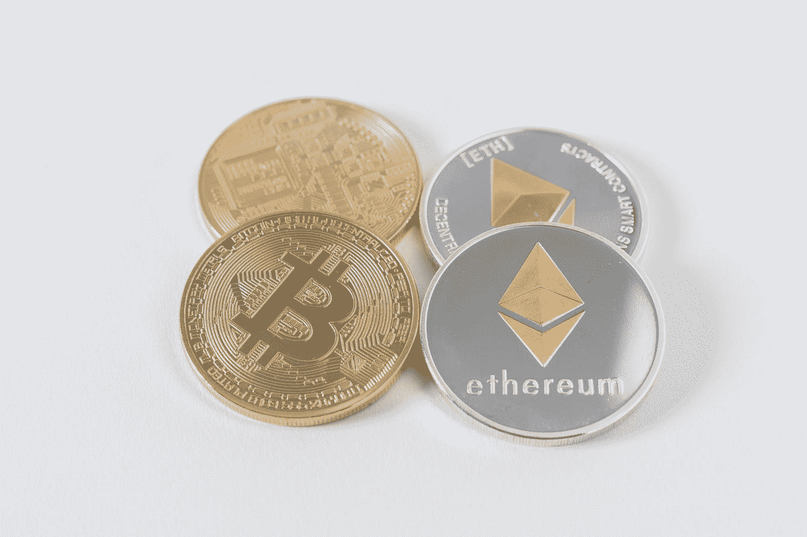

# 加密货币:数字现金初学者指南

> 原文：<https://pub.towardsai.net/cryptocurrency-a-beginners-guide-to-digital-cash-cea36781389d?source=collection_archive---------2----------------------->

## [密码术](https://towardsai.net/p/category/cryptography)

## 加密货币是一种计算机化的分期付款框架

照片由[思想目录](https://unsplash.com/@thoughtcatalog?utm_source=medium&utm_medium=referral)在 [Unsplash](https://unsplash.com?utm_source=medium&utm_medium=referral) 上拍摄

## 介绍

发展改变了人们工作、协商、购物的方式，甚至物品的报酬。协会和购买者通常不再喜欢现金，这种行为提供了一种处理非接触式支付的方式。想必大家在这一点上已经了解了加密货币。我们应该理解这个流行的表达是什么，你可以投入资源的顶级密码是什么。加密货币是一种不依赖银行确认交易的计算机化的劳动力和产品分期付款框架。当你移动计算机化的储蓄时，交易被记录在一份免费的报告中。你把你的加密现金放在一个高级钱包里。

这种数字货币得名于它利用加密来确认交易。高层次的编码安排与存放和发送钱包内的加密信息以及公共记录有关。加密的目的是为了安全和幸福。

数字形式的货币通常是利用区块链创新组装的。区块链描绘了交易被记录成“方块”和时间跨度的方式。

现在，让我们来了解一下有哪些顶级密码

## 1.比特币

事实上，纲要需要从这里开始。这可能是最有效的交换数字货币已经吸引了每个人很长一段时间了。

按市值计算，比特币是全球最大的加密货币。任何银行或政府都不会给予或支持比特币，个人比特币也不像任何投机那样重要，它同样伴随着保险和市场风险。

通常，比特币交易和比特币账户不受官僚或政府计划的保护。比特币的价值可能会波动。它在任何有新闻价值的场合都有很强的感染力。

## 2.醚

以太的市值为 3160 亿美元，是 2015 年第二大加密货币。以太坊背后的目标是建立一个分散的货币项目，这个星球上的任何人都可以不受限制地获得，几乎不考虑身份和国籍。

它自称是世界上可编程的区块链。这是一个货币管理、游戏和应用程序的商业中心，不能获取你的信息。

金融支持者利用各种数字货币交换平台来买卖以太网。目前的决定包括比特币基地，北海巨妖，比特斯坦普，双子座，币安和 Bitfinex。

## 3.币安硬币

这是 2017 年启动的第三大数字货币，市值为 909 亿美元。截至 2021 年 4 月，就交易量而言，币安是全球最大的数字货币交易市场。

BNB 起初依赖以太坊组织，但目前是币安区块链的当地现金，币安链。它用于支付币安 DEX 和币安 Chain 的交易费用。

同样，在撰写本文时，人们可以利用币安硬币将资源投入到通过币安的 Launchpad 记录的某些 ico 中，币安硬币的市值为 53，164，821，304 美元

## 4.索拉纳

Solana 是发展最快的 DeFi 生物系统之一，现在拥有一枚当地数字货币硬币，其价值在一个月前达到顶峰。索拉纳是一个快速，安全，控制安全的区块链，提供了全球拨款所需的开放框架。

根据 Solana 的说法，它每秒可以处理 5 万次交换。它是可扩展的、低成本的、可组合的。它利用一种特殊的策略来请求交换以提高速度。

客户可以支付他们的交易费用，并与该组织的本地加密货币 SOL 达成合作协议。在我撰写本文时，它的市值为 10，267，620，865 美元。

## 5.Dogecoin

这是 2021 年购买的最便宜的数字货币。由于埃隆·马斯克认为自己是“骗子大师”，这枚硬币在经历了一段不光彩的历史后成为了公众的焦点。撰写报告时，Dogecoin 的汇率为 22.10 卢比。

它依赖于 Litecoin，在其确认工作的背后也有类似的创新。Dogecoin 是一种“通货膨胀的硬币”，而比特币等加密形式的货币则是通货紧缩的，因为硬币的数量是有上限的。

用户可以在高级现金交易中购买和出售 Dogecoin。他们可以选择把他们的金币储存在交易中或者钱包里。

## 6.卡尔达诺

卡尔达诺正计划一个有前途的发展潜力。Cardano 是一个分散的第三代利益相关区块链平台。Cardano 是一个区块链和智能合约平台，拥有名为“ada”的加密货币。

Cardano 利用 Ouroboros——一种股权证明计算——来设计区块并确认在其区块链发生的交易。在一个广阔的层面上，大毒蛇填写如下。它将实际时间划分为由空间组成的时期，空间是固定的时间框架。

这些时间段就像工厂的轮班。每个开幕式都有一个由“抽奖”框架选出的开幕式负责人。在这个框架下，赌注越高，彩票中奖几率越大。

## 7.莱特币

莱特币是在相当长一段时间内延续比特币的第一种加密货币形式，经常被喻为“比特币的黄金之银”。Litecoin 依赖于一个开源的整体部分网络，它不受任何中央位置的强制，并使用“脚本”作为工作的证明，可以在客户端级 CPU 的帮助下解码。

比特币和莱特币的另一个主要区别在于每种加密货币可以创造的硬币总数。这就是莱特币与众不同的地方。比特币组织永远不能超过 2100 万个硬币，而莱特币最多可以达到 8400 万个硬币。

## 8.波尔卡多(点)

波尔卡多特是一个迷人的支票-股份计算机化的现金，是突出传递其他区块链之间的互操作性。Polkadot 的主要部分是它的交换链，它允许不断发展的协会之间的互操作性。

这就像 manner 将“副链”或等价的区块链与它们的邻域令牌一起考虑为明确的用例。波尔卡多特使信息或资源能够穿越区块链，而不仅仅是代币。

它通过在不同的平等区块链之间传播交换来提供条件适应性

## 9.创

这个被暗指为 TRX 的数字货币是一个依赖于区块链的去中心化的工作框架。Tron 已经成为当今市场上最便宜的数字货币形式之一。

结果是消费者的总体费用降低。Tron 在区块链的一个公共组织上复制了这个行动计划，并作为一个分散的、去中心化的存储空间，使它更加熟练和实用。

这意味着像上述模型中的网飞一样，通过允许任何人和每个人在其位于区块链的组织上拥有先进的转移内容，来去掉中介。全世界的人可以直接付钱给物质制造商来得到物质。

## 10.系绳(USDT)

Tether (USDT)是一种数字货币，其价值旨在反映美元的价值。想法是制造稳定的加密货币，可以像高级美元一样使用。

满足这种稳定的美元替代品需求的硬币被归类为“稳定硬币”系绳是最著名的稳定硬币，甚至在许多著名的交易中作为美元的替代品！

根据他们的网站，将现金兑换成高级货币，将硬币的价值与美元、欧元和日元等公共货币标准的成本挂钩。

像其他密码一样，它使用区块链。完全不像其他密码，它[根据权威系绳网站]“100%由美元支持”(美元是储备)。每一个系绳都应该以 1:1 的比例保留以备后用(这是一个主要卖点，也是在普遍相当松散和分散的加密空间中的一个预期问题)。

对 Tether 的基本利用是，它为通常不可预测的加密空间提供了一些稳固性，并为不能用美元交易的交易以及与银行的交易提供了流动性(例如，为偶尔有争议但仍有驱动力的交易 Bitfinex 提供了流动性)。

## 底线

区块链和密码行业一直在发展，为进步和发展扫清了道路。如果你把资源投入或期望投入到分散的唱片创新中，保持对业务发展的关注是很重要的。

有大量关于区块链和密码的数据应该被获取。为此，你需要选择一个可靠的新闻网站，可以给你关于区块链和加密最可信的新闻。

我希望你喜欢这篇文章。通过我的 [LinkedIn](https://www.linkedin.com/in/data-scientist-95040a1ab/) 和 [twitter](https://twitter.com/amitprius) 联系我。

# 推荐文章

[1。NLP —零到英雄与 Python](https://medium.com/towards-artificial-intelligence/nlp-zero-to-hero-with-python-2df6fcebff6e?sk=2231d868766e96b13d1e9d7db6064df1)
2。 [Python 数据结构数据类型和对象](https://medium.com/towards-artificial-intelligence/python-data-structures-data-types-and-objects-244d0a86c3cf?sk=42f4b462499f3fc3a160b21e2c94dba6)3 .[Python 中的异常处理概念](/exception-handling-concepts-in-python-4d5116decac3?source=friends_link&sk=a0ed49d9fdeaa67925eac34ecb55ea30)
4。[为什么 LSTM 在深度学习方面比 RNN 更有用？](/deep-learning-88e218b74a14?source=friends_link&sk=540bf9088d31859d50dbddab7524ba35)
5。[神经网络:递归神经网络的兴起](/neural-networks-the-rise-of-recurrent-neural-networks-df740252da88?source=friends_link&sk=6844935e3de14e478ce00f0b22e419eb)
6。[用 Python](https://medium.com/towards-artificial-intelligence/fully-explained-linear-regression-with-python-fe2b313f32f3?source=friends_link&sk=53c91a2a51347ec2d93f8222c0e06402)
7 全面讲解了线性回归。[用 Python](https://medium.com/towards-artificial-intelligence/fully-explained-logistic-regression-with-python-f4a16413ddcd?source=friends_link&sk=528181f15a44e48ea38fdd9579241a78)
充分解释了 Logistic 回归 8。[concat()、merge()和 join()与 Python](/differences-between-concat-merge-and-join-with-python-1a6541abc08d?source=friends_link&sk=3b37b694fb90db16275059ea752fc16a)
的区别 9。[与 Python 的数据角力—第一部分](/data-wrangling-with-python-part-1-969e3cc81d69?source=friends_link&sk=9c3649cf20f31a5c9ead51c50c89ba0b)
10。[机器学习中的混淆矩阵](https://medium.com/analytics-vidhya/confusion-matrix-in-machine-learning-91b6e2b3f9af?source=friends_link&sk=11c6531da0bab7b504d518d02746d4cc)