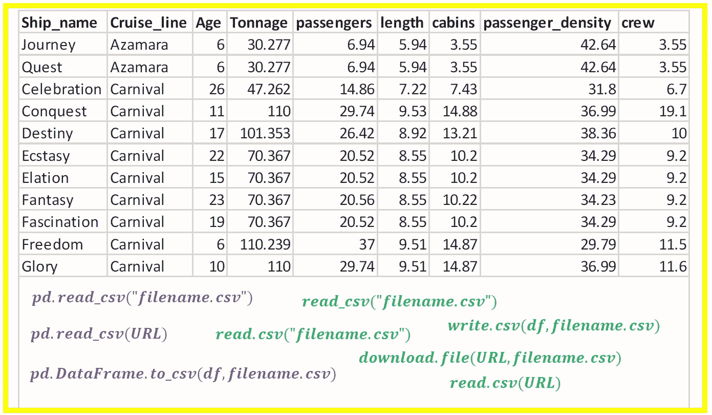
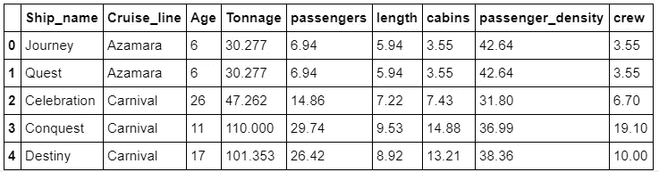
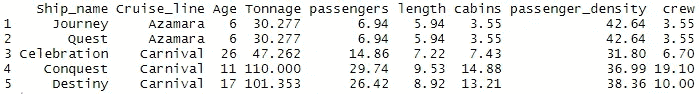
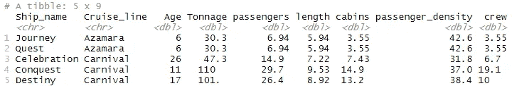

# 数据科学中的 CSV 文件格式

> 原文：<https://pub.towardsai.net/csv-file-format-in-data-science-913a7a92f17f?source=collection_archive---------0----------------------->



**使用 csv 文件格式导入和导出数据的 Python 和 R 函数。本杰明·欧·塔约的图片**

## 在 CSV 文件中导入和导出数据的教程。Python 和 R 实现。

T 逗号分隔值(CSV)文件格式是数据科学中最流行的文件格式。作为初学者，您在数据科学之旅中学到的基本技能之一是如何导入存储在 CSV 文件中的数据。数据是数据科学和机器学习的关键，因此学习导入和导出 CSV 文件中包含的数据的基础知识非常重要。导入的数据可以多种方式使用，例如生成可视化、描述性统计、预测性建模，或者只是用于清理和预处理，然后导出回 CSV 文件以备后用。本教程将涵盖使用 Python 和 R 代码实现处理 CSV 文件的基础知识。我们将使用[号游轮数据集](https://github.com/bot13956/ML_Model_for_Predicting_Ships_Crew_Size)来说明我们的例子。

# 一.数据输入

## 1.从本地目录导入 CSV 文件

**a)使用 Python 的熊猫**

创建一个包含您的 CSV 文件的目录。然后在同一个目录下创建一个 Jupyter 笔记本。现在，使用以下命令将 CSV 文件作为数据框导入 Jupyter 笔记本:

```
import pandas as pddf = pd.read_csv("cruise_ship_info.csv")df.head(n=5)
```



**表 1** 。使用 pd.read_csv()方法输出。

可以使用 ***type()*** 函数验证新对象的类型:

```
type(df)
```

这将返回以下输出:

```
pandas.core.frame.DataFrame
```

***PD . read _ CSV()***方法有几个不同的属性。要了解更多信息，您可以使用以下内容访问帮助页面:

```
?pd.read_csv
```

**b)使用基数 R**

在当前工作目录下创建一个 R 脚本文件。现在使用以下命令将 CSV 文件作为数据帧导入 R 脚本:

```
data <- read.csv("cruise_ship_info.csv")head(data, n = 5)
```



**表二**。使用 read.csv()函数输出。

可以使用 class()函数来验证新对象的类型:

```
class(data)
```

这将返回以下输出:

```
"data.frame"
```

***read.csv()*** 函数有几个不同的属性。要了解更多信息，您可以使用以下内容访问帮助页面:

```
?read.csv
```

**c)使用 R 的 Readr 包**

***readr*** 包中的 ***read_csv()*** 函数也可用于导入 csv 文件:

```
library(readr)data <-read_csv("cruise_ship_info.csv")head(data, n = 5)
```



**表 3** 。使用 read_csv()函数输出。

请注意，在这种情况下，输出是一个 tibble。tibble 是一种特殊类型的数据帧。你可以从 tidyverse 网站找到更多关于 tibble 的信息。

***read.csv()*** 函数有几个不同的属性。要了解更多信息，您可以使用以下内容访问帮助页面:

```
?read_csv
```

## 2.使用文件的 URL 从互联网导入 CSV 文件

**a)使用 Python 熊猫**

如果 CSV 文件位于具有已知 URL 的网站上，则可以按如下方式导入该文件:

```
url = "[https://raw.githubusercontent.com/bot13956/ML_Model_for_Predicting_Ships_Crew_Size/master/cruise_ship_info.csv](https://raw.githubusercontent.com/bot13956/ML_Model_for_Predicting_Ships_Crew_Size/master/cruise_ship_info.csv)"df = pd.read_csv(url)df.head(n = 5)
```

这将产生与表 1 中的输出相同的输出。

**b)使用基数 R**

```
url = "[https://raw.githubusercontent.com/bot13956/ML_Model_for_Predicting_Ships_Crew_Size/master/cruise_ship_info.csv](https://raw.githubusercontent.com/bot13956/ML_Model_for_Predicting_Ships_Crew_Size/master/cruise_ship_info.csv)"data <-read.csv(url)head(data, n = 5)
```

这将产生与表 2 中的输出相同的输出。

使用 R 的 Readr 包

```
url = "[https://raw.githubusercontent.com/bot13956/ML_Model_for_Predicting_Ships_Crew_Size/master/cruise_ship_info.csv](https://raw.githubusercontent.com/bot13956/ML_Model_for_Predicting_Ships_Crew_Size/master/cruise_ship_info.csv)"data <-read_csv(url)head(data, n = 5)
```

这将产生与表 3 中的输出相同的输出。

**d)使用 R 中的 download.file()函数**

该功能允许您首先将文件下载到当前工作目录，然后您可以使用上面第 1 小节中讨论过的任何方法导入文件:

```
url = "[https://raw.githubusercontent.com/bot13956/ML_Model_for_Predicting_Ships_Crew_Size/master/cruise_ship_info.csv](https://raw.githubusercontent.com/bot13956/ML_Model_for_Predicting_Ships_Crew_Size/master/cruise_ship_info.csv)"download.file(url,"cruise_ship_info.csv")
```

要了解有关 download.file()函数的更多信息，您可以使用以下内容访问帮助页面:

```
?download.file
```

# 二。数据导出

假设您已经从 CSV 文件中导入了原始的不干净数据。然后，您编写了代码来争论和清理数据。现在，您希望导出干净的数据集，并将其保存为 CSV 文件以供将来使用。在本节中，我们将解释如何将数据导出到 CSV 文件。

## 1.使用 Python 的熊猫

最终数据帧(df)可通过以下方式导出为 CSV 文件:

```
df.to_csv("final.csv", index = False)
```

默认情况下，`pd.DataFrame.to_csv`方法在包含观察数字的文件中创建一个额外的列。为了防止这种情况，将`index`参数设置为`False`。

*pd。数据帧* ***。*to _ CSV()**函数有几个不同的属性。要了解更多信息，您可以使用以下内容访问帮助页面:

```
?pd**.**DataFrame**.**to_csv
```

## 2.使用 R

```
write.csv(df, "final.csv", row.names = F)
```

默认情况下，`write.csv`函数会在包含观察值的文件中创建一个额外的列。为了防止这种情况，将`row.names`参数设置为`F (False).`

***write.csv()*** 函数有几个不同的属性。要了解更多信息，您可以使用以下内容访问帮助页面:

```
?write.csv
```

总之，我们已经讨论了从 CSV 文件导入数据或将其导出到 CSV 文件的几种方法。CSV 文件格式是存储数据最常用的文件格式。任何对学习数据科学基础感兴趣的人都必须学习如何使用 CSV 文件格式。

# 其他数据科学/机器学习资源

[数据科学课程](https://medium.com/towards-artificial-intelligence/data-science-curriculum-bf3bb6805576)

[机器学习的基本数学技能](https://medium.com/towards-artificial-intelligence/4-math-skills-for-machine-learning-12bfbc959c92)

[3 个最佳数据科学 MOOC 专业](https://medium.com/towards-artificial-intelligence/3-best-data-science-mooc-specializations-d58da382f628)

[进入数据科学的 5 个最佳学位](https://towardsdatascience.com/5-best-degrees-for-getting-into-data-science-c3eb067883b1)

[2020 年开始数据科学之旅的 5 个理由](https://towardsdatascience.com/5-reasons-why-you-should-begin-your-data-science-journey-in-2020-2b4a0a5e4239)

[数据科学的理论基础——我应该关心还是仅仅关注实践技能？](https://towardsdatascience.com/theoretical-foundations-of-data-science-should-i-care-or-simply-focus-on-hands-on-skills-c53fb0caba66)

[机器学习项目规划](https://towardsdatascience.com/machine-learning-project-planning-71bdb3a44349)

[如何组织你的数据科学项目](https://towardsdatascience.com/how-to-organize-your-data-science-project-dd6599cf000a)

[大型数据科学项目的生产力工具](https://medium.com/towards-artificial-intelligence/productivity-tools-for-large-scale-data-science-projects-64810dfbb971)

[数据科学作品集比简历更有价值](https://towardsdatascience.com/a-data-science-portfolio-is-more-valuable-than-a-resume-2d031d6ce518)

[使用协方差矩阵图进行特征选择和降维](https://medium.com/towards-artificial-intelligence/feature-selection-and-dimensionality-reduction-using-covariance-matrix-plot-b4c7498abd07)

[数据科学 101 —包含 R 和 Python 代码的中型平台短期课程](https://medium.com/towards-artificial-intelligence/data-science-101-a-short-course-on-medium-platform-with-r-and-python-code-included-3cdc9d489c6d)

***如有疑问，请发邮件给我***:benjaminobi@gmail.com