# 2021 年数据科学就业市场趋势分析

> 原文：<https://pub.towardsai.net/current-data-science-job-market-trend-analysis-future-4184f03a04ca?source=collection_archive---------0----------------------->

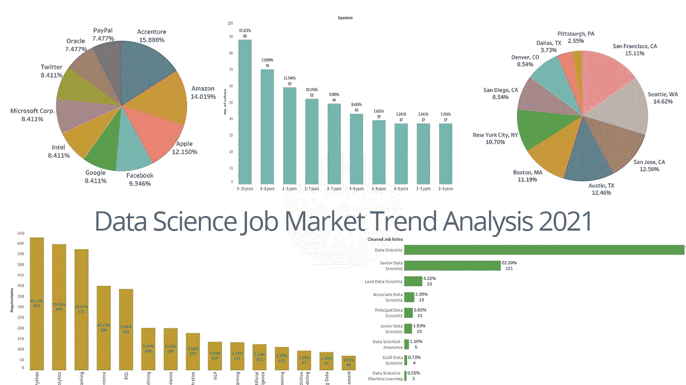

图 1:数据科学就业市场趋势| **所有图片均来自作者，除非另有说明。**

## [数据科学](https://towardsai.net/p/category/data-science)，[社论](https://towardsai.net/p/category/editorial)，[新闻](https://towardsai.net/p/category/news)

## 了解雇主对 2021 年数据科学家角色的期望。来自 3000 多个数据科学家职位发布的数据分析—使用网络搜集从多个职业门户网站中提取

**作者:** [苏扬·希罗](https://www.linkedin.com/in/sujan-shirol/)，[罗伯特·伊里翁多](https://mktg.best/vguzs)

***免责声明:*** *本文仅出于教育目的。我们不鼓励任何人抓取网站，尤其是那些可能有条款和条件反对此类行为的网站。*

你在为 2021 年的数据科学工作面试做准备吗？我们分析了几个在线职业门户网站的 3000 多份数据科学招聘信息的招聘趋势。希望这些见解能帮助你通过分析雇主的期望和整体市场需求为面试做好准备。

数据科学和 [**机器学习**](https://mld.ai/mldcmu) 美国的机会一年比一年好。跨行业和跨职能的公司(IT、营销、咨询等。)已经开始增加对数据科学家的使用和需求，以满足企业对数据科学家的需求。事实上，根据美国劳工统计局(Bureau of Labor Statistics)的最新就业前景报告，公司需求预计将在未来十年大幅增长。

作为一名数据科学家，你可以期待你的技能得到很好的补偿。为了了解当今的角色以及未来的企业需求，我们对数据科学家的角色进行了自己的研究，并深入就业门户网站，以了解美国初创公司和公司对候选人的确切要求。

为了分析当前的趋势并理解它们的意义、见解和市场需求，我们向前迈进了一步，并试图为潜在的求职者启发一些有趣的推论。这一分析背后的主要目的是帮助求职者和职业转型者更好地了解当前市场对数据科学家和机器学习从业者的需求。

下面的数据分析将为我们提供一个概述:

1.  美国顶级公司积极招募数据科学家🌃
2.  美国招聘数据科学家的热门地点[🗺️](https://emojipedia.org/world-map/)
3.  美国数据科学家所需的经验水平📊
4.  美国❗️招聘数据科学家的顶级公司提供的最受欢迎的职位
5.  不同经验水平组内的职位趋势
6.  美国数据科学家的 15 大热门技能📚
7.  美国数据科学家职位发布的顶级编程语言
8.  美国数据科学职位发布的顶级数据可视化工具
9.  美国数据科学职位发布的顶级深度学习框架
10.  美国数据科学家职位发布的顶级大数据技术
11.  美国数据科学家职位发布的顶级网络框架
12.  最后的想法

为了启动分析，我们需要最新最准确的数据。因此，最好的选择似乎是网上搜集一些美国流行的求职门户网站。

## 网页抓取

Selenium 是提取相关信息的最快、最经济、最可靠的方法之一。这个数据分析项目使用 Selenium 来抓取工作门户网站。导入必要的包并设置 chrome 驱动路径非常简单。在一个循环中点击 50 页，其中每页包含 20 个职位招聘的简要描述，制作 3000 多个职位招聘来分析数据。

最重要的是，提取每个职位发布的 URL 会将我们带到相应职位发布的详细页面，其中提供了进行推理所需的所有细节。

```
import pandas as pd
import numpy as np
from selenium import webdriver
from selenium.common.exceptions import NoSuchElementExceptionchromepath = r'D:\Drivers\Chrome Driver\chromedriver.exe'url_list = []for i in range(1, 50):
    print('Opening Search Pages ' + str(i))
    page_url = '[https://jobportalexample.com/data-scientist-jobs-'+str(i)](https://www.naukri.com/data-scientist-jobs-'+str(i))
    driver = webdriver.Chrome(chromepath)
    driver.get(page_url)
    print('Accessing Webpage OK \n')
    url_elt = driver.find_elements_by_class_name("fw500")
    print('Success')

    for j in url_elt:
        url = j.get_attribute("href")
        url_list.append(url)

driver.close()
```

为了简化这个过程，URL 被保存为熊猫数据帧。

```
url_list_copy_cleaned = [i for i in url_list]
out_company_df = pd.DataFrame(url_list_copy_cleaned, columns=['Website'])
out_company_df.head()
```

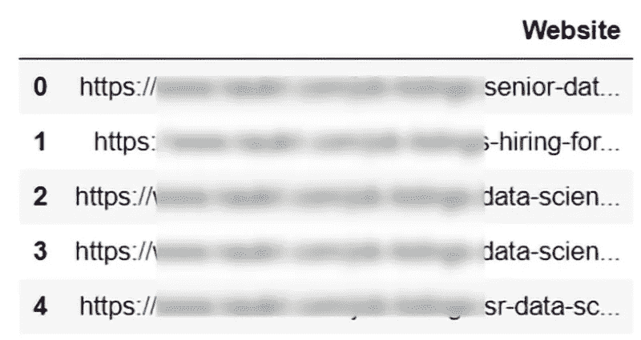

图 2:数据帧。

既然变量‘url _ list _ copy _ cleaned’具有 3000+个工作列表的 URL。下一步是点击所有的 1000 页，提取细节。

将被刮除的元素有:

✔️companies
✔️locations
✔️experience
✔️roles
✔️skills

```
jobs={'roles':[],
     'companies':[],
     'locations':[],
     'experience':[],
     'skills':[]}

driver = webdriver.Chrome(chromepath)for url in out_company_df['Website']:
    driver.get(url)
    try:
        name_anchor = driver.find_element_by_class_name('pad-rt-8')
        name = name_anchor.text
        jobs['companies'].append(name)
    except NoSuchElementException:
        jobs['companies'].append(np.nan)

    try:
        role_anchor = driver.find_element_by_class_name('jd-header-title')
        role_name = role_anchor.text
        jobs['roles'].append(role_name)
    except NoSuchElementException:
        jobs['roles'].append(np.nan)

    try:
        location_anchor = driver.find_element_by_class_name('location')
        location_name = location_anchor.text
        jobs['locations'].append(location_name)
    except NoSuchElementException:
        jobs['locations'].append(np.nan)

    try:
        experience_anchor = driver.find_element_by_class_name('exp')
        experience = experience_anchor.text
        jobs['experience'].append(experience)
    except NoSuchElementException:
        jobs['experience'].append(np.nan)

    try:
        skills_anchor = driver.find_elements_by_class_name("chip")
        each_skill = []
        for skills in skills_anchor:
            each_skill.append(skills.text)
        jobs['skills'].append(each_skill)
    except NoSuchElementException:
        jobs['skills'].append(np.nan)driver.close()
```

注意，**发现** `NoSuchElementException` **错误是非常重要的**，因为一些 URL 会将我们直接带到公司网站，而不仅仅是同一个工作门户网站的另一个详细信息页面。在这种情况下，我们正在寻找的 HTML 元素可能不存在，这将抛出一个错误。

为了更好地处理和预处理数据，将数据固化为 Pandas DataFrame 是最好的选择。在所有预处理步骤之后，比如删除空值、拆分列、标记位置、技能列等。，清理后的数据集将被带到 Tableau 以获得最佳可视化效果📈。

如果你对 Tableau 不熟悉，它是一家专注于商业智能的美国交互式数据可视化软件公司[【1】](https://en.wikipedia.org/wiki/Tableau_Software)。

# 数据分析(深入研究)

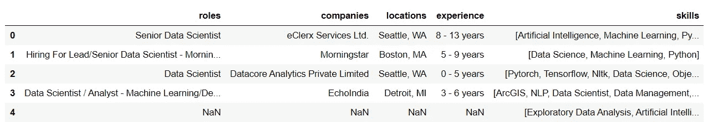

图 3: CSV 表。

## 美国顶级公司积极招募数据科学家


图 4:美国顶级公司积极招聘数据科学家。

就数据科学家的职位空缺而言，埃森哲在美国排名第一，其次是亚马逊、苹果和脸书。这里需要特别注意的一点是，招聘数据科学家的顶级公司要么是社交媒体公司，要么是电子商务或支付处理平台，如 PayPal 和 Google Pay。

所有这些每天都有最高数量的客户参与，导致数千 Pb 的数据流。如果我们仔细观察，埃森哲公司。是一家爱尔兰跨国公司，提供咨询和处理服务 [[2]](https://en.wikipedia.org/wiki/Accenture) ，如应用服务、数据和分析、技术创新、商业智能、自动化等，这需要大量熟练的数据科学家和工程师。

## 美国雇佣数据科学家最多的地方

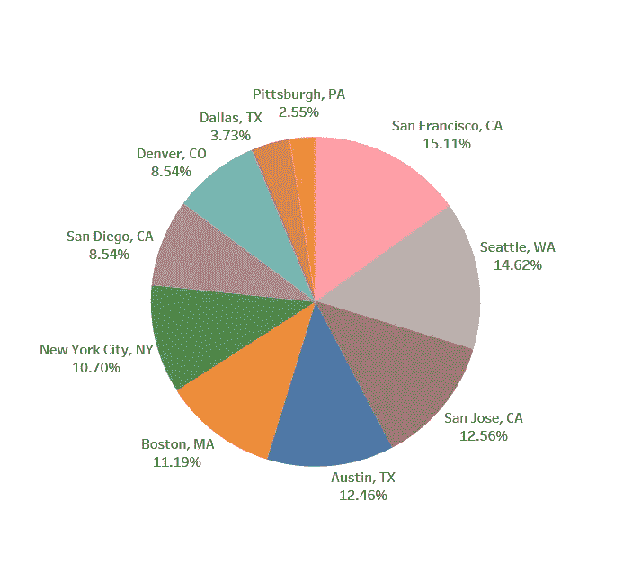

图 5:美国雇佣数据科学家最多的地方。

**三藩市**📍约占工作清单的 15%，这是不言而喻的，也是至关重要的，因为硅谷是北加州旧金山湾区南部的一个地区，是全球高科技和创新的中心[【3】](https://en.wikipedia.org/wiki/Silicon_Valley)。

紧随这一趋势的是西雅图、圣何塞、奥斯汀、波士顿、纽约市、圣地亚哥、丹佛、达拉斯、匹兹堡等，这些城市在美国的数据科学工作岗位总数中占很大比例。

令人惊讶的是，匹兹堡是如何跻身美国招聘数据科学家的前十大城市的，这座钢铁城市的数据科学家职位空缺率为 2.55%。这些地方可以增加求职者找到理想工作的机会。

## 美国数据科学家所需的经验水平

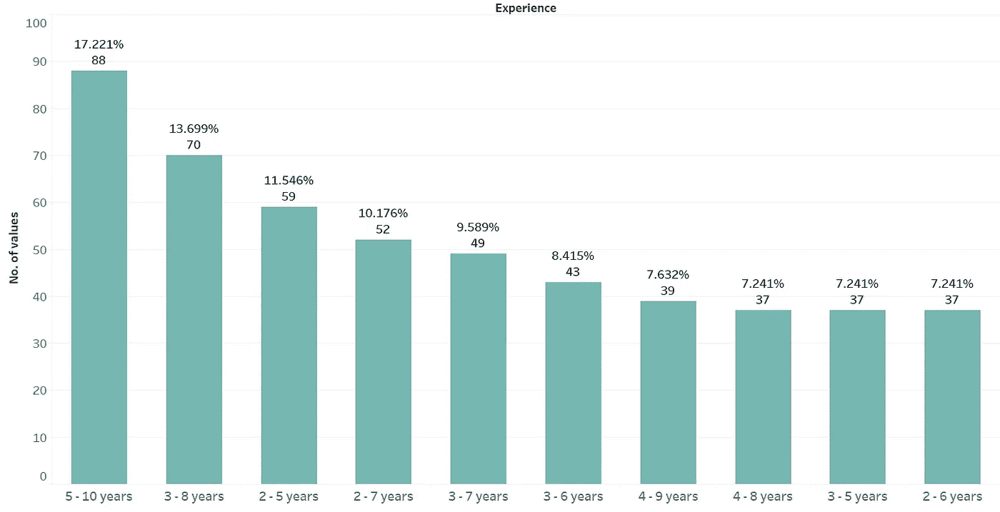

图 6:美国数据科学家所需的经验水平。

从上面显示的统计数据来看📊 📈很明显，组织在寻找经验丰富的数据科学家，其工作年限在 5-10 年之间，占总数据科学家需求的 17 %, 3-8 年占 13%。不幸的是，入门级数据工作的范围很小，对于完全的新手来说几乎为零，这使得求职充满挑战。

这个分析也说明了数据科学领域的市场是多么的不成熟。如果不为新人才提供机会，有前途的年轻数据科学家很难获得经验。接受事实，新手必须做最好的自己，努力从人群中脱颖而出。

在这篇文章中，我们根据自己的最终想法给你一些建议。但是，请和我们在一起。

## 美国顶级数据科学家招聘公司提供的工作角色

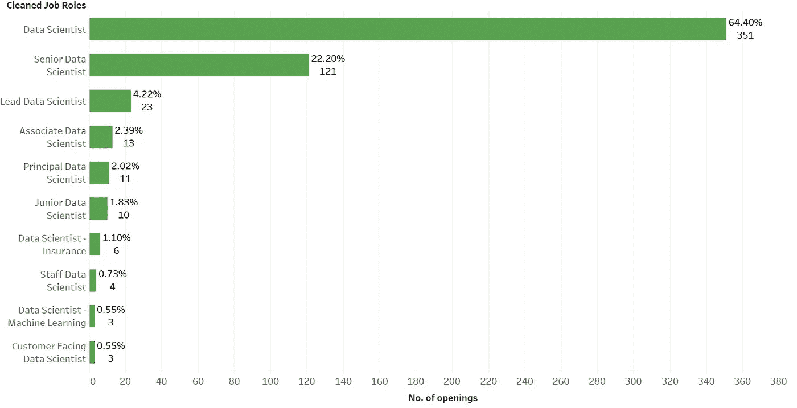

图 7:美国雇佣数据科学家的顶级公司提供的工作角色。

令人震惊的是，寻求经验丰富的科学家的组织将这一职位仅仅称为数据科学家。重要的职位空缺是 5-10 年经验的专业人士。高级数据科学家职位占总需求的 22%。令人耳目一新的是，助理数据科学家进入了前五名。尽管如此，统计数据迫使我们质疑助理数据科学家应该拥有什么样的经验水平❓.一如既往，答案就在数据本身之中。👇

## 不同经验水平组内的职位趋势

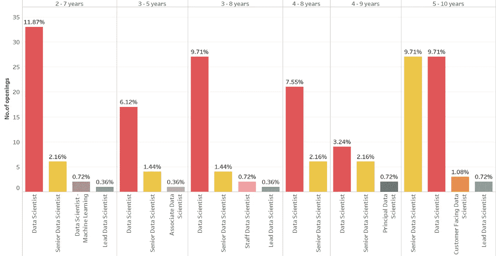

图 8:不同经验水平组内的职位趋势。

经验水平组:5-10 年的数据科学家和高级数据科学家各占 9.17%，而经验水平组:2-7 年的高级数据科学家占 2.16%，首席数据科学家占 0.36%。对助理数据科学家的要求是 3-5 年的经验。

## 美国数据科学家的 15 大热门技能

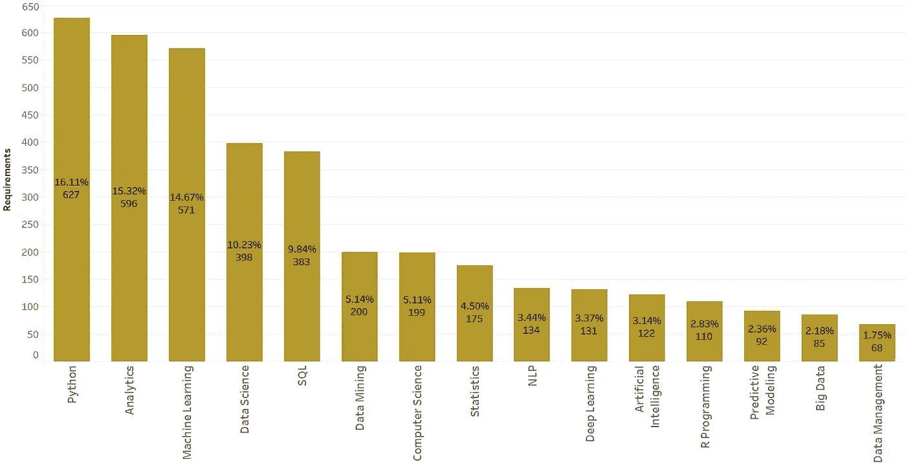

图 9:美国数据科学家的 15 大热门技能。

对于世界上大多数工作来说，技能是至关重要的。让我们来看看任何数据科学家都必须具备的 15 大技能。拥有合适的技能会带来更多的机会🚪对于任何求职者来说。Python 编程、分析学、 [**机器学习**](https://mld.ai/mldcmu) 是公司最需要的前 3 项技能。

大多数人有一个错误的观念，认为 SQL 是数据科学家最不需要的，但它属于五大技能之一。通过这种分析，我们希望能够更容易地为更好的数据职业铺平道路。

## 美国数据科学家职位发布的顶级编程语言


图 10:美国数据科学家职位发布的顶级编程语言。

🗣或困惑的非常著名的论点😵在新的人才中有**在 Python 和 R、Julia 和 Scala 之间选择正确的编程语言。根据我们的分析，Python 贡献了这些招聘信息中近 50%的总需求，第二名也是 SQL。**

所以，掌握 Python 和 SQL 技能至关重要。惊人地😲C++是五大编程语言需求之一，占总数的 3.8%。占总需求 3.3%的 MATLAB 是数百万工程师和科学家用来分析数据、开发算法、创建模型的编程和数值计算平台[【4】](https://www.mathworks.com/products/matlab.html)。

## 美国数据科学职位发布的顶级数据可视化工具

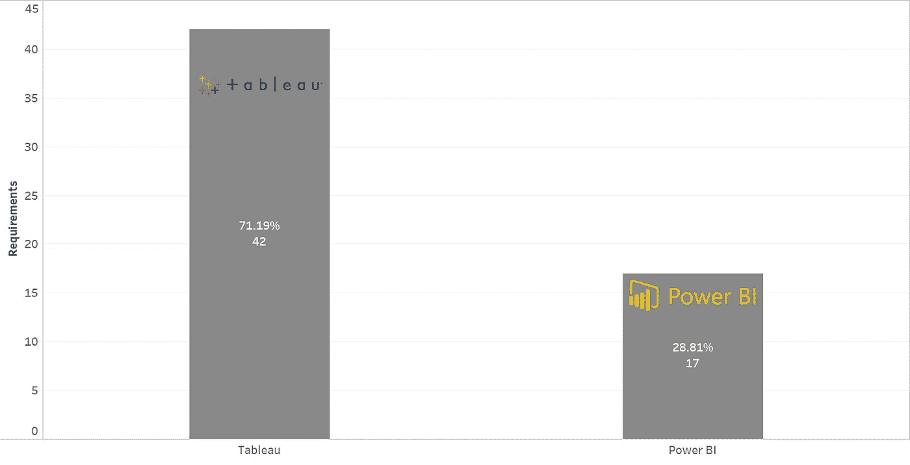

图 11:美国数据科学职位发布的顶级数据可视化工具。

Tableau 是一个可视化分析平台，它改变了我们使用数据解决问题的方式，使人们和组织能够充分利用他们的数据 [[5]](https://www.tableau.com/why-tableau/what-is-tableau) ，而 Power BI 是一个软件服务、应用和连接器的集合，它们协同工作，将您不相关的数据源转化为连贯的、身临其境的、交互式的见解。

您的数据可能是一个 Excel 电子表格，或者是一组基于云的本地混合数据仓库。Power BI 让您可以轻松地将⛓️连接到您的数据源，可视化并发现什么是重要的，并与您想要的任何人或任何人分享[【6】](https://docs.microsoft.com/en-us/power-bi/fundamentals/power-bi-overview)。Tableau 和 Power BI 大致相同，只有一些小的不同。虽然 Power BI 是一家高度可信的公司微软的产品，但 Tableau 是业界最青睐的产品。让我们*解码*为什么 Tableau 如此受欢迎。

在对🧐做了一点研究后，发现 Power BI 是为普通利益相关者而构建的，不一定是专业的数据分析师。有了 Tableau，数据分析师在清理数据和将数据转化为可视化数据时将会少一些麻烦。

Tableau 速度更快，功能更强，它还提供了许多高级技术，如参数和自定义计算。由于我们丢弃的数据与数据科学有关，而 Tableau 最适合专业数据分析师，因此 Tableau 成为我们在这种情况下的首选工具。

## 美国数据科学职位发布的顶级深度学习框架

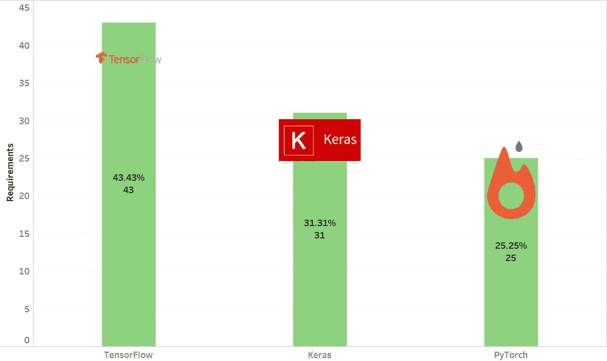

图 12:美国数据科学职位发布的顶级深度学习框架。

[**深度学习**](https://news.towardsai.net/dl) 是人工智能中机器学习的子集，它具有能够学习非结构化或无标签的无监督数据的网络。也被称为深度神经学习或深度神经网络，它模仿人脑🧠处理数据的工作方式，用于检测物体、识别语音、翻译语言和做出决策[【7】](https://www.investopedia.com/terms/d/deep-learning.asp#:~:text=Deep%20learning%20is%20a%20subset,learning%20or%20deep%20neural%20network.)。

深度学习的框架有很多，但 Tensorflow、Keras、PyTorch 是最流行的。它们提供了一整套库来处理深度学习技术，并有效地使用 GPU 硬件的能力。谷歌的 TensorFlow 占总需求的 43%，似乎是市场上最受欢迎的深度学习框架，其次是 Keras 和 PyTorch。

## 美国数据科学家职位发布的顶级大数据技术

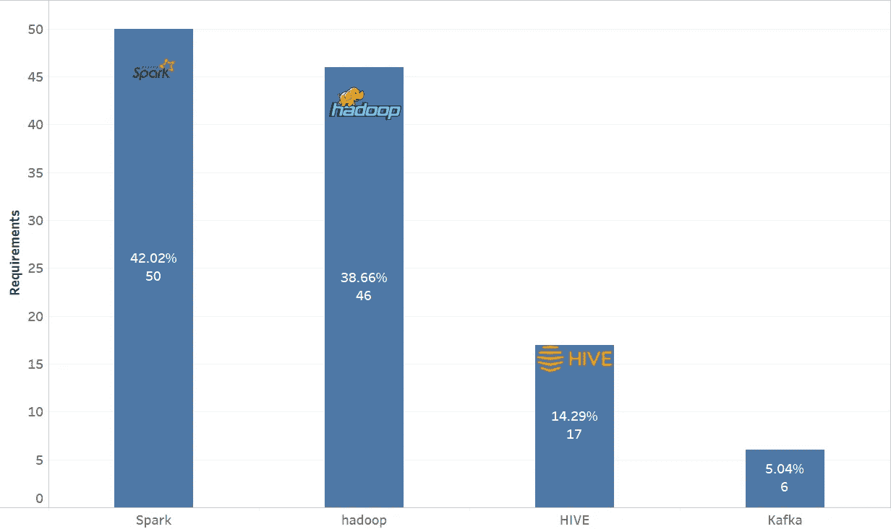

图 13:美国数据科学家职位发布的顶级大数据技术。

随着每分钟数据量的增加，世界需要一种新的方法来处理它，而大数据是一个处理方法的领域，用于分析、系统地提取信息或处理太大或太复杂而无法通过传统数据处理应用软件处理的数据集[【8】](https://en.wikipedia.org/wiki/Big_data)。

存在几种大数据技术，但 Apache Spark、Hadoop、Hive 和 Kafka 是当今公司使用的流行技术。似乎 Apache Spark 和 Hadoop 比其他大数据技术更有优势。

## 美国数据科学家职位发布的顶级网络框架

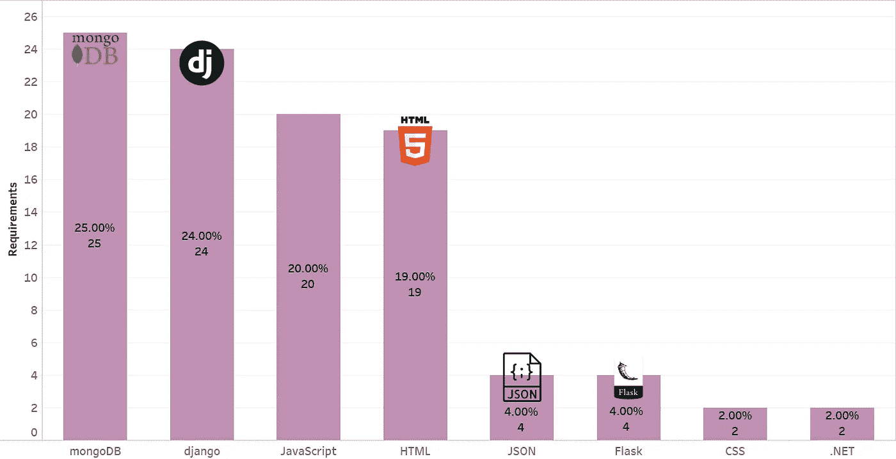

图 14:美国数据科学家职位发布的顶级网络框架。

利用数据科学技能构建机器学习模型是一项主要任务，将模型部署到生产中供非技术人员使用是数据科学生命周期♻️.的另一项相关任务

部署通常以 web 应用程序的形式进行，行业希望数据科学家拥有 web 框架的技能和知识来部署任何机器学习模型。MongoDB、Django、JavaScript 和 HTML 是目前市场上流行的 web 技术。要在行业中领先一步，这些 web 框架在当前状态下是必须的。

## 最后的想法

一切看起来势不可挡，但请知道，这并不要求同时拥有所有这些技能。**挑一两个，最多三个——术业有专攻，深耕**。

此外，你不必等到掌握了所有的技能再去申请工作。除非**你申请的公司是一家老古董**，否则在找数据工作或在职期间继续学习是可以接受的。请在你的简历中提到你正在学习的技能，并告诉招聘你的人，当然，不要忘记定期更新你的简历，并根据工作岗位进行相应的定制。

在钻研上面提到的技巧之前，请务必具备 [**统计**](http://news.towardsai.net/descriptive-statistics) 和 [**线性代数**](http://news.towardsai.net/r4n) 的基础知识。但不仅仅是学习技能——最重要的是以项目、黑客马拉松、坚实的 Github 档案等形式拥有实用的知识。此外，拥有一个自己的博客或频道是你数据简历的一个很好的补充。

尽管如此，如果你对此分析有任何意见，请在评论中告诉我们，或者给我们发一封 [**电子邮件**](mailto:pub@towardsai.net) 。我们祝你一路顺风🙏。感谢您的阅读！

**免责声明:**本文所表达的观点仅代表作者个人观点，不代表与作者(直接或间接)相关的任何公司的观点。这项工作并不打算成为最终产品，而是当前思想的反映，同时也是讨论和改进的催化剂。

**除非另有说明，所有图片均来自作者。**

通过[发布**走向 AI** 发布](https://towardsai.net/)

## 参考

[1]《Tableau 软件——维基百科》。2021.En.Wikipedia.Org。[https://en.wikipedia.org/wiki/Tableau_Software.](https://en.wikipedia.org/wiki/Tableau_Software.)

[2]“埃森哲—维基百科”。2021.En.Wikipedia.Org。[https://en.wikipedia.org/wiki/Accenture.](https://en.wikipedia.org/wiki/Accenture.)

[3]《硅谷——维基百科》。2021.En.Wikipedia.Org。[https://en.wikipedia.org/wiki/Silicon_Valley.](https://en.wikipedia.org/wiki/Silicon_Valley.)

[4]《MATLAB—Mathworks》。2021.Mathworks.Com。[https://www.mathworks.com/products/matlab.html.](https://www.mathworks.com/products/matlab.html.)

[5]“什么是 Tableau？”。2021.画面。[https://www.tableau.com/why-tableau/what-is-tableau.](https://www.tableau.com/why-tableau/what-is-tableau.)

【6】“什么是权力 BI？—动力 BI”。2021.Docs.Microsoft.Com。[https://docs . Microsoft . com/en-us/power-bi/fundamentals/power-bi-overview。](https://docs.microsoft.com/en-us/power-bi/fundamentals/power-bi-overview.)

[7]“深度学习如何帮助防范金融诈骗”。2021.Investopedia。[https://www . investopedia . com/terms/d/Deep-learning . ASP #:~:text = Deep % 20 learning % 20 is % 20a % 20 subset，learning % 20 or % 20 Deep % 20 neural % 20 network。](https://www.investopedia.com/terms/d/deep-learning.asp#:~:text=Deep%20learning%20is%20a%20subset,learning%20or%20deep%20neural%20network.)

[8]“大数据——维基百科”。2019.En.Wikipedia.Org。[https://en.wikipedia.org/wiki/Big_data.](https://en.wikipedia.org/wiki/Big_data.)

[](https://ws.towardsai.net/shop) [## 店铺↓ |走向 AI

### 发布最好的技术、科学和工程|社论→https://towardsai.net/p/editorial |订阅→…

ws.towardsai.net](https://ws.towardsai.net/shop) [](https://members.towardsai.net/) [## 加入我们吧↓ |面向人工智能成员|数据驱动的社区

### 加入人工智能，成为会员，你将不仅支持人工智能，但你将有机会…

members.towardsai.net](https://members.towardsai.net/) [](https://sponsors.towardsai.net/) [## 赞助商|了解如何成为面向人工智能的赞助商

### 无论你是想以一种吸引读者的方式突出你的产品，吸引高度相关的小众受众，还是…

sponsors.towardsai.net](https://sponsors.towardsai.net/) 

## 进一步阅读

[](/k-nearest-neighbors-knn-algorithm-tutorial-machine-learning-basics-ml-ec6756d3e0ac) [## k 近邻(KNN)算法教程—机器学习基础

### 潜入 K-最近邻，一个基本的经典机器学习(ML)算法

pub.towardsai.net](/k-nearest-neighbors-knn-algorithm-tutorial-machine-learning-basics-ml-ec6756d3e0ac) [](/deep-dive-into-pandas-dataframe-join-pd-join-4cc2adee351d) [## 深入了解熊猫数据帧连接— pd.join()

### 关于如何在 pandas 中将列与其他数据框连接的深度可视化教程

pub.towardsai.net](/deep-dive-into-pandas-dataframe-join-pd-join-4cc2adee351d) [](https://news.mktg.best/natural-language-in-search-engine-optimization-seo-how-what-when-and-why-b390364b5d3d) [## 搜索引擎优化(SEO)中的自然语言——如何、做什么、何时以及为什么

新闻网](https://news.mktg.best/natural-language-in-search-engine-optimization-seo-how-what-when-and-why-b390364b5d3d)