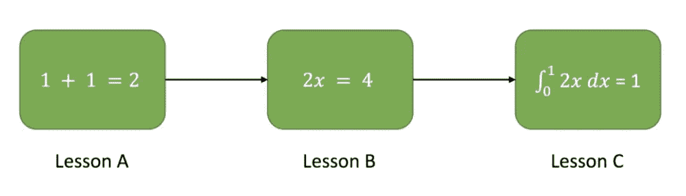
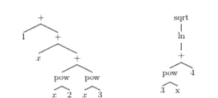

# 课程学习

> 原文：<https://pub.towardsai.net/curriculum-learning-and-symbolic-mathematics-36015f408251?source=collection_archive---------3----------------------->

## [机器学习](https://towardsai.net/p/category/machine-learning)

## 用一个简单的实际应用解释了一个重要的概念

# 介绍

照片由[奥斯卡诺德](https://unsplash.com/@furbee?utm_source=medium&utm_medium=referral)在 [Unsplash](https://unsplash.com?utm_source=medium&utm_medium=referral) 上拍摄

我们可以把深度学习的巨大领域想象成地壳，漂浮在数学和算法理解的地幔上。这是一个巨大的知识领域，它被划分成不同的专业，就像构造板块划分我们的世界一样。最重要的是，深度学习的专业化——例如自然语言处理和认知计算科学——可以重合形成美丽的山脉，有助于定义深度学习的标志性领域。

课程学习是介于面向人工智能的认知科学和 NLP 这两个领域之间的一种深度学习技术。虽然目前许多从业者或爱好者不知道(其维基百科页面目前正在等待批准)，但对于那些选择探索这一隐藏宝石的人来说，这一发现值得花时间。

但是，这个让深度学习程序更高效的神秘方法是什么？

# 什么是课程学习？

[来源](https://medium.com/@pprocks/curriculum-learning-654aa6423abd)

我们需要从一个基本的类比开始。就像我们大多数人知道的那样，例如，神经网络是对人脑的模仿，将课程学习视为植根于人类的行动更有帮助。

你是怎么学数学的？你是从解二次方程开始，还是从测度论开始你的数学之旅？大概不会。那么，正如 Elman (1993 年)和 Bengio (2009 年)在他们各自的论文中所建议的那样，为什么计算机应该？

从概念上讲，课程学习相当简单:提炼和组织输入，使较低复杂性的输入首先被“输入”到程序中，较高复杂性的输入随后被处理。这使得“学习”能够以更渐进的方式和更有条理地进行。

回到我们学习数学的最初类比，当前的自然语言处理方法让我们将偏导数与我们的一二三混合在一起。课程学习——就像课程*如何为*学习工作一样——将训练我们基本的数字和算术运算，然后教我们更复杂的数学(代数和微积分等)。这就是为什么它如此有效——因为我们将深度学习的许多方面建立在自己的基础上(尽管很松散)，所以课程学习是一种逻辑和有效的延伸。

现在我们已经有了合作学习的工作知识，让我们简单地将它应用到一个问题中，并讨论它的具体影响。

# **一篇关于符号数学的论文，一些改进及其影响**

描述在 [Lample 和 Charton](https://arxiv.org/abs/1912.01412) 中使用的方法的前缀符号树

我们可能应该以一篇 30 秒的论文摘要开始，该摘要涉及深度学习在符号数学中的新用途(更详细的版本，请查看这篇[文章](https://towardsdatascience.com/deep-learning-for-symbolic-mathematics-5830b22063d0))。

Guillaume Lample 和 Franç ois Charton，两位脸书人工智能研究人员，在他们的论文创作时，使用了一个 [Seq2Seq 模型](https://google.github.io/seq2seq/)(它接受一个输入并产生一个任意的、非一对一的输出——[语言翻译器创建者的主食](https://towardsdatascience.com/understanding-encoder-decoder-sequence-to-sequence-model-679e04af4346))，以便象征性地整合生成的数学表达式(与计算相对)。在测试数据集上，Lample-Charton 模型具有惊人的 99.6%的准确率，并以超过 30%的优势击败了其他流行的数学框架，如 Mathematica、Matlab 和 Maple。

这就是课程学习进入游戏的地方。Lample 和 Charton 创建的原始论文和项目使用了八个高端 GPU。仅通过粗略实施课程学习(不是最高端的)，我们能够减少到更小的批量和更小的数据集，但仍然将测试集的最终性能提高了大约 2%。这表明，课程学习有可能为资源有限的深度学习和人工智能爱好者提供一种方法，来优化和试验计算成本更高的程序，并进行他们自己的实验。事实上，许多人已经这样做了几年了。

在这个项目中使用课程学习的真正发现是原始项目的改进潜力。虽然这种基于 CL 的修改是在 barer 资源上进行的，但是想象一下，如果一个更精炼的 CL 被用在具有原始资源集的原始项目中。最确定的是，计算费用将会减少，程序的效率将会提高，并且可以添加一些新的功能，如将刘维尔函数和特殊函数添加到训练数据集，而不会增加过多的计算机缓存。

# 总结想法

关于深度学习和计算机科学的发展，这种对利基领域的探索告诉了我们什么？

首先，它进一步加深了计算机科学家和神经科学家之间的关系，麻省理工学院在这里详细介绍了[的重要性](https://news.mit.edu/2017/explained-neural-networks-deep-learning-0414)。通过将我们如何学习与我们的 DL 程序如何学习相关联，不可避免的是，进一步的发现将被揭示，这将有助于该领域更加繁荣。

第二，它强调了合作学习作为一种可以在其他领域概念上实现的东西的潜力。例如，通过考虑网络在图像分类项目的各个类别上的性能，人们会发现性能最高的网络是那些从更容易识别的类别开始的网络(如这里的[所示](https://towardsdatascience.com/how-to-improve-your-network-performance-by-using-curriculum-learning-3471705efab4))。

最后，它展示了关注效率如何产生更准确的结果。简而言之，效率意味着将更多的精力用于更好地完成目标。

正如所有科学家的口头禅一样，“复杂的问题往往会产生简单而强大的创新”。希望这篇文章能证实这一事实。

# 承认

没有今天这篇文章所依靠的其他几个人，他的努力是不可能的。感谢 Joshua，您领导了这个项目，并在此过程中帮助我澄清了一些概念。非常感谢 Francois Charton 和 Ernest Davis 澄清了他们论文中的几个讨论主题，并提出了可能的改进路线。

# 参考

[1]纪尧姆·兰普尔，弗朗索瓦·沙尔顿。[符号数学的深度学习](https://arxiv.org/abs/1912.01412?utm_source=feedburner&utm_medium=feed&utm_campaign=Feed%253A+arxiv%252FQSXk+%2528ExcitingAds%2521+cs+updates+on+arXiv.org%2529)。 *arXiv 预印本 arXiv:1912.01412v1，2019。* 【2】厄内斯特·戴维斯。[深度学习用于符号整合:综述(Lample and Charton，2019)](https://arxiv.org/abs/1912.05752) *arXiv 预印本 arXiv:1912.05752v2，2019。*
【3】planta NIOS 等[基于能力的神经机器翻译课程学习](https://arxiv.org/abs/1903.09848) *arXiv 预印本 arXiv:1903.09848 v2* 【4】Daphna wein shall， [Gad Cohen，Dan Amir。迁移学习的课程学习:深度网络的理论与实验](https://arxiv.org/abs/1802.03796) *arXiv 预印本 arXiv:1802.03796v4，2018。*
【5】阿希什·瓦斯瓦尼、诺姆·沙泽尔、尼基·帕尔马、雅各布·乌兹科雷特、利翁·琼斯、艾丹·戈麦斯、卢卡斯·凯泽、伊利亚·波洛舒欣。你所需要的只是关注。 *NIPS Proceedings，神经信息处理系统进展 30 (NIPS 2017)，2017。*
【6】杰弗里·l·埃尔曼。神经网络的学习和发展:从小处着手的重要性。 *认知，48 —爱思唯尔科学出版社 1993。*
【7】曼弗雷德·埃普，斯文·马格，斯特凡·韦姆特。[持续强化学习的课程目标屏蔽](https://arxiv.org/abs/1809.06146)。*2019 年 IEEE 发展学习和表观遗传机器人国际会议(ICDL-Epirob)。*
【8】阿纳斯塔西娅·彭蒂娜，维克多利亚·沙尔曼斯卡，克里斯托夫·h·兰伯特。[多任务的课程学习](https://openaccess.thecvf.com/content_cvpr_2015/html/Pentina_Curriculum_Learning_of_2015_CVPR_paper.html) *计算机视觉基金会，IEEE Xplore*
【9】yo shua beng io，Jerome Louradour，Ronan Collobert，Jason Weston [课程学习 ICML’09](https://dl.acm.org/doi/10.1145/1553374.1553380):*第 26 届机器学习国际年会论文集，2009。*
【10】王思农，Belinda Z. Li，Madian Khabsa，， [Linformer:具有线性复杂性的自我注意](https://arxiv.org/abs/2006.04768) *arXiv 预印本 arXiv:2006.04768v3，2020 .*