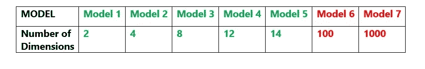
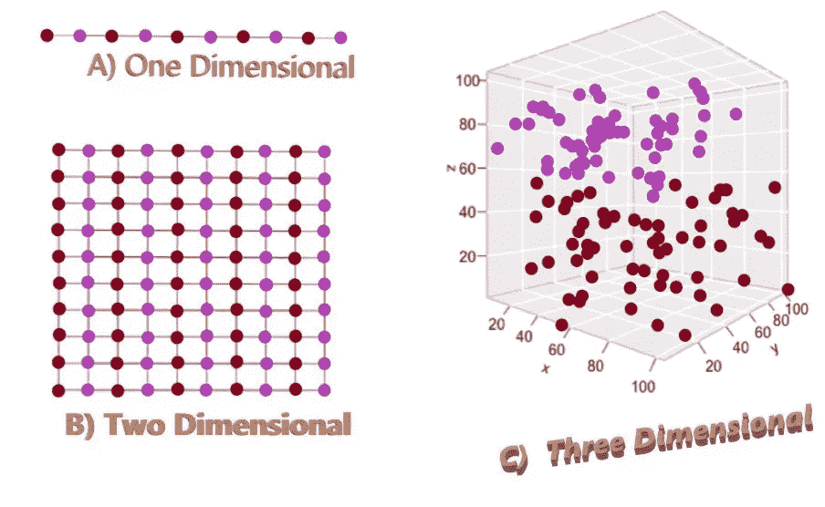
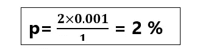
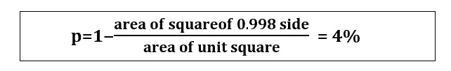
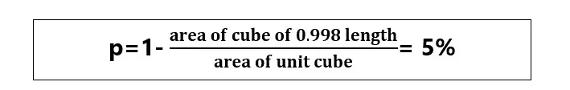
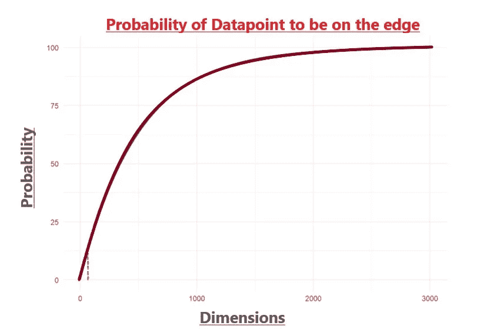
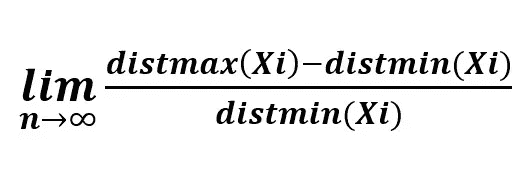
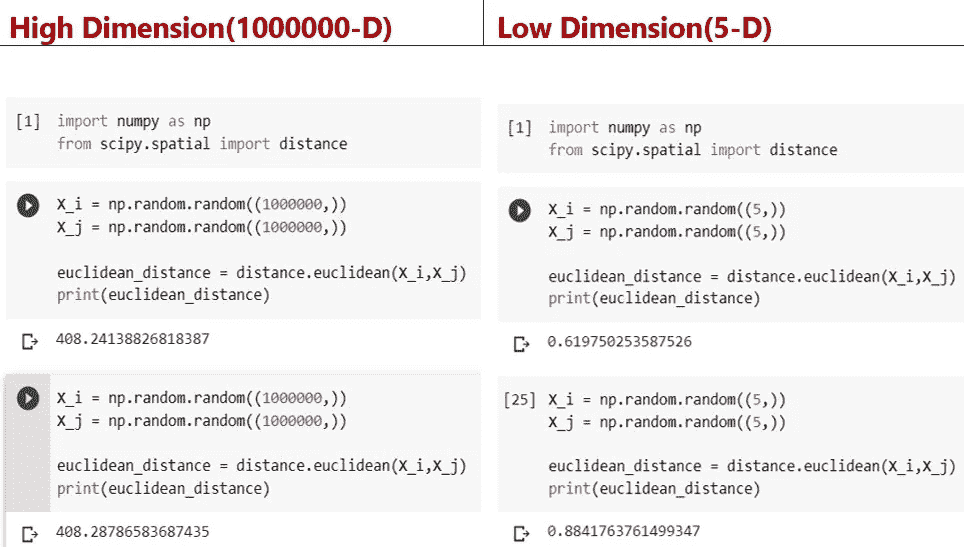

# 维度的诅咒

> 原文：<https://pub.towardsai.net/curse-of-dimensionality-4335c09ed688?source=collection_archive---------1----------------------->

## [机器学习](https://towardsai.net/p/category/machine-learning)

维数灾难——这是数学家理查德·贝尔曼在 1957 年的著作《**动态编程**中提出的一个吸引人的术语，指的是在高维实例中问题会变得更加难以解决。

让我们从一个问题开始。什么是**维度**？

**维度**简单来说就是给定数据集的属性或特征。

这听起来很简单。那么，为什么我们要使用这样一个与维度相关的负面词汇呢？这里的**诅咒**是什么？

## **让我们用一个一般的例子来学习维数灾。**

如果有人问我什么是机器学习模型？

通俗地说，当我们给定数据集进行训练时，训练阶段的输出是一个**模型**。

假设我们有 7 个模型，每个模型都有不同数量的维度，在所有 7 个模型中保持模型的动机相同:

我们在这里观察到的是，我们为训练阶段提供的用于生成模型的特征数量呈指数增长。

所以问题来了，维度的数量和模型之间有什么关系？

我们能说更多的特征会导致更好的模型吗？

答案是肯定的，但是……哦，是的！这里有一个但是。

我们可以说更多的特征导致更好的模型，但这仅在一定程度上是正确的，让我们称这个程度为阈值。

**假设**:在我们的例子中，模型 5 是阈值。

模型 5 具有 14 个属性，并且在模型 1 至模型 7 中，相同属性的错误率最低。

为什么会这样？7 型不应该是最好的型号吗？

其原因是，在模型 6 和模型 7 中，大多数特征是冗余的或稀疏的，这意味着在一定数量的特征之后，所有其他特征都不重要。

## 好吧，但是现在稀疏是什么？为什么这是一个问题？

考虑可以覆盖一维单位线的 10 个均匀间隔的点。

在二维 1×1 平面中，需要 100 个均匀间隔的样本点来覆盖整个区域。

当涉及到一个三维的 a 立方体时，需要 1000 个点来覆盖整个区域，你可以想象只把 100 个点放入三维空间，它们会显得相当稀疏。

覆盖整个体积所需的数据点随着尺寸的增加呈指数增加。空间的容量增长非常快，因此数据跟不上，从而变得稀疏，如下图所示。低维中的数据结构和相关性在高维空间中不能很好地应用或推广。

**好复杂！二维，三维，多维？多维度的直觉是什么？**

因为我们都习惯于二维或最多三维，我们无法想象多维思考超出了我们想象的范围。让我们试着用概率来形象化维度的诅咒。

以一个分类问题为例。在分类问题中，目标是定义类别之间的明确界限。

从一条单位长度的线上随机选取一点。点在边上的概率小于<0.001 from the border is:

Similarly, in a two-dimensional space, consider a unit square. The probability of a point being in the edges is:

In a three dimensional space, in a unit cube, the probability of a point being in the edges is:

similarly, in an n-dimensional space, the probability of a point being on the edges is:

The point I am trying to make here is as “n” increases, the probability of a data point likely to be on the edges increases and the graph below gives a visual of the same.

## **我们能逃脱这个诅咒吗？**

**哦，是的！！！降维。**

降维是一种将高维变量转换成低维变量而不丢失太多特征信息的方法。

降维中基本上有两种类型的组件，本文不讨论，因为降维本身是一个巨大且非常有趣的主题，但只是定义组件。

**特征选择:**该技术从原始数据集中提取最相关的变量，涉及三种方式；过滤器、包装器和嵌入式。

**特征提取:**该技术用于将维度数据降低到更低维度的空间。

通过降低数据的维度，我们大大减少了计算工作量，减少了维度冗余，并获得了更有效的距离度量。

## **距离度量？在高维空间中距离是如何被影响的？**

高维数据影响距离度量，尤其是欧几里德距离。从数学上讲，欧几里德距离的公式是，

使得，

**n** 为尺寸。

**Xi** 是实数的 n 维向量

x 是一个向量空间，其中 X₁，X₂，…Xₖ的 Xi 属于 x

***distmax(Xi)——>****Xj 属于 X₁的 Xi 到 XJ 的最大距离，…，Xₖ & Xj ≠Xi*

***distmin(Xi)——>****Xj 属于 X₁的 Xi 到 XJ 的最小距离，…，Xₖ & Xj ≠Xi*

在较低的维度中，distmax()会比 distmin()大得多，因此比率会大于零(图)。

然而，在更高的维度中，distmax()和 distmin()都是相同的，所以比率实际上会变成零，这意味着在高维度中，所有点几乎是**等距的(**图**)。**

因此，在高维空间中，由于所有的点都是等距的，所以应用欧几里德距离是没有意义的。这是机器学习在计算高维距离时的主要问题之一。下面是上述 python 数学证明模拟的输出，它验证了我们关于欧几里德距离和高维度的陈述。

**如下图:**

## 我们有结论了吗？

在具有大量特征的问题中，很大比例的数据将位于边缘。这被称为维数灾难，也是特征工程必不可少的原因。

在本文中，使用简单的例子研究了维数灾难的本质。很明显，更高的维度是有代价的。空间体积的爆炸性质是维度诅咒的首要原因。我们观察到维数灾难的影响在只有几十维的情况下很容易被察觉。

对于距离，如果我们增加维数，计算欧几里得距离就没有意义，因为在高维空间中，所有的向量几乎都是等距的。

尽管存在诅咒，但机器学习的许多最大成功都来自高维领域。

## **参考文献:**

1.贝尔曼环(1961)。适应性控制过程。有导游的旅行。新泽西州普林斯顿普林斯顿大学出版社

2.[使用 Scikit-Learn、Keras 和 tensor flow-aurélien géRon 进行机器实践学习](https://www.oreilly.com/library/view/hands-on-machine-learning/9781492032632/)

3.[高维几何，维数灾难，降维](https://www.cs.princeton.edu/courses/archive/fall15/cos521/lecnotes/lec12.pdf)

4.数据挖掘简介—庞·谭宁、迈克尔·斯坦巴克、维平·库马尔