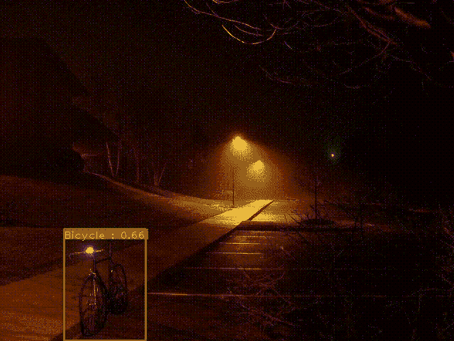
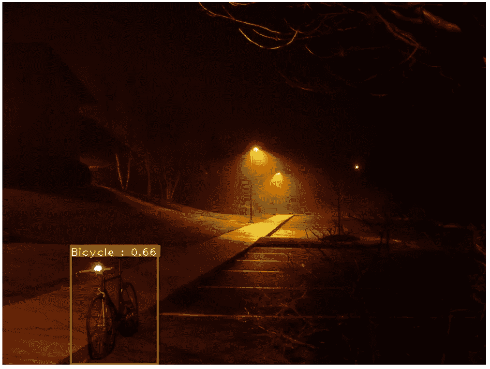
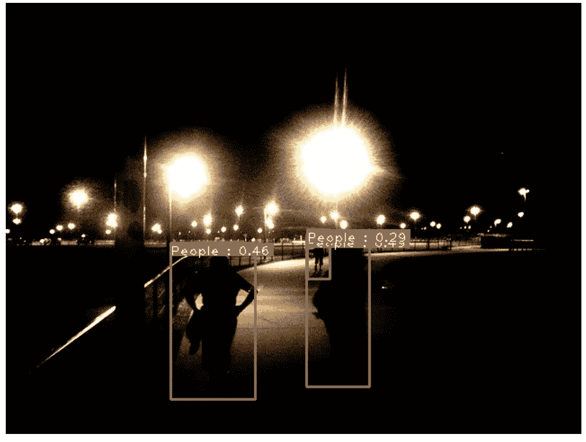

# 使用 EfficientDet 的自定义对象检测-最简单的方法

> 原文：<https://pub.towardsai.net/custom-object-detection-using-efficientdet-the-simplest-way-32749fb93359?source=collection_archive---------0----------------------->



目标检测

在这篇文章中，我将向你展示如何使用 [Monk](https://github.com/Tessellate-Imaging/Monk_Object_Detection) 的 EfficientDet 创建你的自定义对象检测器。

我假设你已经知道深度学习计算机视觉的基本知识。在深入研究之前，请确保您知道什么是对象检测，什么是迁移学习，以及其他一些深度学习术语。

如果你对这些都不了解，是时候回去学习基础知识，然后再来看这篇文章了。当然，你可以在没有任何知识的情况下使用[僧侣](https://github.com/Tessellate-Imaging/Monk_Object_Detection)来做这些事情，但是最好是让你的基础知识清晰明了。我会在这篇文章的最后部分放一些学习资源。

# 目录

1.  **数据采集**
2.  **转换为 COCO 格式**
3.  **培训模式**
4.  **测试对象检测器**

# 数据采集

在本文中，我们使用的数据来自[专门的暗图像数据集](https://github.com/cs-chan/Exclusively-Dark-Image-Dataset)。

```
wget [http://web.fsktm.um.edu.my/~cschan/source/CVIU/ExDark.zip](http://web.fsktm.um.edu.my/~cschan/source/CVIU/ExDark.zip)wget --no-check-certificate 'https://docs.google.com/uc?export=download&id=1FfEuDUdRbOFTtL8GioPceFghshMvfX7S' -O ExDark_Annno.zip
```

# 转换为 COCO 格式

下载数据的当前格式是

**数据集目录结构**

```
Dark (root_dir)
      |
      |------Images (img_dir) 
      |         |
      |         |----Bicycle
      |                 |
      |                 |---------img1.jpg
      |                 |---------img2.jpg
      |                 |---------..........(and so on)
      |
      |         |-----Boat
      |                 |
      |                 |---------img1.jpg
      |                 |---------img2.jpg
      |                 |---------..........(and so on)
      |
      |         |-----...........(and so on)
      |
      |
      |
      |------Annotations (anno_dir) 
      |         |
      |         |----Bicycle
      |                 |
      |                 |---------img1.jpg.txt
      |                 |---------img2.jpg.txt
      |                 |---------..........(and so on)
      |
      |         |-----Boat
      |                 |
      |                 |---------img1.jpg.txt
      |                 |---------img2.jpg.txt
      |                 |---------..........(and so on)
      |
      |         |------............(and so on)
```

这里我们通过 Monk 格式转换成 COCO 格式

1.  从当前格式转换为 Monk 格式

**和尚格式**

**数据集目录结构**

```
Dark (root)
      |
      |------Images (img_dir)
      |         |
      |         |----Bicycle
      |                 |
      |                 |---------img1.jpg
      |                 |---------img2.jpg
      |                 |---------..........(and so on)
      |
      |         |-----Boat
      |                 |
      |                 |---------img1.jpg
      |                 |---------img2.jpg
      |                 |---------..........(and so on)
      |
      |         |-----...........(and so on)
      |
      |
      |------train_labels.csv (anno_file)
```

**标注文件格式**

```
| Id         | Labels                                 |
| img1.jpg   | x1 y1 x2 y2 label1 x1 y1 x2 y2 label2  |
```

*   标签:xmin ymin xmax ymax 标签
*   xmin，ymin 边界框的左上角

**COCO 格式**

**数据集目录结构**

```
./ (root_dir)
      |
      |------Dark (coco_dir) 
              |
              |------Images (set_dir)
              |         |
              |         |----Bicycle
              |                 |
              |                 |---------img1.jpg
              |                 |---------img2.jpg
              |                 |---------..........(and so on)
              |
              |         |-----Boat
              |                 |
              |                 |---------img1.jpg
              |                 |---------img2.jpg
              |                 |---------..........(and so on)
              |
              |         |-----...........(and so on)
              |
              |
              |
              |------annotations 
              |----------|
                         |--------------------instances_Images.json  (instances_<set_dir>.json)
                         |--------------------classes.txt
```

*   instances_Train.json ->正确的 COCO 格式
*   classes.txt ->按字母顺序排列的类列表

对于车列

*   root_dir = "。/";
*   coco _ dir = " Dark
*   img_dir = "。/";
*   set _ dir = " Images

注意:注释文件名也与 set_dir 一致

Annotations 文件夹包含两个文件 classes.txt、instances_Images.json

2.从 Monk 格式转换到 COCO 格式。

运行 classes.txt

For instances_Images.json 运行

# 培训模式

在训练中选择合适的批量大小，学习速率，设置目录路径。也可以在多个 GPU 上训练。例如，如果您使用 2 个 GPU，请将 line8 更改为 gtf.model( gpu_devices=[0，1])

# 测试对象检测器

训练完模型后，我们可以在训练好的文件夹中得到权重文件。

你可以在下面看到一些图像推论:



推论 1



推论 2

你可以在 [Github](https://github.com/Tessellate-Imaging/Monk_Object_Detection/blob/master/application_model_zoo/Example%20-%20Object%20Detection%20in%20low%20lighting%20conditions.ipynb) 上找到完整的代码。

如果有任何问题，可以联系[阿布舍克](https://www.linkedin.com/in/abhishek-kumar-annamraju/)和[阿卡什](https://www.linkedin.com/in/akashdeepsingh01/)。请随意联系他们。

***【谢谢】***

# 证明人和信用

1.  [关于效率的论文](https://arxiv.org/abs/1911.09070)
2.  [https://github.com/signatrix/efficientdet](https://github.com/signatrix/efficientdet)
3.  [EfficientDet 博客](https://towardsdatascience.com/efficientdet-scalable-and-efficient-object-detection-review-4472ffc34fd9)
4.  [https://medium . com/analytics-vid hya/custom-object-detection-with-yolov 3-8f 72 Fe 8 ced 79](https://medium.com/analytics-vidhya/custom-object-detection-with-yolov3-8f72fe8ced79)


照片由 [Srilekha](https://www.instagram.com/_fernwehd_._/) 拍摄