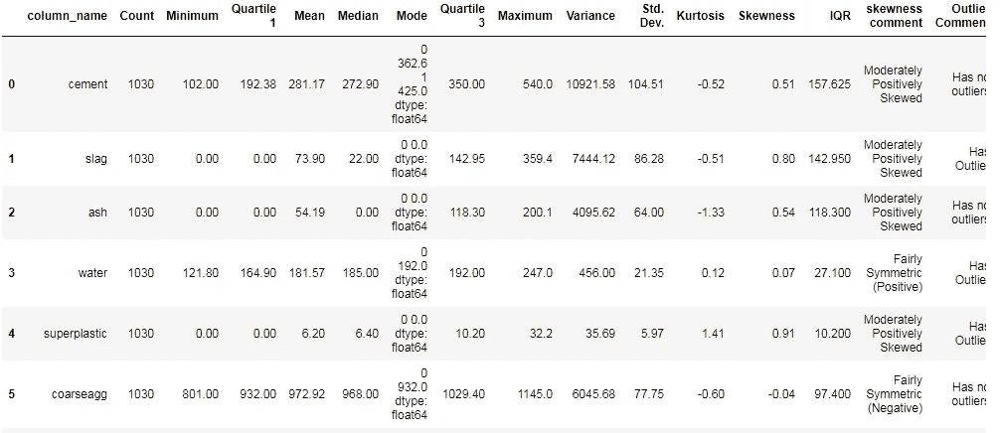

# 用 Python 定制数据框的统计细节

> 原文：<https://pub.towardsai.net/custom-statistical-details-of-data-frame-with-python-745d652b363f?source=collection_archive---------1----------------------->

## [数据科学](https://towardsai.net/p/category/data-science)

## 数据集中特征的统计分析


由[克里斯·利维拉尼](https://unsplash.com/@chrisliverani?utm_source=medium&utm_medium=referral)在 [Unsplash](https://unsplash.com?utm_source=medium&utm_medium=referral) 上拍摄

在本文中，我们将介绍使用 python 进行基于自定义的描述性统计分析。尽管在 python 中，我们可以通过一个单词的方法来实现这一点，即 describe()。但是，如果我们自己制作一个函数来生成一个统计报告，又会怎么样呢？

我们从所描述的方法中得到的统计数据非常有用，但给出的信息很少。例如，下图显示了来自 ***describe()*** 方法的结果。


内置方法的统计描述。作者的照片

在这里，我们可以看到统计分析，这些信息看起来像一个箱线图。但是，我们不知道偏度和峰度。只有一个平均值，即均值，如果我们想看到均值，众数和中位数之间的比较，然后我们想出了一个自定义报告的解决方案。

[](/z-statistics-t-statistics-p-statistics-are-still-confusing-you-87557047e20a) [## Z-统计量，T-统计量，P-统计量还在迷惑你？

### 机器学习统计学中的定义和概念

pub.towardsai.net](/z-statistics-t-statistics-p-statistics-are-still-confusing-you-87557047e20a) [](/correlation-and-its-types-in-statistics-7a723dcfd12d) [## 统计学中的相关性及其类型

### 统计学有助于理解机器学习中的行为

pub.towardsai.net](/correlation-and-its-types-in-statistics-7a723dcfd12d) 

python 示例如下所示:

```
# Preparing Custom EDA Reportdef custom_summary(data):
    result = []
    for col in data.columns:
        stats = OrderedDict({"column_name":col,
                         "Count":round(data[col].count(),2),
                        "Minimum":round(data[col].min(),2),
                        "Quartile 1
                       ":round(data[col].quantile(0.25),2),
                        "Mean":round(data[col].mean(),2),
                        "Median":round(data[col].median(),2),
                        "Mode":round(data[col].mode(),2),
                        "Quartile 3 
                        ":round(data[col].quantile(0.75),2),
                        "Maximum":round(data[col].max(),2),
                        "Variance":round(data[col].var(),2),
                        "Std. Dev.":round(data[col].std(),2),
                        "Kurtosis":round(data[col].kurt(),2),
                        "Skewness":round(data[col].skew(),2),
                        "IQR":data[col].quantile(0.75)-data[col].quantile(0.25)})
        result.append(stats)
        if data[col].skew()<-1:
            sk_label = "Highly Negatively Skewed"
        elif -1<=data[col].skew()<-0.5:
            sk_label = "Moderately Negatively Skewed"
        elif -0.5<= data[col].skew()<0:
            sk_label = "Fairly Symmetric (Negative)"
        elif 0<=data[col].skew()<0.5:
            sk_label= "Fairly Symmetric (Positive)"  
        elif 0.5<=data[col].skew()<1:   
            sk_label= "Moderately Positively Skewed"  
        elif data[col].skew()>1:
            sk_label="Highly Positively Skewed"
        else:
            sk_label='error'
        stats['skewness comment']=sk_label#Outlier comment
        upperlim = stats['Quartile 3']+(1.5*stats['IQR'])    
        lowerlim = stats['Quartile 1']-(1.5*stats['IQR'])
        if len([x for x in data[col] if x < lowerlim or x >
                                                upperlim]) > 0:
            outliercomments = 'Has Outlier'
        else:
            outliercomments = 'Has no outliers'
        stats['Outlier Comment'] = outliercomments result_df = pd.DataFrame(result)
    return result_df
```

这个自定义函数的结果显示了更广泛的统计分析，如下所示:



使用自定义函数进行统计分析。作者的照片

对于初学者来说，有些单词很难认识。让我在下面的术语表中清除这些。

*   Count:它是数据集中的总行数。
*   最小值:它是特定特征的数据集中的最小值。
*   四分位数 1:是特征列中 25%值处的值。
*   均值、中值和众数:这些是平均值。
*   四分位数 3:是特征列中的 75%的值。
*   最大值:它是特定特征的数据集中的最大值。
*   方差:它是平均值的分布。如果价差越大，那么方差就越大。
*   标准差:它是方差的平方根，表示平均值的分布。
*   峰度:它表明曲线的形状及其尾部不同于正态分布。
*   偏斜度:它也表示与正态钟形分布的不同均值和标准差的形状变化。
*   IQR:它是四分位数 1 和四分位数 3 之间的值。

[](/chi-square-hypothesis-testing-in-statistics-87884bc73d99) [## 统计学中的卡方假设检验

### 分类特征之间的关系关联

pub.towardsai.net](/chi-square-hypothesis-testing-in-statistics-87884bc73d99) 

结论:

有时内置函数不足以在一个方法中获得所有细节，我们使用许多方法来查看所有细节。一知半解，我们可以自己制作函数来观察统计细节。

我希望你喜欢这篇文章。通过我的 [LinkedIn](https://www.linkedin.com/in/data-scientist-95040a1ab/) 和 [twitter](https://twitter.com/amitprius) 联系我。

# 推荐文章

[1。NLP —零到英雄用 Python](https://medium.com/towards-artificial-intelligence/nlp-zero-to-hero-with-python-2df6fcebff6e?sk=2231d868766e96b13d1e9d7db6064df1)
2。 [Python 数据结构数据类型和对象](https://medium.com/towards-artificial-intelligence/python-data-structures-data-types-and-objects-244d0a86c3cf?sk=42f4b462499f3fc3a160b21e2c94dba6)
3。[数据预处理概念同 Python](/data-preprocessing-concepts-with-python-b93c63f14bb6?source=friends_link&sk=5cc4ac66c6c02a6f02077fd43df9681a)
4。[用 Python 进行主成分分析降维](/principal-component-analysis-in-dimensionality-reduction-with-python-1a613006d531?source=friends_link&sk=3ed0671fdc04ba395dd36478bcea8a55)
5。[用 Python 全面讲解 K-means 聚类](https://medium.com/towards-artificial-intelligence/fully-explained-k-means-clustering-with-python-e7caa573176a?source=friends_link&sk=9c5c613ceb10f2d203712634f3b6fb28)
6。[用 Python 充分解释了线性回归](https://medium.com/towards-artificial-intelligence/fully-explained-linear-regression-with-python-fe2b313f32f3?source=friends_link&sk=53c91a2a51347ec2d93f8222c0e06402)
7。[用 Python](https://medium.com/towards-artificial-intelligence/fully-explained-logistic-regression-with-python-f4a16413ddcd?source=friends_link&sk=528181f15a44e48ea38fdd9579241a78)
充分解释了 Logistic 回归 8。[用 Python 做时间序列的基础知识](https://medium.com/towards-artificial-intelligence/basic-of-time-series-with-python-a2f7cb451a76?source=friends_link&sk=09d77be2d6b8779973e41ab54ebcf6c5)
9。[与 Python 的数据角力—第一部分](/data-wrangling-with-python-part-1-969e3cc81d69?source=friends_link&sk=9c3649cf20f31a5c9ead51c50c89ba0b)
10。[机器学习中的混淆矩阵](https://medium.com/analytics-vidhya/confusion-matrix-in-machine-learning-91b6e2b3f9af?source=friends_link&sk=11c6531da0bab7b504d518d02746d4cc)