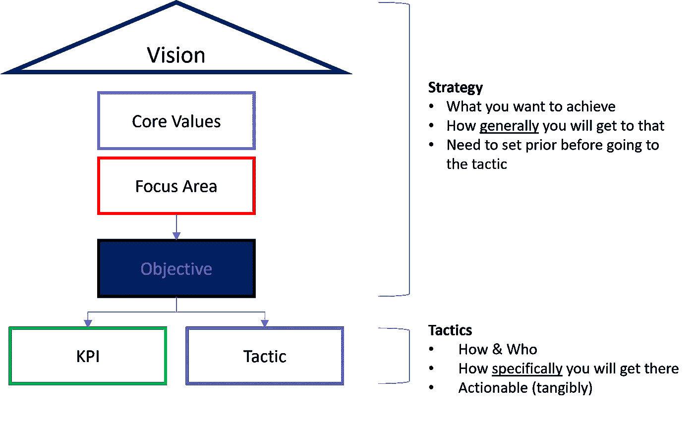
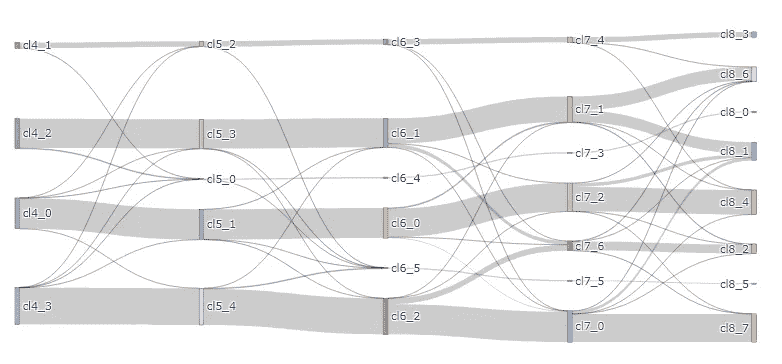
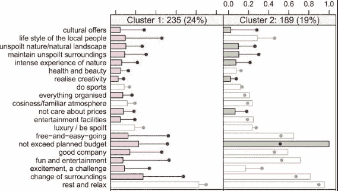
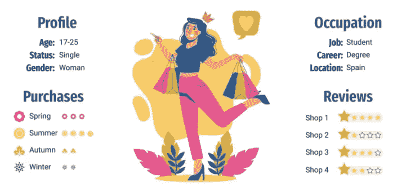

# 将客户细分作为一种策略

> 原文：<https://pub.towardsai.net/customer-segmentation-as-a-strategy-38a8eb73cdb?source=collection_archive---------1----------------------->

## 介绍数据驱动的细分，并将其整合到您的战略中

马里奥·普里西克在 [Unsplash](https://unsplash.com/s/photos/customer-group?utm_source=unsplash&utm_medium=referral&utm_content=creditCopyText) 上的照片

# 什么是客户细分，为什么

客户细分是

> 根据客户共有的某些特性或特征，将客户识别并分组为自然存在的或人工创建的客户群的过程。

一个组织内客户细分的最终目标是对其客户群有一个 **的**战略层面的了解。例如，客户细分中的大多数用例将与营销相关；****

*   营销推广的有效性——我们的客户如何与我们的营销沟通互动，他们的购买行为是否受到该推广的影响，我们在推广时是否错过了任何客户
*   产品组合—我们的客户如何与我们的产品和服务互动，他们是否接触到我们的全部或部分产品，我们是否有机会向客户提供更多产品

这些是市场营销的一些例子，但是，客户细分的用例可以扩展到市场营销部门之外，例如物流、战略和其他部门。

## 对于营销人员来说，当我们有了单一细分时，为什么还需要细分

这可能是那些接触过个性化营销或推荐引擎的数据科学家或营销人员的问题，因为这些概念已经与一对一的客户进行了互动。

最简单的解释是，客户细分更多的是在战略层面，而单一细分(或个性化)更多的是在战术层面。在战略层面，你可以想象你确定了哪座山最适合你爬，在战术层面，你选择哪种装备最适合爬那座山。

战略战术层面

# 所以如果我想开始做细分，我应该使用什么数据？

对于数据驱动的客户细分方法，活动将主要依赖于我们的细分方法中的数据。一般我们在定义用什么数据的时候，要准备好对应以下 5W 的数据: **W** ho， **W** 这里， **W** hat， **W** hen， **W** hy。

*   ***Who:人口统计数据*** —该数据区主要是每个细分的起点，提供客户信息的基础，如职业、年龄、性别、收入、教育程度等。
*   ***其中:地理数据*** —有些人可能会认为地理是人口数据的一部分，但我们应该单独分析。这是因为一些企业根据地理位置(或位置)提供不同的服务，或者一些企业可能具有宏观层面的影响(即新冠肺炎、法律和法规)，从而导致不同地区的不同行为。
*   ***什么和什么时候:行为数据*** —该数据区域通常定义客户购买了什么、购买了多少产品、花费了多少钱以及购买的频率。我们中的一些人将这定义为 RFM(最近频率货币)数据。然而，行为数据代表了更高层次的数据，例如，他们如何与线上和线下渠道互动，他们是否对我们的营销活动做出回应，等等。这些行为数据描绘了客户如何与企业互动的整体图景。
*   ***为什么:心理数据*** —该数据区域试图对客户与企业活动背后的“为什么”做出回应。所有其他数据领域都基于事实—客户互动、购买和个人资料。情感和感觉使互动更加个人化。心理数据可能包括促使顾客购买或不购买的生活方式数据、价值观、情感和观点。

所有这些数据区域都将是您的细分结果的关键驱动因素。因此，如果你想专注于一个特定的领域，确保你已经准备好这些数据。

# 然后…

在进行数据驱动的分段之前，将有几个步骤，如定义分段的目标、分析和理解每个数据区域上的数据，以及选择聚类算法。

有多种聚类算法可供选择，你可以在这篇[帖子](https://developers.google.com/machine-learning/clustering/clustering-algorithms)中找到更多信息。但是回顾一下每种类型的算法:

*   基于质心的聚类(即 K 均值、K 原型)
*   基于密度的聚类(即 DBSCAN)
*   基于分布的聚类(即 DBCLASD)
*   分层聚类

最流行的客户细分算法是 *K 均值算法*，它是基于质心的聚类家族之一。但是，您应该对您的数据进行数据分析，以了解它们，并根据您的数据集选择正确的算法。您可以选择在第一次迭代中尝试 K-mean 算法，并尝试多种算法来查看它们是否适合您的数据。

# 我应该制作多少个片段？

对于致力于创造细分的数据科学家来说，这是一个价值百万美元的问题。当然，确定分段数的方法有很多种(我之前写过这方面的内容，可以查看这篇帖子[这里](/get-the-optimal-k-in-k-means-clustering-d45b5b8a4315?sk=57cd2417af60bc408fff01499870fb8e)找到几种确定 K-mean 算法中分段数的技巧)。

从经验来看，分割是科学和艺术的结合**。你可以用科学的方法找到细分市场的数量(scree plot，silhouette score，仅举几个例子)，但有时你需要找到适合你的业务的细分市场的数量。**

我推荐的一个图是**跨解决方案的分段水平稳定性**(或者，分段水平移动)。

跨解决方案的分段水平稳定性(从 K=4 到 K=8)

通过该图，您可以 ***直观地看到，如果我们为算法分配不同数量的分段，每个分段的人口如何移动到不同的分段*** 。现在你可以放大每一个细分市场，并找到它们的独特特征以及是什么因素推动了向另一个细分市场的移动(例如；当 K 从 7 变为 8 时，片段 1 已经被分成 2 个完整的片段)。将它们与您的实力相匹配，并专注于您的业务，以正确选择适合您的细分市场编号。

# 良好客户细分的特征

你开始得到细分，那么什么是好的客户细分的特征或标准。

1.  **可微。**同一细分市场内的客户应具有相似的特征(同质)，需要与其他细分市场有明显的区别(异质)。
2.  **实质性的。**细分市场的规模应该足够大或足够适合您的业务，以服务于这些市场并从中产生收入，从而实现成本效益。
3.  **可识别。**每个细分市场的客户都需要能够识别、跟踪和衡量他们的特质和特征(即购买行为)。
4.  **可及。**每个细分市场的客户应该能够通过通信和分销渠道接触到企业。例如，你的企业可能需要数字营销工具来联系年轻一代的客户，你有 tik-tok 或 Twitter 来联系他们吗？
5.  **可操作的。**您的企业需要为您的细分市场提供产品或服务。有时，您可能需要创建新的产品来适应您的客户群，但是这与您的业务目标一致吗？

# 去买吧

现在您已经完成了细分市场分析并最终确定了细分市场结果，您需要能够将您的细分市场传达给管理层或其他业务部门。

我们可以使用的一种技术是**分段剖析**。在此可视化中，我们将挑选关键因素(通过使用细分市场 ID 作为目标进行检索，然后您可以构建一个基于树的模型来查看重要特征)或对您的业务重要的因素(例如，RFM —最近、频率和货币)，并将它们可视化，并突出显示区分每个细分市场的关键因素。

片段分析可视化(条形代表聚类的平均值，而点和线代表总体的平均值)

高管和经理喜欢故事和可视化，我们可以使用上面的可视化，并将其总结为**客户角色**。建立客户角色的几个好处是:

*   提供对您的客户特征、特点和需求的关键总结和总体理解。
*   提供每个细分市场接触到的产品或服务的一个很好的方式，并提供业务可以提供或需要进一步发展的产品或方式的概述。
*   根据细分市场规模和每个细分市场中的机会，对计划和预算进行优先级排序
*   客户细分的单一沟通创造了整个业务的一致性(**记住！细分是战略层面**。

将结果构建到客户角色中可以为每个人提供价值和洞察力，并且是传达您对每个细分市场的分析和发现的好方法。

客户角色示例

# 参考

 [## 聚类算法|机器学习中的聚类| Google 开发者

### 让我们快速看一下聚类算法的类型以及何时应该选择每种类型。选择聚类时…

developers.google.com](https://developers.google.com/machine-learning/clustering/clustering-algorithms)  [## 求 K-均值聚类中的最优 K

### K-Means 聚类中寻找最佳聚类数的快速教程

pub.towardsai.net](/get-the-optimal-k-in-k-means-clustering-d45b5b8a4315)  [## 市场细分分析

### 这本书是在 CC BY 4.0 许可下开放存取出版的。这本开放存取的书为每个人提供了一些东西…

link.springer.com](https://link.springer.com/book/10.1007/978-981-10-8818-6)  [## 创建客户角色的 5 个最佳指南

### 你有多了解你的客户？如果你像我们大多数人一样，可能没有你应该做的那么好。最大的…

www.usertesting.com](https://www.usertesting.com/blog/customer-personas)