# 基于 K 均值聚类的客户细分

> 原文：<https://pub.towardsai.net/customer-segmentation-using-k-means-clustering-c0c6307ec3f7?source=collection_archive---------0----------------------->

## [机器学习](https://towardsai.net/p/category/machine-learning)

"市场营销的目的是充分了解和理解顾客，使产品或服务适合他并自我销售"。

彼得·德鲁克


由 [Austin Distel](https://unsplash.com/@austindistel?utm_source=unsplash&utm_medium=referral&utm_content=creditCopyText) 在 [Unsplash](https://unsplash.com/s/photos/marketing-customer-targets?utm_source=unsplash&utm_medium=referral&utm_content=creditCopyText) 上拍摄

**什么是客户细分？**

客户细分是将公司的客户划分成组的过程，其中每个组内的客户在其组内共享共同的特征(例如，个性、兴趣、购买历史)。对客户进行细分的目标是决定如何与每一组中的客户建立联系，以最大化每个客户对企业的价值。

细分提供了一种组织和管理公司与客户关系的简单方法。这一过程还使您的营销、服务和销售工作更容易个性化，以满足每个群体中个人的特定需求。

**客户细分的好处**

有几个原因说明了客户细分对企业的重要性。《客户细分终极指南》的作者 Kristen Baker 定义了使用客户细分可以获得的几个好处。其中包括以下内容:

1.更深入地了解您的客户，以便根据他们的独特需求和挑战定制您的内容。

2.创建有针对性的活动和广告，以引起客户的共鸣并转化客户群。

3.通过了解不同群体可能遇到的挑战并做好准备，改善您的客户服务和客户支持工作。

4.通过定制内容和互动提高客户忠诚度。

5.了解谁是你最有价值的客户，为什么。

6.有效识别产品、支持和服务的新机会。

**利用机器学习进行客户细分**

机器学习模型是分析大型数据集和在数据中寻找见解和模式的伟大工具。他们可以准确地识别多个客户群，每个客户群中的客户都有共同的特征和兴趣。这些发现很难用手工或传统的分析方法发现。

有许多不同的机器学习算法适用于不同类型的问题。用于客户细分的一种非常常见的机器学习算法是 k 均值聚类算法。K-means 聚类是一种无监督的学习技术，用于通过按特征而不是预定义的类别对未标记的数据进行分组来分类。变量 K 表示创建的集群(组)的数量。目标是将数据分成不同的聚类，并找到每个聚类的中心位置。然后，新的数据点可以被分配给其中心最接近该新的数据点的聚类。

**路线图**

本文的剩余部分将展示一个程序，该程序将读取客户发票数据，使用 K-Means 聚类算法对客户数据进行分段，并发现关于每个客户群的见解。以下步骤将使用机器学习和 Python 来执行。

1.导入所需的软件库。

2.加载数据。

3.数据分析。

4.数据清理和转换。

5.将数据标准化。

6.将数据可视化

7.发现关于客户的见解。

**程序**

使用 K-Means 聚类算法进行客户细分的程序如下所示。

**导入所需的软件库**

```
**import** pandas **as** pd
**import** numpy **as** np
**import** seaborn **as** sns
**import** matplotlib.pyplot **as** plt
**from** sklearn.cluster **import** KMeans
**from** sklearn **import** cluster
```

**加载数据**

```
# Load data on Google Colab **from** google.colab **import** files 
uploaded **=** files**.**upload()
```

将数据存储到数据框变量中。

```
retail **=** pd**.**read_excel('Online Retail.xlsx', sheet_name**=**'Online Retail')
```

**数据分析**

打印数据框的前 5 行。

```
retail**.**head()
```

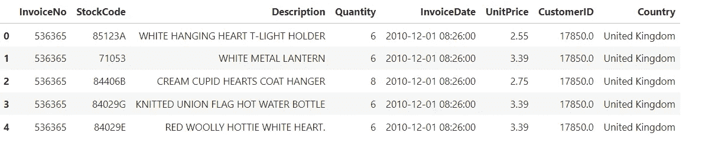

这些数据来自 Kaggle 的网站。该数据集包含一家总部位于英国的在线零售公司在八个月内的所有采购。数据可以在这个[链接](https://www.kaggle.com/vijayuv/onlineretail)找到。

下面列出了列和定义。

1.  发票号—发票号码。
2.  库存代码——特定产品的库存标识符。
3.  描述—产品的描述。
4.  数量——购买产品的数量。
5.  InvoiceDate —创建发票的日期(年月日)。
6.  单价——单一产品的价格。
7.  CustomerID —每个客户的唯一标识符。
8.  国家——购买产品的国家。

显示有关数据列的信息。

```
retail**.**info()
<class 'pandas.core.frame.DataFrame'>
RangeIndex: 541909 entries, 0 to 541908
Data columns (total 8 columns):
 #   Column       Non-Null Count   Dtype         
---  ------       --------------   -----         
 0   InvoiceNo    541909 non-null  object        
 1   StockCode    541909 non-null  object        
 2   Description  540455 non-null  object        
 3   Quantity     541909 non-null  int64         
 4   InvoiceDate  541909 non-null  datetime64[ns]
 5   UnitPrice    541909 non-null  float64       
 6   CustomerID   406829 non-null  float64       
 7   Country      541909 non-null  object        
dtypes: datetime64[ns](1), float64(2), int64(1), object(4)
memory usage: 33.1+ MB
```

发票记录 541909 条，8 列。变量包含字母数字、数字和日期数据类型。Description 和 CustomerID 列中有 null 值或缺少值。

**数据清理和转换**

删除没有客户 ID 的记录。

```
retail **=** retail[pd**.**notnull(retail['CustomerID'])]
```

在数据框中为每张发票的总销售额创建一个新列。这是通过将数量乘以每行的单价来计算的。

```
retail['Sales'] **=** retail['Quantity'] ***** retail['UnitPrice']
retail**.**head(5)
```

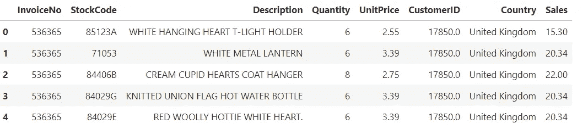

我们需要转换数据，以便每个记录代表一个客户的购买历史。我们将使用 group by 功能按 CustomerID 汇总销售额。lambda 函数将用于按客户 ID 对发票数量求和。

```
customer_retail **=** retail**.**groupby('CustomerID')**.**agg({'Sales': sum, 
                               'InvoiceNo': **lambda** x: x**.**nunique()})
customer_retail**.**head(5)
```


我们将在数据框中选择要用于分析的列，并重命名列名以使其更加直观。

```
customer_retail**.**columns **=** ['TotalSales', 'OrderCount'] 
customer_retail**.**head(5)
```

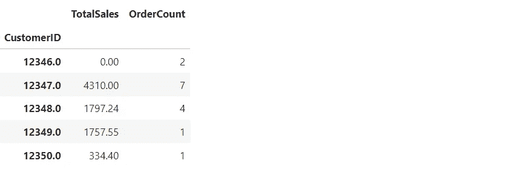

为数据框中每个客户的平均订单值创建一个新列。计算方法是将总销售额除以每行的订单数。

```
customer_retail['AvgOrderValue'] **=** customer_retail['TotalSales'] **/** customer_retail['OrderCount']
customer_retail**.**head()
```

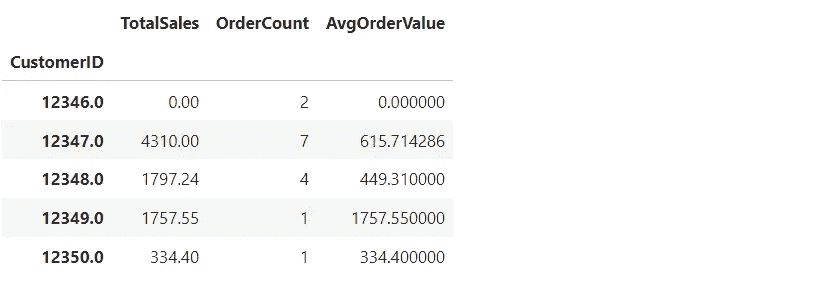

**归一化数据**

我们需要对数据进行标准化，使其分布的平均值为 0，标准差为 1。规范化使要素之间更加一致，从而使模型能够更准确地预测输出。这是针对数据框中的每个要素或列进行的。rank (method=first)函数按照数据在数据框中出现的顺序对数据进行排序。

```
rank_retail **=** customer_retail**.**rank(method**=**'first')
normalized_retail **=** (rank_retail **-** rank_retail**.**mean()) **/** rank_retail**.**std()
normalized_retail**.**head()
```

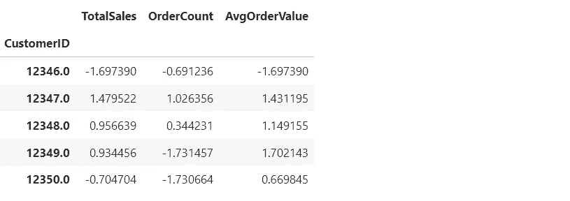

我们将使用 K-means 聚类算法来分割我们的客户发票数据。这是一种无监督的学习算法，旨在将 n 个观察值划分为 k 个聚类，其中每个观察值都属于质心最近的聚类(聚类的中心)。该算法的目标是最小化观测值与其所属聚类的质心之间的平方欧几里德距离。如果你想了解更多关于 K-means 聚类算法的知识，请点击这个[链接](https://www.analyticsvidhya.com/blog/2021/11/understanding-k-means-clustering-in-machine-learningwith-examples/)。

我们将使用 K-means 聚类算法的肘方法来选择最佳的聚类数。肘方法是一种最常用的方法，用于通过在 K-means 算法中用一系列 K 值拟合模型来选择最佳聚类数。肘形法需要在 SSE(误差平方和)与多个聚类之间绘制一个线图，并找到代表“肘形点”的点(在该点之后 SSE 或惯性开始以线性方式下降)。

```
sse **=** []
krange **=** list(range(2,11))
X **=** normalized_retail[['TotalSales','OrderCount','AvgOrderValue']]**.**values
**for** n **in** krange:
    model **=** cluster**.**KMeans(n_clusters**=**n, random_state**=**3)
    model**.**fit_predict(X)
    cluster_assignments **=** model**.**labels_
    centers **=** model**.**cluster_centers_
    sse**.**append(np**.**sum((X **-** centers[cluster_assignments]) ****** 2))

# Plot the results.
fig **=** plt**.**figure(figsize **=** (8,5))
plt**.**plot(krange, sse, marker**=**'o')
plt**.**xlabel("$K - Number of Clusters$")
plt**.**ylabel("Sum of Squares")
plt**.**grid(**True**)
plt**.**show()
```

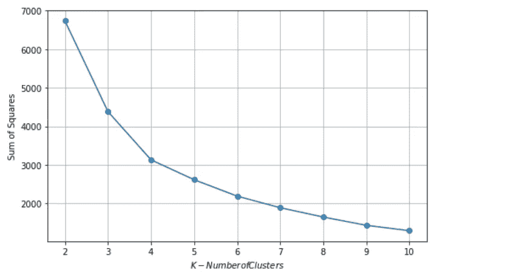

该图显示了 4 个聚类，这是该分析的最佳聚类数。如果我们将集群的数量增加到 4 个以上，那么惯性或者平方距离的和会有非常小的变化。

我们现在需要使用找到的最佳聚类数(4)在标准化数据帧上训练 k-means 聚类模型。该模型遍历训练数据，并将每个数据点分配给质心最接近该数据点的聚类。我们还会将聚类数添加到数据框中数据所属的每一行。

```
kmeans **=** KMeans(n_clusters**=**4)**.**fit(normalized_retail[['TotalSales', 'OrderCount', 'AvgOrderValue']])
four_clusters **=** normalized_retail[['TotalSales', 'OrderCount', 'AvgOrderValue']]**.**copy(deep**=True**)
four_clusters['Cluster'] **=** kmeans**.**labels_
four_clusters**.**head(5)
```

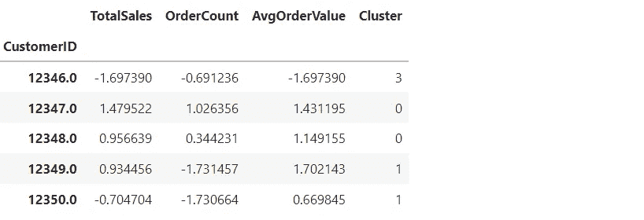

数据框中的每一行现在都被分配给特定的聚类。

我们现在将根据之前的数据框创建一个新的数据框，其中每个记录代表一个客户在规范化之前的购买历史。我们还会将聚类列添加到该数据框中。

```
df **=** customer_retail
frame **=** pd**.**DataFrame(df)
frame['Cluster'] **=** four_clusters['Cluster']
frame**.**head(5)
```

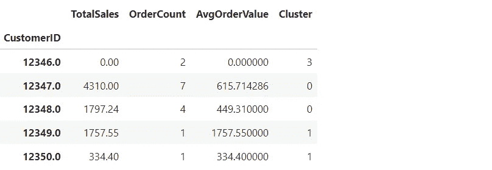

**数据可视化和洞察**

可视化总销售额和每个分类之间的关系。

```
fig **=** plt**.**figure(figsize **=** (8,5))
sns**.**barplot(x **=** 'Cluster', 
            y **=** 'TotalSales', 
            data **=** frame,
            ci **=** **None**)
# Add labels.
plt**.**xlabel("Cluster", size**=**12)
plt**.**ylabel("Total Sales ($)", size**=**12)
```

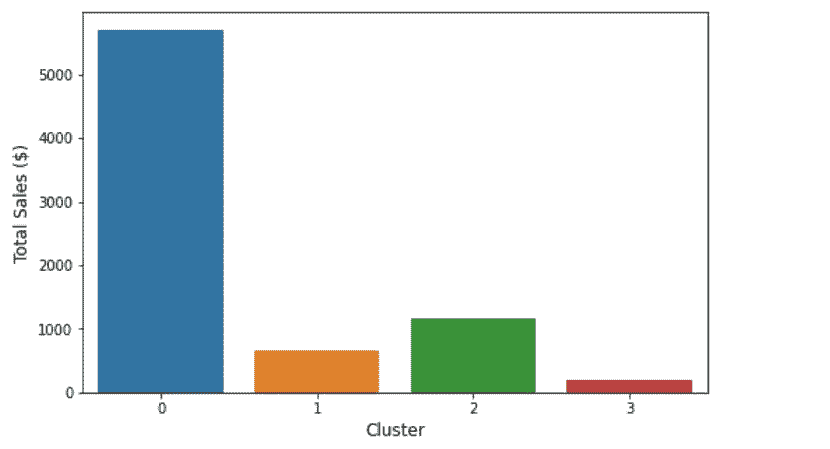

可视化订单计数和每个群之间的关系。

```
fig **=** plt**.**figure(figsize **=** (8,5))
sns**.**barplot(x **=** 'Cluster', 
            y **=** 'OrderCount', 
            data **=** frame,
            ci **=** **None**)
# Add labels
plt**.**xlabel("Cluster", size**=**12)
plt**.**ylabel("Order Count", size**=**12)
```

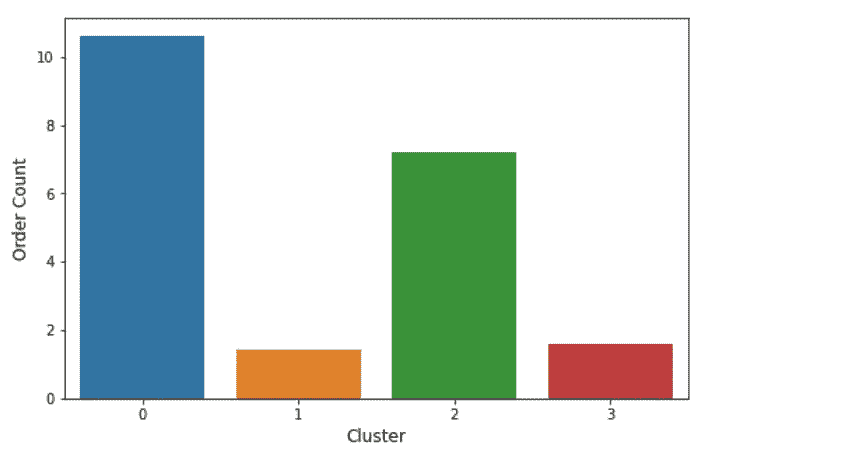

可视化平均顺序值和每个分类之间的关系。

```
fig **=** plt**.**figure(figsize **=** (8,5))
sns**.**barplot(x **=** 'Cluster', 
            y **=** 'AvgOrderValue', 
            data **=** frame,
            ci **=** **None**)
# Add labels.
plt**.**xlabel("Cluster", size**=**12)
plt**.**ylabel("Average Order Value", size**=**12)
```

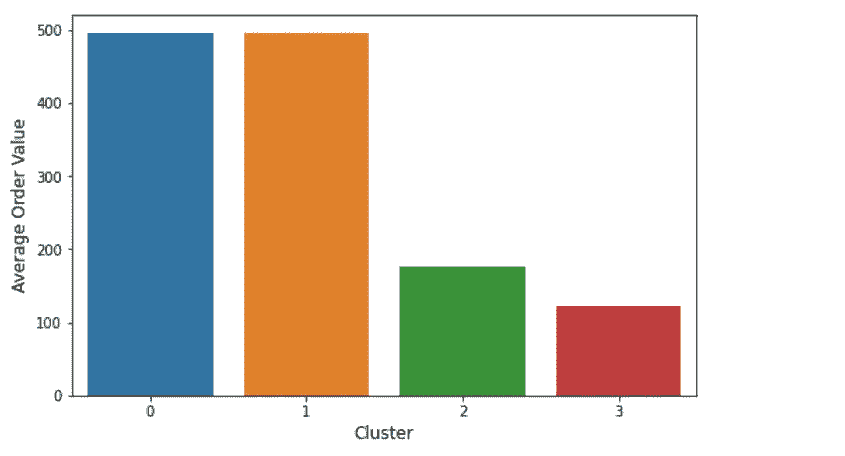

创建一个数据框，包括 4 个聚类中每个聚类内所有数据点的平均值。数据点包括总销售额、订单计数和平均订单价值。聚类的中心是该聚类内所有点(元素)的平均值。

```
cluster1_metrics **=** kmeans**.**cluster_centers_[0]
cluster2_metrics **=** kmeans**.**cluster_centers_[1]
cluster3_metrics **=** kmeans**.**cluster_centers_[2]
cluster4_metrics **=** kmeans**.**cluster_centers_[3]

data **=** [cluster1_metrics, cluster2_metrics, cluster3_metrics, cluster4_metrics]
cluster_center_df **=** pd**.**DataFrame(data)
# Add the column lables.
cluster_center_df**.**columns **=** four_cluster_df**.**columns[0:3]
cluster_center_df
```

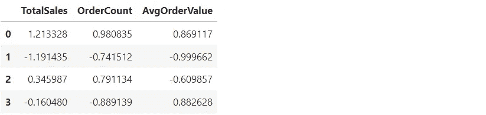

集群编号显示在最左边的列中。

按订单计数显示总销售额的分类。

```
fig **=** plt**.**figure(figsize **=** (9,6))
plt**.**scatter(
    four_clusters**.**loc[four_clusters['Cluster'] **==** 0]['OrderCount'], 
    four_clusters**.**loc[four_clusters['Cluster'] **==** 0]['TotalSales'],
    c**=**'blue')

plt**.**scatter(
    four_clusters**.**loc[four_clusters['Cluster'] **==** 1]['OrderCount'], 
    four_clusters**.**loc[four_clusters['Cluster'] **==** 1]['TotalSales'],
    c**=**'orange')

plt**.**scatter(
    four_clusters**.**loc[four_clusters['Cluster'] **==** 2]['OrderCount'], 
    four_clusters**.**loc[four_clusters['Cluster'] **==** 2]['TotalSales'],
    c**=**'green')

plt**.**scatter(
    four_clusters**.**loc[four_clusters['Cluster'] **==** 3]['OrderCount'], 
    four_clusters**.**loc[four_clusters['Cluster'] **==** 3]['TotalSales'],
    c**=**'red')

plt**.**title('Total Sales by Order Count', size**=**14)
plt**.**xlabel('Order Count', size**=**12)
plt**.**ylabel('Total Sales', size**=**12)

plt**.**grid()
plt**.**show()
```

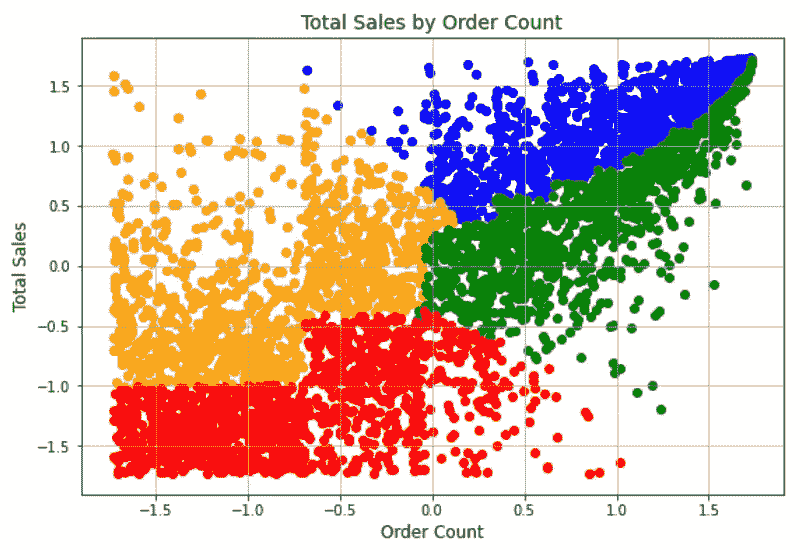

红色客户的总销售额和订单数都很低，这意味着他们是低价值客户。蓝色的客户总销售额和订单数都很高，表明他们是高价值客户。

按订单计数显示平均订单值的分类。

```
*# Visualize the clusters for average order value by order count*
fig **=** plt**.**figure(figsize **=** (9,6))
plt**.**scatter(
    four_clusters**.**loc[four_clusters['Cluster'] **==** 0]['OrderCount'], 
    four_clusters**.**loc[four_clusters['Cluster'] **==** 0]['AvgOrderValue'],
    c**=**'blue')

plt**.**scatter(
    four_clusters**.**loc[four_clusters['Cluster'] **==** 1]['OrderCount'], 
    four_clusters**.**loc[four_clusters['Cluster'] **==** 1]['AvgOrderValue'],
    c**=**'orange')

plt**.**scatter(
    four_clusters**.**loc[four_clusters['Cluster'] **==** 2]['OrderCount'], 
    four_clusters**.**loc[four_clusters['Cluster'] **==** 2]['AvgOrderValue'],
    c**=**'green')

plt**.**scatter(
    four_clusters**.**loc[four_clusters['Cluster'] **==** 3]['OrderCount'], 
    four_clusters**.**loc[four_clusters['Cluster'] **==** 3]['AvgOrderValue'],
    c**=**'red')

plt**.**title('Average Order Value by Order Count')
plt**.**xlabel('Order Count')
plt**.**ylabel('Average Order Value')

plt**.**grid()
plt**.**show()
```

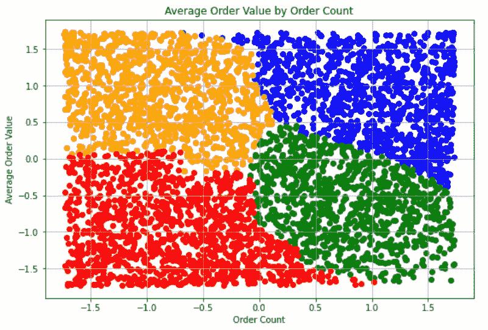

红色客户的平均订单价值和订单数量较低，意味着他们是低价值客户。蓝色客户的平均订单价值和订单数量都很高，表明他们是价值最高的客户。橙色客户的平均订单价值较高，但订单数量较少，这意味着他们对高价产品的订单较少。

按总销售额显示平均订单值的分类。

```
fig **=** plt**.**figure(figsize **=** (9,6))
plt**.**scatter(
    four_clusters**.**loc[four_clusters['Cluster'] **==** 0]['TotalSales'], 
    four_clusters**.**loc[four_clusters['Cluster'] **==** 0]['AvgOrderValue'],
    c**=**'blue')

plt**.**scatter(
    four_clusters**.**loc[four_clusters['Cluster'] **==** 1]['TotalSales'], 
    four_clusters**.**loc[four_clusters['Cluster'] **==** 1]['AvgOrderValue'],
    c**=**'orange')

plt**.**scatter(
    four_clusters**.**loc[four_clusters['Cluster'] **==** 2]['TotalSales'], 
    four_clusters**.**loc[four_clusters['Cluster'] **==** 2]['AvgOrderValue'],
    c**=**'green')

plt**.**scatter(
    four_clusters**.**loc[four_clusters['Cluster'] **==** 3]['TotalSales'], 
    four_clusters**.**loc[four_clusters['Cluster'] **==** 3]['AvgOrderValue'],
    c**=**'red')

plt**.**title('Average Order Value by Total Sales')
plt**.**xlabel('Total Sales')
plt**.**ylabel('Average Order Value')

plt**.**grid()
plt**.**show()
```

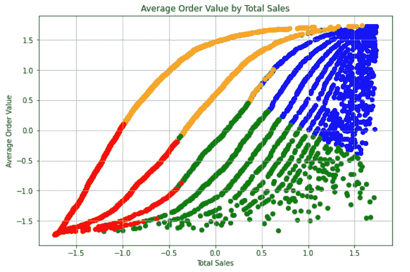

蓝色客户的总销售额和平均订单价值都很高，这意味着他们是价值最高的客户。橙色客户的平均订单价值较高，但总销售额较低，这意味着他们对高价产品的订单较少。红色和绿色的客户是高机会客户。

让我们确定最高价值群中的客户。通过更改簇号和数据帧名称，相同的代码可用于其他簇。

```
high_value_cluster **=** four_clusters**.**loc[four_clusters['Cluster'] **==** 0]
high_value_cluster
```

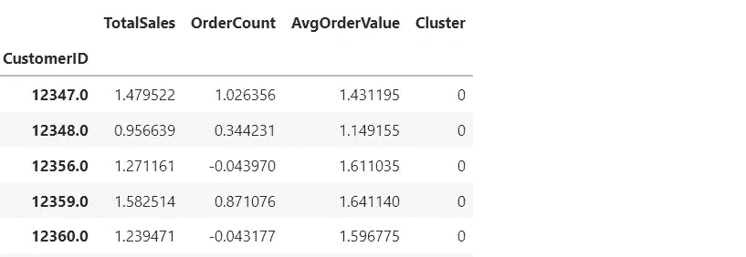

让我们找出所有分类中最畅销的商品。

```
pd**.**DataFrame(retail**.**groupby('Description')**.**count()['StockCode']**.**sort_values(ascending**=False**)**.**head())
```

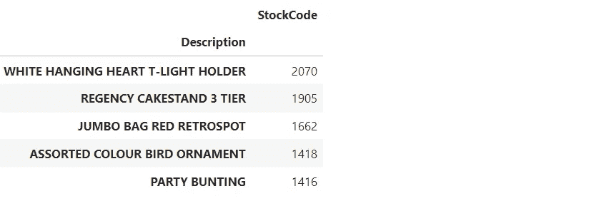

让我们确定最高价值群中最畅销的商品。通过更改簇号和数据帧名称，相同的代码可用于其他簇。

```
high_value_cluster **=** four_clusters**.**loc[four_clusters['Cluster'] **==** 0]

pd**.**DataFrame(retail**.**loc[retail['CustomerID']**.**isin(high_value_cluster**.**index)]**.**groupby(
    'Description')**.**count()['StockCode']**.**sort_values(ascending**=False**)**.**head())
```

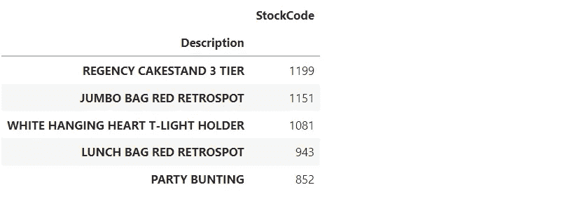

非常感谢你阅读我的文章！如果您有任何意见或反馈，请在下面添加。

如果你喜欢阅读这样的故事，并想支持我成为一名作家，可以考虑报名成为一名媒体成员。会员资格让你可以无限制地接触媒体上的故事。你可以使用这个链接报名【https://medium.com/@dniggl/membership 

-