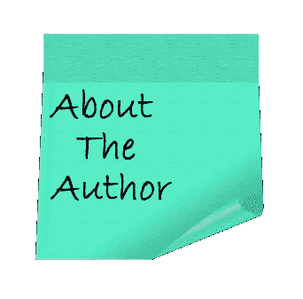

# CVML 注释-它是什么以及如何转换它？

> 原文：<https://pub.towardsai.net/cvml-annotation-what-it-is-and-how-to-convert-it-7b818dc30c9f?source=collection_archive---------5----------------------->

## [计算机视觉](https://towardsai.net/p/category/computer-vision)，[深度学习](https://towardsai.net/p/category/machine-learning/deep-learning)

## 这篇文章是关于 CMVL 注释格式，以及如何将它们转换成其他注释格式。


照片由[列宁·艾斯特拉达](https://unsplash.com/@lenin33?utm_source=medium&utm_medium=referral)在 [Unsplash](https://unsplash.com?utm_source=medium&utm_medium=referral) 上拍摄

2004 年 1 月，[](https://www.researchgate.net/profile/Thor_List)**和[**Robert b . Fisher**](https://www.researchgate.net/profile/Robert_Fisher5)**发表了一篇名为[***CVML——一种基于 XML 的计算机视觉标记语言***](https://www.researchgate.net/publication/220927989_CVML_-_An_XML-based_computer_vision_markup_language)*的研究论文。介绍一种新的基于 XML 的注释格式，名为 **CVML。*******

## *****什么是计算机视觉中的标注？*****

***注记是对影像数据集的标注，因此可用于训练模型。正确标记图像在计算机视觉任务中非常重要，因为模型将使用这些注释进行学习，错误的标记将使模型不太准确，垃圾进垃圾出。***

***如果你正在读这篇文章，那么你有可能在某个地方遇到过 CVML。CVML 不是时下流行的业态，在 COCO 和 VOC 的时代，它似乎已经迷失了。(你看 COCO 和 VOC [在这里](https://towardsdatascience.com/coco-data-format-for-object-detection-a4c5eaf518c5))。***

## ***什么是 CVML？***

***CVML 是最早尝试创建一种通用注释格式的人之一，这种格式可以让世界各地的研究人员一起工作。它的创造者将其描述为***

> ***随着专门为计算机视觉设计的公共数据接口的引入，人们将能够使兼容的项目更容易地一起工作，如果不是作为一个单元，而是作为更大设置中的模块。一个群体的独特能力将会被其他人获得而不会泄露任何秘密。我们已经创建了一种语言，它可以很容易地与现有的代码相结合，还创建了一个库，如果人们愿意的话，可以在所有主要平台上运行。***
> 
> ***这个接口足够简单，所以没有人需要花太多时间来实现它，足够灵活，可以包含许多可能的功能需求，可扩展，所以每个组可以添加他们自己的附加信息源，最后是部分可解析的。这意味着数据中可能有辅助信息，如果不理解或不期望，可以安全地忽略这些信息。***

## ***CVML 格式***

***作为一种 XML 格式，每个项目都可以有自己的 CVML 格式版本。下面给出的转换代码符合以下格式:***

```
*<dataset>
<frame number="772" sec="187" ms="717">
<objectlist>
<object id="0">
<orientation>90</orientation>
<box h="15" w="6" xc="501" yc="100"/>
<appearance>appear</appearance>
<hypothesislist>
<hypothesis evaluation="1.0" id="1" prev="1.0">
<type evaluation="1.0">Traffic Light</type>
<subtype evaluation="1.0">go</subtype>
</hypothesis>
</hypothesislist>
</object>
</objectlist>
<grouplist></grouplist>
</frame>
</dataset.*
```

***根据上面的格式，我们将要求边界框使用`<box h="15" w="6" xc=”501” yc="100"/>`。“h”是高度，“w”是宽度，“xc”和“yc”分别是边界框中心在 x 和 y 上的坐标。
和`<subtype evaluation="1.0">go</subtype>`为标签。因此，在下面给出的转换代码中，我们将 h、w、xc、yc 和 subtype 转换为 xmin、ymin、xmax、ymax 和 label。xmin 和 ymin 是边界框的左上角，xmax 和 ymax 是右下角。***

## *****将 CVML 转换成 CSV 文件*****

***将 CVML 转化为。csv 文件可以很容易地转换成任何流行的格式，如 COCO 或 VOC。***

***步骤 1:导入必要的库。***

```
*import os
import sys
import numpy as np
import pandas as pd
import xmltodict
import json
from tqdm.notebook import tqdm
import collections*
```

***步骤 2:加载注释文件***

```
*img_dir = <image directory>;
annoFile=<annotation file>;
f = open(annoFile, 'r');
my_xml = f.read();
anno = dict(dict(xmltodict.parse(my_xml))["dataset"])*
```

***第三步:进入每个文件，找到包围盒的细节，并把它写在熊猫数据框中。***

```
*combined=[]
count=0;
for frame in tqdm(anno['frame']):
    fname=file_content[count].strip()
    count+=1
    label_str = "";
    width=640
    height=480
    if(type(frame["objectlist"]) ==collections.OrderedDict):
        if(type(frame["objectlist"]['object']) == list):
            for j,i in enumerate(frame['objectlist']['object']):
                x1=max(int(i['box']['[@xc](http://twitter.com/xc)'])-int(i['box']['[@w](http://twitter.com/w)'])/2,0)
                y1=max(int(i['box']['[@yc](http://twitter.com/yc)'])-int(i['box']['[@h](http://twitter.com/h)'])/2,0)
                x2=min(int(i['box']['[@xc](http://twitter.com/xc)'])+int(i['box']['[@w](http://twitter.com/w)'])/2,width)
                y2=min(int(i['box']['[@yc](http://twitter.com/yc)'])+int(i['box']['[@h](http://twitter.com/h)'])/2,height)
                label=i['hypothesislist']['hypothesis']['subtype']['#text']
                label_str+=str(x1)+" "+str(y1)+" "+str(x2)+" "+str(y2)+" "+label+" "else:
            x1=max(0,int(frame["objectlist"]['object']['box']['[@xc](http://twitter.com/xc)'])-int(frame["objectlist"]['object']['box']['[@w](http://twitter.com/w)'])/2)
            y1=max(0,int(frame["objectlist"]['object']['box']['[@yc](http://twitter.com/yc)'])-int(frame["objectlist"]['object']['box']['[@h](http://twitter.com/h)'])/2)
            x2=min(width,int(frame["objectlist"]['object']['box']['[@xc](http://twitter.com/xc)'])+int(frame["objectlist"]['object']['box']['[@w](http://twitter.com/w)'])/2)
            y2=min(height,int(frame["objectlist"]['object']['box']['[@yc](http://twitter.com/yc)'])+int(frame["objectlist"]['object']['box']['[@h](http://twitter.com/h)'])/2)
            label=frame["objectlist"]['object']['hypothesislist']['hypothesis']['subtype']['#text']
            label_str += str(x1)+" "+str(y1)+" "+str(x2)+" "+str(y2)+" " + label

    combined.append([fname,label_str.strip()])*
```

***步骤 4:将数据帧转换成 CSV 文件。***

```
*df = pd.DataFrame(combined, columns = ['ID', 'Label']);
df.to_csv("train_labels.csv", index=False);*
```

****将其转换为 CSV 文件后，您可以轻松将其转换为其他格式。****

## ***将 CSV 文件转换为 COCO***

***步骤 1:导入库***

```
*import os
import numpy as np 
import cv2
import dicttoxml
import xml.etree.ElementTree as ET
from xml.dom.minidom import parseString
from tqdm import tqdm
import shutil
import json
import pandas as pd*
```

***步骤 2:加载 CSV 文件并设置文件目录。***

```
*root = "./";
img_dir = <image directory>;
anno_file = "train_labels.csv";dataset_path = root;
images_folder = root + "/" + img_dir;
annotations_path = root + "/annotations/";if not os.path.isdir(annotations_path):
    os.mkdir(annotations_path)

input_images_folder = images_folder;
input_annotations_path = root + "/" + anno_file;output_dataset_path = root;
output_image_folder = input_images_folder;
output_annotation_folder = annotations_path;tmp = img_dir.replace("/", "");
output_annotation_file = output_annotation_folder + "/instances_" + tmp + ".json";
output_classes_file = output_annotation_folder + "/classes.txt";if not os.path.isdir(output_annotation_folder):
    os.mkdir(output_annotation_folder);df = pd.read_csv(input_annotations_path);
columns = df.columnsdelimiter = " ";*
```

***步骤 3:创建 classes.txt 文件，该文件将包含注释文件中存在的所有标签类。***

```
*list_dict = [];
anno = [];
for i in range(len(df)):
    img_name = df[columns[0]][i];
    labels = df[columns[1]][i];
    tmp = str(labels).split(delimiter);
    for j in range(len(tmp)//5):
        label = tmp[j*5+4];
        if(label not in anno):
            anno.append(label);
    anno = sorted(anno)

for i in tqdm(range(len(anno))):
    tmp = {};
    tmp["supercategory"] = "master";
    tmp["id"] = i;
    tmp["name"] = anno[i];
    list_dict.append(tmp);anno_f = open(output_classes_file, 'w');
for i in range(len(anno)):
    anno_f.write(anno[i] + "\n");
anno_f.close();*
```

***第四步:最后将 CSV 文件转换成 COCO 格式。***

```
*coco_data = {};
coco_data["type"] = "instances";
coco_data["images"] = [];
coco_data["annotations"] = [];
coco_data["categories"] = list_dict;
image_id = 0;
annotation_id = 0;for i in tqdm(range(len(df))):
    img_name = df[columns[0]][i];
    labels = df[columns[1]][i];
    tmp = str(labels).split(delimiter);
    image_in_path = input_images_folder + "/" + img_name;
    img = cv2.imread(image_in_path, 1);
    h, w, c = img.shape;images_tmp = {};
    images_tmp["file_name"] = img_name;
    images_tmp["height"] = h;
    images_tmp["width"] = w;
    images_tmp["id"] = image_id;
    coco_data["images"].append(images_tmp);for j in range(len(tmp)//5):
        x1 = float(tmp[j*5+0]);
        y1 = float(tmp[j*5+1]);
        x2 = float(tmp[j*5+2]);
        y2 = float(tmp[j*5+3]);
        label = tmp[j*5+4];
        annotations_tmp = {};
        annotations_tmp["id"] = annotation_id;
        annotation_id += 1;
        annotations_tmp["image_id"] = image_id;
        annotations_tmp["segmentation"] = [];
        annotations_tmp["ignore"] = 0;
        annotations_tmp["area"] = (x2-x1)*(y2-y1);
        annotations_tmp["iscrowd"] = 0;
        annotations_tmp["bbox"] = [x1, y1, x2-x1, y2-y1];
        annotations_tmp["category_id"] = anno.index(label);coco_data["annotations"].append(annotations_tmp)
    image_id += 1;outfile =  open(output_annotation_file, 'w');
json_str = json.dumps(coco_data, indent=4);
outfile.write(json_str);
outfile.close();*
```

***这就是我在这个博客里的全部内容。我希望这能增加你对 CVML 的了解。欲了解更多详情，请查看这篇研究论文。***

***也非常感谢阿披实的所有帮助。***

***感谢您的阅读。***

******

***嗨，我是 Rohit。我是 BTech。来自印度的最后一年学生。我有机器学习和深度学习的知识。我有兴趣在人工智能和人工智能领域工作。我在 Tessellate Imaging 公司做计算机视觉实习生。在 [LinkedIn](https://www.linkedin.com/in/rohit96/) 上与我联系。***