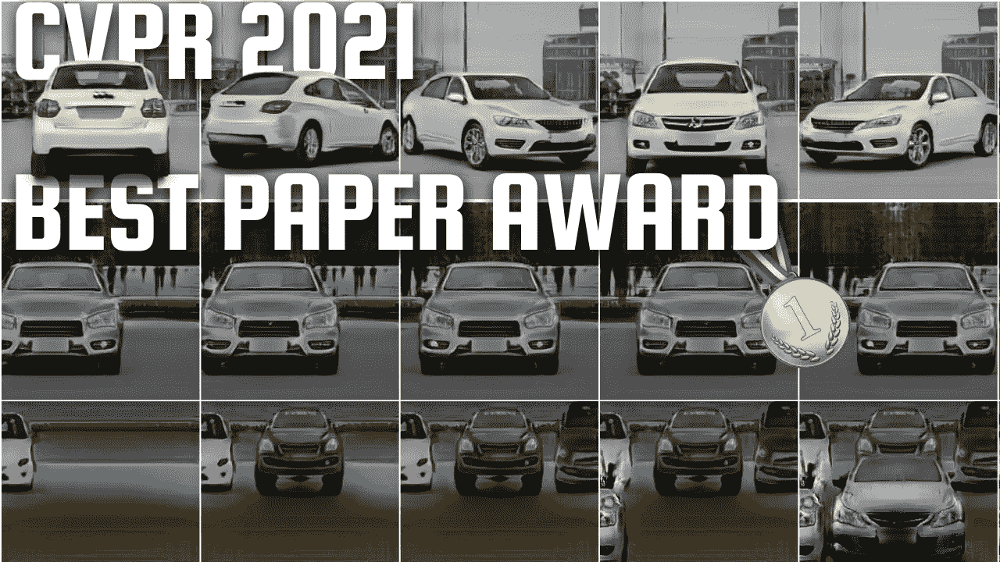
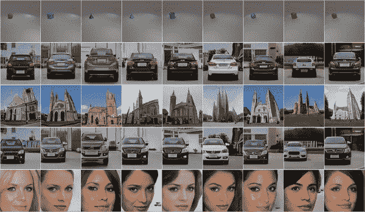
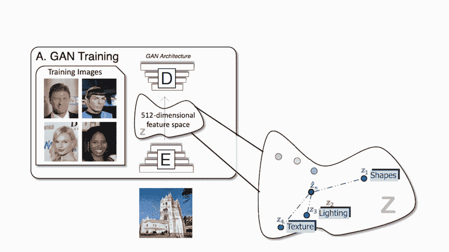
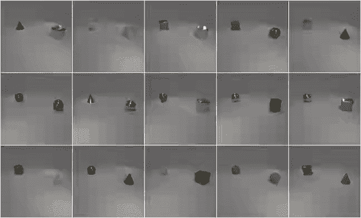
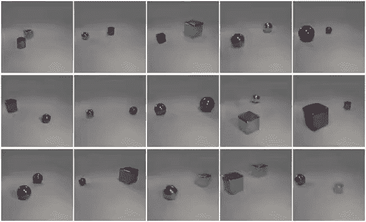
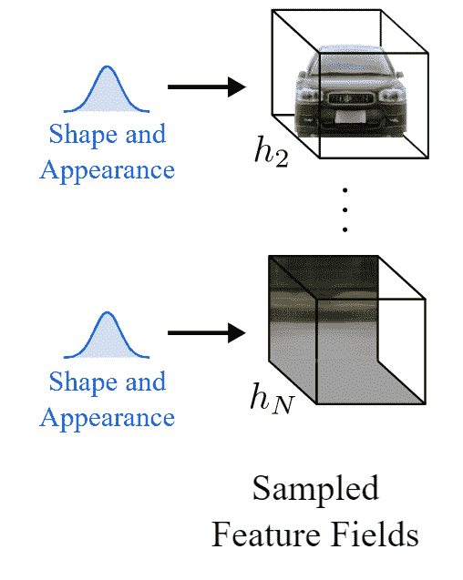
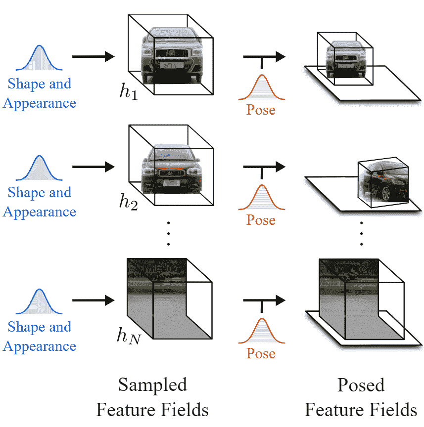
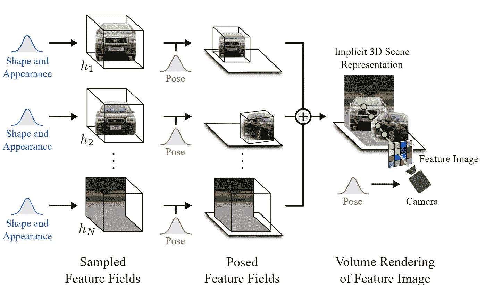
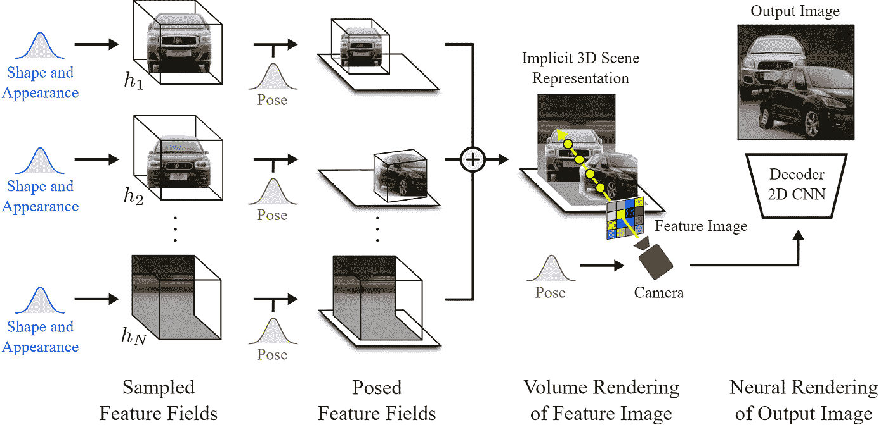
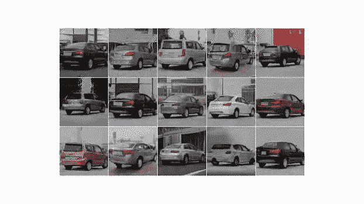

# CVPR 2021 年最佳论文奖:长颈鹿——可控图像生成

> 原文：<https://pub.towardsai.net/cvpr-2021-best-paper-award-giraffe-controllable-image-generation-24eac0001ca4?source=collection_archive---------0----------------------->

## [计算机视觉](https://towardsai.net/p/category/computer-vision)

## 使用改进的 GAN 架构，他们可以移动图像中的对象，而不会影响背景或其他对象！

> 原载于 [louisbouchard.ai](https://www.louisbouchard.ai/cvpr-2021-best-paper/) ，前两天在[我的博客上看到了！](https://www.louisbouchard.ai/cvpr-2021-best-paper/)

听听这个故事…

CVPR 2021 年最佳论文奖授予了来自马普智能系统研究所和图宾根大学的 Michael Niemeyer 和 Andreas Geiger，他们的论文名为 Giraffe，研究了可控图像合成的任务。换句话说，他们着眼于生成新的图像，并控制什么会出现，物体及其位置和方向，背景等。使用改进的 GAN 架构，他们甚至可以在不影响背景或其他对象的情况下移动图像中的对象！CVPR 是一个一年一度的会议，就在上周，大量计算机视觉领域的新研究论文专门为这次会议而发表。

作者制作的预告片示例。迈克尔·尼迈耶和安德烈亚斯·盖格(2021 年)

正如你已经知道的，如果你经常阅读我的文章，传统的 GAN 架构与编码器和解码器设置一起工作，就像这样。在训练期间，编码器接收图像，将其编码为压缩表示，解码器采用该表示来创建改变风格的新图像。对于我们在训练数据集中的所有图像，这被重复多次，以便编码器和解码器学习如何在训练期间最大化我们想要实现的任务的结果。一旦训练完成，你可以发送一个图像到编码器，它会做同样的过程，根据你的需要生成一个新的看不见的图像。无论任务是什么，它都将非常相似地工作，无论是将一张脸的图像转换成另一种风格，如卡通化器，还是从快速草稿中创建一个美丽的风景。仅使用解码器，我们也称之为生成器，因为它是负责创建新图像的模型，我们可以在这个编码信息空间中行走，并对我们发送给生成器的信息进行采样，以生成无限量的新图像。这个编码信息空间通常被称为潜在空间，我们用来生成新图像的信息是潜在代码。我们基本上在这个最佳空间内随机选择一些潜在的代码，它会根据我们想要完成的任务生成一个新的随机图像，当然是根据这个生成器的训练过程。这是难以置信的酷，但正如我刚才所说的，图像是完全随机的，我们没有或很少知道它会是什么样子，这对创作者来说已经没什么用了。

甘举例。迈克尔·尼迈耶和安德烈亚斯·盖格(2021 年)

这就是他们用这篇论文攻击的问题。事实上，通过获取物体形状和外观的潜在代码并将其发送到解码器或生成器，他们能够控制物体的姿势，这意味着他们可以四处移动它们，改变它们的外观，添加其他物体，改变背景，甚至改变相机的姿势。所有这些变换都可以在每个对象或背景上独立完成，而不会影响图像中的任何其他内容！

左边是长颈鹿，右边是普通的 2D 甘。[迈克尔·尼迈耶和安德里亚斯·盖格(2021)](https://m-niemeyer.github.io/project-pages/giraffe/index.html)

正如您所看到的，它比其他基于 GAN 的方法要好得多，其他基于 GAN 的方法通常无法将对象彼此分开，并且都受到特定对象修改的影响。

他们的方法与众不同之处在于，他们在三维场景表示中攻击这个问题，就像我们如何看待现实世界一样，而不是像其他 GANs 那样停留在二维图像世界中。但除此之外，这个过程非常相似。他们对信息进行编码，识别物体，在潜在空间内对其进行编辑，并对其进行解码以生成新的图像。在这里，在这个潜在的空间里还有一些步骤要做。我们可以将此视为经典 GAN 图像合成网络与神经渲染器的组合，神经渲染器用于从发送到网络的图像生成 3D 场景，正如我们将看到的那样。

生成对象的单个三维表示。迈克尔·尼迈耶和安德烈亚斯·盖格(2021 年)

实现这一目标有三个主要步骤。对输入图像进行编码后，意味着我们已经处于潜在空间中，第一步是将图像转换为 3D 场景。但不仅仅是简单的 3D 场景，而是由 3D 元素组成的 3D 场景，3D 元素是对象和背景。这种将图像视为由生成的体渲染组成的场景的方式允许他们在生成的图像中改变相机角度并独立控制对象。这是通过使用一个类似的模型来实现的，我之前报道的论文中的[叫做 NERV](https://youtu.be/ZkaTyBvS2w4) ，但是他们不是使用一个单一的模型来从输入图像中生成整个锁定的场景，而是使用两个独立的模型来独立生成对象和背景。这里称为采样特征字段。这个网络的参数也是在训练期间学习的。我不会进入细节，但它非常类似于我在另一篇文章中提到的 NERF。如果你想了解更多关于这类网络的细节，你可以观看[这个关于 NERV 的视频](https://youtu.be/ZkaTyBvS2w4)，它也链接在下面的参考文献中。

3D 表示中的姿态转换。迈克尔·尼迈耶和安德烈亚斯·盖格(2021 年)

这个场景中的元素没有纠缠在一起，我们可以单独编辑它们，而不会影响图像的其他部分。这是第二步。他们可以对对象做任何他们想做的事情，比如改变它的位置和方向。
换句话说，它们改变物体或背景的姿势。在这一点上，他们甚至可以添加新的对象放在他们想要的任何地方。然后，他们通过将所有的特征字段加在一起，简单地将它们组合成包含所有对象和背景的最终 3D 场景。

完整的潜在空间计算。迈克尔·尼迈耶和安德烈亚斯·盖格(2021 年)

最后，我们必须回到自然图像的 2D 世界。所以最后一步是把这个 3D 场景渲染成一个普通的图像。因为我们仍然在 3D 世界中，我们可以改变相机的视点来决定我们将如何看待这个场景。然后，我们根据相机光线和其他参数(如 alpha 值和透射率)来评估每个像素。这给了我们他们所谓的特征图像，但这个特征图像是由每个像素的特征向量组成的图像。由于我们仍然处于潜在空间，这些特征需要被转换成 RGB 颜色和高分辨率图像。这是通过使用典型的解码器来实现的，就像其他 GAN 架构一样，将其放大到原始尺寸，同时学习 RGB 通道转换功能。瞧，您的新图像对生成的内容有了更多的控制！

编码器编码后的完整网络。[迈克尔·尼迈耶和安德里亚斯·盖格(2021)](https://m-niemeyer.github.io/project-pages/giraffe/index.html)

当然，正如您所看到的，当用于真实世界的数据时，它仍然不是完美的。尽管如此，它仍然令人印象深刻，是朝着正确方向迈出的重要一步，特别是考虑到这些是完全由 GANs 生成的合成图像，并且它是第一篇能够以这种精度控制生成图像的论文。

瑕疵示例。[迈克尔·尼迈耶和安德里亚斯·盖格(2021)](https://m-niemeyer.github.io/project-pages/giraffe/index.html)

这篇论文真的很有趣，我推荐阅读它，以了解他们的模型是如何工作的。祝贺 Michael Niemeyer 和 Andreas Geiger 获得他们当之无愧的最佳论文奖。他们还在 GitHub 上发布了代码，如果你想玩的话。链接在下面的参考资料中

感谢您的阅读！

## 观看视频

来我们的 [**Discord 社区和我们聊天:** **一起学习 AI**](https://discord.gg/learnaitogether)和*分享你的项目、论文、最佳课程、寻找 Kaggle 队友等等！*

如果你喜欢我的工作，并想与人工智能保持同步，你绝对应该关注我的其他社交媒体账户( [LinkedIn](https://www.linkedin.com/in/whats-ai/) 、 [Twitter](https://twitter.com/Whats_AI) )并订阅我的每周人工智能[简讯](http://eepurl.com/huGLT5) ！

# 支持我:

*   支持我的最好方式是成为这个网站的成员，或者如果你喜欢视频格式，在[**YouTube**](https://www.youtube.com/channel/UCUzGQrN-lyyc0BWTYoJM_Sg)**上订阅我的频道。**
*   **在经济上支持我在 T21 的工作**
*   **跟我来这里上 [**中**](https://whats-ai.medium.com/)**

# **参考**

*   **Michael Niemeyer 和 Andreas Geiger(2021)，“长颈鹿:将场景表示为合成生成神经特征场”，发表于 CVPR 2021 年。**
*   **论文等项目链接:[https://m-nie Meyer . github . io/project-pages/长颈鹿/index.html](https://m-niemeyer.github.io/project-pages/giraffe/index.html)**
*   **代号:[https://github.com/autonomousvision/giraffe](https://github.com/autonomousvision/giraffe)**
*   **NERF 视频:[https://youtu.be/ZkaTyBvS2w4](https://youtu.be/ZkaTyBvS2w4)**