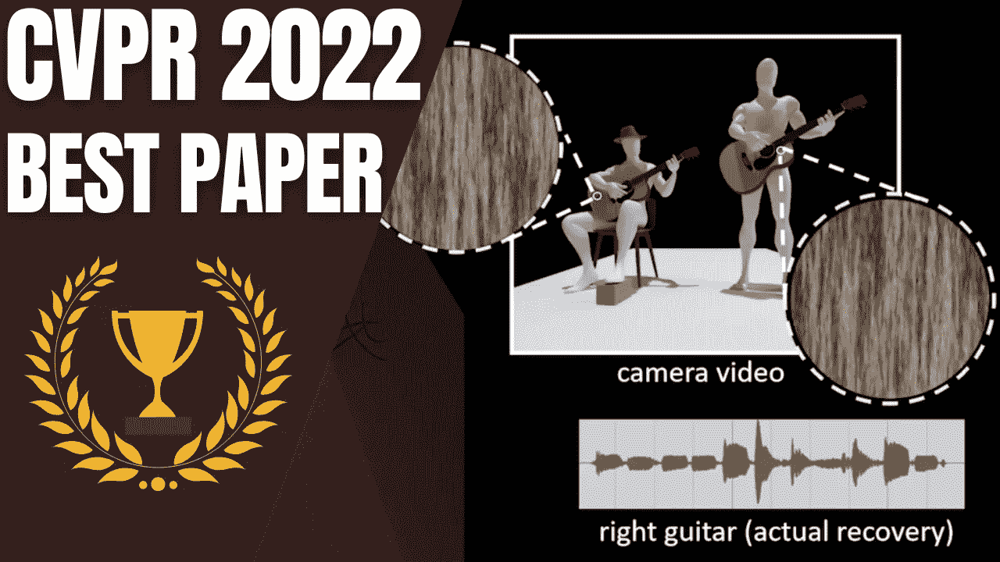
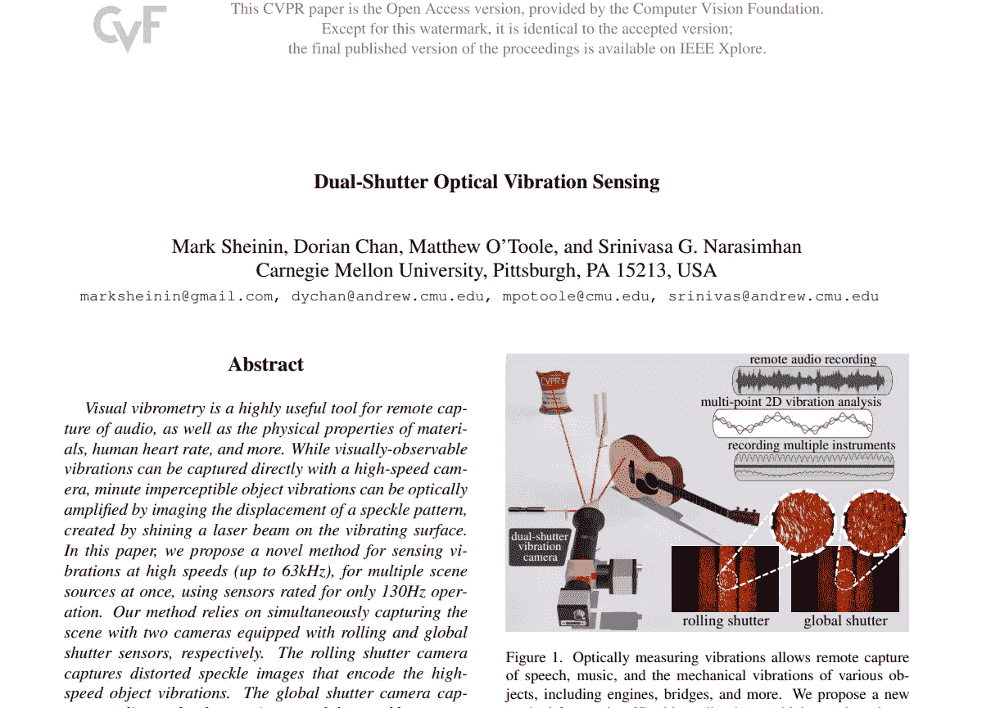
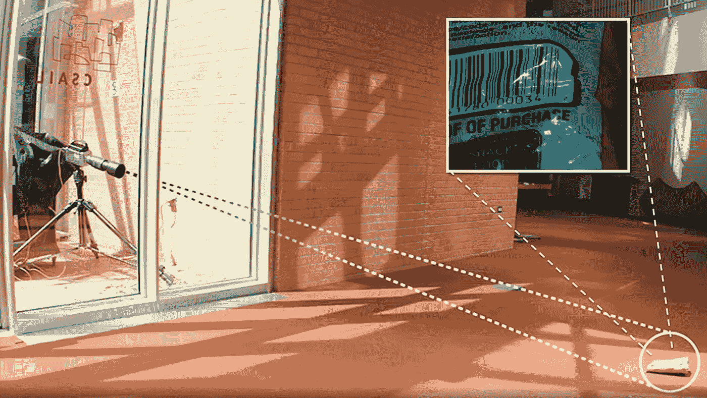
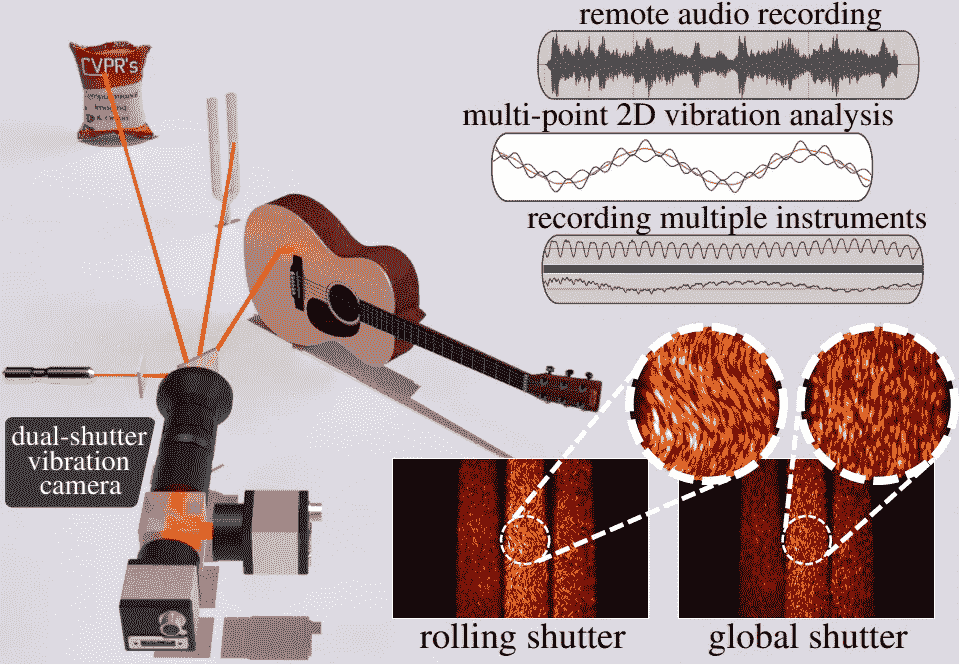
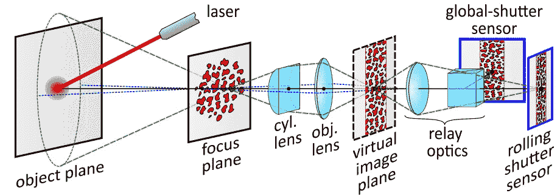
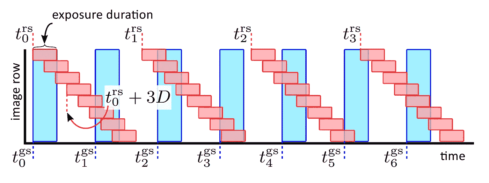

# CVPR 2022 最佳论文荣誉奖:双快门光学振动传感

> 原文：<https://pub.towardsai.net/cvpr-2022-best-paper-honorable-mention-dual-shutter-optical-vibration-sensing-1947834ba012?source=collection_archive---------3----------------------->

## 他们使用相机和激光束在任何振动表面上重建声音，使他们能够隔离乐器，专注于特定的扬声器，消除环境噪音，以及许多令人惊叹的应用。

> 最初发表于 [louisbouchard.ai](https://www.louisbouchard.ai/cvpr-2022-best-paper/) ，前两天在[我的博客上读到的！](https://www.louisbouchard.ai/cvpr-2022-best-paper/)

今年，我有机会亲自来到 CVPR，参加了令人惊叹的最佳论文奖颁奖典礼，我不得不在名为“双快门光学振动检测”的频道上报道这篇精彩的论文，作者是 Mark Sheinin、Dorian Chan、Matthew O'Toole、Srinivasa Narasimhan。

一句话:他们使用相机和激光束在任何振动表面上重建声音，使他们能够隔离乐器，专注于特定的扬声器，消除环境噪音，以及许多令人惊叹的应用。

让我们深入了解他们是如何实现的，并听到一些疯狂的结果。

你应该看视频听结果，或者去他们的网站听例子…

在视频中显示的第一个例子中，您可以清楚地听到每个音轨上的两把吉他。

这不是使用录制的声音，而是使用激光和两个分别装有滚动和全局快门传感器的相机。似乎通过视觉处理这项任务比录制后试图分割音轨要容易得多。更多——这也意味着我们可以通过眼镜和任何振动的物体记录任何东西。在这里，他们在扬声器上使用他们的方法来隔离左右扬声器——而麦克风会自动记录两者并混合音轨。

通常，这种称为视觉振动测量的间谍技术需要完美的照明条件和高速摄像机，这些摄像机看起来像伪装的狙击手，可以捕捉高达 63kHz 的高速振动。在这里，他们用仅为 60 和 130 Hz 构建的传感器获得了类似的结果！更好的是:它们可以同时处理多个对象！

然而，这是一项非常具有挑战性的任务，需要大量的工程和伟大的想法来实现它。他们不只是录制乐器，然后将视频发送到一个自动创建和分离音频的模型。他们首先需要了解他们收到的激光，并正确处理它。

他们将激光对准表面进行监听。然后，激光从表面反射到聚焦平面。这个焦点平面是我们获取信息的地方，而不是仪器或物体本身。因此，我们将只通过激光响应来分析目标物体的微小振动，创建如下图示:

“我们的双快门系统示意图。我们添加了一个柱面透镜，将散斑扩展到图像平面列中，然后传递到两个具有滚动和全局快门的相机上。”图片来自[论文](https://openaccess.thecvf.com/content/CVPR2022/papers/Sheinin_Dual-Shutter_Optical_Vibration_Sensing_CVPR_2022_paper.pdf)。

我们的相机捕捉到的二维激光响应模式称为散斑，然后使用我们的两台相机对其进行全局和局部处理。我们的本地相机，或滚动快门相机，只能以 60 fps 的速度捕捉帧，所以拍摄多张照片，并在 y 轴上滚动它们，以获得真正嘈杂和不准确的 63khz 图像。

红色表示滚动快门相机信号，蓝色表示全局快门参考帧。图片来自[报](https://openaccess.thecvf.com/content/CVPR2022/papers/Sheinin_Dual-Shutter_Optical_Vibration_Sensing_CVPR_2022_paper.pdf)。

这就是全局快门相机是必要的地方，因为物体表面和运动的粗糙度导致散斑成像的随机性。它将基本上拍摄我们第一台相机使用的同一张散斑图像的全局截图，并使用这张新图像作为参考框架，仅从滚动快门捕捉中分离出相关的振动。滚动快门相机将以高频率逐行对场景进行采样，而全局快门相机将一次性对整个场景进行采样，以作为参考帧，我们对整个视频重复这一过程。

瞧！

这就是他们如何能够从录音中分离声音，只提取一种乐器，消除环境噪音，甚至从一袋芯片的振动中重建语音。

当然，这只是这篇伟大论文的一个简单概述，我强烈邀请您阅读它以获得更多信息，链接如下。恭喜作者获得荣誉奖。我很高兴参加这次活动，并看到现场演示。看到这篇论文将激励的未来出版物，我非常兴奋。

我也请你仔细检查你可能放在窗户附近的所有薯条袋；不然你说的话可能会有人听！

谢谢你看完整篇文章。让我知道你将如何应用这项技术，如果你看到任何潜在的风险或令人兴奋的用例。我很想和你讨论这个。

特别感谢 CVPR 邀请我参加这个活动。和所有的研究人员和公司一起呆在新奥尔良真的很酷。

下周我会带着另一篇精彩的论文来看你！

## 参考

阅读全文:[https://www.louisbouchard.ai/cvpr-2022-best-paper/](https://www.louisbouchard.ai/cvpr-2022-best-paper/)
谢宁、马克和陈、多里安和奥图尔、马修和纳拉辛汉、斯里尼瓦萨 g .，2022，双快门光学振动传感，Proc。IEEE CVPR。
项目页面:【https://imaging.cs.cmu.edu/vibration/】T4我的时事通讯(一个新的人工智能应用每周向你的邮件解释！):[https://www.louisbouchard.ai/newsletter/](https://www.louisbouchard.ai/newsletter/)