# 不确定性建模在人脸识别中的应用

> 原文：<https://pub.towardsai.net/cvpr2020-paper-summary-data-uncertainty-in-face-recognition-1f17547473a2?source=collection_archive---------4----------------------->

## [计算机视觉](https://towardsai.net/p/category/computer-vision)

[IEEE CVPR 会议](http://cvpr2020.thecvf.com/)

在这个故事中，介绍了旷视科技公司和中国科学技术大学在人脸识别中的数据不确定性学习。这是作为 CVPR 2020 年技术报告发表的。你可能已经知道，[旷视科技公司](https://en.megvii.com/)以面部识别而闻名。本文在人脸识别中很少探索数据不确定性学习在人脸识别中的应用。

他们甚至在 Github[上向所有人公开了代码！让我们看看他们是如何做到的。](https://github.com/Ontheway361/dul-pytorch)

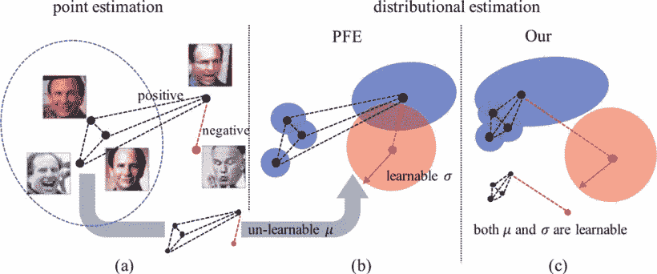

(A)确定性模型在不考虑数据不确定性的情况下给出点嵌入；(b)概率模型给出用估计平均值和估计方差参数化的分布估计。 [PFE](https://openaccess.thecvf.com/content_ICCV_2019/papers/Shi_Probabilistic_Face_Embeddings_ICCV_2019_paper.pdf) 利用预先训练的点嵌入作为均值，只学习每个样本的不确定性σ；(c)作者的方法同时学习σ以及，导致在潜在空间中更好的类内紧密性和类间可分性。不同的类别被标记为蓝色或红色。最好是彩色的。

不确定性建模很重要，但在人脸识别中很少考虑。先前的研究(PFE [1])通过将人脸图像中的特征建模为高斯分布来考虑不确定性。然而，在这种情况下，尚不清楚数据不确定性如何影响特征学习。

本文提出了数据不确定性学习(DUL)算法，通过同时学习特征空间的均值和方差，将数据不确定性估计理论应用于人脸识别领域。

DUL 算法有两种训练模式(DUL_cls 和 DUL_rgs)，DUL_cls 和 DUL_rgs 都学习不确定性表示 *σ* 以及恒等式表示 *μ* ，因此预测 *μ* 可以直接用常用的匹配度量来评估。因此，DUL 算法对训练集中的噪声数据具有鲁棒性，并能有效降低脏样本对模型训练的负面影响。

# 概述

1.  **深度学习中的不确定性**
2.  **人脸识别中的数据不确定性学习**
3.  **基于分类的人脸识别 DUL (DUL_cls)**
4.  **基于回归的面部识别 DUL (DUL_rgs)**
5.  **实验结果**

# **1。深度学习的不确定性**

近年来，不确定性在深度学习中受到了很多关注。已经提出了几种方法来研究不确定性在深度神经网络中的具体表现[2，3，4，5]。数据的不确定性源于数据中的“噪音”。具体来说，在深度不确定性学习中，不确定性可以分为模型不确定性和数据不确定性，模型不确定性捕获深度神经网络中的参数噪声，数据不确定性测量给定训练数据中固有的噪声。在诸如人脸识别的计算机视觉应用中，这种不确定性建模是基本的，因为噪声在图像中广泛存在。

# 2.人脸识别中的数据不确定性学习

对于由连续映射空间 *X → Y* 组成的人脸数据集，假设含噪图像集( *y_i ∈ Y* )被噪声 *n(x_i)* 退化，则无噪图像集 *(x_i ∈ X)* 退化。所以这个映射空间本身就承载了数据的不确定性。这意味着每个被观察对象可以表示为 *y_i = f(x_i) + ϵ σ(x_i)，*其中σ ~ N *(0，I)，*其中 *f( )* 是感兴趣数据的嵌入函数。

传统的回归模型仅被训练成在给定 *f(x_i)的情况下逼近输入 *x_i* 。*然而，使用数据不确定性学习的回归模型也估计 *σ(x_i)* ，它代表预测的不确定性 *f(x_i)* (见(a))。

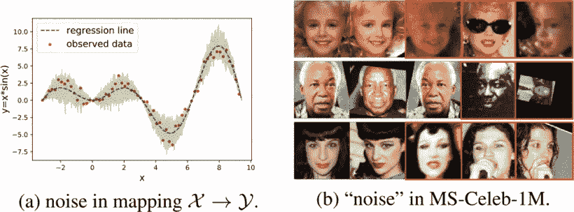

(a):观测数据对(红点)中的目标 y 被 x 相关噪声破坏。数据不确定性回归将给出超出特定预测值(绿线)的“噪声水平”(绿色阴影)；(b):标记有相同 ID 的样品出现在每一行中。与其他类内样本相比，带有红框的样本被视为噪声数据。

# **3。基于分类的面部识别 DUL (** DUL_cls **)**

引入基于分类的数据不确定性学习(DUL)DUL cls 来训练人脸分类模型中的数据不确定性。DUL_cls 在目标函数上类似于变分信息瓶颈(VIB) [6]，其中 VIB 是输入数据 *X* 到潜在表示 *Z* 的概率。VIB 根据信息瓶颈推导出这个目标函数。相比之下，DUL_cls 从数据不确定性的角度推导出它，该数据不确定性与具有足够能力预测标签 *Y* 同时保持 *Z* 尽可能简洁的基本权衡有关。

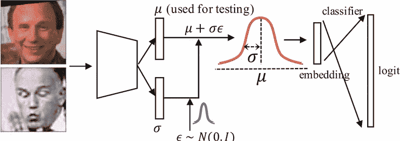

提议的 DUL cls FR 模型概述

DUL_cls 的总代价函数可以表示为: *L* _KL 在算法中起平衡器的作用， *L* _softmax 最小化 softmax 损失用于图像分类。

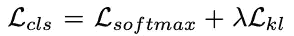

**DUL_cls 损失函数**

## 3.1 分配代表性

将样本 *x* 在潜在空间 *z* 中的表示定义为高斯分布。高斯分布的两个参数(均值和方差)取决于输入，由不同的 CNN 预测，其中 *μ* 可视为人脸的判别特征， *σ* 指预测的 *μ* 的不确定性。

每个样本的表示 *p(z_i|x_i)* 不是确定性的点嵌入，是从潜在空间采样的随机嵌入。

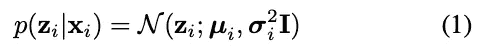

表示概率

等式 1 中的采样操作是不可微的，因此在模型训练期间不能控制梯度流。在方程 2 中，使用变分贝叶斯[7]的自动编码来确保模型照常渐变。具体来说，首先，从独立于模型参数的正态分布中对随机噪声 *ϵ* 进行采样，并生成 *s* 作为等效采样表示。这获得了等同于采样操作的随机嵌入属性。

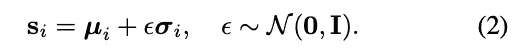

取样操作

## 3.2 分类损失

因为采样表示 s 是样本(图像数据) *x* 的最终表示，所以最小化用于图像分类的采样表示 s 的 softmax 损失。 *L_* softmax 也有 softmax 的不同变种，如 AMSoftMax、ArcFace 和 L2SoftMax。

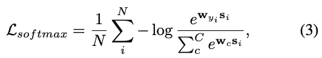

分类损失函数

## 3.3 KL-散度正则化

*L* _kl 用方程 3 充当了一个很好的平衡器，受变分信息瓶颈的启发，本文在优化过程中引入了一个归一化项。它利用约束模型将分布 *N (μ，σ)* 逼近为正态分布 *N (0，1)* 。在这一章中，使用库尔贝克-莱布勒散度(KLD)，将测量两个分布之间的“距离”。

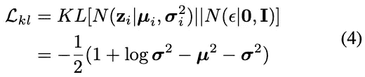

KL-散度正则化损失

# **4。基于回归的面部识别 DUL (DUL_rgs)**

这里，提出了数据的数据不确定性回归(DUL_rgs)，它使用数据不确定性学习(DUL)来改进现有的人脸识别模型，DUL_rgs 的模型被训练来衰减由于低质量样本导致的模糊 *μ* 的影响。DUL rgs 将传统的最小二乘回归技术解释为具有数据不确定性回归模型的最大似然估计。

DUL_rgs 基于连续映射空间 *X→Y* 中数据不确定性回归的思想。一个困难但重要的挑战是，离散目标空间 *Y* 由离散变量组成，在人脸识别任务中不能近似为连续目标向量。

本文针对这一问题，构造了一个新的连续映射空间 *(X→W)* 来进行预测。这个空间大致相当于原来的离散目标空间 *Y* 。具体地，使用预训练的人脸识别模型提取的分类层(DUL_cls)的权重矩阵 *W* 是新的连续映射空间 *(X→W)* 。

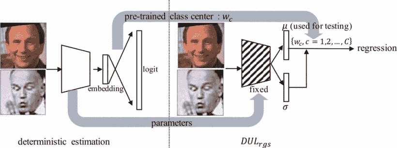

卷积层中的所有参数由确定性面部识别模型预先训练，并且在 DUL_rgs 的训练期间是固定的。

## 4.1 分配代表性

对于连续的目标空间 *W* ，空间 *X* 使等式 5 的概率最大化

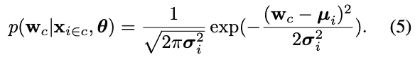

等式 5 的概率

等式 5 的对数似然性由等式 6 表示。该等式是不确定性得分，其中学习的方差 *σ_i* 是学习的身份嵌入信息 *μ_i* 属于第 c 类的置信度的度量。

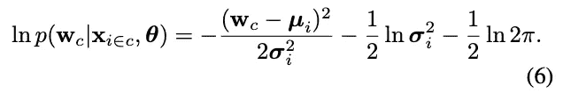

等式 5 的对数似然

训练神经网络预测对数方差以稳定随机优化过程中的数字。通过最大化可能性来最小化成本函数。

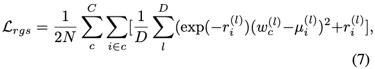

最小化成本函数

# 5.实验结果

提供定性和定量分析，以调查获取的数据中不确定性的重要性，以及数据不确定性的学习如何影响人脸模型的学习。在噪声数据集上的实验表明，该方法更加可靠。

结果显示了 DUL 与 LFW，YTF，MegaFace (MF)和 CFP-FP 数据集的当前最佳实践的比较。

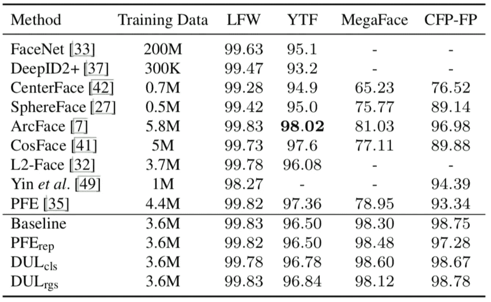

结果与 LFW、YTF、MegaFace (MF)和 CFP-FP 数据集的当前最佳实践进行了比较。

高斯模糊以各种比率应用于 MS-Celeb-1M 面部训练集样本以创建降级样本。实验结果表明，DUL 方法和 PFE 都取得了比基线模型更稳健的结果。

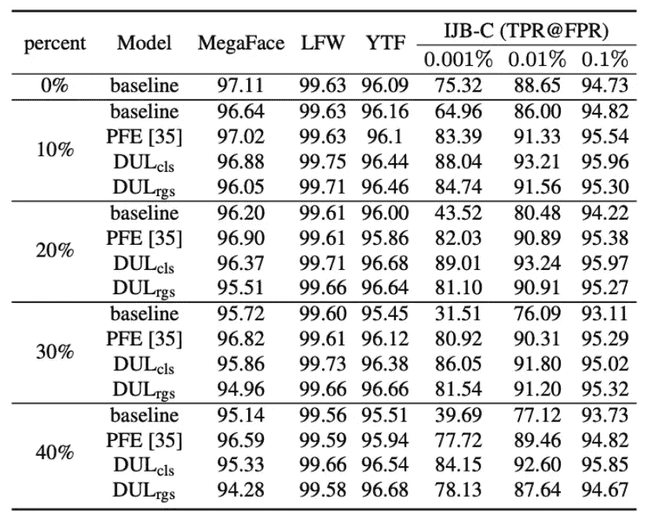

结果对比目前最好的方法 IJB-C 数据集，主干:ResNet64。

与基线模型相比，DUL cls 在简单和半硬样本中显示出相对较少的失败案例。已经表明，与 DUL cls 相比，基线模型在具有极端噪声的硬样本中具有较少的坏情况。这表明，具有数据不确定性学习的网络专注于训练应该正确分类的样本，同时“放弃”有害样本，而不是过度拟合它们。

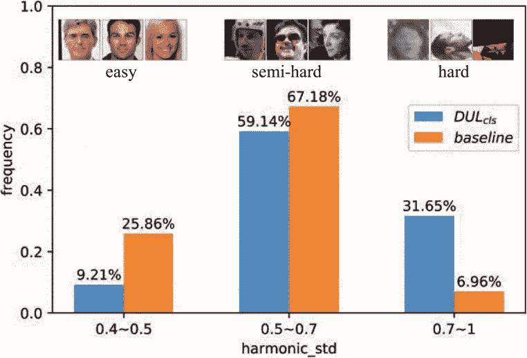

基线模型和 DUL cls 之间的不良案例分析。

# 参考

[1]史宜春、阿尼尔·K·贾恩和内森·D·卡尔卡。“概率人脸嵌入”，2019 年 IEEE 计算机视觉国际会议论文集。

[2]查尔斯·布伦德尔、朱利安·科尔内比塞、科雷·卡武克库奥卢和金奎大·威斯特拉。“神经网络中的权重不确定性”，arXiv 预印本 arXiv:1505.05424，2015 年。

[3]亚林·加尔。《深度学习中的不确定性》，博士论文，剑桥大学，2016 年。

[4]亚林·加尔和邹斌·格拉马尼。“作为贝叶斯近似的辍学:表示深度学习中的模型不确定性”，国际机器学习会议，第 1050-1059 页，2016 年。

[5]亚历克斯·肯德尔和亚林·加尔。“在用于计算机视觉的贝叶斯深度学习中，我们需要哪些不确定性？“神经信息处理系统进展，第 5574–5584 页，2017 年”。

[6]亚历山大·阿莱米、伊恩·费希尔、约书亚·V·狄龙和凯文·墨菲。“深度变化的信息瓶颈”，载于 2017 年国际学习表征会议论文集。

[7]迪德里克·P·金马和马克斯·韦林。“自动编码变分贝叶斯”，ICLR，2014 年。

# 过去论文摘要列表

## 数据不确定性学习

2020 年: [ [DUL](https://mako95.medium.com/cvpr2020-paper-summary-data-uncertainty-in-face-recognition-1f17547473a2)

## 一级分类

**2019:** [ [DOC](https://medium.com/swlh/paper-summary-deep-one-class-classification-doc-adc4368af75c) ]

**2020:** [ [DROC](https://medium.com/the-shadow/exploring-important-feature-repressions-in-deep-one-class-classification-droc-d04a59558f9e) ]

## 生物医学图像分割

**2018:**[【UOLO】](https://medium.com/swlh/paper-summary-biomedical-image-segmentation-and-object-detection-uolo-c1175ba5c8c4)

## 图像聚类

**2020:**[【DTC】](https://medium.com/swlh/paper-deep-transfer-clustering-dtc-learning-to-discover-novel-visual-categories-ec5a26aea075)