# 基于物联网的智慧城市网络流量中的网络攻击检测

> 原文：<https://pub.towardsai.net/cyberattacks-detection-in-iot-based-smart-city-network-traffic-c874588c5f6c?source=collection_archive---------0----------------------->

## [机器学习](https://towardsai.net/p/category/machine-learning)

## 在本文中，不同的机器学习和深度学习模型被用于网络攻击的分类，如 DoS、蠕虫、后门以及来自正常网络流量和网络入侵检测的更多攻击。 **UNSW-NB15 数据集**已经用于训练 ML 和 DL 模型。[你可以在我的 GitHub 账户上找到完整的代码、训练过的模型、图、数据集、预处理文件。](https://github.com/abhinav-bhardwaj/IoT-Network-Intrusion-Detection-System-UNSW-NB15)

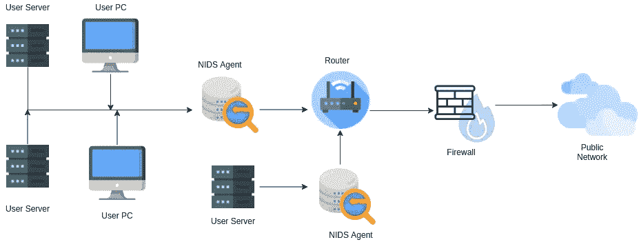

使用 Draw.io 制作

物联网的整体理念是将互联网的功能从电脑和智能手机扩展到电子、机械设备、传感器等。随着物联网设备使用案例的增多，**安全漏洞**也急剧增加。

今天，物联网设备被用于**消防系统**、**无人机**、**智能家居**、**医疗保健**等等。你可以想象如果有不怀好意的人进入这些系统，那将是一场灾难。这就是安装**网络入侵检测系统(NIDS)** 的原因，该系统分析所有流量并检测恶意流量，帮助组织监控其云、内部或混合基础架构。

# 资料组

Pcap 文件(原始网络数据包)是在澳大利亚网络安全中心(ACCS)的网络范围实验室使用 IXIA PerfectStorm 工具创建的。

该数据集可在新南威尔士大学网站[https://research.unsw.edu.au/projects/unsw-nb15-dataset](https://research.unsw.edu.au/projects/unsw-nb15-dataset)上获得

*   **UNSW_NB15.csv** —原始数据集
*   **UNSW _ NB15 _ features . CSV**—49 个带有类别标签的特征。这些功能在 UNSW-NB15_freatures.csv 文件中有描述。
*   **bin_data.csv** —用于二进制分类的已处理 csv 数据集文件
*   **multi_data.csv** —用于多类分类的已处理 csv 数据集文件

# **使用的机器学习模型**

*   决策树分类器
*   k 最近邻分类器
*   线性回归模型
*   线性支持向量机
*   逻辑回归模型
*   多层感知器分类器
*   随机森林分类器

# 数据预处理

*   数据集有 **45 个属性**和 **175341 行**。
*   删除**空值**后，数据集有 **45 个属性**和 **81173 行**。
*   属性的数据类型使用要素数据集中提供的数据类型信息进行转换。

## 一键编码

*   使用
    **pd.get_dummies()** 对分类列***【proto】****【服务】****【状态】*** 进行 one-hot 编码，之后删除这 3 个属性。
*   ***data _ cat***data frame 在 **one-hot-encoding** 后有 **19 个属性**。
*   ***data_cat*** 与主***data***data frame 串接。
*   ***数据*** 数据帧的总属性— **61**

## 数据标准化

*   **使用**最小最大缩放器**在**范围 0 到 1** 内缩放数据帧的 58 个数字列**。

## 准备二元分类

*   为**二进制分类**创建数据帧的**副本。**
*   ***【标签】*** 属性分为两类 ***【正常】*** 和 ***【异常】*** 。
*   ***【标签】*** 使用 **LabelEncoder()** 编码，对应的编码标签(0，1)保存在 ***【标签】*** 列本身。
*   **二进制数据集** — **81173 行**， **61 列**

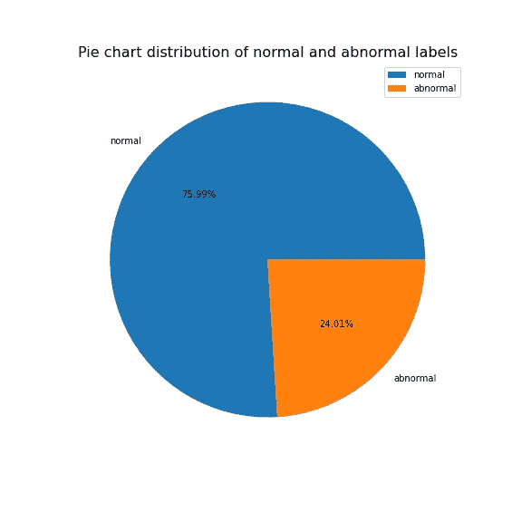

## 准备多类分类

*   为**多级分类**创建数据帧的**副本。**
*   ***【attack _ cat】***属性分为**9***【分析】******【后门】******【DoS】******【漏洞利用】******【Fuzzers】*****
*   ***attack_cat*** 使用 **LabelEncoder()** 编码，对应的编码标签(0，1，2，3，4，5，6，7，8)保存在 ***标签*** 属性中。
*   ***attack_cat*** 为一键编码。
*   **多类数据集** — **81173 行**， **69 列**

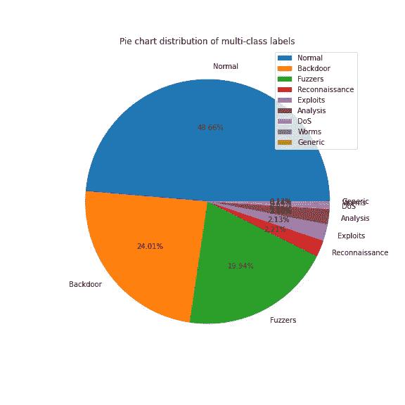

## 特征选择

*   ***【bin _ data】***—**61**的属性号
*   ***【多数据】*** — **69** 的属性号
*   使用**皮尔逊相关系数**方法进行特征提取。
*   选择与目标属性 ***标签*** 相关系数**大于 0.3 的属性。**

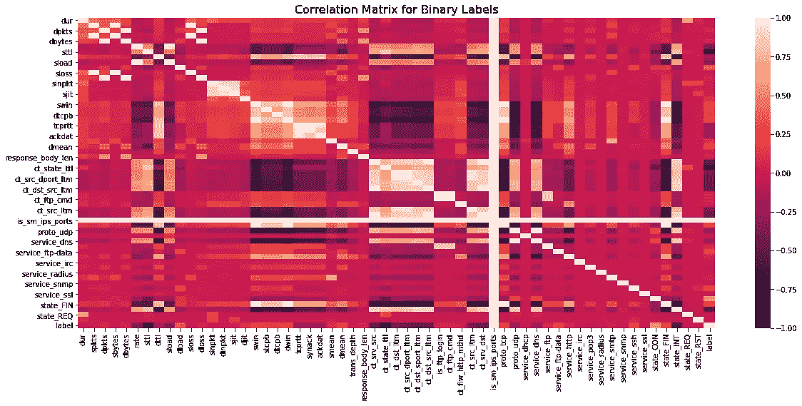

*   特征选择后**【bin _ data】**的属性个数— **15**
*   ***速率*** '， ***sttl*** '， ***sload*** '， ***dload*** '， ***ct_srv_src*** '， ***ct_state_ttl*** ***ct_srv_dst*** '， ***state_CON*** '， ***state_INT*** '， ***label*** '。

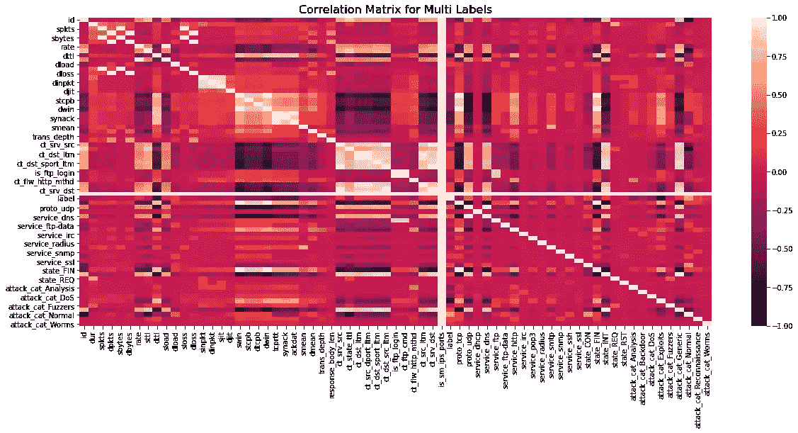

*   特征选择后**【多数据】**的属性数— **16**
*   ***dttl*** '， ***swin*** '， ***dwin*** '， ***tcprtt*** '， ***synack*** '， ***ackdat*** '， ***label*** '， ***state_FIN*** '，***attack _ cat _ Analysis***'，***attack _ cat _ DoS***'，***attack _ cat _ Exploits***'，***attack _ cat _ Normal***'。

# 将数据集分为训练集和测试集

*   将**中的 **bin_data** 随机分成 80%用于训练**和 20%用于测试。
*   将**中的 **multi_data** 随机分成 70%用于训练**，30%用于测试。
*   目标特征— ***标签***

# 决策树分类器

## 二元分类

*   精确度—**98.00009857099**
*   平均绝对误差—**0.0148814290114**
*   均方误差—**0.0148814290114**
*   均方根误差—**0.132650575473**
*   R2 得分—**89 . 3838098**

```
DecisionTreeClassifier(ccp_alpha=0.0, class_weight=None, criterion=’gini’, max_depth=None, max_features=None, max_leaf_nodes=None, min_impurity_decrease=0.0, min_impurity_split=None, min_samples_leaf=1, min_samples_split=2, min_weight_fraction_leaf=0.0, presort=’deprecated’, random_state=123, splitter=’best’)
```

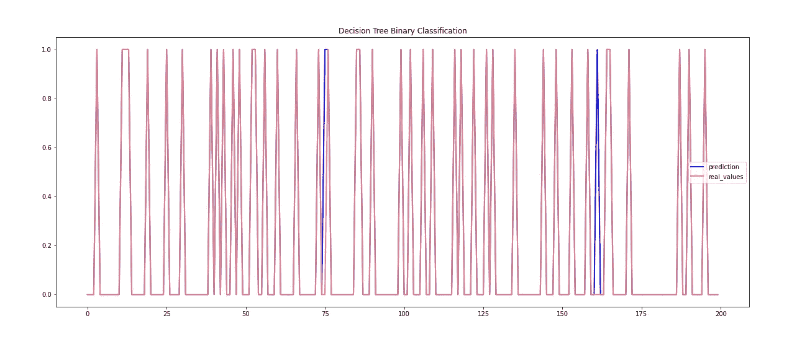

**用决策树分类器进行二元分类**

## 多类分类

*   准确度—**97 . 279895**
*   平均绝对误差— **0.06800262812089355**
*   均方差—**0.204480946123**
*   均方根误差—**0.45246459965086**
*   R2 得分—**86.1336013**

```
DecisionTreeClassifier(ccp_alpha=0.0, class_weight=None, criterion=’gini’, max_depth=None, max_features=None, max_leaf_nodes=None, min_impurity_decrease=0.0, min_impurity_split=None, min_samples_leaf=1, min_samples_split=2, min_weight_fraction_leaf=0.0, presort=’deprecated’, random_state=123, splitter=’best’)
```

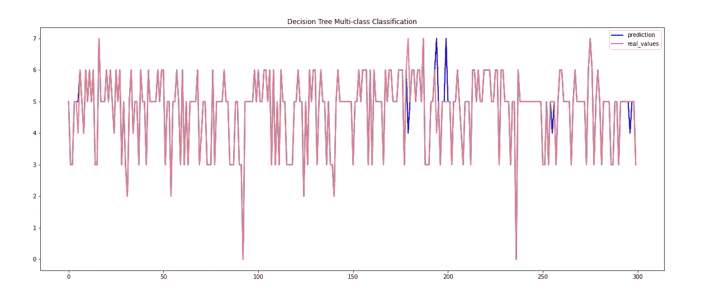

**用决策树分类器进行多类分类**

# k 近邻分类器

## 二元分类

*   准确度—**98.3442162**
*   平均绝对误差—**0.012657838004**
*   均方误差—**0.012657838004**
*   均方根误差—**0.134880966738807**
*   R2 得分— **90 分**

```
KNeighborsClassifier(algorithm=’auto’, leaf_size=30, metric=’minkowski’, metric_params=None, n_jobs=None, n_neighbors=5, p=2, weights=’uniform’)
```

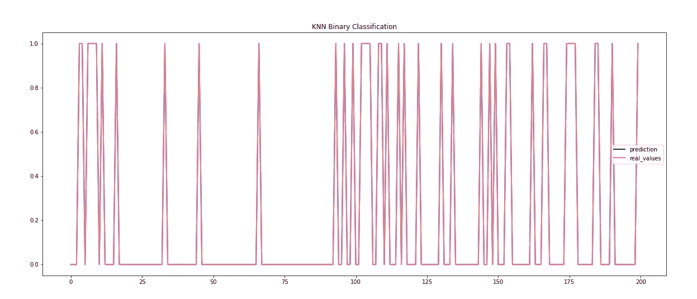

**用 KNN 分类器进行二元分类**

## 多类分类

*   准确度—**97.66754271**
*   平均绝对误差—**0.0658705650459921**
*   均方差—**0.19436662286466**
*   均方根误差—**0.421897624**
*   R2 分数—**86.90772136**

```
KNeighborsClassifier(algorithm=’auto’, leaf_size=30, metric=’minkowski’, metric_params=None, n_jobs=None, n_neighbors=5, p=2, weights=’uniform’)
```

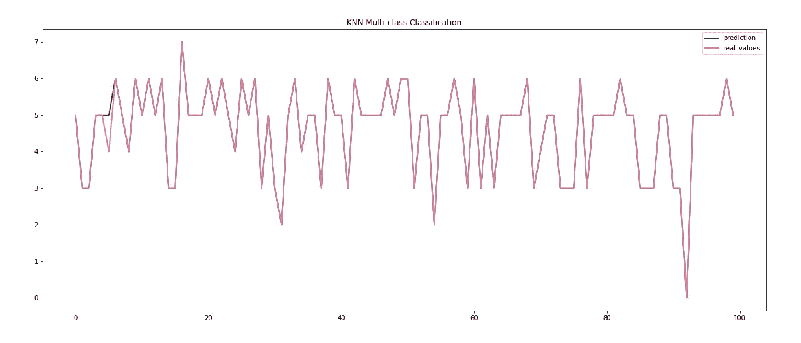

**用 KNN 分类器进行多类分类**

# 线性回归模型

## 二元分类

*   准确度—**97.2222944363641**
*   平均绝对误差—**0.0233477055742**
*   均方误差—**0.0233477055742**
*   均方根误差—**0.14342664767**
*   R2 得分—**88 . 486816471647**

```
LinearRegression(copy_X=True, fit_intercept=True, n_jobs=None, normalize=False)
```

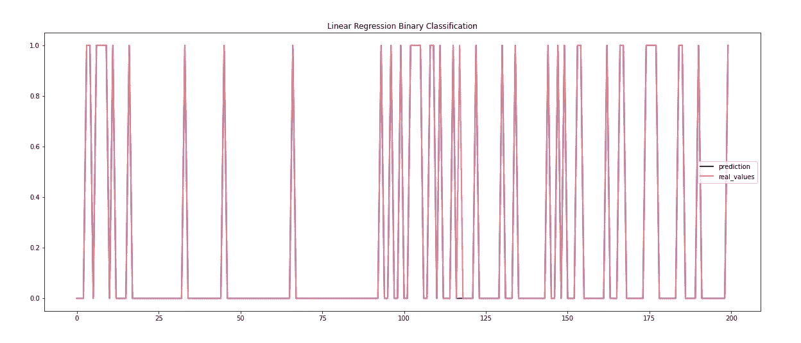

**用线性回归模型进行二元分类**

## 多类分类

*   准确度—**95.111958**
*   平均绝对误差—**0.0645466491**
*   均方误差—**0.1254927726**
*   均方根误差—**0.342596962178**
*   R2 得分—**91.868180129**

```
LinearRegression(copy_X=True, fit_intercept=True, n_jobs=None, normalize=False)
```

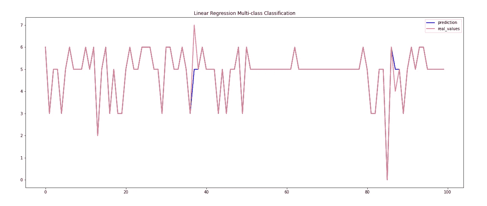

**用线性回归模型进行多类分类**

# 线性支持向量机

## 二元分类

*   准确度—**97 . 5442347**
*   平均绝对误差—**0.0266245765322**
*   均方误差—**0.0266245765322**
*   均方根误差— **0.1466177555610688**
*   R2 得分—**88 . 436498**

```
SVC(C=1.0, break_ties=False, cache_size=200, class_weight=None, coef0=0.0, decision_function_shape=’ovr’, degree=3, gamma=’auto’, kernel=’linear’, max_iter=-1, probability=False, random_state=None, shrinking=True, tol=0.001, verbose=False)
```

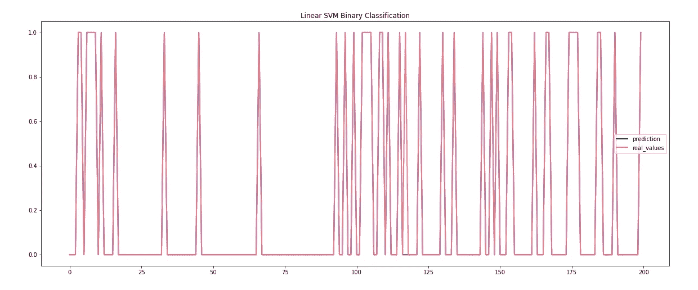

**用线性支持向量机进行二元分类**

## 多类分类

*   准确度—**97.5683311**
*   平均绝对误差—**0.0543495400786**
*   均方误差—**0.1537450722**
*   均方根误差—**0.424861345317**
*   R2 比分—**26555**

```
SVC(C=1.0, break_ties=False, cache_size=200, class_weight=None, coef0=0.0, decision_function_shape=’ovr’, degree=3, gamma=’auto’, kernel=’linear’, max_iter=-1, probability=False, random_state=None, shrinking=True, tol=0.001, verbose=False)
```

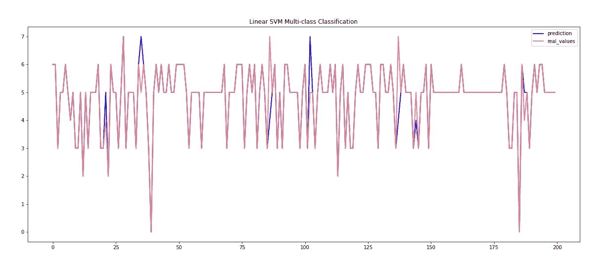

**用线性支持向量机进行多类分类**

# 逻辑回归模型

## 二元分类

*   准确度—**97.8041884**
*   平均绝对误差—**0.02879581152**
*   均方差—**0.029882879581152**
*   均方根误差—**0.14286671186019**
*   R2 得分—**88 . 48682778785**

```
LogisticRegression(C=1.0, class_weight=None, dual=False, fit_intercept=True, intercept_scaling=1, l1_ratio=None, max_iter=5000, multi_class=’auto’, n_jobs=None, penalty=’l2', random_state=123, solver=’lbfgs’, tol=0.0001, verbose=0, warm_start=False)
```

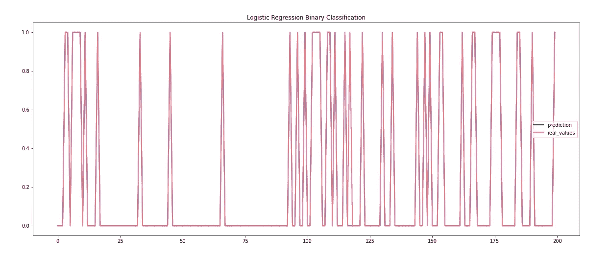

**用逻辑回归模型进行二元分类**

## 多类分类

*   准确度—**97 . 58669938691**
*   平均绝对误差—**0.0651248356**
*   均方误差—**0.1826544022**
*   均方根误差—**0.4266169165047**
*   R2 得分—**87.8880146**

```
LogisticRegression(C=1.0, class_weight=None, dual=False, fit_intercept=True, intercept_scaling=1, l1_ratio=None, max_iter=5000, multi_class=’multinomial’, n_jobs=None, penalty=’l2', random_state=123, solver=’newton-cg’, tol=0.0001, verbose=0, warm_start=False)
```


**用 Logistic 回归模型进行多类分类**

# 多层感知器分类器

## 二元分类

*   准确度—**98.3999719998697**
*   平均绝对误差— **0.01632275947028026**
*   均方误差—**0.016325947028026**
*   均方根误差— **0.12776055522061674**
*   R2 得分—**91.18100463**

```
MLPClassifier(activation=’relu’, alpha=0.0001, batch_size=’auto’, beta_1=0.9, beta_2=0.999, early_stopping=False, epsilon=1e-08, hidden_layer_sizes=(100,), learning_rate=’constant’, learning_rate_init=0.001, max_fun=15000, max_iter=8000, momentum=0.9, n_iter_no_change=10, nesterovs_momentum=True, power_t=0.5, random_state=123, shuffle=True, solver=’adam’, tol=0.0001, validation_fraction=0.1, verbose=False, warm_start=False)
```

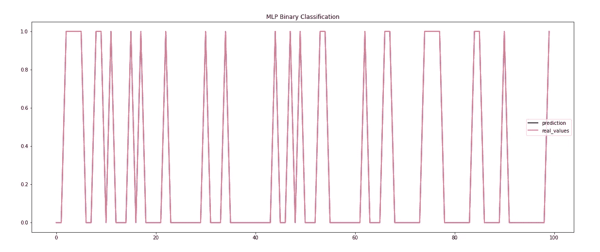

**用多层感知器分类器进行二元分类**

## 多类分类

*   准确度—**97.5007884**
*   平均绝对误差—**0.060610249671485**
*   均方差—**0.1759526937**
*   均方根误差—**0.42970517**
*   R2 比分—**87.55505165656525**

```
MLPClassifier(activation=’relu’, alpha=0.0001, batch_size=’auto’, beta_1=0.9, beta_2=0.999, early_stopping=False, epsilon=1e-08, hidden_layer_sizes=(100,), learning_rate=’constant’, learning_rate_init=0.001, max_fun=15000, max_iter=8000, momentum=0.9, n_iter_no_change=10, nesterovs_momentum=True, power_t=0.5, random_state=123, shuffle=True, solver=’adam’, tol=0.0001, validation_fraction=0.1, verbose=False, warm_start=False)
```

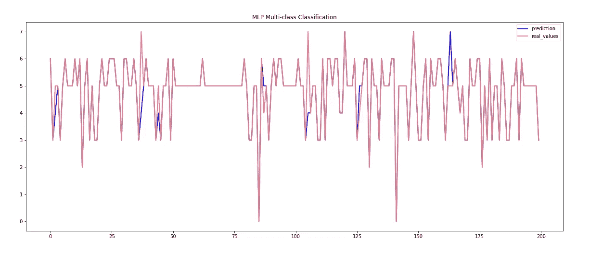

**用多层感知器分类器进行多类分类**

# 随机森林分类器

## 二元分类

*   准确度—**98.6387372968679**
*   平均绝对误差—**0.0126270403**
*   均方误差—**0.0126270403**
*   均方根误差— **0.1164086342427846**
*   R2 得分—**92.53345335**

```
RandomForestClassifier(bootstrap=True, ccp_alpha=0.0, class_weight=None, criterion=’gini’, max_depth=None, max_features=’auto’, max_leaf_nodes=None, max_samples=None, min_impurity_decrease=0.0, min_impurity_split=None, min_samples_leaf=1, min_samples_split=2, min_weight_fraction_leaf=0.0, n_estimators=100, n_jobs=None, oob_score=False, random_state=123, verbose=0, warm_start=False)
```

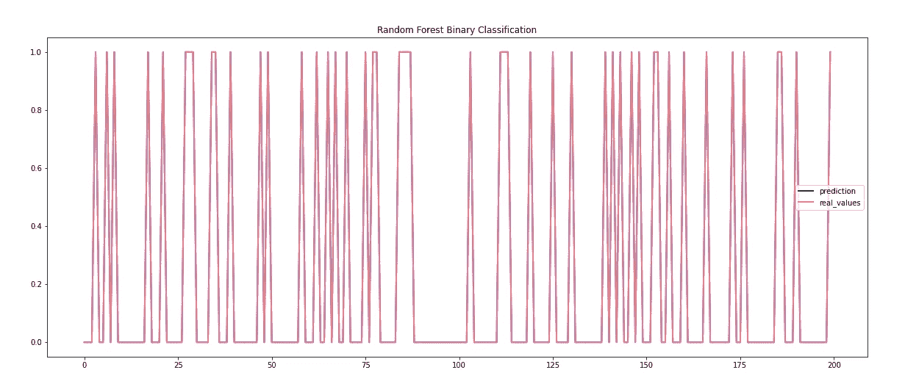

**用随机森林分类器进行二元分类**

## 多类分类

*   准确度—**97.7078844**
*   平均绝对误差—**0.0661366622864652**
*   均方误差—**0.1962417871**
*   均方根误差—**0.442869790352**
*   R2 得分—**86.6224011**

```
RandomForestClassifier(bootstrap=True, ccp_alpha=0.0, class_weight=None, criterion=’gini’, max_depth=None, max_features=’auto’, max_leaf_nodes=None, max_samples=None, min_impurity_decrease=0.0, min_impurity_split=None, min_samples_leaf=1, min_samples_split=2, min_weight_fraction_leaf=0.0, n_estimators=100, n_jobs=None, oob_score=False, random_state=50, verbose=0, warm_start=False)
```

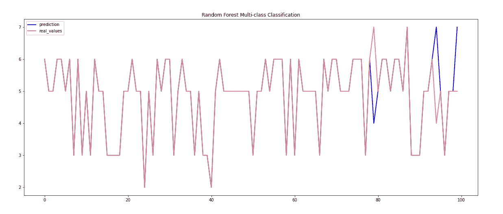

**用随机森林分类器进行多类分类**

# 在我的 GitHub 帐户上获取完整的代码、模型和绘图

[](https://github.com/abhinav-bhardwaj/IoT-Network-Intrusion-Detection-System-UNSW-NB15) [## GitHub-abhinav-bhardwaj/IoT-Network-Intrusion-Detection-System-UNSW-NB15:网络入侵…

### 基于各种机器学习和深度学习算法的网络入侵检测，使用 UNSW-NB15 数据集

github.com](https://github.com/abhinav-bhardwaj/IoT-Network-Intrusion-Detection-System-UNSW-NB15) 

# 引文

*   名词（noun 的缩写）穆斯塔法和 j .斯莱，“ **UNSW-NB15:网络入侵检测系统综合数据集(UNSW-NB15 网络数据集)**，“2015 军事通信与信息系统会议(MilCIS)，2015 年，第 1–6 页，**DOI:**[**10.1109/mil cis . 2015 . 7348942**](https://doi.org/10.1109/MilCIS.2015.7348942)
*   Nour Moustafa & Jill Slay (2016) **网络异常检测系统的评估:UNSW-NB15 数据集的统计分析以及与 KDD99 数据集的比较**，信息安全杂志:全球视角，25:1–3，18–31，**DOI:**[10.1080/193935555 . 2015 . 11125974](https://doi.org/10.1080/19393555.2015.1125974)