# CycleGAN 作为 OCR 图像去噪引擎

> 原文：<https://pub.towardsai.net/cyclegan-as-a-denoising-engine-for-ocr-images-8d2a4988f769?source=collection_archive---------0----------------------->

## [深度学习](https://towardsai.net/p/category/machine-learning/deep-learning)

## 将扫描但不干净的文档清理到原始形式。对于干净的文档，执行 OCR 将是一项更加精确的任务。

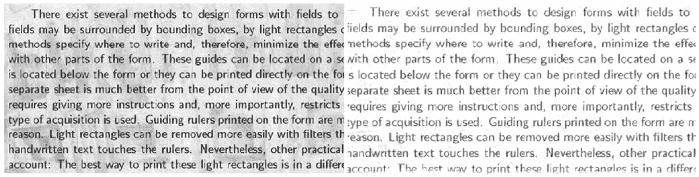

图一。脏的输入图像(左)，干净的输出图像(右)

W 随着数字化的快速发展，对数字化内容的需求对于数据处理、存储和传输至关重要。光学字符识别(“OCR”)是将键入的、手写的或印刷的文本转换成可编辑、可搜索和可解释的数字化格式的过程，同时避免了将数据输入系统的需要。

大多数情况下，扫描的文档包含噪声，这使得 OCR 无法识别文本的全部内容。扫描过程通常导致噪声的引入，例如水印、背景噪声、由于相机运动或抖动引起的模糊、褪色的文本、皱纹或咖啡污渍。这些噪声对现有的文本识别算法提出了许多可读性挑战，显著降低了它们的性能。

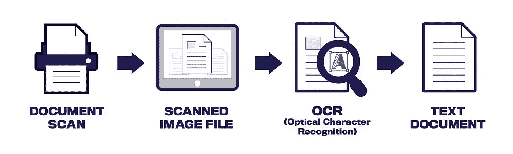

图二。使用 OCR 将扫描的文档转换为文本文档

# **基本 OCR 预处理方法**

*   **二值化**通过固定阈值，将彩色图像转换成仅由黑白像素组成的图像。
*   **歪斜校正**通常涉及歪斜角度确定和基于歪斜角度校正文档图像。
*   **噪声去除**通过去除比图像其余部分亮度更高的小点或小块，帮助平滑图像。
*   **细化和骨架化**确保手写文本笔画宽度的一致性，因为不同的书写者具有不同的书写风格。

# **CycleGAN 作为一种高级 OCR 预处理方法**

[生成对抗网络](https://en.wikipedia.org/wiki/Generative_adversarial_network)(“GANs”)是一种基于深度学习的生成模型。GAN 模型体系结构包括两个子模型:用于生成新示例的生成器模型，以及用于对所生成的示例是来自该领域的真实示例还是由生成器模型生成的虚假示例进行分类的鉴别器模型。

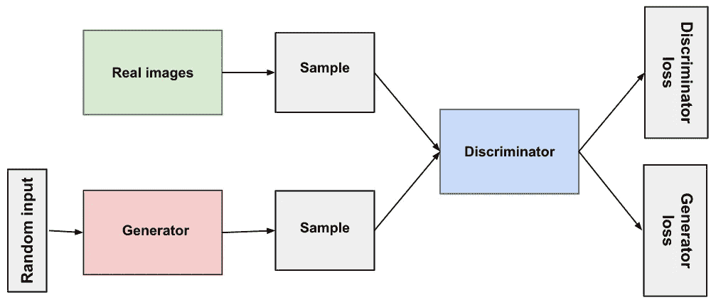

图三。GAN 网络概念图(来源:[https://developers . Google . com/machine-learning/GAN/GAN _ structure](https://developers.google.com/machine-learning/gan/gan_structure))

CycleGAN 被选为使用 **TensorFlow** 实施，作为一种高级 OCR 预处理方法。CycleGAN 的一个优点是它**不需要成对的训练数据**。通常，配对数据是这样的数据集，其中一个独立样本中的每个数据点都与另一个独立样本中的数据点唯一配对。

虽然仍然需要输入和输出变量，但它们不需要直接相互对应。由于配对数据在大多数领域中很难找到，因此 CycleGAN 的无监督训练功能确实非常有用。

在缺少用于训练的成对图像的情况下，CycleGAN 能够使用不成对的数据学习噪声图像的分布与去噪图像之间的映射，以实现用于清理噪声文档的**图像到图像转换**。

图像到图像的转换是将图像从一个域(即噪声文档图像)，到另一个(即干净的文档图像)。图像的其他特征，如文本，应该保持可识别的相同，而不是与任何领域不直接相关的特征，如背景。

# **CycleGAN 架构**

CycleGAN 的架构包括**两对生成器** **和鉴别器**。每个发生器都有一个相应的鉴别器，它试图从真实图像中评估其合成图像。与任何 GANs 一样，**发生器和鉴别器以相反的方式学习**。每个生成器都试图“愚弄”相应的鉴别器，而鉴别器则学会不被“愚弄”。

为了让生成器保留脏文档的文本，该模型计算了**循环一致性损失**，该损失评估了从其域来回转换的图像与其原始版本的相似程度。

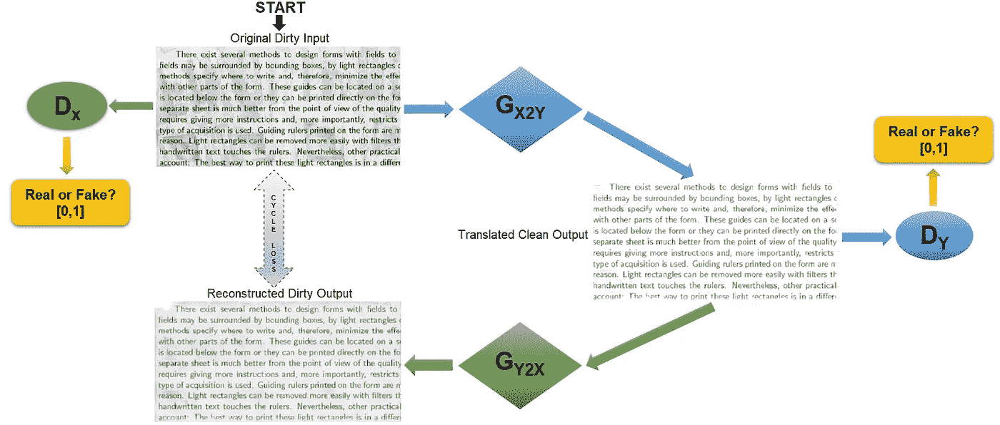

图 4(a)原始脏输入到其转换的干净输出的转换

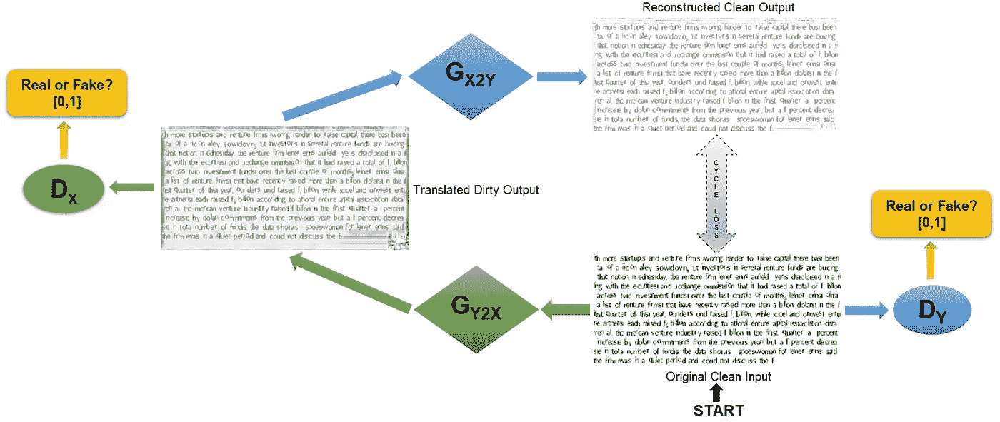

图 4(b)原始干净输入到其转换的脏输出的转换

第一个生成器， **G-x2y** ，将原始的脏输入转换成转换后的干净输出。鉴别器 **D-y** 将尝试评估转换后的清晰输出是真实图像还是生成的图像。鉴别器然后将提供被评估的图像是真实图像的概率。

第二个生成器， **G-y2x** ，将原始的干净输入转换成转换后的脏输出。鉴别器 **D-x** 将试图从生成的图像中分辨出真正的脏图像。创建的模型将在两个方向上进行训练，一组脏图像和一组干净图像，如上图所示。

# **方法和设计**

**背景噪声去除**是去除背景噪声的过程，如对比度不均匀、背景斑点、折角页、褪色的黑子、文档上的皱纹等。背景噪声限制了 OCR 的性能，因为很难将文本与其背景区分开。

使用 [**Kaggle 文档去噪数据集**](https://www.kaggle.com/c/denoising-dirty-documents/data) 来训练 CycleGAN 模型，该数据集由具有各种形式的噪声的噪声文档组成，例如咖啡污渍、褪色的黑子、折角页和皱纹。

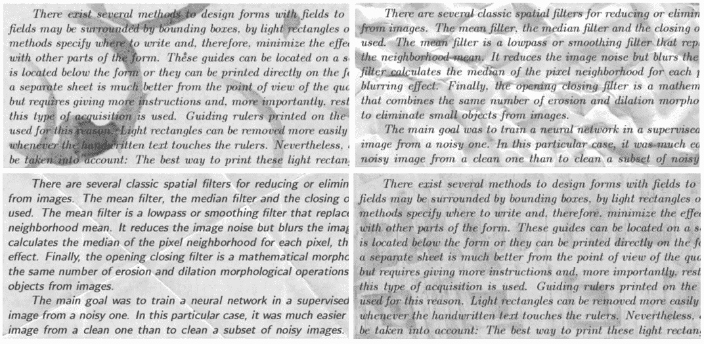

图五。Kaggle 文档去噪数据集中的脏文档类型

为了微调模型训练，执行了**合成文本生成**以引入除 Kaggle 数据集之外的更多噪声。这是使用 [DocCreator](https://doc-creator.labri.fr/) 程序实现的，这是一个开源的多平台软件，可以基于少量的真实图像创建几乎无限量的不同地面真实合成文档图像。各种逼真的退化模型已被应用于原始语料库，从而生成合成图像。

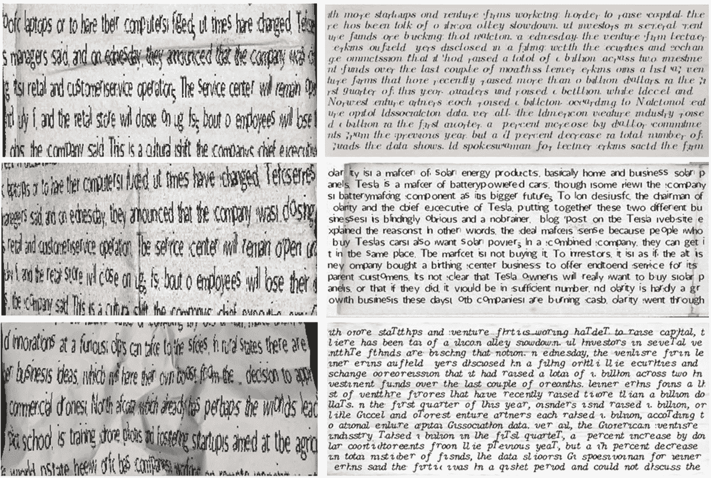

图六。生成的合成文本中的脏文档类型

**train** 数据分组在 trainA 和 trainB 文件夹下，包含有噪声和干净的文档图像。**验证**数据分类在文件夹 testA 和 testB 下，也包括有噪声和干净的文档图像。在测试文件夹下的看不见的噪声文档图像的**测试**数据集用于测试训练的网络，并且评估用于从文档图像中去除背景噪声的模型。

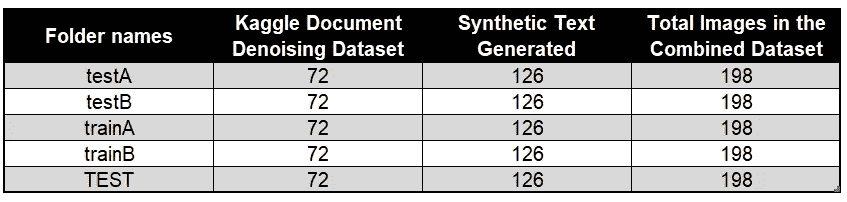

图 7。培训、验证和测试数据的分类

对于模型训练，使用 Adam 优化器，学习率为 0.0002，动量为 0.5，带有大小为 256 X 512 的噪声输入图像。由于硬件限制，最好的结果是通过训练 CycleGAN 模型 300 个历元获得的，批次大小为 3。

# **结果评估**

进行了一项**析因设计**实验，以检验多个因素如何影响因变量，包括独立因素和共同因素。在 Adam 优化器、输入图像大小和批量大小等训练参数保持不变的情况下，在该项目中评估了四个不同的因素。

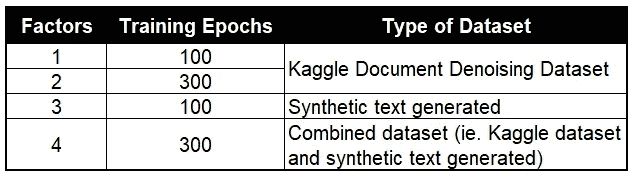

图 8。本实验中考虑的因素

由于 CycleGAN 架构的复杂性，我们使用以下各种指标对 CycleGAN 性能进行了深入评估:

*   **鉴别器损耗**函数接受两个输入——真实图像和生成图像。真实损失是真实图像的 [sigmoid 交叉熵损失](https://gombru.github.io/2018/05/23/cross_entropy_loss/)和一个阵列，因为这些是真实图像。生成损失是生成图像和零阵列的 sigmoid 交叉熵损失，因为这些是伪图像。总鉴频器损耗是实际损耗和产生损耗的均方误差之和。
*   **精度**通过将总鉴频器损耗表示为百分比来计算。鉴频器损耗越低，精度越高。
*   **生成器损失**是生成的图像和一个数组的 sigmoid 交叉熵损失。这包括 L1 损失，它是生成的图像和目标图像之间的平均绝对误差，因此允许生成的图像在结构上变得与目标图像相似。
*   在**循环一致性丢失**中，原始脏图像通过第一生成器传递以产生生成的图像。该生成的图像经由第二生成器传递，以产生重建的图像。计算原始脏图像和重建图像之间的平均绝对误差。平均绝对误差越低，与原始脏图像相比，重建图像的结构越相似。
*   **峰值信噪比(“PSNR”)**被定义为信号的最大可能功率与使其表现质量恶化的失真噪声的功率之比。PSNR 通常用均方误差来表示。PSNR 值越高，图像质量越好。

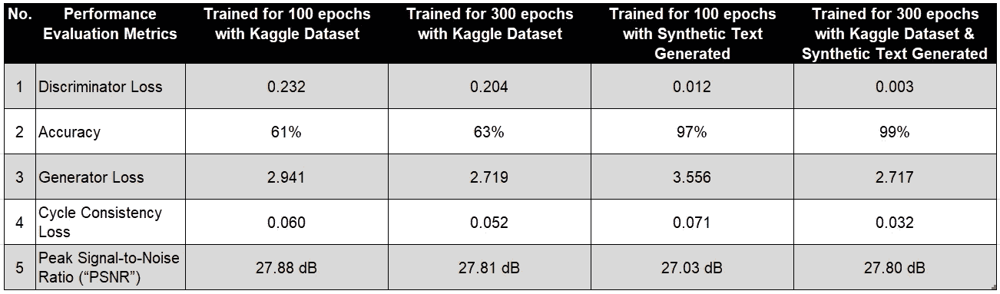

图九。可量化绩效评估指标的平均结果

比较从四个因素获得的结果，精确度**从 61%到 99%的显著提高**反映了从原始图像到生成图像转换期间获得的减少的**鉴别器损失**。随着**发生器 los** 的减少，生成的图像在结构上与原始图像相似。

对于**周期一致性损失**，随着训练时期和数据集的增加，可以看到显著的改善。平均绝对误差的降低意味着重建图像在结构上类似于原始脏图像。在获得高图像质量时， **PSNR 值**没有显著差异。

让我们来看看使用组合数据集为 **300 个时期训练模型时的学习曲线。**

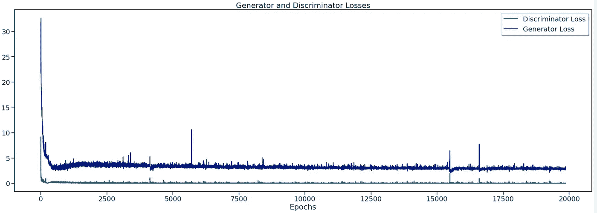

图 10(a)发电机和鉴频器损耗

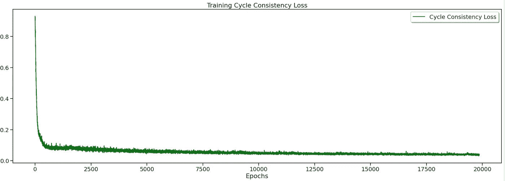

图 10(b)训练周期一致性损失

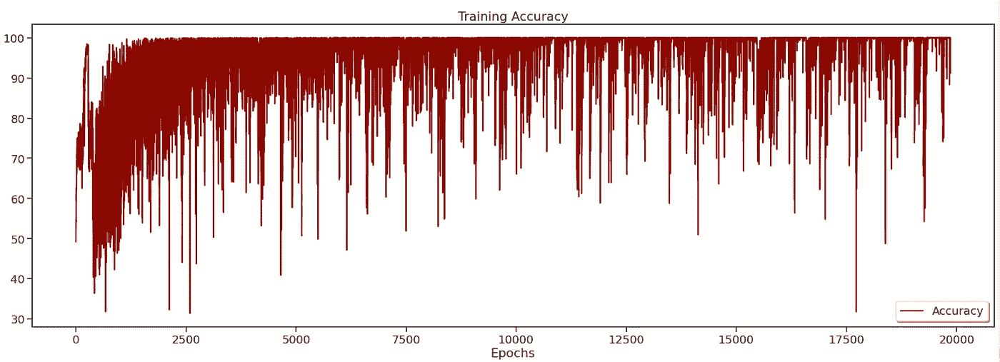

图 10(c)训练准确度

从训练数据集得出的上述学习曲线让我们了解了模型的学习效果。在每次前进过程中，对单个批次的这些学习曲线进行评估。

**损失曲线**反映了良好的拟合，因为它已经下降到一个稳定点。损失中的“波动”量与批次大小有关。当批量大小为 1 时，波动会相对较大。当批量大小为完整数据集时，波动将最小，因为每次梯度更新都应单调地改善损失函数(除非学习率设置得太高)。

至于**训练准确度图**，考虑到学习算法的随机性，会有一些波动。虽然使用了较慢的学习速率 0.0002，但我们已经将动量增加到 0.5，以确保模型学习良好。

*   **模板匹配**是一种在更大的图像中搜索并找到模板图像位置的方法。模板图像在输入图像上滑动，并且在模板和模板图像下的输入图像的小块之间进行比较。返回灰度图像，其中每个像素表示该像素的邻域与模板匹配的程度。

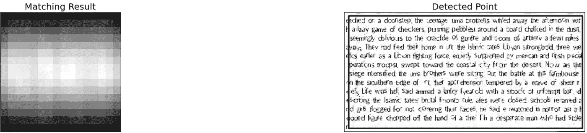

图 11(a)仅使用 **Kaggle 数据集**的 **100 个时期**的模板匹配

图 11(b)仅使用 **Kaggle 数据集**的 **300** 和**历元**的模板匹配

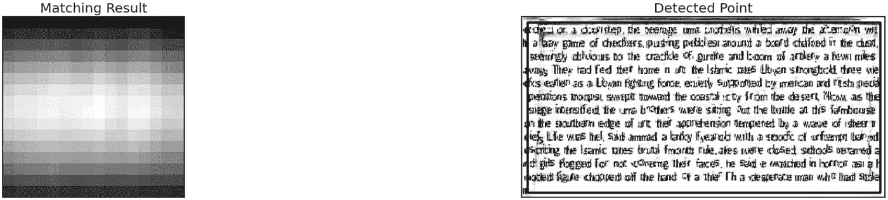

图 11(c)仅使用生成的**合成文本的 **100 个时期**的模板匹配**

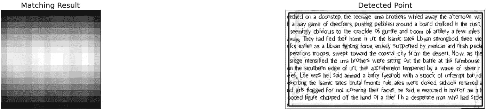

图 11(d)使用**组合数据集**对 **300 个时期**的模板匹配

总体而言，CycleGAN 模型在**模板匹配**方面表现良好。匹配结果显示了灰度图像，该灰度图像由该像素的邻域与模板图像匹配的程度的强度水平来表示。检测到的点指示被检测的文本的良好覆盖，并与模板图像匹配。

*   **均方误差(“MSE”)**测量误差平方的平均值，即估计值和估计值之间的平均平方差。MSE 的零值表示完全相似，而大于 1 的值意味着相似度较低，并且将随着像素强度之间的平均差异的增加而继续增加。
*   **结构相似性指数(“SSIM”)**试图对图像的结构信息中的感知变化进行建模，而 MSE 是实际估计的感知误差。与 MSE 不同，SSIM 值可以在负 1 和 1 之间变化，1 表示完全相似。

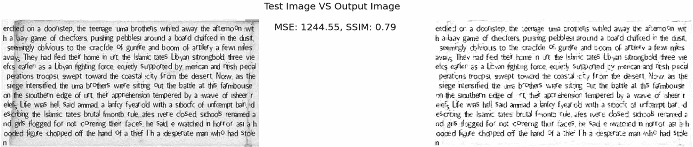

图 12(a)仅使用 **Kaggle 数据集**的 **100 个时期**的输出

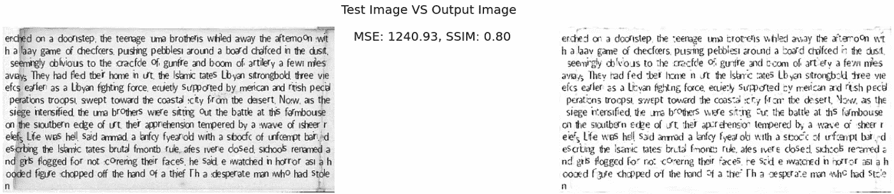

图 12(b)仅使用 **Kaggle 数据集**的 300 个时期的输出

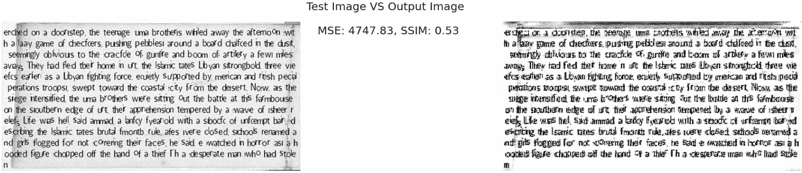

图 12(c)仅使用生成的**合成文本的 **100 个时期**的输出**

图 12(d)使用**组合数据集**的 **300 个时期**的输出

随着训练时期和数据集的增加， **MSE** 的减少随着 **SSIM** 值的提高而显著。这表明测试图像和生成的输出图像之间的结构相似性更高，并且像素强度差异减小。

*   **图像相减**是从生成的图像中减去脏图像的过程。目的是比较两幅图像的像素强度，以确定使用训练的模型清洁脏图像的程度。

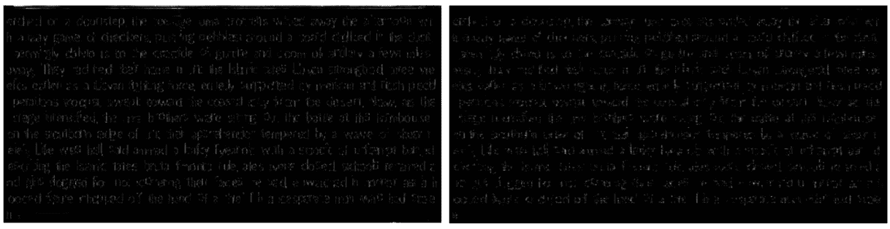

图 13(a)仅使用 **Kaggle 数据集**的 **100 个时期**(左)和 **300 个时期**(右)的图像相减输出

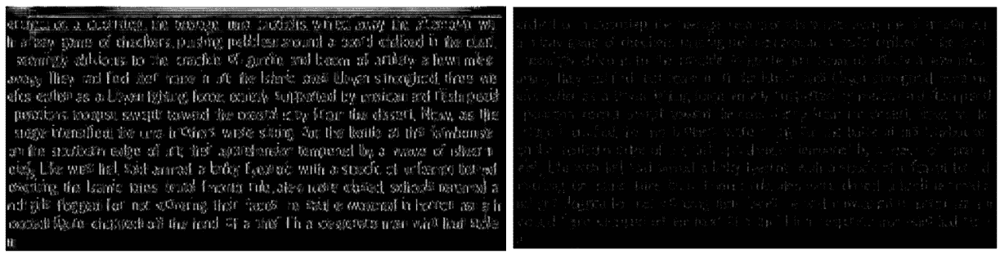

图 13(b)仅使用生成的的**合成文本的 **100 个时期**的图像减法输出(左)，以及使用**组合数据集**的 **300 个时期**(右)**

从生成的输出图像中减去测试图像**，以确定使用训练模型清洁脏图像的程度。通过比较输出图像的像素强度，有利的结果(即几乎全黑输出图像)是由 CycleGAN 使用组合数据集以更高数量的训练时期获得的。**

**CycleGAN 针对各种训练参数和因子生成的输出图像示例如下所示。**

****原始列:**原始脏/干净图像；**

****翻译栏:**训练原始图像后对应的干净/脏图像；**

****重建栏:**使用翻译后的图像重建回原始脏/干净状态的图像。**

**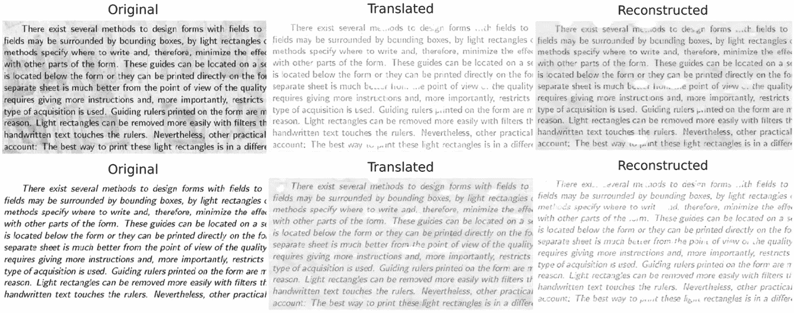**

**图 14(a)仅使用 **Kaggle 数据集**为 **100 个时期**训练的输出图像**

**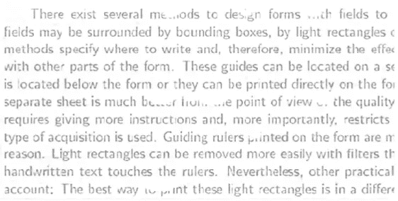**

**图 14(b)在**翻译的**图像中缺少文本**

**仅使用 Kaggle 数据集为 **100 个时期训练的输出图像对于 OCR 来说并不理想。在翻译和重建的图像中都发现了缺失的文本。****

**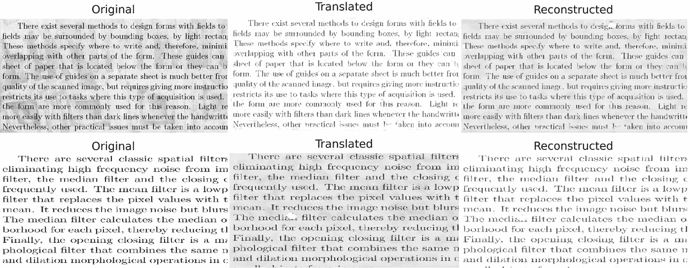**

**图 15(a)仅使用 **Kaggle 数据集**为 **300 个时期**训练的输出图像**

**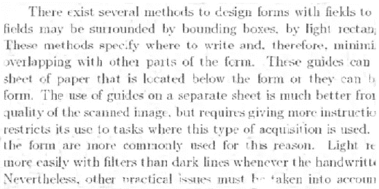**

**图 15(b)在**翻译的**图像中缺少文本**

**仅使用 Kaggle 数据集，针对 **300 个时期训练的输出图像逐渐得到改善。随着训练时期数量的增加，在翻译和重建的图像中丢失文本的出现都减少了。****

**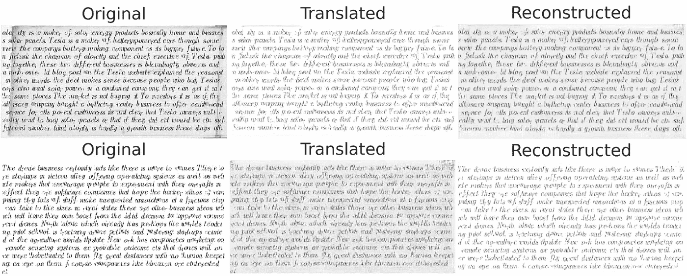**

**图 16(a)仅使用生成的**合成文本为 **100 个时期**训练的输出图像****

**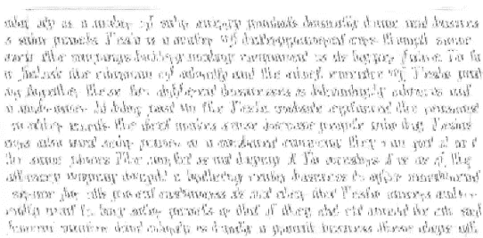**

**图 16(b)翻译后的**图像中的文本不清晰****

**仅使用生成的合成文本为 **100 个时期训练的输出图像难以辨认。因此，增加用于训练的历元数将有助于提高输出图像的可读性。****

**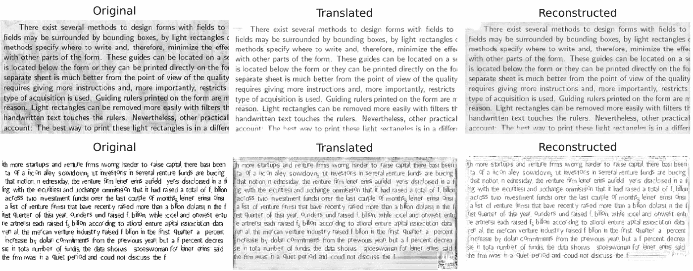**

**图 17。使用**组合数据集**为 **300 个时期**训练的输出图像**

**从上面使用组合数据集对 **300 个历元进行训练的输出图像可以看出，随着训练历元数量的增加，CycleGAN 的模型性能有了显著提高。使用合成文本生成添加噪声有助于增加训练数据量，从而提高模型性能。深度网络如 CycleGAN 在大量训练数据的情况下表现更好。通过将训练模型暴露于数量增加的训练样本来减轻过度拟合的风险。****

# ****建议****

**为了提高 CycleGAN 的性能，可以考虑以下方面:**

*   **通过数据扩充增加数据集**
*   **增加训练的时期数**
*   **尝试不同的学习率和学习率计划以增强收敛性**

**上述建议的基础是基于通过合成文本生成和用于训练的时期数量的增加而在数据集的增加中观察到的改进的性能。CycleGAN 架构的复杂性包括管理用于训练的大规模数据集的能力，从而为模型性能的进一步改进提供了良好的基础。**

# ****结论****

**CycleGAN 已被证明是一个有效的去噪引擎，可以对 OCR 文档进行去噪和清理。**

**在没有成对训练数据的情况下，CycleGAN 独特地使用循环一致性损失解决了用不成对数据学习有意义的转换的问题。它允许生成器生成干净的图像，通过图像到图像的转换保留脏输入图像的文本。通过生成合成文本，训练时期数量的增加与数据集的增加相结合，也有助于显著提高 CycleGAN 模型的性能。**

# ****参考文献****

1.  **[莫妮卡·夏尔马、阿布舍克·维尔马、洛夫凯什·维格的《学习清洁:甘视角》](https://arxiv.org/abs/1901.11382)**
2.  **[OCR 中的预处理](https://towardsdatascience.com/pre-processing-in-ocr-fc231c6035a7)**
3.  **[tensor flow 核心教程中的 cycle gan](https://www.tensorflow.org/tutorials/generative/cyclegan)**
4.  **[Keras 实现的 GAN](https://github.com/eriklindernoren/Keras-GAN/tree/master/cyclegan)**
5.  **[用深度学习清理脏的扫描文档](https://medium.com/illuin/cleaning-up-dirty-scanned-documents-with-deep-learning-2e8e6de6cfa6)**
6.  **[斯坦福 CS Class CS231n:用于视觉识别的卷积神经网络](https://cs231n.github.io/neural-networks-3/)**
7.  **[过拟合和欠拟合](https://www.tensorflow.org/tutorials/keras/overfit_and_underfit)**