# [2019-CVPR] D2 网:极端外观变化下图像间的匹配问题

> 原文：<https://pub.towardsai.net/d2-net-matching-problem-among-images-under-an-extreme-appearance-changes-9f059f33a2ef?source=collection_archive---------1----------------------->

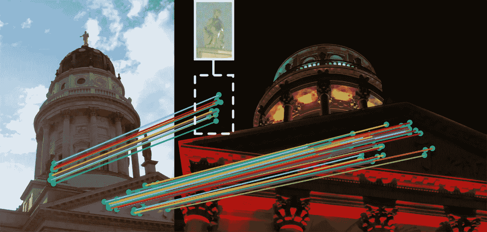

在穹顶上使用计算机视觉。

本文基于 2019 年在 CVPR 发表的论文' **D2 网络:一个可训练的联合描述和检测局部特征的 CNN，**'。如需进一步阅读，请参考 https://arxiv.org/pdf/1905.03561.pdf

本文介绍了一种解决**极端条件变化**中匹配问题的最新方法，特别是在特定数据集上。在具有挑战性的条件下创建通用的匹配算法是一个具有挑战性的问题。这篇文章总结了这篇论文，以便你能容易地理解这篇论文的基本概念。

# 匹配问题是什么？

匹配问题是寻找两幅图像之间对应关系的一般方法。对于人类方面，识别两幅图像之间的相同点是一个容易的问题。然而，对于计算机方面，由于计算机将图像识别为像素阵列，因此匹配问题相当具有挑战性。

与匹配问题相关的研究的主要贡献是**找到一种提取两幅图像之间对应关系的算法。**下图显示了匹配问题的一个例子。

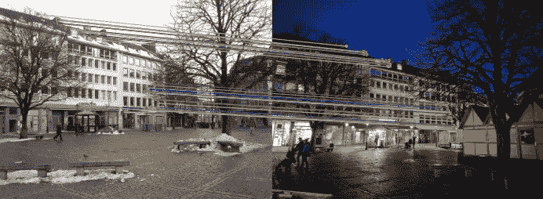

昼夜差异下的匹配问题

匹配问题受到 **SIFT(尺度不变特征变换)** (2004)的强烈影响，这是长期以来最先进的特征提取。在深度学习一代之后，研究人员发现了大量的特征提取方法。因此，到目前为止，匹配问题是可以在计算机视觉领域探索的。

# 为什么需要这项研究？

先前的工作发现了许多很好地解决匹配问题的方法。然而，这些方法在具有挑战性的条件下缺乏鲁棒性。这项研究侧重于各种图像条件下的像素级对应。条件可以是昼夜差异、季节变化和弱纹理场景。

先前的工作区分了特征检测器和特征描述符，因此它被称为**检测然后描述**方法。他们首先检测图像中的特征，并在检测到的关键点周围创建补丁。然后，使用特征描述符，指定特征，例如生成一个 N 维向量。然而，这种方法有一个限制:局部描述符考虑更大的块并可能编码更高级的结构，关键点检测器仅发现小的图像区域。因此，这些方法在极端的外观变化中遭受显著的性能下降。

这项研究提出了一种**描述和检测**的方法:**不是在低级信息的早期执行特征检测，而是同时创建特征检测器和特征描述符**。它使用 CNN 架构生成特征地图，其主干是 **VGGNet** 。( **VGGNe** t 比 **ResNet** 更具有光照不变性)

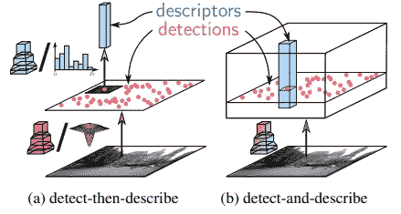

# 特征抽出

如上所述，D2 网络使用 CNN 层进行特征提取。关于实现细节，作者建议您阅读原文。它最终输出一个三维张量 f。

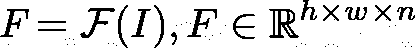

h，w 是特征图的空间分辨率，n 是通道的数量。那么(I，j)中的每个向量被用作这种位置的描述符。他们将描述符表示为 d。

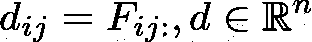

在训练阶段，**无论极端条件如何变化，这些描述符都会为相同的场景产生相似的值。**

每个通道都是特征的检测器。

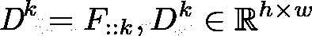

当且仅当(I，j)必须是通道 k 中的局部最大值，即张量 f 中通道中位置(I，j)处的最大值时，点(I，j)被检测。

# 如何设计损失函数

要实现这个目标，设计一个损失函数是最关键的部分。当我们的必要条件不满足时，损失函数必须是高值，当我们的必要条件满足时，损失函数必须几乎为零。我们可以总结必须满足的条件。

(1)检测点在其邻域内趋于局部最大值。

(2)在不同通道的同一位置，检测点往往最大。

(3)对应点会相似。即对应点将具有较小的欧几里德距离。

(4)对应点的邻居不会相似。即，对应的邻域将具有高欧几里德距离。

因此，网络对损失函数使用检测+描述度量。

## 软特征检测

为了使网络端到端，它使用软局部最大值，这是可区分的。

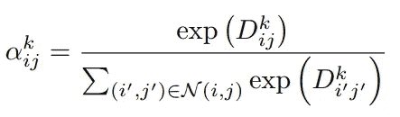

软局部最大值正在计算**它在它的邻居**中有多少区别。因为它与邻居相比是有区别的，所以它返回较大的值。但是，如果它的区分度不够，它将返回较小的值。使用的下一个指标如下。

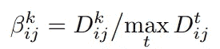

该指标使用最大比率法。正在计算**是否接近不同通道**中相同位置的最大值。然后将其最大化以获得单个得分图。

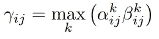

最后通过图像级归一化来完成。

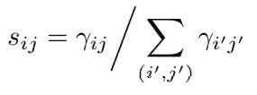

然后，当满足上面介绍的条件(1)和(2)时，这个分数将会很高。

## 描述符距离

有两个距离，这将是主要的:正描述符 p 和负描述符 n。让我们将 c 表示为像素 A 和像素 b 之间的对应关系。

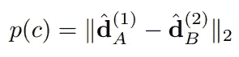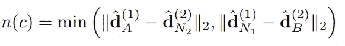

正描述符 p 估计像素 A 和像素 B 之间的相似性。要让对应 c 更自信，分数一定要足够小。**负距离 n 计算像素 A 和像素 B 的邻居之间的相似度，也计算像素 B 和像素 A 的邻居之间的相似度**。然而，如果相邻像素是相邻像素，匹配问题是一个极具挑战性的问题。因此，本文提供了一个超参数 K 作为公差来缓解匹配问题。

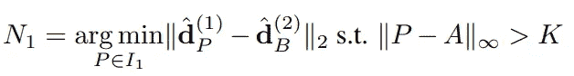

最后，将**裕度函数**设计为

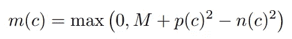

该余量满足要求(3)和(4)。**因为错误的对应会导致更高的 p 和更低的 n，所以这将是一个非常好的对应度量**。最后，损失函数被设计为边缘函数和图像级归一化分数的组合。

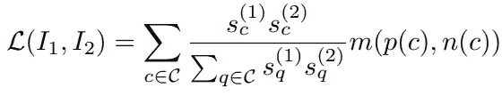

# 结果

引入的评估协议是仅当通过单应性重新投影的点在阈值内时才认为匹配是正确的。实验在不同的阈值下进行，以检查性能趋势。

1.  与以前的匹配算法相比，**在定位精度方面有较低的性能，而阈值**很紧。实验是在 HPatches 数据集上进行的，h patches 数据集是匹配问题的 be 基准。由于 CNN 同时执行描述符和检测器，因此个人性能可能会下降。检测器的后一种使用错过了低级的斑点状结构，该结构比高级特征定位得更好。
2.  然而，由于阈值宽松(6.5 像素或更高)，D2 网络优于其他匹配算法。如下图所示，**对光照变化和视点变化不变**。

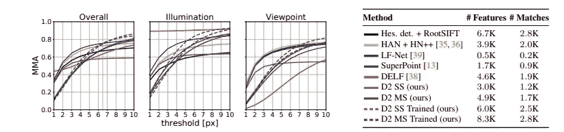

基于 HPatches 图像对的评估

3.即使 D2 网在严格的阈值下具有较低的性能，**它足以构建 3D 重建(基于图像构建 3D 模型)**。作者用了‘马德里大都会；、“Gendramenmarkt”和“伦敦塔”数据集。尽管 D2 网络与以前的作品相比准确性有所下降，但这并不是一个显著的下降。性能下降是因为 3D 重建任务需要在图像匹配中失败的良好定位的特征。

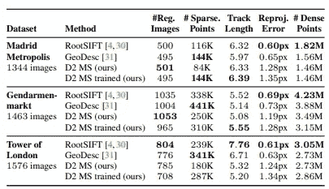

对局部特征评估基准的评估

4.本文还检查了挑战性条件下的本地化性能。 **D2 网络在“亚琛昼夜”数据集和“因洛克”数据集上都优于本地化问题**

对亚琛昼夜数据集的评估

# 结论

描述和检测方法在定位问题上是最先进的。然而，它在图像匹配问题和三维重建问题上仍然有局限性。这一研究是有意义的，因为它为匹配问题提供了一种新的方法。

联系方式:给我发邮件

jeongyw12382@postech.ac.kr