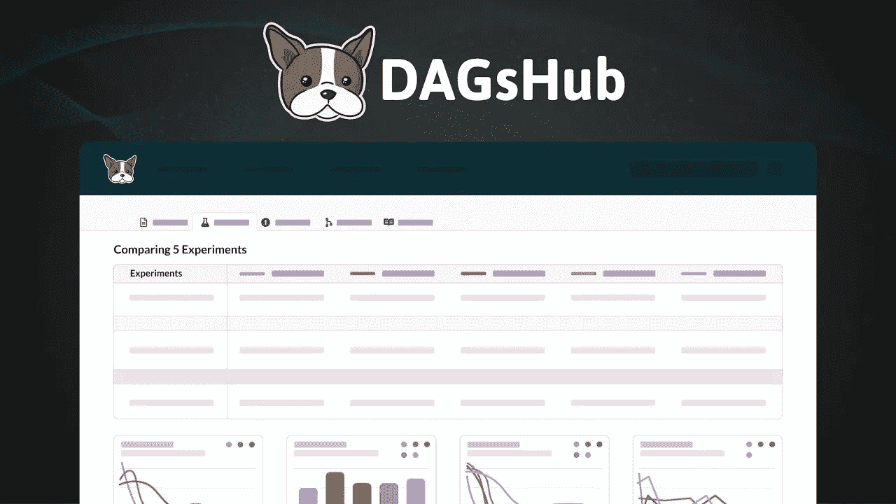
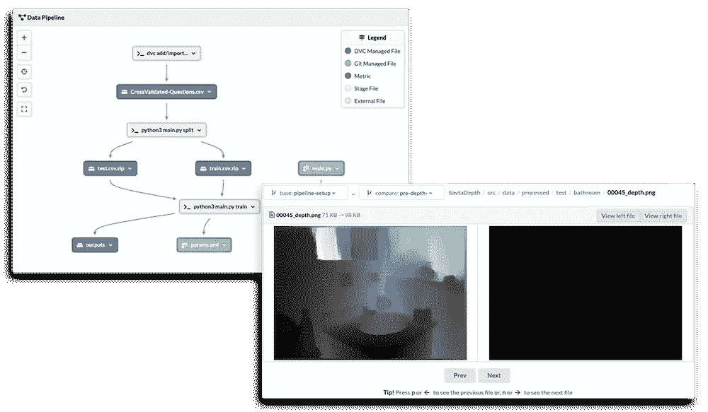
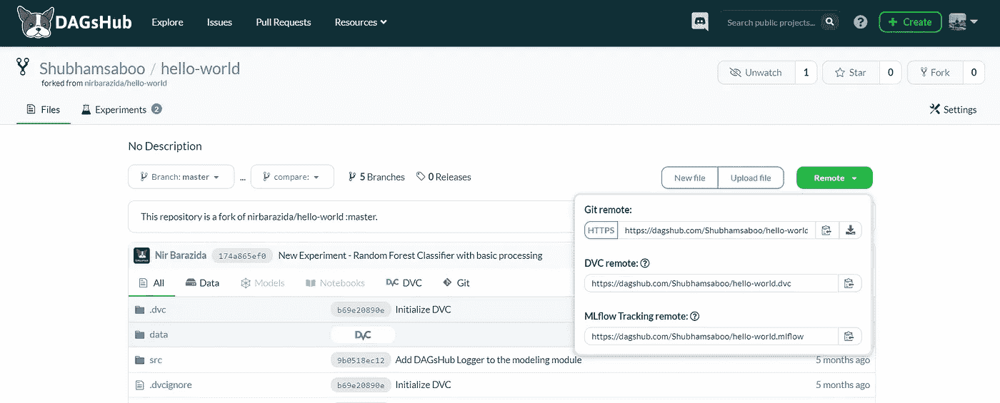
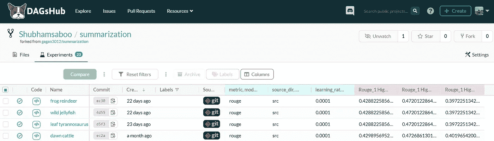
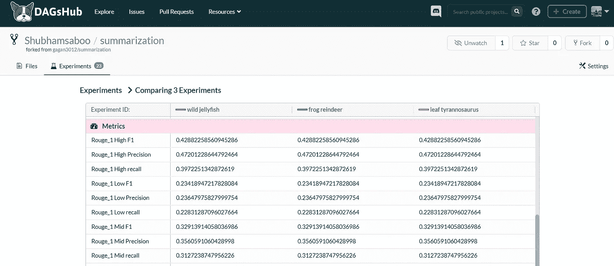
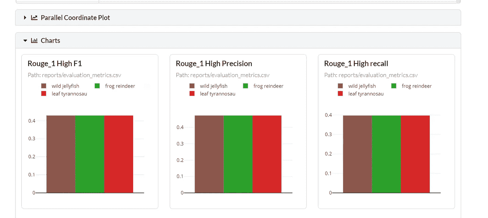

# DagsHub → Github 数据科学

> 原文：<https://pub.towardsai.net/dagshub-github-for-data-science-92e77adbc9a3?source=collection_archive---------3----------------------->

## [数据科学](https://towardsai.net/p/category/data-science)

## **数据科学家有权浏览、预览、共享、分叉和合并数据模型和代码。**

DAGsHub →一个协作数据科学平台！

# DAGsHub 是什么？

DagsHub 是一个开源的数据科学和机器学习协作平台，允许您通过利用 git(源代码版本控制)和 DVC(数据版本控制)的力量来快速构建、扩展和部署机器学习项目。

DAGsHub 将数据、模式和代码结合在一起→全部在一个地方！

自从这个领域开始以来，处理代码和数据一直是数据专业人员的主要难题。不像传统的软件工程项目，你只需要跟踪代码，在 ML 项目中，你必须跟踪数据和模型以及代码，这本身就是一项复杂的任务。

如果你曾经尝试过一个企业级的 ML 项目，你完全可以涉及到多个组件，比如代码、数据、监控。总之，将所有这些部分放在一起并让它们协同工作是一项可怕的任务，这主要是因为标准代码版本平台，如 GitHub、Bitbucket 或 GitLab，不支持推和拉大量数据。

# 常规解决方案

管理数据和代码的传统解决方案是将代码推送到任何标准的代码版本平台，如 GitHub，并将数据和模型推送到本地或云存储，如 AWS、Google Cloud 等。

将您的数据、代码和模型存储在不同的地方会带来很多问题，首先也是最重要的是它们之间的连接或桥梁。您需要高效地线程化所有这些组件，使它们协同工作，从而使您的 ML 项目正常运行。您可能面临的另一个问题是连接之间的延迟，这会影响应用程序的运行速度。

# DAGsHub 存储—前进的方向

> **随着 DVC(数据版本控制)的发明来管理数据，类似于 git 对代码所做的事情。我们进入了管理端到端 ML 项目的高效平台和方法时代！**

DAGsHub Storage 构建于 DVC 之上，汇集了数据科学的精髓，即数据和代码。它通过 DVC 遥控器工作，不需要任何配置，开箱即用。它使共享数据和模型像共享链接一样简单，这允许数据团队内部的轻松协作和思想自由流动。

DAGsHub Storage 使用 DVC 来版本化数据和模型，如 git 代码，可以很容易地跨版本跟踪和比较。在存储库接口中，DAGsHub 提供了一个自动化的管道来可视化项目的组件以及它们如何链接在一起，从而允许团队中的每个人理解项目的工作流，而不管他们的技术理解如何。它还提供了并排比较数据的能力，并支持多种形式，如文本、图像、音频和表格。

DAGsHub |并排图像数据比较生成的自动化管道

# 达格舒布闪耀的地方。

DAGsHub 允许您快速构建、共享和重用机器学习和数据科学项目，消除了数据团队每次从头开始的辛劳。以下是 DAGsHub 的一些特性，这些特性使它从其他传统平台中脱颖而出:

内置远程工具，如 Git(用于源代码跟踪)、DVC(用于数据版本跟踪)和 MLflow(用于实验跟踪)，允许您在一个地方连接所有东西，无需任何配置。

DAGsHub 允许您通过漂亮的用户界面舒适地跟踪和监控不同个人进行的不同 ML 实验。一个 ML 项目中的所有实验都可以被跟踪并链接到它的数据、代码和模型的特定版本！

实验跟踪仪表板

除了跟踪您的实验之外，您还可以并排比较不同的实验，并通过每个实验的记录值和 DAGsHub 提供的开箱即用的直观可视化来了解性能指标和超参数的差异。

实验对比

交互式可视化对比实验

# 结论

随着数据科学项目因涉及多个利益相关方而变得越来越大，传统的源代码管理平台很难以协作和可共享的有效方式管理代码和工件→ DAGsHub 来拯救！

展望未来，像 DAGsHub 这样的平台将成为主流，并在跨部门和组织执行协作数据项目方面发挥重要作用，使数据团队能够快速构建、协作和共享他们的数据科学和机器学习项目。

# 参考

*   [https://dagshub.com/docs](https://dagshub.com/docs/)
*   【https://dagshub.com/blog 号
*   【https://dagshub.com/Shubhamsaboo/summarization 

如果你想了解更多，或者想让我写更多关于这个主题的东西，请随时联系我们。

我的社交链接:[LinkedIn](https://www.linkedin.com/in/shubhamsaboo/)|[Twitter](https://twitter.com/Saboo_Shubham_)|[Github](https://github.com/Shubhamsaboo)

如果你喜欢这篇文章或觉得它有帮助，请花一分钟按一下拍手按钮，它增加了文章对其他媒体用户的可见性。